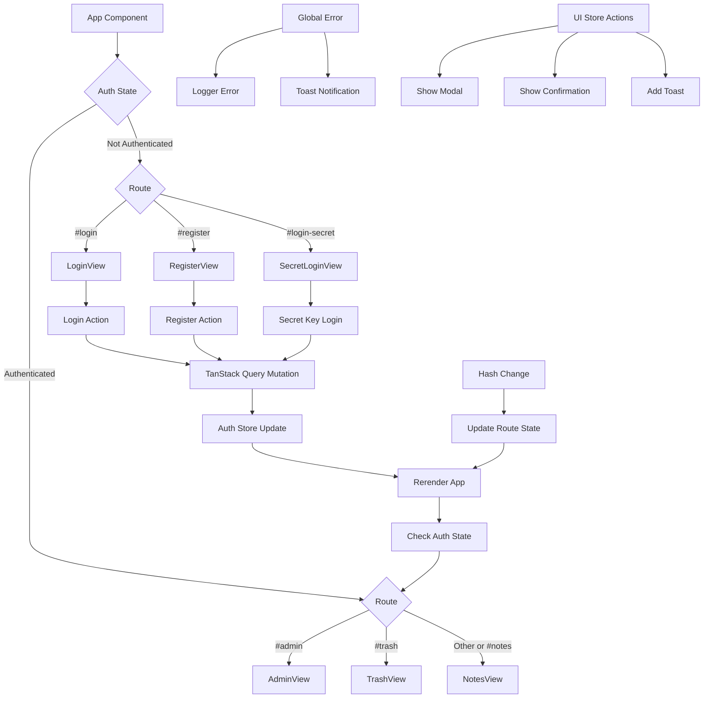

# App.jsx Component
**Last Updated:** January 21, 2026  
**Version:** 1.0  
**Status:** ✅ Production Ready

---

## Overview

`App.jsx` is the root component of Glass Keep. It handles routing, authentication state, global error handling, and provides the main application structure with modal overlays, toast notifications, and confirmation dialogs.

---

## Purpose

Serve as the application root with responsibilities for:
- Hash-based routing
- Authentication state management
- Global error handling
- View rendering (Login, Register, Notes, Admin, Trash)
- Global modal system
- Toast notification system
- Generic confirmation dialogs
- Theme application

---

## Key Responsibilities

### 1. Routing
- Hash-based navigation (`#/notes`, `#/login`, `#/register`, `#/admin`, `#/trash`)
- Route change detection via `hashchange` event
- View selection based on route and auth state

### 2. Authentication
- User authentication state via `useAuthStore`
- Auth mutation wrappers (login, register, secret key login)
- Route protection for authenticated views

### 3. Error Handling
- Global error event listener
- Unhandled rejection listener
- Error logging to logger system
- Graceful error recovery

### 4. Global UI Elements
- Modal overlay system
- Toast notification system
- Generic confirmation dialogs
- Settings panel integration

---

## State Management

### Zustand Stores Used

```javascript
// Auth Store - User authentication state
const { currentUser } = useAuthStore();

// Settings Store - User preferences
const { dark } = useSettingsStore();

// UI Store - Global UI state
const { 
  toasts, 
  genericConfirmOpen, 
  setGenericConfirmOpen,
  genericConfirmConfig,
  setGenericConfirmConfig,
  openModal, 
  closeModal 
} = useUIStore();
```

### Local State

```javascript
// Routing state
const [route, setRoute] = useState(window.location.hash || "#/notes");
```

---

## Routing Logic

```javascript
// Route determination based on auth state and hash
if (!currentUser) {
  // Unauthenticated routes
  if (route === "#/register") {
    currentView = <RegisterView />;
  } else if (route === "#/login-secret") {
    currentView = <SecretLoginView />;
  } else {
    currentView = <LoginView />;
  }
} else {
  // Authenticated routes
  if (route === "#/admin") {
    currentView = <AdminView />;
  } else if (route === "#/trash") {
    currentView = <TrashView />;
  } else {
    currentView = <NotesView />; // Default
  }
}
```

### Routes Table

| Route | Auth Required | View | Description |
|-------|--------------|------|-------------|
| `#/login` | No | LoginView | User login page |
| `#/register` | No | RegisterView | User registration page |
| `#/login-secret` | No | SecretLoginView | Secret key login page |
| `#/notes` | Yes | NotesView | Main notes interface |
| `#/admin` | Yes | AdminView | Admin panel |
| `#/trash` | Yes | TrashView | Trash management |

---

## Authentication Flow

### Login
```javascript
const signIn = async (credentials) => {
  const result = await login.mutateAsync(credentials);
  useAuthStore.getState().login(result.user, result.token);
  return result;
};
```

### Register
```javascript
const registerAuth = async (data) => {
  const result = await register.mutateAsync(data);
  useAuthStore.getState().login(result.user, result.token);
  return result;
};
```

### Secret Key Login
```javascript
const signInWithSecret = async (secret) => {
  const result = await secretKeyLogin.mutateAsync(secret);
  useAuthStore.getState().login(result.user, result.token);
  return result;
};
```

---

## Global Error Handling

```javascript
useEffect(() => {
  const handleError = (event) => {
    logger.error('unhandled_error', {
      message: event.message,
      filename: event.filename,
      lineno: event.lineno,
      colno: event.colno,
      type: 'error'
    }, event.error);
  };

  const handleUnhandledRejection = (event) => {
    logger.error('unhandled_rejection', {
      reason: event.reason?.message || String(event.reason),
      type: 'unhandledrejection'
    }, event.reason instanceof Error ? event.reason : new Error(String(event.reason)));
  };

  window.addEventListener('error', handleError);
  window.addEventListener('unhandledrejection', handleUnhandledRejection);

  return () => {
    window.removeEventListener('error', handleError);
    window.removeEventListener('unhandledrejection', handleUnhandledRejection);
  };
}, []);
```

### Error Types Logged

1. **Unhandled Errors** - JavaScript errors not caught by try/catch
2. **Unhandled Rejections** - Promise rejections not caught
3. **Error Properties** - Message, filename, line number, column number
4. **Error Objects** - Full error stack traces

---

## UI Components

### 1. Modal System

```javascript
const modalOpen = useUIStore(state => state.activeModal !== null);

// Rendered when any modal is active
{modalOpen && <Modal />}
```

**Purpose:** Global modal container for all modal types

**Modal Types:**
- Note edit modal
- Image viewer modal
- Settings modal
- Admin modals
- Custom modals

---

### 2. Settings Panel

```javascript
<SettingsPanel />
```

**Purpose:** Global settings panel (hidden by default, toggled via context)

**Features:**
- User profile settings
- Theme selection
- Font size adjustment
- System preferences

---

### 3. Generic Confirmation Dialog

```javascript
{genericConfirmOpen && (
  <div className="fixed inset-0 z-[60] flex items-center justify-center">
    {/* Backdrop */}
    <div
      className="absolute inset-0 bg-black/40 backdrop-blur-sm"
      onClick={() => setGenericConfirmOpen(false)}
    />
    
    {/* Dialog Content */}
    <div className="glass-card rounded-xl shadow-2xl w-[90%] max-w-sm p-6 relative animate-in zoom-in-95 duration-200">
      <h3 className="text-lg font-semibold mb-2">{genericConfirmConfig.title}</h3>
      <p className="text-sm text-gray-600 dark:text-gray-300">
        {genericConfirmConfig.message}
      </p>
      <div className="mt-5 flex justify-end gap-3">
        <button onClick={() => setGenericConfirmOpen(false)}>
          {genericConfirmConfig.cancelText || "Cancel"}
        </button>
        <button onClick={async () => {
          setGenericConfirmOpen(false);
          if (genericConfirmConfig.onConfirm) {
            await genericConfirmConfig.onConfirm();
          }
          setGenericConfirmConfig({});
        }}>
          {genericConfirmConfig.confirmText || "Confirm"}
        </button>
      </div>
    </div>
  </div>
)}
```

**Configuration Object:**
```javascript
{
  title: "Delete Note?",
  message: "This action cannot be undone.",
  confirmText: "Delete",
  cancelText: "Cancel",
  danger: true,
  onConfirm: async () => {
    // Confirmation action
  }
}
```

---

### 4. Toast Notifications

```javascript
{toasts.length > 0 && (
  <div className="fixed top-4 right-4 z-[70] space-y-2 pointer-events-none">
    {toasts.map((toast) => (
      <div
        key={toast.id}
        className={`px-4 py-3 rounded-xl shadow-xl max-w-sm animate-in slide-in-from-right-2 flex items-center gap-3 border border-white/10 backdrop-blur-md pointer-events-auto ${toast.type === 'success'
          ? 'bg-emerald-600/90 text-white shadow-emerald-500/20'
          : toast.type === 'error'
            ? 'bg-red-600/90 text-white shadow-red-500/20'
            : 'bg-blue-600/90 text-white shadow-blue-500/20'
        }`}
      >
        {toast.type === 'success' ? (
          <svg className="w-5 h-5 flex-shrink-0">Checkmark</svg>
        ) : toast.type === 'error' ? (
          <svg className="w-5 h-5 flex-shrink-0">Error</svg>
        ) : (
          <svg className="w-5 h-5 flex-shrink-0">Info</svg>
        )}
        <span className="text-sm font-medium">{toast.message}</span>
      </div>
    ))}
  </div>
)}
```

**Toast Types:**
- `success` - Green background, checkmark icon
- `error` - Red background, error icon
- `info` - Blue background, info icon

**Toast Properties:**
```javascript
{
  id: string,        // Unique identifier
  type: 'success' | 'error' | 'info',
  message: string    // Toast message
}
```

---

## Component Tree

```
App
├── LoginView (when route = "#/login" and not authenticated)
├── RegisterView (when route = "#/register" and not authenticated)
├── SecretLoginView (when route = "#/login-secret" and not authenticated)
├── NotesView (when authenticated and route = "#/notes" or default)
├── AdminView (when authenticated and route = "#/admin")
├── TrashView (when authenticated and route = "#/trash")
├── Modal (global, when modalOpen = true)
├── SettingsPanel (global, always rendered)
├── Generic Confirmation Dialog (global, when genericConfirmOpen = true)
└── Toast Notifications (global, when toasts.length > 0)
```

---

## Data Flow



---

## Hooks Used

### Zustand Hooks
- `useAuthStore` - Authentication state
- `useSettingsStore` - Theme and user preferences
- `useUIStore` - Global UI state (modals, toasts, confirmations)

### TanStack Query Hooks
- `useLogin` - Login mutation
- `useRegister` - Registration mutation
- `useSecretKeyLogin` - Secret key login mutation
- `useAllowRegistration` - Query registration setting

### React Hooks
- `useState` - Routing state
- `useEffect` - Event listeners, route changes, cleanup

---

## Key Patterns

### 1. Route Protection
```javascript
if (!currentUser) {
  // Redirect to login
} else {
  // Show authenticated view
}
```

### 2. Error Boundary Pattern
```javascript
useEffect(() => {
  const handleError = (event) => {
    logger.error('error_key', { data }, event.error);
  };
  
  window.addEventListener('error', handleError);
  
  return () => window.removeEventListener('error', handleError);
}, []);
```

### 3. Conditional Rendering
```javascript
{modalOpen && <Modal />}
{toasts.length > 0 && <ToastList />}
{genericConfirmOpen && <ConfirmationDialog />}
```

### 4. Auth Mutation Wrapper
```javascript
const signIn = async (credentials) => {
  const result = await login.mutateAsync(credentials);
  useAuthStore.getState().login(result.user, result.token);
  return result;
};
```

---

## Performance Considerations

### 1. Event Listeners
- Event listeners cleaned up on unmount
- No memory leaks from dangling listeners
- Efficient event delegation

### 2. State Updates
- Zustand stores optimized for minimal re-renders
- TanStack Query mutations handle loading/error states
- Conditional rendering of global UI elements

### 3. Route Changes
- Hash-based routing (no client-side router overhead)
- Minimal state updates on route change
- Fast view switching

### 4. Toast Notifications
- Animate-in classes for smooth entry
- Fixed positioning for optimal performance
- Auto-dismiss (managed by UI store)

---

## Accessibility

### Keyboard Navigation
- Confirmation dialog focus management
- Tab order maintained in dialogs
- Escape key handling (via UI store)

### Screen Readers
- ARIA labels on interactive elements
- Semantic HTML structure
- Toast announcements

### Focus Management
- Modal focus trap (handled by Modal component)
- Confirmation dialog focus
- Focus restoration after modal close

---

## Testing

### Unit Tests

```javascript
describe('App Component', () => {
  it('should render LoginView when not authenticated', () => {
    // Test routing logic
  });
  
  it('should render NotesView when authenticated', () => {
    // Test auth state
  });
  
  it('should handle route changes', () => {
    // Test hashchange event
  });
  
  it('should log unhandled errors', () => {
    // Test error listener
  });
  
  it('should show toast notifications', () => {
    // Test toast rendering
  });
  
  it('should show confirmation dialog', () => {
    // Test dialog rendering
  });
});
```

### Integration Tests

```javascript
describe('App Integration', () => {
  it('should complete login flow', () => {
    // Test: login -> redirect -> NotesView
  });
  
  it('should complete registration flow', () => {
    // Test: register -> auto-login -> NotesView
  });
  
  it('should show error on failed login', () => {
    // Test: failed login -> error toast
  });
});
```

### E2E Tests (Playwright)

```javascript
test('User login flow', async ({ page }) => {
  await page.goto('/');
  await page.fill('[data-testid="email"]', 'test@example.com');
  await page.fill('[data-testid="password"]', 'password123');
  await page.click('[data-testid="login-button"]');
  await expect(page.locator('h1')).toContainText('My Notes');
});

test('Route navigation', async ({ page }) => {
  await page.goto('/#/notes');
  await expect(page.url()).toContain('#/notes');
  await page.goto('/#/admin');
  await expect(page.url()).toContain('#/admin');
});
```

---

## Troubleshooting

### Issue: Route not updating on hash change

**Possible Causes:**
- Event listener not attached
- Hash change not triggered
- Route state not updating

**Solutions:**
1. Verify `hashchange` event listener is attached
2. Check browser console for errors
3. Ensure hash is actually changing
4. Verify route state update logic

---

### Issue: Auth state not persisting after refresh

**Possible Causes:**
- Token not stored in localStorage
- Auth store not initialized from storage
- Token expired

**Solutions:**
1. Check auth store initialization
2. Verify token storage in localStorage
3. Check token expiration
4. Ensure auth state persists

---

### Issue: Toast notifications not showing

**Possible Causes:**
- Toasts array empty
- Toast not added to UI store
- CSS hiding toasts

**Solutions:**
1. Check `toasts` array in UI store
2. Verify toast addition logic
3. Check CSS z-index and positioning
4. Ensure toast container renders

---

### Issue: Global errors not being logged

**Possible Causes:**
- Event listeners not attached
- Logger not initialized
- Error context missing

**Solutions:**
1. Verify error event listeners attached
2. Check logger initialization
3. Test with intentional error
4. Verify error data structure

---

## Related Components

- [LoginView](./AuthViews.md) - Login interface
- [RegisterView](./AuthViews.md) - Registration interface
- [NotesView](./NotesView.md) - Main notes interface
- [AdminView](./AdminView.md) - Admin panel
- [TrashView](./TrashView.md) - Trash management
- [Modal](./Modal.md) - Global modal container
- [SettingsPanel](./SettingsPanel.md) - Settings interface

---

## Related Contexts

- [AuthContext](../contexts/AuthContext.md) - Authentication state
- [UIContext](../contexts/UIContext.md) - Global UI state
- [SettingsContext](../contexts/SettingsContext.md) - User preferences

---

## Best Practices

1. **Always wrap auth mutations** with state updates
2. **Clean up event listeners** on unmount
3. **Log all errors** with context information
4. **Use conditional rendering** for global UI elements
5. **Maintain route protection** logic
6. **Keep error handlers** simple and focused
7. **Use semantic HTML** for accessibility
8. **Test error flows** thoroughly

---

**Component Version:** 1.0  
**Last Updated:** January 21, 2026  
**Status:** ✅ Production Ready