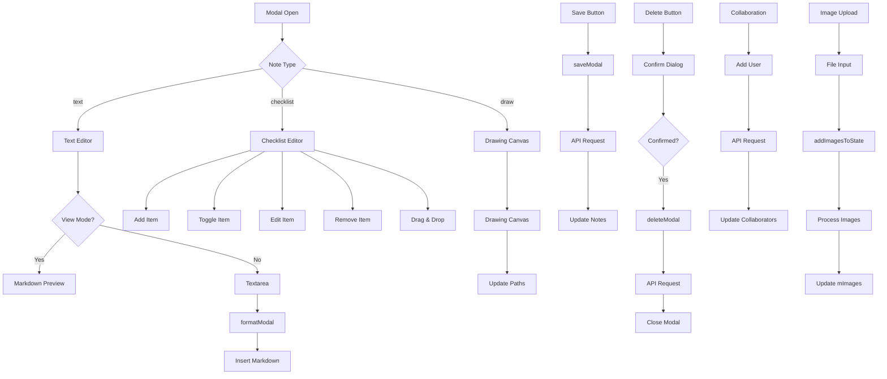

# Modal Component
**Last Updated:** January 21, 2026  
**Version:** 1.0  
**Status:** ✅ Production Ready

---

## Overview

`Modal` is the comprehensive note editor modal that provides full CRUD operations for notes. It supports three note types (text, checklist, drawing), includes rich text formatting, image management, collaboration features, and various customization options (color, transparency, tags).

---

## Purpose

Provide full-featured note editing interface with:
- Text note editing with markdown support
- Checklist note management with drag-and-drop
- Drawing canvas for sketch notes
- Rich text formatting toolbar
- Image upload and viewing
- Tag management
- Color and transparency selection
- Collaboration features
- Delete confirmation
- Save and cancel actions

---

## Key Responsibilities

### 1. Note Type Rendering
- Text notes: Editable textarea with markdown preview
- Checklist notes: Interactive checklist with drag-and-drop
- Drawing notes: Canvas-based drawing interface

### 2. Rich Text Features
- Markdown formatting support
- Format toolbar (bold, italic, heading, etc.)
- View/Edit mode toggle
- Smart Enter handling

### 3. Media Management
- Image upload
- Image viewer with navigation
- Image deletion
- Image download

### 4. Collaboration
- Add/remove collaborators
- User search
- Permission handling
- Owner vs. collaborator modes

### 5. Customization
- Color picker
- Transparency picker
- Tag management
- Pin/unpin notes
- Archive/unarchive notes

---

## Component Structure

### Main Modal

```
Modal
├── Modal Scrim (backdrop)
│   └── Click to close
├── Modal Container
│   ├── Sticky Header
│   │   ├── Title Input
│   │   ├── Collaboration Button
│   │   ├── View/Edit Toggle
│   │   ├── Format Button (text type)
│   │   │   └── Format Toolbar Popover
│   │   ├── 3-Dot Menu
│   │   │   ├── Download .md
│   │   │   ├── Archive/Unarchive
│   │   │   └── Delete
│   │   ├── Pin Button
│   │   └── Close Button
│   ├── Content Area
│   │   ├── Images Gallery
│   │   ├── Text Editor (view/edit mode)
│   │   │   └── Markdown Preview
│   │   ├── Checklist Editor
│   │   └── Drawing Canvas
│   │   └── Edited Timestamp
│   ├── Footer
│   │   ├── Tags Section
│   │   │   └── Tag Input
│   │   └── Controls
│   │       ├── Color Picker
│   │       ├── Transparency Picker
│   │       ├── Image Upload
│   │       └── Save Button
│   ├── Delete Confirmation (overlay)
│   ├── Collaboration Modal (overlay)
│   └── Image Viewer (overlay)
```

### ChecklistContent Sub-component

```
ChecklistContent
├── Input Field
│   ├── Enter to add
│   └── Add button
├── Active Items (undone)
│   └── ChecklistRow (drag-and-drop)
└── Completed Items (done)
    └── ChecklistRow
```

### CollaborationModal Sub-component

```
CollaborationModal
├── Current Collaborators List
│   ├── Collaborator Info
│   └── Remove/Leave Button
├── User Search Input
│   └── User Dropdown (portal)
└── Action Buttons
    ├── Cancel
    └── Add Collaborator
```

---

## State Management

### Context Consumption

```javascript
// Modal Context - All modal state
const {
  open,                    // Modal open state
  activeId,               // Active note ID
  activeNoteObj,          // Active note object
  mType,                  // Note type (text/checklist/draw)
  mTitle,                 // Note title
  setMTitle,             // Set title
  mBody,                 // Note body/content
  setMBody,              // Set body
  viewMode,               // View/Edit mode
  setViewMode,            // Toggle mode
  mItems,                // Checklist items
  setMItems,             // Set items
  mInput,                // Checklist input
  setMInput,             // Set input
  mDrawingData,           // Drawing paths
  setMDrawingData,       // Set drawing data
  mColor,                // Note color
  setMColor,             // Set color
  mTransparency,          // Note transparency
  setMTransparency,       // Set transparency
  mImages,               // Attached images
  setMImages,            // Set images
  imgViewOpen,           // Image viewer open
  mImagesViewIndex,       // Current image index
  tagInput,              // Tag input value
  setTagInput,           // Set tag input
  mTagList,              // Tag list
  setMTagList,           // Set tag list
  showModalFmt,           // Format toolbar open
  setShowModalFmt,        // Toggle format toolbar
  modalMenuOpen,          // Menu open
  setModalMenuOpen,       // Toggle menu
  showModalColorPop,       // Color picker open
  setShowModalColorPop,   // Toggle color picker
  showModalTransPop,      // Transparency picker open
  setShowModalTransPop,   // Toggle transparency picker
  collaborationModalOpen, // Collaboration modal open
  setCollaborationModalOpen, // Toggle collaboration modal
  collaboratorUsername,    // Collaborator search input
  setCollaboratorUsername, // Set username
  showUserDropdown,       // User dropdown open
  setShowUserDropdown,    // Toggle dropdown
  filteredUsers,          // Filtered user results
  setFilteredUsers,       // Set filtered users
  addModalCollaborators, // Current collaborators
  confirmDeleteOpen,      // Delete confirmation open
  setConfirmDeleteOpen,   // Toggle delete confirmation
  checklistDragId,        // Dragged checklist item ID
  loadingUsers,           // Users loading state
  setLoadingUsers,        // Set loading state
  dropdownPosition,       // Dropdown position
  setDropdownPosition,    // Set dropdown position
  modalScrollRef,         // Scroll container ref
  modalFmtBtnRef,         // Format button ref
  modalMenuBtnRef,        // Menu button ref
  modalColorBtnRef,       // Color button ref
  modalTransBtnRef,       // Transparency button ref
  modalFileRef,           // File input ref
  mBodyRef,               // Body textarea ref
  noteViewRef,            // View mode ref
  collaboratorInputRef,    // Collaborator input ref
  scrimClickStartRef,      // Scrim click start ref
  closeModal,             // Close modal action
  saveModal,              // Save note action
  deleteModal,            // Delete note action
  formatModal,            // Format text action
  onModalBodyClick,        // Body click handler
  handleSmartEnter,       // Smart Enter handler
  resizeModalTextarea,    // Auto-resize textarea
  handleTagKeyDown,       // Tag keydown handler
  handleTagBlur,          // Tag blur handler
  handleTagPaste,         // Tag paste handler
  handleDownloadNote,      // Download note handler
  addCollaborator,        // Add collaborator action
  removeCollaborator,      // Remove collaborator action
  searchUsers,            // Search users action
  loadCollaboratorsForAddModal, // Load collaborators
  onMChecklistDragStart,  // Checklist drag start
  onMChecklistDragOver,   // Checklist drag over
  onMChecklistDrop,       // Checklist drop
  openImageViewer,         // Open image viewer
  closeImageViewer,        // Close image viewer
  nextImage,              // Next image
  prevImage,              // Previous image
  modalHasChanges,         // Changes detected
  isSaving               // Saving state
} = useModal()

// Auth Context
const { token, currentUser } = useAuth()

// Notes Context
const { notes, tagFilter, loadNotes, togglePin, toggleArchiveNote } = useNotes()

// Settings Context
const { dark } = useSettings()

// Collaboration Hook
const { isOnline } = useCollaboration({ token, tagFilter, onNotesUpdated: loadNotes })
```

---

## Key Features

### 1. Modal Scrim (Backdrop)

```javascript
<div
  className="modal-scrim fixed inset-0 bg-black/40 backdrop-blur-md z-40 flex items-center justify-center"
  onMouseDown={(e) => {
    scrimClickStartRef.current = (e.target === e.currentTarget);
  }}
  onClick={(e) => {
    if (scrimClickStartRef.current && e.target === e.currentTarget) {
      closeModal();
    }
    scrimClickStartRef.current = false;
  }}
>
  {/* Modal content */}
</div>
```

**Behavior:**
- Click scrim to close modal
- Track click start to prevent false closes
- Backdrop blur effect
- Fixed positioning

---

### 2. Title Input

```javascript
<input
  className="flex-[1_0_50%] min-w-[240px] bg-transparent text-2xl font-bold placeholder-gray-500"
  value={mTitle}
  onChange={(e) => { if (isOnline) setMTitle(e.target.value) }}
  placeholder="Title"
  disabled={!isOnline}
/>
```

**Features:**
- Editable when online
- Disabled when offline
- Transparent background
- Large font size
- Placeholder text

---

### 3. Format Toolbar

```javascript
<button
  ref={modalFmtBtnRef}
  onClick={(e) => {
    e.stopPropagation();
    setShowModalFmt((v) => !v);
  }}
>
  <FormatIcon />
</button>
<Popover
  anchorRef={modalFmtBtnRef}
  open={showModalFmt}
  onClose={() => setShowModalFmt(false)}
>
  <FormatToolbar
    dark={dark}
    onAction={(t) => {
      setShowModalFmt(false);
      formatModal(t);
    }}
  />
</Popover>
```

**Features:**
- Toggle visibility
- Position relative to button
- Close on action
- Pass dark mode
- Call formatModal with type

---

### 4. Three-Dot Menu

```javascript
<button
  ref={modalMenuBtnRef}
  onClick={(e) => { e.stopPropagation(); setModalMenuOpen((v) => !v); }}
>
  <Kebab />
</button>
<Popover
  anchorRef={modalMenuBtnRef}
  open={modalMenuOpen}
  onClose={() => setModalMenuOpen(false)}
>
  <div onClick={(e) => e.stopPropagation()}>
    <button onClick={handleDownloadNote}>Download .md</button>
    <button onClick={toggleArchiveNote}>Archive</button>
    <button onClick={() => setConfirmDeleteOpen(true)}>Delete</button>
  </div>
</Popover>
```

**Menu Items:**
- Download note as markdown
- Archive/Unarchive note
- Delete note

---

### 5. Text Editor

#### Edit Mode

```javascript
<textarea
  ref={mBodyRef}
  className="w-full bg-transparent placeholder-gray-500 focus:outline-none resize-none overflow-hidden"
  style={{ scrollBehavior: 'unset' }}
  value={mBody}
  onChange={(e) => { if (isOnline) { setMBody(e.target.value); resizeModalTextarea(); } }}
  onKeyDown={(e) => {
    if (e.key === "Enter" && !e.shiftKey && !e.altKey && !e.ctrlKey && !e.metaKey) {
      const res = handleSmartEnter(value, start, end);
      if (res) {
        e.preventDefault();
        setMBody(res.text);
        // Restore cursor and scroll
      }
    }
  }}
  placeholder="Write your note…"
  disabled={!isOnline}
/>
```

**Features:**
- Auto-resize height
- Smart Enter handling
- Cursor position restoration
- Scroll to bottom on last line
- Disabled when offline

#### View Mode

```javascript
<div
  ref={noteViewRef}
  className="note-content note-content--dense whitespace-pre-wrap"
  dangerouslySetInnerHTML={{ __html: marked.parse(mBody || "") }}
/>
```

**Features:**
- Markdown rendering with `marked`
- Read-only display
- Dense content layout
- Preserve whitespace

---

### 6. Smart Enter Handling

```javascript
const handleSmartEnter = (value, start, end) => {
  const lastNewlineIndex = value.lastIndexOf('\n');
  const isOnLastLine = start > lastNewlineIndex;
  const res = handleSmartEnter(value, start, end);
  
  if (res) {
    e.preventDefault();
    setMBody(res.text);
    requestAnimationFrame(() => {
      try {
        el.setSelectionRange(res.range[0], res.range[1]);
      } catch { /* ignore */ }
      resizeModalTextarea();
      if (isOnLastLine) {
        setTimeout(() => {
          modalScrollEl.scrollTop += 30;
        }, 50);
      }
    });
  }
};
```

**Behavior:**
- Insert markdown list items
- Maintain cursor position
- Auto-scroll on last line
- Handle multiple list types

---

### 7. Checklist Editor

```javascript
<ChecklistContent
  mItems={mItems}
  setMItems={setMItems}
  mInput={mInput}
  setMInput={setMInput}
  isOnline={isOnline}
  uid={uid}
  checklistDragId={checklistDragId}
  onMChecklistDragStart={onMChecklistDragStart}
  onMChecklistDragOver={onMChecklistDragOver}
  onMChecklistDrop={onMChecklistDrop}
/>
```

**Features:**
- Add items via input
- Toggle completion
- Edit item text
- Remove items
- Drag-and-drop reorder
- Separate done/undone sections

---

### 8. Drawing Canvas

```javascript
<DrawingCanvas
  data={mDrawingData}
  onChange={setMDrawingData}
  width={750}
  height={850}
  readOnly={!isOnline}
  darkMode={dark}
  initialMode="view"
/>
```

**Features:**
- Canvas-based drawing
- Path data storage
- Read-only when offline
- Dark mode color conversion
- View/edit modes

---

### 9. Image Gallery

```javascript
{mImages.length > 0 && (
  <div className="mb-5 flex gap-3 overflow-x-auto">
    {mImages.map((im, idx) => (
      <div key={im.id} className="relative inline-block">
         { e.stopPropagation(); openImageViewer(idx); }}
        />
        {isOnline && (
          <button onClick={() => setMImages(prev => prev.filter(x => x.id !== im.id))}>
            ×
          </button>
        )}
      </div>
    ))}
  </div>
)}
```

**Features:**
- Horizontal scroll
- Click to view full size
- Remove button (online only)
- Responsive heights

---

### 10. Image Viewer

```javascript
{imgViewOpen && mImages.length > 0 && (
  <div className="fixed inset-0 z-50 bg-black/80 flex items-center justify-center">
    {/* Controls */}
    <div className="absolute top-4 right-4">
      <button onClick={downloadImage}>Download</button>
      <button onClick={closeImageViewer}>Close</button>
    </div>
    
    {/* Navigation */}
    {mImages.length > 1 && (
      <>
        <button onClick={prevImage}>←</button>
        <button onClick={nextImage}>→</button>
      </>
    )}
    
    {/* Main Image */}
    
    
    {/* Caption */}
    <div className="absolute bottom-6">
      {mImages[mImagesViewIndex].name}
      ({mImagesViewIndex + 1}/{mImages.length})
    </div>
  </div>
)}
```

**Features:**
- Full-screen overlay
- Download button
- Previous/Next navigation
- Image caption with index
- Click outside to close

---

### 11. Color Picker

```javascript
<button
  ref={modalColorBtnRef}
  onClick={() => setShowModalColorPop((v) => !v)}
  style={{
    backgroundColor: mColor === "default" ? "transparent" : solid(bgFor(mColor, dark)),
    borderColor: mColor === "default" ? "#d1d5db" : solid(bgFor(mColor, dark)),
  }}
>
  {mColor === "default" && <div style={{ backgroundColor: dark ? "#1f2937" : "#fff" }} />}
</button>
<Popover
  anchorRef={modalColorBtnRef}
  open={showModalColorPop}
  onClose={() => setShowModalColorPop(false)}
>
  <div className="grid grid-cols-6 gap-2">
    {COLOR_ORDER.filter(name => LIGHT_COLORS[name]).map(name => (
      <ColorDot
        key={name}
        name={name}
        darkMode={dark}
        selected={mColor === name}
        onClick={(e) => {
          e.stopPropagation();
          setMColor(name);
          setShowModalColorPop(false);
        }}
      />
    ))}
  </div>
</Popover>
```

**Features:**
- Visual color preview
- Grid of color options
- Selected state indicator
- Click to select and close

---

### 12. Transparency Picker

```javascript
<button
  ref={modalTransBtnRef}
  onClick={() => setShowModalTransPop((v) => !v)}
  className={`px-2 py-1 rounded-lg border ${
    mTransparency 
      ? 'border-accent bg-accent/20 text-accent' 
      : 'border-[var(--border-light)]'
  }`}
>
  💧
</button>
<Popover
  anchorRef={modalTransBtnRef}
  open={showModalTransPop}
  onClose={() => setShowModalTransPop(false)}
>
  <div className="flex flex-col gap-1">
    <button onClick={() => { setMTransparency(null); }}>
      Use Default
    </button>
    {TRANSPARENCY_PRESETS.map(preset => (
      <button key={preset.id} onClick={() => { setMTransparency(preset.id); }}>
        {preset.name}
      </button>
    ))}
  </div>
</Popover>
```

**Features:**
- Transparency indicator (💧)
- Default option
- Preset options
- Active state highlight

---

### 13. Tag Management

```javascript
<div className="flex items-center gap-2">
  {mTagList.map(tag => (
    <span key={tag}>
      {tag}
      {isOnline && (
        <button onClick={() => setMTagList(prev => prev.filter(t => t !== tag))}>
          ×
        </button>
      )}
    </span>
  ))}
  {isOnline && (
    <input
      value={tagInput}
      onChange={(e) => setTagInput(e.target.value)}
      onKeyDown={handleTagKeyDown}
      onBlur={handleTagBlur}
      onPaste={handleTagPaste}
      placeholder="Add tags"
    />
  )}
</div>
```

**Features:**
- Display current tags
- Remove tag button
- Add tag input
- Enter to add
- Paste to add (comma-separated)
- Disabled when offline

---

### 14. Image Upload

```javascript
<input
  ref={modalFileRef}
  type="file"
  accept="image/*"
  multiple
  className="hidden"
  onChange={async (e) => {
    const f = e.target.files;
    if (f && f.length) {
      await addImagesToState(f, setMImages);
    }
    e.target.value = "";
  }}
/>
<button onClick={() => modalFileRef.current?.click()}>
  🖼️
</button>
```

**Features:**
- Multiple file selection
- Image files only
- Hidden file input
- Button trigger
- Reset after upload

---

### 15. Delete Confirmation

```javascript
{confirmDeleteOpen && (
  <div className="fixed inset-0 z-50 flex items-center justify-center">
    <div className="absolute inset-0 bg-black/40" onClick={() => setConfirmDeleteOpen(false)} />
    <div className="glass-card rounded-xl p-6">
      <h3>Delete this note?</h3>
      <p>This action cannot be undone.</p>
      <div className="mt-5 flex justify-end gap-3">
        <button onClick={() => setConfirmDeleteOpen(false)}>Cancel</button>
        <button
          className="bg-red-600 text-white"
          onClick={async () => {
            setConfirmDeleteOpen(false);
            await deleteModal();
          }}
        >
          Delete
        </button>
      </div>
    </div>
  </div>
)}
```

**Features:**
- Confirmation dialog
- Warning message
- Cancel button
- Delete button (red)
- Calls deleteModal on confirm

---

### 16. Collaboration Modal

```javascript
<CollaborationModal
  dark={dark}
  activeId={activeId}
  notes={notes}
  currentUser={currentUser}
  addModalCollaborators={addModalCollaborators}
  collaboratorUsername={collaboratorUsername}
  setCollaboratorUsername={setCollaboratorUsername}
  showUserDropdown={showUserDropdown}
  setShowUserDropdown={setShowUserDropdown}
  filteredUsers={filteredUsers}
  dropdownPosition={dropdownPosition}
  addCollaborator={addCollaborator}
  removeCollaborator={removeCollaborator}
  searchUsers={searchUsers}
  setCollaborationModalOpen={setCollaborationModalOpen}
/>
```

**Features:**
- Show current collaborators
- Add new collaborators
- Search users
- Remove collaborators
- Owner vs. collaborator modes
- Leave note option for collaborators

---

## Sub-Components

### ChecklistContent

**Purpose:** Render checklist editor with input and items

```javascript
function ChecklistContent({
  mItems, setMItems,
  mInput, setMInput,
  isOnline, uid,
  checklistDragId,
  onMChecklistDragStart,
  onMChecklistDragOver,
  onMChecklistDrop
}) {
  // Input for new items
  // List of undone items
  // Divider
  // List of done items
}
```

**Features:**
- Enter to add item
- Add button
- Separate done/undone
- Drag-and-drop support
- Edit item text
- Toggle completion
- Remove items

---

### CollaborationModal

**Purpose:** Manage note collaborators

```javascript
function CollaborationModal({
  dark, activeId, notes, currentUser,
  addModalCollaborators, collaboratorUsername,
  setCollaboratorUsername, showUserDropdown,
  setShowUserDropdown, filteredUsers,
  dropdownPosition, addCollaborator,
  removeCollaborator, setCollaborationModalOpen
}) {
  // Current collaborators list
  // User search input
  // User dropdown (portal)
  // Action buttons
}
```

**Features:**
- Show collaborators
- Owner controls (add/remove)
- Collaborator controls (leave)
- User search with debounce
- User dropdown (portal)
- Permission checks

---

## Keyboard Shortcuts

### Image Viewer
- `←` - Previous image
- `→` - Next image
- `D` - Download image
- `Esc` - Close viewer

### Text Editor
- `Enter` - Smart insert (lists, newlines)
- `Shift + Enter` - Regular newline
- `Esc` - Close modal (via scrim)

---

## Data Flow



---

## Performance Optimizations

### 1. Portal for Dropdown
```javascript
{showUserDropdown && createPortal(
  <div className="fixed z-[60]">User Dropdown</div>,
  document.body
)}
```

**Purpose:** Render dropdown at body level to avoid z-index issues

### 2. Debounced Search
```javascript
React.useEffect(() => {
  const timer = setTimeout(() => {
    if (collaboratorUsername.trim().length >= 2) {
      searchUsers(collaboratorUsername);
    }
  }, 300);
  return () => clearTimeout(timer);
}, [collaboratorUsername, searchUsers]);
```

**Purpose:** Prevent excessive API calls during user search

### 3. requestAnimationFrame
```javascript
requestAnimationFrame(() => {
  try {
    el.setSelectionRange(res.range[0], res.range[1]);
  } catch { /* ignore */ }
});
```

**Purpose:** Ensure cursor position updates after render

---

## Accessibility

### Focus Management
- Modal focus trap
- Focus restoration on close
- Visible focus indicators
- Tab order maintained

### Keyboard Navigation
- Escape to close modal
- Arrow keys for image navigation
- Enter for actions
- Tab through controls

### Screen Readers
- Semantic HTML structure
- ARIA labels on buttons
- Alt text on images
- Meaningful button text

---

## Testing

### Unit Tests

```javascript
describe('Modal Component', () => {
  it('should render text editor', () => {
    // Test text type rendering
  });
  
  it('should render checklist editor', () => {
    // Test checklist type rendering
  });
  
  it('should render drawing canvas', () => {
    // Test drawing type rendering
  });
  
  it('should toggle view/edit mode', () => {
    // Test mode switching
  });
  
  it('should show format toolbar', () => {
    // Test format toolbar
  });
  
  it('should handle save', () => {
    // Test save action
  });
  
  it('should show delete confirmation', () => {
    // Test delete flow
  });
});
```

### Integration Tests

```javascript
describe('Modal Integration', () => {
  it('should complete note edit flow', () => {
    // Test: open -> edit -> save -> close
  });
  
  it('should complete checklist flow', () => {
    // Test: add items -> toggle -> save
  });
  
  it('should complete image upload flow', () => {
    // Test: upload -> view -> delete
  });
});
```

### E2E Tests (Playwright)

```javascript
test('Note editing', async ({ page }) => {
  await page.goto('/#/notes');
  await page.click('[data-testid="note-1"]');
  
  // Edit title
  await page.fill('[data-testid="modal-title"]', 'Updated Title');
  
  // Edit body
  await page.fill('[data-testid="modal-body"]', 'Updated content');
  
  // Save
  await page.click('[data-testid="save-button"]');
  
  // Verify
  await expect(page.locator('[data-testid="note-1"]')).toContainText('Updated Title');
});
```

---

## Troubleshooting

### Issue: Modal not closing on scrim click

**Possible Causes:**
- Click start tracking error
- Event propagation issue
- Scrim z-index issue

**Solutions:**
1. Verify scrimClickStartRef logic
2. Check event.stopPropagation()
3. Verify z-index is correct
4. Test click target detection

---

### Issue: Format toolbar not showing

**Possible Causes:**
- View mode active
- Modal not open
- Ref not attached
- Online status false

**Solutions:**
1. Check viewMode state
2. Verify modal is open
3. Ensure modalFmtBtnRef is set
4. Check isOnline status

---

### Issue: Images not uploading

**Possible Causes:**
- File input ref not attached
- Offline mode
- addImagesToState error
- File format not supported

**Solutions:**
1. Verify modalFileRef is set
2. Check isOnline status
3. Test addImagesToState function
4. Verify file types are images

---

### Issue: Collaboration not working

**Possible Causes:**
- User not owner
- API error
- User not found
- Permission error

**Solutions:**
1. Verify user is owner
2. Check API responses
3. Test user search
4. Verify permissions on server

---

### Issue: Smart Enter not working

**Possible Causes:**
- Textarea ref not attached
- handleSmartEnter error
- Cursor position error
- Markdown parsing error

**Solutions:**
1. Verify mBodyRef is set
2. Test handleSmartEnter function
3. Check cursor position calculation
4. Verify markdown insertion logic

---

## Related Components

- [FormatToolbar](./FormatToolbar.md) - Rich text formatting
- [ChecklistRow](./ChecklistRow.md) - Checklist item component
- [DrawingCanvas](../DrawingCanvas.md) - Drawing component
- [Popover](./Popover.md) - Popover container
- [ColorDot](./ColorDot.md) - Color selection dot

---

## Related Contexts

- [ModalContext](../contexts/ModalContext.md) - Modal state management
- [AuthContext](../contexts/AuthContext.md) - User authentication
- [NotesContext](../contexts/NotesContext.md) - Notes operations
- [SettingsContext](../contexts/SettingsContext.md) - Dark mode

---

## Best Practices

1. **Always close popovers on action**
2. **Stop event propagation on nested clicks**
3. **Debounce user search queries**
4. **Use portals for dropdowns**
5. **Maintain focus management**
6. **Validate online status before actions**
7. **Handle errors gracefully**
8. **Provide clear confirmation dialogs**

---

**Component Version:** 1.0  
**Last Updated:** January 21, 2026  
**Status:** ✅ Production Ready