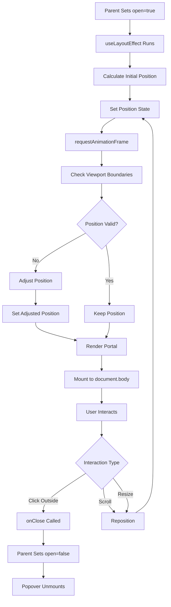

# Popover Component
**Last Updated:** January 21, 2026  
**Version:** 1.0  
**Status:** ✅ Production Ready

---

## Overview

`Popover` is a positioning component that renders content in a portal outside the normal DOM flow, positioned relative to an anchor element. It automatically adjusts position to stay within viewport boundaries and closes when clicking outside.

---

## Purpose

Provide popover container with:
- Portal rendering (outside normal DOM flow)
- Automatic positioning relative to anchor
- Viewport boundary detection
- Position adjustment to stay visible
- Click outside to close
- Scroll and resize handling
- Customizable offset
- High z-index for layering

---

## Key Responsibilities

### 1. Positioning
- Calculate position relative to anchor
- Initial placement below anchor
- Adjust if bottom of popover exceeds viewport
- Adjust if right of popover exceeds viewport

### 2. Portal Rendering
- Render outside normal DOM flow
- Attach to document.body
- Avoid overflow/clipping issues
- Maintain z-index layering

### 3. User Interaction
- Close on click outside
- Ignore clicks inside popover
- Ignore clicks on anchor element

### 4. Responsiveness
- Reposition on scroll
- Reposition on resize
- Maintain visibility in viewport

---

## Component Structure

```
Popover
├── Portal (createPortal)
│   └── Fixed Container
│       ├── Ref (boxRef)
│       ├── Position (top, left)
│       ├── Z-Index (99999)
│       └── Children Content
└── Event Listeners
    ├── Scroll → Reposition
    ├── Resize → Reposition
    └── Click Outside → Close
```

---

## Props

```javascript
{
  anchorRef: React.RefObject<HTMLElement>,  // Anchor element ref (required)
  open: boolean,                         // Open state (required)
  onClose: () => void,                   // Close handler (required)
  children: React.ReactNode,              // Content (required)
  offset: number                         // Distance from anchor (default: 8)
}
```

### anchorRef
- **Type:** `React.RefObject<HTMLElement>`
- **Default:** Required
- **Purpose:** Reference to anchor element
- **Usage:** Popover positioned relative to this element

### open
- **Type:** `boolean`
- **Default:** Required
- **Purpose:** Popover open state
- **Usage:** When true, render popover; when false, return null

### onClose
- **Type:** `() => void`
- **Default:** Required
- **Purpose:** Close handler
- **Usage:** Called when user clicks outside popover

### children
- **Type:** `React.ReactNode`
- **Default:** Required
- **Purpose:** Popover content
- **Usage:** Any React content to display in popover

### offset
- **Type:** `number`
- **Default:** `8`
- **Purpose:** Distance from anchor element (in pixels)
- **Usage:** Gap between anchor and popover

---

## Key Features

### 1. Initial Positioning

```javascript
const place = () => {
  const a = anchorRef?.current;
  if (!a) return;
  const r = a.getBoundingClientRect();
  let top = r.bottom + offset;
  let left = r.left;
  setPos({ top, left });
  // ... adjustment
};
```

**Initial Position:**
- Top: Anchor bottom + offset
- Left: Anchor left
- Example: Anchor at (100, 200), offset 8 → Popover at (100, 208)

---

### 2. Viewport Boundary Detection

```javascript
requestAnimationFrame(() => {
  const el = boxRef.current;
  if (!el) return;
  const bw = el.offsetWidth;
  const bh = el.offsetHeight;
  let t = top;
  let l = left;
  const vw = window.innerWidth;
  const vh = window.innerHeight;
  if (l + bw + 8 > vw) l = Math.max(8, vw - bw - 8);
  if (t + bh + 8 > vh) {
    t = Math.max(8, r.top - bh - offset);
  }
  setPos({ top: t, left: l });
});
```

**Adjustment Logic:**

#### Right Edge
- If: `left + popoverWidth + 8 > viewportWidth`
- Then: `left = max(8, viewportWidth - popoverWidth - 8)`
- Result: Popover moves left to fit within viewport

#### Bottom Edge
- If: `top + popoverHeight + 8 > viewportHeight`
- Then: `top = max(8, anchorTop - popoverHeight - offset)`
- Result: Popover moves above anchor

**Minimum Margin:** 8px from viewport edges

---

### 3. Portal Rendering

```javascript
return createPortal(
  <div
    ref={boxRef}
    style={{ position: "fixed", top: pos.top, left: pos.left, zIndex: 99999 }}
  >
    {children}
  </div>,
  document.body
);
```

**Portal Benefits:**
- Renders outside normal DOM flow
- Attached to document.body
- Avoids overflow/clipping issues
- High z-index (99999) ensures visibility
- Fixed positioning relative to viewport

---

### 4. Click Outside to Close

```javascript
useEffect(() => {
  if (!open) return;
  const onDown = (e) => {
    const el = boxRef.current;
    const a = anchorRef?.current;
    if (el && el.contains(e.target)) return;
    if (a && a.contains(e.target)) return;
    onClose?.();
  };
  document.addEventListener("mousedown", onDown, true);
  return () => document.removeEventListener("mousedown", onDown, true);
}, [open, onClose, anchorRef]);
```

**Logic:**
1. Listen for mousedown on document (capture phase)
2. If click inside popover: Ignore
3. If click inside anchor: Ignore
4. Otherwise: Call onClose

**Capture Phase:** `true` ensures detection before other handlers

---

### 5. Scroll and Resize Handling

```javascript
const onWin = () => place();
window.addEventListener("scroll", onWin, true);
window.addEventListener("resize", onWin);
```

**Events:**
- Scroll: Reposition popover
- Resize: Reposition popover
- Use capture phase for scroll to catch all scroll events

**Cleanup:**
- Remove listeners on unmount
- Remove listeners when popover closes

---

### 6. useLayoutEffect for Positioning

```javascript
useLayoutEffect(() => {
  if (!open) return;
  const place = () => {
    // ... positioning logic
  };
  place();
  // ... event listeners
}, [open, anchorRef, offset]);
```

**Why useLayoutEffect?**
- Runs synchronously after DOM updates
- Prevents flickering on initial render
- Ensures position calculated before paint
- Better for visual positioning

---

## Styling

### Container

```javascript
style={{ 
  position: "fixed", 
  top: pos.top, 
  left: pos.left, 
  zIndex: 99999 
}}
```

- `position: fixed` - Fixed positioning relative to viewport
- `top: pos.top` - Calculated top position
- `left: pos.left` - Calculated left position
- `zIndex: 99999` - High z-index for layering

---

## Accessibility

### Click Outside Detection

```javascript
if (el && el.contains(e.target)) return;
if (a && a.contains(e.target)) return;
```

**Features:**
- Ignores clicks inside popover
- Ignores clicks on anchor element
- Closes on clicks elsewhere

### Keyboard Navigation

- Requires parent to implement keyboard support
- Escape key handling recommended in parent
- Focus management recommended

### ARIA Attributes

Parent should add appropriate ARIA attributes:

```javascript
<button
  aria-haspopup="true"
  aria-expanded={open}
  ref={anchorRef}
>
  Toggle
</button>

<Popover anchorRef={anchorRef} open={open}>
  <div role="menu">
    {/* Menu items */}
  </div>
</Popover>
```

---

## Data Flow



---

## Performance

### Optimizations

1. **useLayoutEffect**
   - Synchronous DOM updates
   - Prevents flickering
   - Calculates position before paint

2. **requestAnimationFrame**
   - Batches DOM reads
   - Ensures layout is complete
   - Reduces reflows

3. **Conditional Rendering**
   - Only render when open
   - Early return when closed
   - No unnecessary DOM nodes

4. **Event Listener Cleanup**
   - Remove listeners on unmount
   - Remove listeners when closed
   - Prevent memory leaks

---

## Responsive Design

### Viewport Adaptation

The popover automatically adapts to viewport:

```javascript
const vw = window.innerWidth;
const vh = window.innerHeight;
if (l + bw + 8 > vw) l = Math.max(8, vw - bw - 8);
if (t + bh + 8 > vh) t = Math.max(8, r.top - bh - offset);
```

**Behaviors:**
- Fits within viewport width
- Fits within viewport height
- 8px minimum margin from edges
- Repositions above anchor if needed

### Scroll and Resize

```javascript
window.addEventListener("scroll", onWin, true);
window.addEventListener("resize", onWin);
```

- Repositions on scroll
- Repositions on resize
- Maintains visibility

---

## Usage Examples

### Basic Usage

```javascript
import { Popover } from './components/Popover'
import { useRef, useState } from 'react'

function MyComponent() {
  const [open, setOpen] = useState(false)
  const anchorRef = useRef(null)
  
  return (
    <div>
      <button ref={anchorRef} onClick={() => setOpen(!open)}>
        Toggle Popover
      </button>
      
      <Popover
        anchorRef={anchorRef}
        open={open}
        onClose={() => setOpen(false)}
      >
        <div className="p-4 bg-white rounded shadow">
          Popover content
        </div>
      </Popover>
    </div>
  )
}
```

### With Custom Offset

```javascript
function MyComponent() {
  const [open, setOpen] = useState(false)
  const anchorRef = useRef(null)
  
  return (
    <div>
      <button ref={anchorRef} onClick={() => setOpen(true)}>
        Show Menu
      </button>
      
      <Popover
        anchorRef={anchorRef}
        open={open}
        onClose={() => setOpen(false)}
        offset={16}
      >
        <div className="bg-white rounded shadow-lg p-2">
          <button onClick={() => alert('Item 1')}>Item 1</button>
          <button onClick={() => alert('Item 2')}>Item 2</button>
        </div>
      </Popover>
    </div>
  )
}
```

### With ARIA Attributes

```javascript
function AccessibleMenu() {
  const [open, setOpen] = useState(false)
  const anchorRef = useRef(null)
  
  const handleKeyDown = (e) => {
    if (e.key === 'Escape') {
      setOpen(false)
      anchorRef.current?.focus()
    }
  }
  
  return (
    <div>
      <button
        ref={anchorRef}
        onClick={() => setOpen(!open)}
        aria-haspopup="true"
        aria-expanded={open}
      >
        Menu
      </button>
      
      <Popover
        anchorRef={anchorRef}
        open={open}
        onClose={() => setOpen(false)}
      >
        <div 
          role="menu" 
          onKeyDown={handleKeyDown}
          className="bg-white rounded shadow-lg p-2"
        >
          <button role="menuitem">Item 1</button>
          <button role="menuitem">Item 2</button>
        </div>
      </Popover>
    </div>
  )
}
```

### With Styled Content

```javascript
function StyledPopover() {
  const [open, setOpen] = useState(false)
  const anchorRef = useRef(null)
  
  return (
    <div>
      <button ref={anchorRef} onClick={() => setOpen(true)}>
        Show Popover
      </button>
      
      <Popover
        anchorRef={anchorRef}
        open={open}
        onClose={() => setOpen(false)}
      >
        <div className="min-w-48 bg-white dark:bg-gray-800 rounded-lg shadow-xl border border-gray-200 dark:border-gray-700 p-4">
          <h3 className="text-lg font-semibold mb-2">Title</h3>
          <p className="text-sm text-gray-600 dark:text-gray-300">
            Popover content here
          </p>
          <div className="mt-4 flex gap-2">
            <button className="px-3 py-1 bg-blue-500 text-white rounded">
              Action
            </button>
            <button className="px-3 py-1 bg-gray-200 dark:bg-gray-700 rounded">
              Cancel
            </button>
          </div>
        </div>
      </Popover>
    </div>
  )
}
```

---

## Testing

### Unit Tests

```javascript
describe('Popover Component', () => {
  it('should not render when closed', () => {
    // Test: open=false → return null
  });
  
  it('should render portal when open', () => {
    // Test: open=true → createPortal
  });
  
  it('should position below anchor', () => {
    // Test: initial position
  });
  
  it('should adjust position at right edge', () => {
    // Test: viewport boundary detection
  });
  
  it('should adjust position at bottom edge', () => {
    // Test: viewport boundary detection
  });
  
  it('should close on click outside', () => {
    // Test: click outside → onClose
  });
  
  it('should not close on click inside', () => {
    // Test: click inside → ignore
  });
  
  it('should not close on click anchor', () => {
    // Test: click anchor → ignore
  });
  
  it('should reposition on scroll', () => {
    // Test: scroll → reposition
  });
  
  it('should reposition on resize', () => {
    // Test: resize → reposition
  });
});
```

### Integration Tests

```javascript
describe('Popover Integration', () => {
  it('should complete open/close flow', () => {
    // Test: toggle → render → click outside → close
  });
  
  it('should handle viewport boundary', () => {
    // Test: anchor near edge → adjust position
  });
});
```

### E2E Tests (Playwright)

```javascript
test('Open and close popover', async ({ page }) => {
  await page.goto('/');
  
  // Click toggle button
  await page.click('[data-testid="popover-toggle"]');
  
  // Verify popover is visible
  await expect(page.locator('[data-testid="popover"]')).toBeVisible();
  
  // Click outside
  await page.click('body');
  
  // Verify popover is closed
  await expect(page.locator('[data-testid="popover"]')).not.toBeVisible();
});
```

---

## Troubleshooting

### Issue: Popover not showing

**Possible Causes:**
- open prop is false
- anchorRef not set
- Portal not rendering

**Solutions:**
1. Verify open prop is true
2. Check anchorRef is set correctly
3. Inspect document.body for portal

---

### Issue: Wrong position

**Possible Causes:**
- Anchor not rendered
- getBoundingClientRect() returns wrong values
- Position state not updating

**Solutions:**
1. Verify anchor element is rendered
2. Check anchorRef.current
3. Test with simple positioning

---

### Issue: Popover clipped by parent

**Possible Causes:**
- Parent has overflow hidden
- Not using portal
- Z-index conflict

**Solutions:**
1. Verify createPortal is working
2. Check parent overflow styles
3. Increase z-index

---

### Issue: Not closing on click outside

**Possible Causes:**
- onClose not provided
- Event listener not attached
- Click detection logic error

**Solutions:**
1. Verify onClose handler is provided
2. Check event listener attachment
3. Test click detection

---

### Issue: Flickering on open

**Possible Causes:**
- Using useEffect instead of useLayoutEffect
- Position calculation delayed
- React rendering issue

**Solutions:**
1. Verify useLayoutEffect is used
2. Check requestAnimationFrame timing
3. Test with controlled position

---

## Related Components

- [FormatToolbar](./FormatToolbar.md) - Format toolbar (uses Popover)
- [Composer](./Composer.md) - Note composer (uses Popover)

---

## Dependencies

- `react` - React hooks (useState, useRef, useEffect, useLayoutEffect)
- `react-dom` - createPortal

---

## Best Practices

1. **Always provide anchorRef from parent**
2. **Use useState for open control**
3. **Add ARIA attributes for accessibility**
4. **Handle Escape key for keyboard navigation**
5. **Style content with proper z-index**
6. **Test viewport boundary cases**
7. **Consider mobile touch targets**
8. **Clean up event listeners properly**

---

## Portal vs. Non-Portal

### Portal (This Component)

**Pros:**
- Renders outside normal flow
- Avoids overflow/clipping
- Fixed positioning easier
- High z-independent of parent

**Cons:**
- Slightly more complex
- Requires createPortal
- Event handling different

### Non-Portal

**Pros:**
- Simpler implementation
- Natural DOM flow
- Easier event handling

**Cons:**
- Can be clipped by parent
- Overflow issues
- Z-index conflicts

**Recommendation:** Use portal for tooltips, dropdowns, and popovers that need to appear outside their container.

---

**Component Version:** 1.0  
**Last Updated:** January 21, 2026  
**Status:** ✅ Production Ready