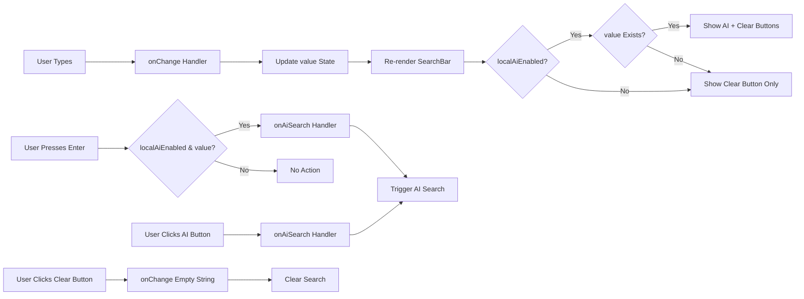

# SearchBar Component
**Last Updated:** January 21, 2026  
**Version:** 1.0  
**Status:** ✅ Production Ready

---

## Overview

`SearchBar` is a flexible search input component that supports both traditional search and AI-powered search. It features a clean design with optional AI search integration, clear button, keyboard shortcuts, and dark mode support.

---

## Purpose

Provide intuitive search interface with:
- Traditional text search
- Optional AI-powered search
- Clear button for quick reset
- Keyboard shortcuts (Enter for AI search)
- Dynamic placeholder text
- Dark mode support
- Responsive design
- Accessibility features

---

## Key Responsibilities

### 1. Search Input
- Text input field
- Controlled component pattern
- Placeholder customization
- Focus management

### 2. AI Integration
- AI search button (when enabled)
- Enter key for AI search
- Conditional display based on state
- Sparkles icon for AI

### 3. User Experience
- Clear button when value exists
- Dynamic placeholder based on AI mode
- Keyboard shortcuts
- Visual feedback on hover
- Accessible button labels

---

## Component Structure

```
SearchBar
├── Search Container (relative)
│   ├── Input Field
│   │   ├── Placeholder (dynamic)
│   │   ├── Value (controlled)
│   │   └── Event Handlers
│   └── Button Container (absolute, right-aligned)
│       ├── AI Search Button (conditional)
│       └── Clear Button (conditional)
```

---

## Props

```javascript
{
  value: string,                    // Search query value (required)
  onChange: (value: string) => void,  // Change handler (required)
  onAiSearch?: (query: string) => void, // AI search handler (optional)
  localAiEnabled: boolean,         // AI search enabled (required)
  dark: boolean,                   // Dark mode (required)
  placeholder?: string              // Custom placeholder (default: "Search...")
}
```

### value
- **Type:** `string`
- **Default:** Required
- **Purpose:** Controlled search input value
- **Usage:** Sets current search query

### onChange
- **Type:** `(value: string) => void`
- **Default:** Required
- **Purpose:** Handle input changes
- **Arguments:** New input value
- **Usage:** Update search state

### onAiSearch
- **Type:** `(query: string) => void`
- **Default:** `undefined`
- **Purpose:** Trigger AI search
- **Arguments:** Search query string
- **Usage:** Called when AI search button clicked or Enter pressed

### localAiEnabled
- **Type:** `boolean`
- **Default:** Required
- **Purpose:** Enable AI search features
- **Usage:** Shows AI search button and changes placeholder

### dark
- **Type:** `boolean`
- **Default:** Required
- **Purpose:** Enable dark mode styling
- **Usage:** Controls button colors and placeholder text

### placeholder
- **Type:** `string`
- **Default:** `"Search..."`
- **Purpose:** Custom placeholder text
- **Usage:** Overridden to "Search or Ask AI..." when localAiEnabled is true

---

## Key Features

### 1. Search Input Field

```javascript
<input
  type="text"
  placeholder={localAiEnabled ? "Search or Ask AI..." : placeholder}
  className={`w-full bg-transparent border border-[var(--border-light)] rounded-lg pl-4 ${localAiEnabled ? 'pr-14' : 'pr-8'} py-2 focus:outline-none focus:ring-2 focus:ring-accent placeholder-gray-500 dark:placeholder-gray-400`}
  value={value}
  onChange={(e) => onChange(e.target.value)}
  onKeyDown={(e) => {
    if (e.key === 'Enter' && localAiEnabled && value.trim().length > 0) {
      onAiSearch?.(value);
    }
  }}
/>
```

**Classes:**
- `w-full` - Full width
- `bg-transparent` - Transparent background
- `border border-[var(--border-light)]` - Border styling
- `rounded-lg` - Rounded corners
- `pl-4` - Left padding (32px)
- `pr-14` / `pr-8` - Right padding (56px when AI, 32px otherwise)
- `py-2` - Vertical padding (8px)
- `focus:outline-none` - Remove default focus
- `focus:ring-2 focus:ring-accent` - Focus ring (accent color, 2px)
- `placeholder-gray-500` / `dark:placeholder-gray-400` - Placeholder text color

**Behavior:**
- Controlled input (value prop)
- Updates on every keystroke
- Triggers AI search on Enter when enabled
- Dynamic placeholder based on AI mode
- Dynamic right padding based on AI mode

---

### 2. AI Search Button

```javascript
{localAiEnabled && value.trim().length > 0 && (
  <button
    type="button"
    title="Ask AI"
    className="h-7 w-7 rounded-full flex items-center justify-center text-accent hover:bg-accent/10 transition-colors"
    onClick={() => onAiSearch?.(value)}
  >
    <Sparkles size={16} />
  </button>
)}
```

**Classes:**
- `h-7 w-7` - Height and width (28px)
- `rounded-full` - Circular shape
- `flex items-center justify-center` - Center content
- `text-accent` - Accent color text
- `hover:bg-accent/10` - Hover background (accent at 10% opacity)
- `transition-colors` - Smooth color transitions

**Behavior:**
- Only shown when `localAiEnabled` is true
- Only shown when value exists and is not empty
- Click triggers `onAiSearch` with current value
- Sparkles icon from lucide-react
- Tooltip shows "Ask AI"

---

### 3. Clear Button

```javascript
{value && (
  <button
    type="button"
    aria-label="Clear search"
    className="h-6 w-6 rounded-full flex items-center justify-center text-gray-500 hover:text-gray-800 dark:text-gray-300 dark:hover:text-white"
    onClick={() => onChange("")}
  >
    ×
  </button>
)}
```

**Classes:**
- `h-6 w-6` - Height and width (24px)
- `rounded-full` - Circular shape
- `flex items-center justify-center` - Center content
- `text-gray-500` / `dark:text-gray-300` - Gray text
- `hover:text-gray-800` / `dark:hover:text-white` - Darker on hover
- `transition-colors` - Smooth color transitions

**Behavior:**
- Only shown when value exists
- Click clears the search (sets to empty string)
- ARIA label for accessibility
- Visual feedback on hover

---

### 4. Button Container

```javascript
<div className="absolute right-2 top-1/2 -translate-y-1/2 flex items-center gap-1">
  {localAiEnabled && value.trim().length > 0 && (
    <button {/* AI search button */} />
  )}
  {value && (
    <button {/* Clear button */} />
  )}
</div>
```

**Classes:**
- `absolute` - Absolute positioning
- `right-2` - Right offset (8px)
- `top-1/2` - Top centered
- `-translate-y-1/2` - Vertical center correction
- `flex items-center gap-1` - Flex layout with gap (4px)

**Behavior:**
- Positioned absolutely inside search container
- Vertically centered
- Right-aligned
- Contains AI search and clear buttons
- Horizontal gap between buttons

---

### 5. Keyboard Shortcuts

```javascript
onKeyDown={(e) => {
  if (e.key === 'Enter' && localAiEnabled && value.trim().length > 0) {
    onAiSearch?.(value);
  }
}}
```

**Shortcut:**
- **Enter** → Triggers AI search (when enabled and value exists)

**Conditions:**
- Key must be `Enter`
- `localAiEnabled` must be true
- Value must not be empty after trimming

---

## Styling

### Dark Mode Colors

**Placeholder Text:**
- Light: `#6b7280` (gray-500)
- Dark: `#9ca3af` (gray-400)

**Clear Button Text:**
- Default: `#6b7280` (gray-500)
- Hover: `#1f2937` (gray-800)
- Dark Default: `#d1d5db` (gray-300)
- Dark Hover: `#ffffff` (white)

### Light Mode Colors

**Placeholder Text:**
- `#6b7280` (gray-500)

**Clear Button Text:**
- Default: `#6b7280` (gray-500)
- Hover: `#1f2937` (gray-800)

### Focus Ring

- Color: `accent` (theme-dependent)
- Width: `2px`
- Radius: Follows border radius

---

## Responsive Design

### Container

```javascript
className="relative w-full max-w-lg"
```

- `w-full` - Full width of parent
- `max-w-lg` - Maximum width of 32rem (512px)
- `relative` - Positioning context for absolute buttons

### Behavior

**Mobile:**
- Full width
- Buttons accessible
- Touch-friendly

**Desktop:**
- Constrained to max width
- Centered or left-aligned based on parent
- Maintain proportions

---

## Accessibility

### ARIA Labels

```javascript
<button aria-label="Clear search">
  ×
</button>
```

**Purpose:** Screen reader context for clear button

### Focus Management

```javascript
className="... focus:ring-2 focus:ring-accent"
```

**Purpose:** Visible focus indicator for keyboard users

### Tooltips

```javascript
<button title="Ask AI">
  <Sparkles />
</button>
```

**Purpose:** Additional context on hover

### Keyboard Navigation

- Tab to input
- Tab to AI search button (if visible)
- Tab to clear button (if visible)
- Enter triggers AI search (when enabled)

---

## Usage Examples

### Basic Usage

```javascript
import { SearchBar } from './components/SearchBar'

function NotesView() {
  const [searchQuery, setSearchQuery] = useState('')
  const [darkMode, setDarkMode] = useState(false)
  
  return (
    <SearchBar
      value={searchQuery}
      onChange={setSearchQuery}
      localAiEnabled={false}
      dark={darkMode}
      placeholder="Search notes..."
    />
  )
}
```

### With AI Search

```javascript
function NotesView() {
  const [searchQuery, setSearchQuery] = useState('')
  const [darkMode, setDarkMode] = useState(true)
  const [localAiEnabled, setLocalAiEnabled] = useState(true)
  
  const handleAiSearch = (query) => {
    console.log('AI Search:', query)
    // Trigger AI search API
  }
  
  return (
    <SearchBar
      value={searchQuery}
      onChange={setSearchQuery}
      onAiSearch={handleAiSearch}
      localAiEnabled={localAiEnabled}
      dark={darkMode}
      placeholder="Search notes..."
    />
  )
}
```

### With Custom Placeholder

```javascript
function NotesView() {
  const [searchQuery, setSearchQuery] = useState('')
  
  return (
    <SearchBar
      value={searchQuery}
      onChange={setSearchQuery}
      localAiEnabled={true}
      dark={false}
      placeholder="Find anything..."
    />
  )
}
```

---

## Data Flow



---

## Performance

### Lightweight Component
- No internal state
- No side effects
- Minimal re-renders
- Pure function component

### Optimized Rendering
- Conditional button rendering
- Minimal class computation
- No unnecessary DOM elements

---

## Testing

### Unit Tests

```javascript
describe('SearchBar Component', () => {
  it('should render search input', () => {
    // Test input rendering
  });
  
  it('should call onChange on input', () => {
    // Test onChange handler
  });
  
  it('should show clear button when value exists', () => {
    // Test conditional rendering
  });
  
  it('should clear search on clear button click', () => {
    // Test clear functionality
  });
  
  it('should show AI button when localAiEnabled and value exists', () => {
    // Test AI button rendering
  });
  
  it('should call onAiSearch on button click', () => {
    // Test AI search callback
  });
  
  it('should call onAiSearch on Enter when localAiEnabled', () => {
    // Test Enter key shortcut
  });
});
```

### Integration Tests

```javascript
describe('SearchBar Integration', () => {
  it('should complete search flow', () => {
    // Test: type -> filter notes
  });
  
  it('should complete AI search flow', () => {
    // Test: type -> click AI button -> trigger search
  });
});
```

### E2E Tests (Playwright)

```javascript
test('Search notes', async ({ page }) => {
  await page.goto('/#/notes');
  
  // Type search query
  await page.fill('[data-testid="search-input"]', 'important');
  
  // Verify results
  await expect(page.locator('[data-testid="note-card"]')).toHaveCount(5);
});

test('AI search', async ({ page }) => {
  await page.goto('/#/notes');
  
  // Type search query
  await page.fill('[data-testid="search-input"]', 'summarize notes');
  
  // Press Enter
  await page.keyboard.press('Enter');
  
  // Verify AI search triggered
  await expect(page.locator('[data-testid="ai-response"]')).toBeVisible();
});
```

---

## Troubleshooting

### Issue: Clear button not showing

**Possible Causes:**
- Value is empty string
- Value is falsy
- Conditional logic error

**Solutions:**
1. Verify value is not empty string
2. Check value is truthy
3. Test with explicit value="test"

---

### Issue: AI button not showing

**Possible Causes:**
- localAiEnabled is false
- Value is empty
- onAiSearch not provided

**Solutions:**
1. Verify localAiEnabled is true
2. Ensure value exists and is not empty
3. Check onAiSearch is provided

---

### Issue: Enter not triggering AI search

**Possible Causes:**
- localAiEnabled is false
- Value is empty
- onAiSearch not provided
- Event handler error

**Solutions:**
1. Verify localAiEnabled is true
2. Ensure value is not empty
3. Check onAiSearch is provided
4. Test onKeyDown handler

---

### Issue: Placeholder not updating

**Possible Causes:**
- localAiEnabled not changing
- Placeholder prop override
- CSS override

**Solutions:**
1. Verify localAiEnabled state
2. Check placeholder prop value
3. Inspect rendered placeholder

---

### Issue: Focus ring not showing

**Possible Causes:**
- Focus styles overridden
- Accent color not defined
- CSS specificity issue

**Solutions:**
1. Check CSS focus styles
2. Verify accent color variable
3. Test with !important or inline styles

---

## Related Components

- [NotesView](./NotesView.md) - Notes view (parent)
- [Sidebar](./Sidebar.md) - Sidebar (potential parent)
- [App.jsx](./App.jsx.md) - Main app (potential parent)

---

## Dependencies

- `lucide-react` - Icon library (Sparkles icon)

---

## Best Practices

1. **Always provide value and onChange**
2. **Use controlled component pattern**
3. **Provide onAiSearch when enabling AI**
4. **Use ARIA labels for accessibility**
5. **Test keyboard shortcuts**
6. **Handle empty states gracefully**
7. **Provide clear visual feedback**
8. **Support both light and dark modes**

---

**Component Version:** 1.0  
**Last Updated:** January 21, 2026  
**Status:** ✅ Production Ready