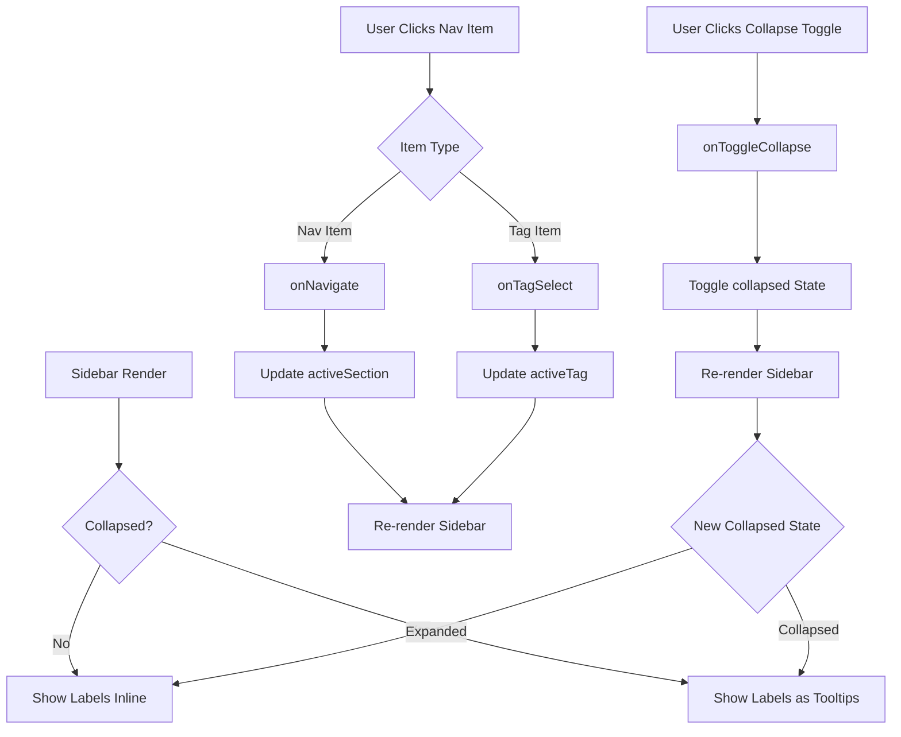

# Sidebar Component
**Last Updated:** January 21, 2026  
**Version:** 1.0  
**Status:** ✅ Production Ready

---

## Overview

`Sidebar` is a collapsible navigation sidebar with glassmorphism styling, supporting multiple navigation sections, tag filtering, admin panel access, and responsive collapse/expand functionality. It features active state highlighting, badge counts, and smooth transitions.

---

## Purpose

Provide comprehensive navigation interface with:
- Primary navigation (All Notes, Archive, Admin)
- System navigation (Health, Alerts)
- Tag-based filtering
- Collapsible state for space efficiency
- Active state visualization
- Badge counts for tags
- Admin-only sections
- Glassmorphism design
- Smooth animations

---

## Key Responsibilities

### 1. Navigation
- Primary views (All Notes, Archive)
- System views (Health, Alerts)
- Settings panel
- Admin panel (conditional)

### 2. Tag Management
- Display available tags
- Show tag counts
- Filter by tag
- Limit display in collapsed state

### 3. State Management
- Active section tracking
- Active tag tracking
- Collapsed state
- Navigation handlers

### 4. User Experience
- Collapsible design
- Active state highlighting
- Hover effects
- Smooth transitions
- Visual hierarchy

---

## Component Structure

```
Sidebar
├── Background Layers
│   ├── Glass background
│   ├── Gradient overlay
│   └── Accent glow
├── Header
│   ├── Logo icon
│   ├── Brand name
│   └── Collapse toggle button
├── Navigation Content
│   ├── Section: Views
│   │   ├── All Notes
│   │   └── Archive
│   ├── Section: System (conditional)
│   │   ├── Health
│   │   └── Alerts
│   ├── Section: Tags (conditional)
│   │   ├── Tag items (with badges)
│   │   └── More tags indicator
│   └── Section: Settings
│       └── Settings
└── Sub-Components
    ├── SidebarItem
    └── SectionLabel
```

---

## Props

```javascript
{
  activeSection: string,         // Currently active section (default: 'overview')
  onNavigate: (section: string) => void,  // Navigation handler (default: () => {})
  className: string,            // Additional classes (default: '')
  tags: Array<{name: string, count: number}>,  // Tags array (default: [])
  onTagSelect: (tag: string | null) => void,  // Tag selection handler (default: () => {})
  activeTag: string | null,    // Currently selected tag (default: undefined)
  isAdmin: boolean,            // Admin access (default: false)
  collapsed: boolean,          // Collapsed state (default: false)
  onToggleCollapse: () => void, // Collapse toggle handler (default: () => {})
}
```

### activeSection
- **Type:** `string`
- **Default:** `'overview'`
- **Purpose:** Currently active navigation section
- **Values:** `'overview'`, `'admin'`, `'health'`, `'alerts'`, `'settings'`

### onNavigate
- **Type:** `(section: string) => void`
- **Default:** `() => {}`
- **Purpose:** Handle navigation to section
- **Arguments:** Section name string

### className
- **Type:** `string`
- **Default:** `''`
- **Purpose:** Additional CSS classes
- **Usage:** Extend or override styling

### tags
- **Type:** `Array<{name: string, count: number}>`
- **Default:** `[]`
- **Purpose:** Available tags with counts
- **Structure:** `[{name: 'work', count: 5}, ...]`

### onTagSelect
- **Type:** `(tag: string | null) => void`
- **Default:** `() => {}`
- **Purpose:** Handle tag selection/deselection
- **Arguments:** Tag name or `null` to clear

### activeTag
- **Type:** `string | null`
- **Default:** `undefined`
- **Purpose:** Currently selected tag
- **Usage:** Highlights active tag

### isAdmin
- **Type:** `boolean`
- **Default:** `false`
- **Purpose:** Enable admin panel access
- **Usage:** Shows Admin Panel nav item

### collapsed
- **Type:** `boolean`
- **Default:** `false`
- **Purpose:** Sidebar collapsed state
- **Usage:** Controls width and content display

### onToggleCollapse
- **Type:** `() => void`
- **Default:** `() => {}`
- **Purpose:** Toggle sidebar collapse
- **Usage:** Switch between expanded/collapsed

---

## Sub-Components

### SidebarItem

Individual navigation item component.

```javascript
{
  icon: React.ComponentType,  // Icon component
  label: string,              // Item label
  active: boolean,             // Active state
  onClick: () => void,        // Click handler
  collapsed: boolean,          // Sidebar collapsed state
  badge?: string | number      // Optional badge count
}
```

**Features:**
- Icon display
- Label text (hidden when collapsed)
- Active state styling with glow
- Hover effects
- Badge display
- Tooltip when collapsed

---

### SectionLabel

Section header component.

```javascript
{
  label: string,      // Section label text
  collapsed: boolean  // Sidebar collapsed state
}
```

**Features:**
- Text label (expanded)
- Divider line (collapsed)
- Uppercase styling
- Small font size

---

## Key Features

### 1. Glassmorphism Background

```javascript
<div className="absolute inset-0 bg-[#0c0c14]/70 backdrop-blur-2xl border-r border-white/[0.06]" />
<div className="absolute inset-0 bg-gradient-to-b from-white/[0.02] via-transparent to-transparent pointer-events-none" />
<div className="absolute top-0 left-0 right-0 h-40 bg-gradient-to-b from-[var(--color-accent)]/[0.03] to-transparent pointer-events-none" />
```

**Layers:**
1. Dark glass background (`#0c0c14` at 70% opacity)
2. Backdrop blur (2xl)
3. Border (white at 6% opacity)
4. Subtle gradient overlay
5. Accent glow at top

---

### 2. Brand Header

```javascript
<div className="relative h-16 flex items-center px-4 border-b border-white/[0.06]">
  <div className="flex items-center gap-3 text-white min-w-0">
    <div className="w-9 h-9 rounded-xl bg-gradient-to-br from-[var(--color-accent)] via-[var(--color-accent)] to-purple-600 flex items-center justify-center shadow-lg shadow-[var(--color-accent)]/25 flex-shrink-0">
      <Layers size={18} className="text-white" />
    </div>
    {!collapsed && (
      <span className="font-bold text-lg tracking-tight bg-clip-text text-transparent bg-gradient-to-r from-white via-white to-gray-400 truncate">
        GlassKeep
      </span>
    )}
  </div>
</div>
```

**Features:**
- Logo icon with gradient background
- Brand name with gradient text
- Hidden when collapsed
- Border separator
- Shadow effects

---

### 3. Collapse Toggle Button

```javascript
<button
  onClick={safeOnToggleCollapse}
  className={`
    absolute top-[72px] -right-3 z-30
    w-6 h-6 rounded-full 
    bg-[#1a1a24] border border-white/10
    flex items-center justify-center
    text-gray-400 hover:text-white hover:border-[var(--color-accent)]/50 hover:bg-[var(--color-accent)]/10
    transition-all duration-200 shadow-lg
    hover:scale-110 active:scale-95
  `}
  title={collapsed ? 'Expand sidebar' : 'Collapse sidebar'}
>
  {collapsed ? <ChevronRight size={14} /> : <ChevronLeft size={14} />}
</button>
```

**Features:**
- Positioned outside sidebar
- Directional icon
- Hover effects (scale, color)
- Active state (scale down)
- Tooltip
- Z-index above other elements

---

### 4. Navigation Sections

#### Views Section

```javascript
<SectionLabel label="Views" collapsed={collapsed} />
<SidebarItem 
  icon={LayoutDashboard} 
  label="All Notes" 
  active={activeSection === 'overview' && !activeTag} 
  onClick={() => { safeOnNavigate('overview'); safeOnTagSelect(null); }} 
  collapsed={collapsed}
/>
<SidebarItem 
  icon={Archive} 
  label="Archive" 
  active={activeTag === 'ARCHIVED' && activeSection === 'overview'} 
  onClick={() => { safeOnNavigate('overview'); safeOnTagSelect('ARCHIVED'); }}
  collapsed={collapsed}
/>
```

**Items:**
- All Notes (default view)
- Archive (special tag filter)

---

#### System Section

```javascript
<SectionLabel label="System" collapsed={collapsed} />
<SidebarItem 
  icon={Activity} 
  label="Health" 
  active={activeSection === 'health'} 
  onClick={() => safeOnNavigate('health')}
  collapsed={collapsed}
/>
<SidebarItem 
  icon={Bell} 
  label="Alerts" 
  active={activeSection === 'alerts'} 
  onClick={() => safeOnNavigate('alerts')}
  collapsed={collapsed}
/>
```

**Items:**
- Health (system health monitor)
- Alerts (notifications/alerts)

---

#### Admin Panel (Conditional)

```javascript
{isAdmin && (
  <SidebarItem 
    icon={Shield} 
    label="Admin Panel" 
    active={activeSection === 'admin'} 
    onClick={() => safeOnNavigate('admin')}
    collapsed={collapsed}
  />
)}
```

**Features:**
- Only shown when `isAdmin` is true
- Separate navigation section
- Access to admin controls

---

#### Tags Section

```javascript
{tags && tags.length > 0 && (
  <>
    <SectionLabel label="Tags" collapsed={collapsed} />
    {safeTags.slice(0, collapsed ? 3 : 10).map(tag => (
      <SidebarItem 
        key={tag.name}
        icon={Hash} 
        label={tag.name} 
        active={activeTag === tag.name && activeSection === 'overview'} 
        badge={!collapsed ? tag.count : undefined}
        onClick={() => { safeOnNavigate('overview'); safeOnTagSelect(tag.name); }}
        collapsed={collapsed}
      />
    ))}
    {tags.length > 10 && !collapsed && (
      <button className="w-full text-xs text-gray-500 hover:text-gray-400 py-2 transition-colors">
        +{tags.length - 10} more tags
      </button>
    )}
  </>
)}
```

**Features:**
- Only shown when tags exist
- Limited to 10 tags (expanded) or 3 tags (collapsed)
- Badge shows note count
- "More tags" indicator when overflow
- Click to filter by tag

---

#### Settings Section

```javascript
<div className="relative p-3 border-t border-white/[0.06]">
  <SidebarItem 
    icon={Settings} 
    label="Settings" 
    active={activeSection === 'settings'} 
    onClick={() => safeOnNavigate('settings')}
    collapsed={collapsed}
  />
</div>
```

**Features:**
- Always visible
- Bottom of sidebar
- Border separator
- Access to settings

---

### 5. Active State Styling

```javascript
className={`w-full flex items-center gap-3 px-3 py-2.5 rounded-xl transition-all duration-200 group relative overflow-hidden
  ${active 
    ? 'bg-[var(--color-accent)]/15 text-white border border-[var(--color-accent)]/30 shadow-[0_0_20px_var(--color-accent-glow)]' 
    : 'text-gray-400 hover:text-white hover:bg-white/5 border border-transparent'
  }
`}
```

**Active State:**
- Accent background (15% opacity)
- Accent border (30% opacity)
- White text
- Accent glow shadow
- Gradient overlay

**Inactive State:**
- Gray text
- Transparent border
- Hover: white text
- Hover: white background (5% opacity)

---

### 6. Collapsed State

```javascript
className={`
  flex flex-col h-full transition-all duration-300 ease-out relative
  ${collapsed ? 'w-[72px]' : 'w-64'}
  ${className}
`}
```

**Dimensions:**
- Expanded: `w-64` (256px / 16rem)
- Collapsed: `w-[72px]` (72px)

**Behavior:**
- Smooth transition (300ms)
- Ease-out timing
- Hides labels when collapsed
- Limits tag display
- Shows tooltips on hover

---

## Styling

### Width

```javascript
collapsed ? 'w-[72px]' : 'w-64'
```

- **Expanded:** 256px (16rem)
- **Collapsed:** 72px
- **Transition:** 300ms ease-out

### Background

```javascript
bg-[#0c0c14]/70 backdrop-blur-2xl
```

- **Color:** `#0c0c14` (dark)
- **Opacity:** 70%
- **Blur:** 2xl (40px)
- **Border:** White at 6% opacity

### Accent Colors

```javascript
--color-accent
--color-accent-glow
```

- **Accent:** Theme-dependent primary color
- **Glow:** Accent glow color
- **Usage:** Active states, borders, shadows

### Typography

```javascript
text-sm font-medium tracking-wide
```

- **Size:** 0.875rem (14px)
- **Weight:** 500 (medium)
- **Spacing:** 0.025em (tracking-wide)
- **Labels:** 10px uppercase, tracking-[0.2em]

---

## Accessibility

### ARIA Labels

```javascript
<button title={collapsed ? 'Expand sidebar' : 'Collapse sidebar'}>
  {/* Toggle button */}
</button>
```

**Purpose:** Screen reader context for toggle button

### Tooltips

```javascript
<SidebarItem
  title={collapsed ? label : undefined}
  /* ... */
/>
```

**Purpose:** Show item labels when collapsed

### Keyboard Navigation

- Tab through nav items
- Enter/Space to activate
- Focus visible on active items
- Logical tab order

---

## Data Flow



---

## Performance

### Conditional Rendering

```javascript
{isAdmin && <SidebarItem icon={Shield} label="Admin Panel" />}
{tags && tags.length > 0 && <SectionLabel label="Tags" />}
```

**Purpose:** Only render when needed

### Limited Tag Display

```javascript
{safeTags.slice(0, collapsed ? 3 : 10).map(tag => (
  <SidebarItem key={tag.name} />
))}
```

**Purpose:** Limit DOM elements

### Transition Optimization

```javascript
transition-all duration-300 ease-out
```

**Purpose:** Smooth, performant animations

---

## Responsive Design

### Breakpoints

**All Sizes:**
- Collapsible design
- Fixed widths
- Smooth transitions

**Mobile Considerations:**
- Default to collapsed
- Show tooltips
- Touch-friendly tap targets

---

## Usage Examples

### Basic Usage

```javascript
import Sidebar from './components/Sidebar'

function App() {
  const [activeSection, setActiveSection] = useState('overview')
  const [collapsed, setCollapsed] = useState(false)
  
  return (
    <Sidebar
      activeSection={activeSection}
      onNavigate={setActiveSection}
      collapsed={collapsed}
      onToggleCollapse={() => setCollapsed(v => !v)}
    />
  )
}
```

### With Tags

```javascript
function App() {
  const [activeTag, setActiveTag] = useState(null)
  const tags = [
    { name: 'work', count: 5 },
    { name: 'personal', count: 3 },
    { name: 'ideas', count: 8 }
  ]
  
  return (
    <Sidebar
      tags={tags}
      activeTag={activeTag}
      onTagSelect={setActiveTag}
    />
  )
}
```

### With Admin Panel

```javascript
function App() {
  const [isAdmin, setIsAdmin] = useState(true)
  
  return (
    <Sidebar
      isAdmin={isAdmin}
      activeSection="admin"
      onNavigate={setActiveSection}
    />
  )
}
```

---

## Testing

### Unit Tests

```javascript
describe('Sidebar Component', () => {
  it('should render navigation items', () => {
    // Test nav item rendering
  });
  
  it('should highlight active section', () => {
    // Test active state styling
  });
  
  it('should collapse on toggle', () => {
    // Test collapse functionality
  });
  
  it('should show tags with badges', () => {
    // Test tag rendering
  });
  
  it('should limit tags display', () => {
    // Test tag limit (10 expanded, 3 collapsed)
  });
  
  it('should show admin panel when isAdmin', () => {
    // Test conditional admin section
  });
});
```

### Integration Tests

```javascript
describe('Sidebar Integration', () => {
  it('should complete navigation flow', () => {
    // Test: click -> onNavigate -> update state
  });
  
  it('should complete tag filter flow', () => {
    // Test: click tag -> onTagSelect -> filter notes
  });
});
```

### E2E Tests (Playwright)

```javascript
test('Sidebar navigation', async ({ page }) => {
  await page.goto('/#/notes');
  
  // Click Archive
  await page.click('[data-testid="sidebar-item-archive"]');
  
  // Verify navigation
  await expect(page).toHaveURL('/#/notes?tag=ARCHIVED');
});

test('Collapse sidebar', async ({ page }) => {
  await page.goto('/#/notes');
  
  // Click collapse toggle
  await page.click('[data-testid="collapse-toggle"]');
  
  // Verify collapsed state
  await expect(page.locator('[data-testid="sidebar"]')).toHaveClass(/w-72/);
});
```

---

## Troubleshooting

### Issue: Sidebar not collapsing

**Possible Causes:**
- collapsed state not updating
- onToggleCollapse not called
- Width style overridden

**Solutions:**
1. Verify collapsed state
2. Check onToggleCollapse handler
3. Inspect width styles

---

### Issue: Active state not showing

**Possible Causes:**
- activeSection/activeTag mismatch
- CSS override issue
- State not updating

**Solutions:**
1. Verify activeSection value
2. Check activeTag value
3. Test state updates

---

### Issue: Tags not displaying

**Possible Causes:**
- tags array is empty
- tags prop not passed
- Array validation failing

**Solutions:**
1. Verify tags array has data
2. Check tags prop
3. Inspect safeTags value

---

### Issue: Admin panel not showing

**Possible Causes:**
- isAdmin is false
- Conditional logic error
- User permissions issue

**Solutions:**
1. Verify isAdmin is true
2. Check user permissions
3. Test conditional rendering

---

### Issue: Collapse button not visible

**Possible Causes:**
- Z-index issue
- Positioning error
- Element hidden

**Solutions:**
1. Check z-index value
2. Verify absolute positioning
3. Inspect element visibility

---

## Related Components

- [SearchBar](./SearchBar.md) - Search bar (often paired)
- [NotesView](./NotesView.md) - Notes view (content area)
- [SettingsPanel](./SettingsPanel.md) - Settings panel (target)

---

## Dependencies

- `lucide-react` - Icon library (LayoutDashboard, Layers, Bell, Activity, Settings, Archive, Shield, Hash, ChevronLeft, ChevronRight)

---

## Best Practices

1. **Always provide navigation handlers**
2. **Use consistent section names**
3. **Limit tag display for performance**
4. **Provide tooltips in collapsed state**
5. **Use defensive programming for handlers**
6. **Maintain active state consistency**
7. **Smooth transitions for collapse/expand**
8. **Test with different screen sizes**

---

**Component Version:** 1.0  
**Last Updated:** January 21, 2026  
**Status:** ✅ Production Ready