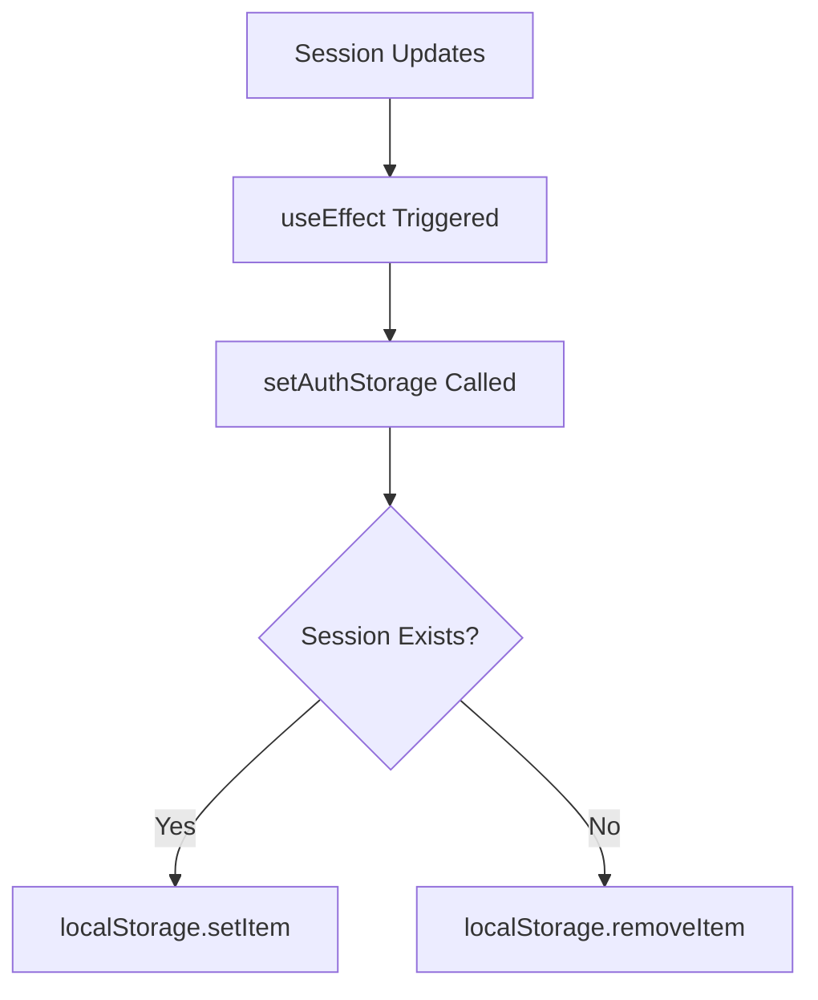
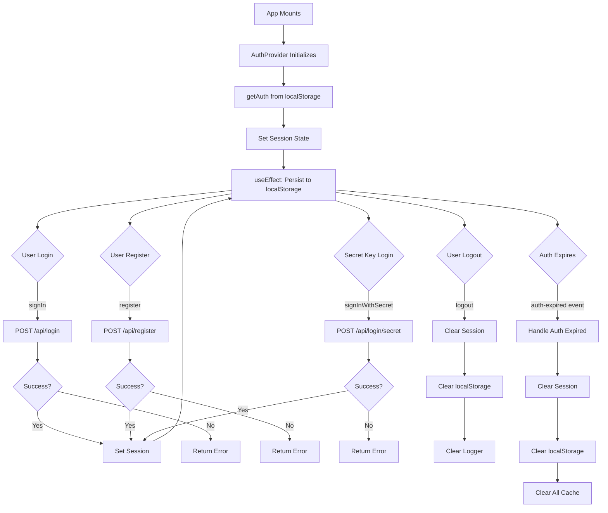

# AuthContext
**Last Updated:** January 21, 2026  
**Version:** 1.0  
**Status:** ✅ Production Ready

---

## Overview

`AuthContext` is a React Context API implementation that provides authentication state and operations throughout the GlassKeep application. Replaces the previous `useAuth` hook with a more scalable Context-based approach, enabling better state management and easier testing.

---

## Purpose

Provide authentication capabilities with:
- User session management
- Token-based authentication
- Login/logout operations
- User registration
- Secret key authentication
- Admin role detection
- Session persistence (localStorage)
- Automatic auth expiration handling
- Comprehensive logging
- Cache clearing on logout

---

## Context Structure

```
AuthContext
├── State
│   ├── session
│   ├── token
│   ├── currentUser
│   └── isAdmin
├── Operations
│   ├── logout()
│   ├── updateSession()
│   ├── signIn()
│   ├── register()
│   └── signInWithSecret()
└── Internals
    ├── getAuth()
    ├── setAuthStorage()
    └── auth-expired event listener
```

---

## Provider Value

```javascript
{
  session: object | null,        // Current session data
  token: string | null,         // Authentication token
  currentUser: object | null,    // Current user object
  isAdmin: boolean,              // Admin role flag
  logout: () => void,           // Logout function
  updateSession: (data) => void, // Update session function
  signIn: (username, password) => Promise,  // Sign in function
  register: (name, email, password) => Promise,  // Register function
  signInWithSecret: (secretKey) => Promise  // Secret key login function
}
```

---

## State Properties

### session
- **Type:** `object | null`
- **Default:** `null`
- **Purpose:** Complete session data
- **Structure:**
```javascript
{
  token: string,      // JWT token
  user: {
    id: number,       // User ID
    name: string,     // User name
    email: string,    // User email
    is_admin: boolean, // Admin flag
    // ... other user fields
  }
}
```

### token
- **Type:** `string | null`
- **Default:** `null`
- **Purpose:** JWT authentication token
- **Usage:** API authentication header
- **Format:** Bearer token

### currentUser
- **Type:** `object | null`
- **Default:** `null`
- **Purpose:** Current user object
- **Structure:** Same as `session.user`

### isAdmin
- **Type:** `boolean`
- **Default:** `false`
- **Purpose:** Admin role flag
- **Derived:** From `currentUser.is_admin`

---

## Operations

### logout()
- **Type:** `() => void`
- **Purpose:** Log out current user
- **Actions:**
  1. Clear session state
  2. Clear localStorage
  3. Clear logger user ID
  4. Log logout event

**Usage:**
```javascript
const { logout } = useAuth()

function LogoutButton() {
  return (
    <button onClick={logout}>
      Logout
    </button>
  )
}
```

---

### updateSession()
- **Type:** `(data: object) => void`
- **Purpose:** Update session data
- **Usage:** Called after login/register
- **Parameters:**
  - `data`: Auth data object with token and user

**Usage:**
```javascript
const { updateSession } = useAuth()

function handleLoginResponse(authData) {
  updateSession({
    token: authData.token,
    user: authData.user
  })
}
```

---

### signIn()
- **Type:** `(username: string, password: string) => Promise<{ok: boolean, user?: object, error?: string}>`
- **Purpose:** Sign in with email/password
- **Parameters:**
  - `username`: Email address
  - `password`: User password
- **Returns:**
  - `ok`: Success flag
  - `user`: User object (if successful)
  - `error`: Error message (if failed)

**Usage:**
```javascript
const { signIn } = useAuth()

async function handleLogin(e) {
  e.preventDefault()
  const result = await signIn(email, password)
  
  if (result.ok) {
    // Login successful
    console.log('Welcome!', result.user)
  } else {
    // Login failed
    console.error(result.error)
  }
}
```

**API Call:**
```javascript
POST /api/login
{
  "email": "user@example.com",
  "password": "password123"
}
```

---

### register()
- **Type:** `(name: string, email: string, password: string) => Promise<{ok: boolean, user?: object, error?: string}>`
- **Purpose:** Register new user
- **Parameters:**
  - `name`: User name
  - `email`: Email address
  - `password`: User password
- **Returns:**
  - `ok`: Success flag
  - `user`: User object (if successful)
  - `error`: Error message (if failed)

**Usage:**
```javascript
const { register } = useAuth()

async function handleRegister(e) {
  e.preventDefault()
  const result = await register(name, email, password)
  
  if (result.ok) {
    // Registration successful
    console.log('Account created!', result.user)
  } else {
    // Registration failed
    console.error(result.error)
  }
}
```

**API Call:**
```javascript
POST /api/register
{
  "name": "John Doe",
  "email": "john@example.com",
  "password": "password123"
}
```

---

### signInWithSecret()
- **Type:** `(secretKey: string) => Promise<{ok: boolean, user?: object, error?: string}>`
- **Purpose:** Sign in with secret key
- **Parameters:**
  - `secretKey`: Secret key string
- **Returns:**
  - `ok`: Success flag
  - `user`: User object (if successful)
  - `error`: Error message (if failed)

**Usage:**
```javascript
const { signInWithSecret } = useAuth()

async function handleSecretLogin(e) {
  e.preventDefault()
  const result = await signInWithSecret(secretKey)
  
  if (result.ok) {
    // Login successful
    console.log('Welcome!', result.user)
  } else {
    // Login failed
    console.error(result.error)
  }
}
```

**API Call:**
```javascript
POST /api/login/secret
{
  "key": "secret-key-here"
}
```

---

## Internal Functions

### getAuth()
- **Type:** `() => object | null`
- **Purpose:** Retrieve auth from localStorage
- **Returns:** Parsed auth data or null
- **Error Handling:** Returns null on parse error

**Implementation:**
```javascript
const getAuth = useCallback(() => {
  try {
    return JSON.parse(localStorage.getItem(AUTH_KEY) || "null");
  } catch (e) {
    return null;
  }
}, []);
```

---

### setAuthStorage()
- **Type:** `(obj: object | null) => void`
- **Purpose:** Persist auth to localStorage
- **Behavior:**
  - If obj provided: Set localStorage
  - If null: Remove from localStorage

**Implementation:**
```javascript
const setAuthStorage = useCallback((obj) => {
  if (obj) localStorage.setItem(AUTH_KEY, JSON.stringify(obj));
  else localStorage.removeItem(AUTH_KEY);
}, []);
```

---

## Session Persistence

### localStorage Key
- **Key:** `'glass-keep-auth'`
- **Format:** JSON string
- **Content:**
```javascript
{
  "token": "jwt-token-here",
  "user": {
    "id": 1,
    "name": "John Doe",
    "email": "john@example.com",
    "is_admin": false
  }
}
```

### Persistence Flow



---

## Auth Expiration Handling

### Event: auth-expired
- **Event Name:** `'auth-expired'`
- **Listener:** Added on mount
- **Actions:**
  1. Log token expiration
  2. Clear logger user ID
  3. Clear session state
  4. Clear localStorage
  5. Clear all cached data

**Implementation:**
```javascript
useEffect(() => {
  const handleAuthExpired = () => {
    logger.warn('token_expired', { url: window.location.href });
    logger.clearUserId();
    console.log("Auth expired, signing out...");
    setSession(null);
    setAuthStorage(null);
    
    // Clear all cached data
    try {
      const keys = Object.keys(localStorage);
      keys.forEach(key => {
        if (key.includes('glass-keep-')) {
          localStorage.removeItem(key);
        }
      });
    } catch (error) {
      logger.error('cache_clear_failed', { reason: 'auth_expiration' }, error);
      console.error("Error clearing cache on auth expiration:", error);
    }
  };

  window.addEventListener('auth-expired', handleAuthExpired);
  return () => {
    window.removeEventListener('auth-expired', handleAuthExpired);
  };
}, [setAuthStorage]);
```

### Triggering Auth Expiration

**In API interceptor or middleware:**
```javascript
// When API returns 401 or expired token
window.dispatchEvent(new Event('auth-expired'));
```

---

## Logging

### Events Logged

#### user_login
- **Triggered:** Successful login
- **Data:**
```javascript
{
  email: string,           // User email or name
  provider: string         // 'api' or 'secret_key'
}
```

#### user_registration
- **Triggered:** Successful registration
- **Data:**
```javascript
{
  email: string           // User email or name
}
```

#### user_logout
- **Triggered:** User logout
- **Data:**
```javascript
{
  reason: string         // 'user_requested' or 'auth_expiration'
}
```

#### token_expired
- **Triggered:** Token expiration
- **Data:**
```javascript
{
  url: string           // Current URL
}
```

#### login_failed
- **Triggered:** Failed login
- **Data:**
```javascript
{
  email: string,        // Username
  reason: string       // Failure reason
}
```

#### registration_failed
- **Triggered:** Failed registration
- **Data:**
```javascript
{
  email: string,        // Email
  reason: string       // Failure reason
}
```

#### secret_login_failed
- **Triggered:** Failed secret key login
- **Data:**
```javascript
{
  reason: string       // Failure reason
}
```

#### login_error / registration_error
- **Triggered:** API errors
- **Data:**
```javascript
{
  email: string,        // Email (for errors)
  reason: string       // Error message
}
```

---

## useAuth Hook

### Purpose
Convenience hook to access auth context from any component.

### Usage

```javascript
import { useAuth } from '../contexts/AuthContext'

function MyComponent() {
  const {
    session,
    token,
    currentUser,
    isAdmin,
    logout,
    updateSession,
    signIn,
    register,
    signInWithSecret,
  } = useAuth()
  
  // Use auth data and functions
  return <div>...</div>
}
```

### Error Handling
Throws error if used outside `AuthProvider`:
```javascript
if (!context) {
  throw new Error('useAuth must be used within AuthProvider');
}
```

---

## Provider Setup

### App Component

```javascript
import { AuthProvider } from './contexts/AuthContext'

function App() {
  return (
    <AuthProvider>
      {/* App content */}
      <Routes />
    </AuthProvider>
  )
}
```

### Component Tree

```
AuthProvider
├── App
│   ├── Routes
│   │   ├── LoginPage
│   │   │   └── useAuth()
│   │   ├── RegisterPage
│   │   │   └── useAuth()
│   │   └── ProtectedRoute
│   │       └── useAuth()
```

---

## Usage Examples

### Protected Route

```javascript
import { useAuth } from '../contexts/AuthContext'
import { Navigate } from 'react-router-dom'

function ProtectedRoute({ children }) {
  const { currentUser } = useAuth()
  
  if (!currentUser) {
    return <Navigate to="/#/login" />
  }
  
  return children
}
```

### Admin Route

```javascript
function AdminRoute({ children }) {
  const { currentUser, isAdmin } = useAuth()
  
  if (!currentUser) {
    return <Navigate to="/#/login" />
  }
  
  if (!isAdmin) {
    return <Navigate to="/#/dashboard" />
  }
  
  return children
}
```

### Login Form

```javascript
import { useAuth } from '../contexts/AuthContext'

function LoginForm() {
  const [email, setEmail] = useState('')
  const [password, setPassword] = useState('')
  const [error, setError] = useState('')
  const { signIn } = useAuth()
  
  const handleSubmit = async (e) => {
    e.preventDefault()
    const result = await signIn(email, password)
    
    if (result.ok) {
      // Redirect to dashboard
      window.location.href = '/#/dashboard'
    } else {
      setError(result.error)
    }
  }
  
  return (
    <form onSubmit={handleSubmit}>
      <input
        type="email"
        value={email}
        onChange={(e) => setEmail(e.target.value)}
        placeholder="Email"
      />
      <input
        type="password"
        value={password}
        onChange={(e) => setPassword(e.target.value)}
        placeholder="Password"
      />
      {error && <div className="error">{error}</div>}
      <button type="submit">Login</button>
    </form>
  )
}
```

### Register Form

```javascript
import { useAuth } from '../contexts/AuthContext'

function RegisterForm() {
  const [name, setName] = useState('')
  const [email, setEmail] = useState('')
  const [password, setPassword] = useState('')
  const [error, setError] = useState('')
  const { register } = useAuth()
  
  const handleSubmit = async (e) => {
    e.preventDefault()
    const result = await register(name, email, password)
    
    if (result.ok) {
      // Redirect to dashboard
      window.location.href = '/#/dashboard'
    } else {
      setError(result.error)
    }
  }
  
  return (
    <form onSubmit={handleSubmit}>
      <input
        type="text"
        value={name}
        onChange={(e) => setName(e.target.value)}
        placeholder="Name"
      />
      <input
        type="email"
        value={email}
        onChange={(e) => setEmail(e.target.value)}
        placeholder="Email"
      />
      <input
        type="password"
        value={password}
        onChange={(e) => setPassword(e.target.value)}
        placeholder="Password"
      />
      {error && <div className="error">{error}</div>}
      <button type="submit">Register</button>
    </form>
  )
}
```

### Secret Key Login

```javascript
import { useAuth } from '../contexts/AuthContext'

function SecretKeyLogin() {
  const [secretKey, setSecretKey] = useState('')
  const [error, setError] = useState('')
  const { signInWithSecret } = useAuth()
  
  const handleSubmit = async (e) => {
    e.preventDefault()
    const result = await signInWithSecret(secretKey)
    
    if (result.ok) {
      // Redirect to dashboard
      window.location.href = '/#/dashboard'
    } else {
      setError(result.error)
    }
  }
  
  return (
    <form onSubmit={handleSubmit}>
      <input
        type="password"
        value={secretKey}
        onChange={(e) => setSecretKey(e.target.value)}
        placeholder="Secret Key"
      />
      {error && <div className="error">{error}</div>}
      <button type="submit">Login with Secret Key</button>
    </form>
  )
}
```

### Logout Button

```javascript
import { useAuth } from '../contexts/AuthContext'

function LogoutButton() {
  const { logout, currentUser } = useAuth()
  
  if (!currentUser) return null
  
  return (
    <button onClick={logout}>
      Logout ({currentUser.name})
    </button>
  )
}
```

### User Profile

```javascript
import { useAuth } from '../contexts/AuthContext'

function UserProfile() {
  const { currentUser, isAdmin } = useAuth()
  
  return (
    <div>
      <h2>{currentUser.name}</h2>
      <p>{currentUser.email}</p>
      {isAdmin && <p>Admin User</p>}
    </div>
  )
}
```

---

## Data Flow



---

## Testing

### Unit Tests

```javascript
describe('AuthContext', () => {
  describe('AuthProvider', () => {
    it('should load session from localStorage', () => {
      // Test: localStorage → session state
    });
    
    it('should persist session to localStorage', () => {
      // Test: session update → localStorage
    });
    
    it('should handle auth-expired event', () => {
      // Test: event → clear session → clear cache
    });
    
    it('should login successfully', async () => {
      // Test: signIn → session set → localStorage updated
    });
    
    it('should handle login failure', async () => {
      // Test: signIn → return error
    });
    
    it('should register successfully', async () => {
      // Test: register → session set → localStorage updated
    });
    
    it('should handle registration failure', async () => {
      // Test: register → return error
    });
    
    it('should login with secret key', async () => {
      // Test: signInWithSecret → session set
    });
    
    it('should logout', () => {
      // Test: logout → clear session → clear localStorage
    });
  });
  
  describe('useAuth', () => {
    it('should return auth context', () => {
      // Test: useAuth → context values
    });
    
    it('should throw error outside provider', () => {
      // Test: useAuth outside AuthProvider → error
    });
  });
});
```

### Integration Tests

```javascript
describe('AuthContext Integration', () => {
  it('should persist session across page reload', () => {
    // Test: login → reload → session still valid
  });
  
  it('should clear session on logout', () => {
    // Test: logout → localStorage cleared
  });
  
  it('should clear cache on auth expiration', () => {
    // Test: auth-expired → all cache cleared
  });
  
  it('should redirect to login on protected route', () => {
    // Test: no session → redirect to login
  });
  
  it('should block non-admin from admin routes', () => {
    // Test: non-admin user → redirect from admin route
  });
});
```

### E2E Tests (Playwright)

```javascript
test('User can login', async ({ page }) => {
  await page.goto('/#/login');
  
  // Fill login form
  await page.fill('input[type="email"]', 'test@example.com');
  await page.fill('input[type="password"]', 'password123');
  
  // Submit form
  await page.click('button[type="submit"]');
  
  // Verify redirected to dashboard
  await expect(page).toHaveURL(/\/dashboard/);
  
  // Verify user logged in
  await expect(page.locator('text=Welcome')).toBeVisible();
});

test('User can logout', async ({ page }) => {
  // Login first
  await page.goto('/#/login');
  await page.fill('input[type="email"]', 'test@example.com');
  await page.fill('input[type="password"]', 'password123');
  await page.click('button[type="submit"]');
  
  // Logout
  await page.click('text=Logout');
  
  // Verify redirected to login
  await expect(page).toHaveURL(/\/login/);
  
  // Verify session cleared
  const session = await page.evaluate(() => localStorage.getItem('glass-keep-auth'));
  expect(session).toBeNull();
});

test('User can register', async ({ page }) => {
  await page.goto('/#/register');
  
  // Fill registration form
  await page.fill('input[type="text"]', 'John Doe');
  await page.fill('input[type="email"]', 'john@example.com');
  await page.fill('input[type="password"]', 'password123');
  
  // Submit form
  await page.click('button[type="submit"]');
  
  // Verify redirected to dashboard
  await expect(page).toHaveURL(/\/dashboard/);
});

test('Auth expiration clears cache', async ({ page }) => {
  // Login first
  await page.goto('/#/login');
  await page.fill('input[type="email"]', 'test@example.com');
  await page.fill('input[type="password"]', 'password123');
  await page.click('button[type="submit"]');
  
  // Add some cache
  await page.evaluate(() => {
    localStorage.setItem('glass-keep-notes', '[{id: 1}]');
  });
  
  // Simulate auth expiration
  await page.evaluate(() => {
    window.dispatchEvent(new Event('auth-expired'));
  });
  
  // Verify cache cleared
  const cache = await page.evaluate(() => localStorage.getItem('glass-keep-notes'));
  expect(cache).toBeNull();
});
```

---

## Troubleshooting

### Issue: Session not persisting

**Possible Causes:**
- localStorage disabled
- Storage quota exceeded
- Privacy settings blocking storage
- Private/Incognito mode

**Solutions:**
1. Check browser console for storage errors
2. Verify localStorage is accessible
3. Test in normal mode (not private)
4. Check storage quota

---

### Issue: Login failing

**Possible Causes:**
- Incorrect credentials
- API endpoint down
- Network error
- Invalid response format

**Solutions:**
1. Verify credentials are correct
2. Check API endpoint status
3. Check browser console for errors
4. Verify response format

---

### Issue: Auth expiration not triggered

**Possible Causes:**
- Event not dispatched
- Event listener not attached
- Event name mismatch

**Solutions:**
1. Verify event is dispatched
2. Check event listener is registered
3. Ensure event name matches ('auth-expired')
4. Test event dispatch manually

---

### Issue: Cache not clearing on logout

**Possible Causes:**
- Cache keys don't match pattern
- localStorage disabled
- Clear function not called

**Solutions:**
1. Verify cache keys include 'glass-keep-'
2. Check localStorage is accessible
3. Verify logout function called
4. Check for errors in clear function

---

### Issue: useAuth throwing error

**Possible Causes:**
- Component outside AuthProvider
- Provider not wrapping component
- Multiple providers

**Solutions:**
1. Ensure component is wrapped in AuthProvider
2. Check provider placement in component tree
3. Verify no duplicate providers
4. Check for missing provider wrapper

---

## Best Practices

1. **Always use useAuth hook** instead of direct context access
2. **Handle login/register errors** with user feedback
3. **Clear sensitive data** on logout
4. **Log all auth events** for debugging
5. **Validate session on mount** for security
6. **Use protected routes** for authenticated pages
7. **Check admin role** for admin-only features
8. **Handle auth expiration** gracefully
9. **Persist session securely** in localStorage
10. **Clear cache on logout** for privacy

---

## Security Considerations

### Token Storage
- Stored in localStorage (convenient, but less secure than httpOnly cookies)
- Consider using httpOnly cookies for production
- Implement token refresh mechanism
- Use secure HTTPS only

### Session Management
- Clear session on logout
- Clear all cache on logout
- Handle token expiration
- Validate tokens server-side

### Secret Key Authentication
- Use strong secret keys
- Rotate secret keys regularly
- Limit secret key usage
- Monitor secret key logins

### Logging
- Don't log sensitive data (passwords, tokens)
- Log auth events for audit trail
- Monitor failed login attempts
- Track suspicious activity

---

## Migration from useAuth Hook

### Old Pattern (useAuth Hook)

```javascript
import useAuth from '../hooks/useAuth'

function MyComponent() {
  const { user, login, logout } = useAuth()
  
  return <div>...</div>
}
```

### New Pattern (useAuth Hook from Context)

```javascript
import { useAuth } from '../contexts/AuthContext'

function MyComponent() {
  const { currentUser, signIn, logout } = useAuth()
  
  return <div>...</div>
}
```

### Key Changes

1. **Import location:** Changed from `../hooks/useAuth` to `../contexts/AuthContext`
2. **Property names:**
   - `user` → `currentUser`
   - `login` → `signIn`
3. **Provider setup:** Must wrap app in `AuthProvider`
4. **Same functionality:** All operations remain the same

---

## Related Contexts

- [UIContext](./UIContext.md) - UI state management
- [SettingsContext](./SettingsContext.md) - User settings
- [NotesContext](./NotesContext.md) - Notes data management

---

## Dependencies

- `react` - React (createContext, useState, useEffect, useCallback)
- `../utils/logger` - Logger utility

---

## API Endpoints Used

### POST /api/login
- **Purpose:** User login
- **Body:** `{ email, password }`
- **Response:** `{ token, user }`

### POST /api/register
- **Purpose:** User registration
- **Body:** `{ name, email, password }`
- **Response:** `{ token, user }`

### POST /api/login/secret
- **Purpose:** Secret key login
- **Body:** `{ key }`
- **Response:** `{ token, user }`

---

**Context Version:** 1.0  
**Last Updated:** January 21, 2026  
**Status:** ✅ Production Ready