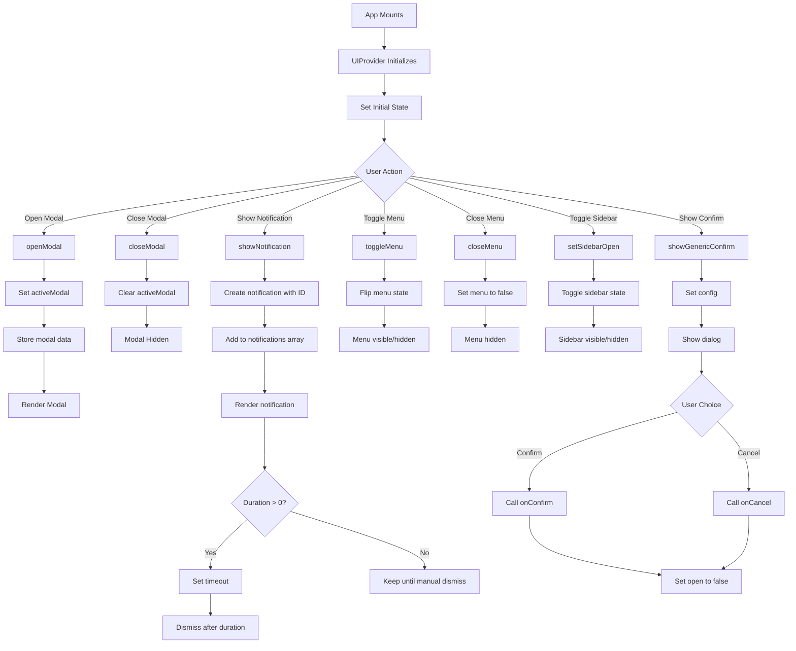

# UIContext
**Last Updated:** January 21, 2026  
**Version:** 1.0  
**Status:** ✅ Production Ready

---

## Overview

`UIContext` is a React Context API implementation that manages global UI state throughout GlassKeep. Provides centralized state management for modals, notifications/toasts, menus, sidebar, and generic confirmation dialogs.

---

## Purpose

Provide comprehensive UI state management with:
- Modal system (open/close with data)
- Toast notification system
- Menu state management (dropdowns, popovers)
- Sidebar visibility control
- Settings panel state
- Generic confirmation dialogs
- Automatic notification dismissal
- Flexible modal data passing

---

## Context Structure

```
UIContext
├── Modal State
│   ├── activeModal
│   ├── modals
│   ├── openModal()
│   └── closeModal()
├── Notification State
│   ├── notifications (toasts)
│   ├── showNotification()
│   ├── showToast()
│   └── dismissNotification()
├── Menu State
│   ├── menus
│   ├── toggleMenu()
│   └── closeMenu()
├── Sidebar State
│   ├── sidebarOpen
│   └── setSidebarOpen
├── Settings Panel State
│   ├── settingsPanelOpen
│   └── setSettingsPanelOpen
└── Generic Confirmation State
    ├── genericConfirmOpen
    ├── genericConfirmConfig
    ├── setGenericConfirmOpen
    ├── setGenericConfirmConfig
    └── showGenericConfirm()
```

---

## Provider Value

```javascript
{
  // Modal State
  activeModal: string | null,             // Currently active modal type
  modals: object,                        // Modal data by type
  openModal: (type, data) => void,     // Open modal with data
  closeModal: () => void,                // Close current modal
  
  // Notification State
  notifications: array,                  // Notifications array
  toasts: array,                        // Alias for notifications
  showNotification: (msg, type, duration) => id,  // Show notification
  showToast: (msg, type, duration) => id,        // Alias for showNotification
  dismissNotification: (id) => void,    // Dismiss notification
  
  // Menu State
  menus: object,                         // Menu open/close state
  toggleMenu: (name) => void,           // Toggle menu
  closeMenu: (name) => void,            // Close menu
  
  // Sidebar State
  sidebarOpen: boolean,                  // Sidebar open state
  setSidebarOpen: (open) => void,       // Set sidebar open
  
  // Settings Panel State
  settingsPanelOpen: boolean,            // Settings panel open
  setSettingsPanelOpen: (open) => void, // Set settings panel open
  
  // Generic Confirmation State
  genericConfirmOpen: boolean,            // Confirmation dialog open
  setGenericConfirmOpen: (open) => void, // Set confirmation open
  genericConfirmConfig: object,          // Confirmation dialog config
  setGenericConfirmConfig: (config) => void,  // Set confirmation config
  showGenericConfirm: (config) => void,  // Show confirmation dialog
}
```

---

## State Properties

### Modal State

#### activeModal
- **Type:** `string | null`
- **Default:** `null`
- **Purpose:** Currently active modal type identifier
- **Usage:** Control which modal is displayed

**Common Modal Types:**
- `'note'` - Note editor modal
- `'settings'` - Settings modal
- `'compose'` - New note composer
- `'ai'` - AI companion modal

---

#### modals
- **Type:** `object`
- **Default:** `{}`
- **Purpose:** Store modal data by type
- **Structure:**
```javascript
{
  'note': { id: '123', type: 'text' },
  'settings': { activeTab: 'appearance' },
  'compose': { type: 'text' }
}
```

---

### Notification State

#### notifications
- **Type:** `array`
- **Default:** `[]`
- **Purpose:** Array of active notifications
- **Alias:** `toasts`

**Notification Structure:**
```javascript
{
  id: number,              // Unique timestamp ID
  message: string,         // Notification message
  type: string            // Notification type
}
```

**Notification Types:**
- `'success'` - Success notification (green)
- `'error'` - Error notification (red)
- `'warning'` - Warning notification (yellow)
- `'info'` - Info notification (blue)

---

### Menu State

#### menus
- **Type:** `object`
- **Default:** `{}`
- **Purpose:** Store menu open/close state
- **Structure:**
```javascript
{
  'colorPicker': true,
  'transparencyPicker': false,
  'userMenu': false,
  'settingsMenu': false
}
```

---

### Sidebar State

#### sidebarOpen
- **Type:** `boolean`
- **Default:** `false`
- **Purpose:** Sidebar visibility state
- **Usage:** Toggle sidebar open/close

---

### Settings Panel State

#### settingsPanelOpen
- **Type:** `boolean`
- **Default:** `false`
- **Purpose:** Settings panel visibility state
- **Usage:** Toggle settings panel

---

### Generic Confirmation State

#### genericConfirmOpen
- **Type:** `boolean`
- **Default:** `false`
- **Purpose:** Generic confirmation dialog visibility
- **Usage:** Show/hide confirmation dialog

---

#### genericConfirmConfig
- **Type:** `object`
- **Default:** `{}`
- **Purpose:** Configuration for confirmation dialog
- **Structure:**
```javascript
{
  title: string,           // Dialog title
  message: string,         // Dialog message
  onConfirm: () => void,   // Confirm callback
  onCancel: () => void,    // Cancel callback
  confirmText: string,     // Confirm button text
  cancelText: string,      // Cancel button text
  danger: boolean          // Is destructive action
}
```

---

## Actions

### openModal()
- **Type:** `(type: string, data: object) => void`
- **Purpose:** Open a modal with associated data
- **Parameters:**
  - `type`: Modal type identifier
  - `data`: Modal data object (optional)
- **Actions:**
  1. Set active modal type
  2. Store modal data in modals object

**Usage:**
```javascript
const { openModal } = useUI()

function openNoteModal(note) {
  openModal('note', { id: note.id, type: note.type })
}

function openSettingsModal() {
  openModal('settings', { activeTab: 'appearance' })
}
```

---

### closeModal()
- **Type:** `() => void`
- **Purpose:** Close currently active modal
- **Actions:**
  1. Clear active modal type

**Usage:**
```javascript
const { closeModal } = useUI()

function handleCloseModal() {
  closeModal()
}
```

---

### showNotification()
- **Type:** `(message: string, type: string, duration: number) => number`
- **Purpose:** Show a toast notification
- **Parameters:**
  - `message`: Notification message
  - `type`: Notification type (default: 'info')
  - `duration`: Auto-dismiss duration in ms (default: 3000)
- **Returns:** Notification ID for manual dismissal
- **Actions:**
  1. Create notification with unique ID
  2. Add to notifications array
  3. Auto-dismiss after duration (if > 0)

**Usage:**
```javascript
const { showNotification } = useUI()

function handleSuccess() {
  showNotification('Note saved successfully!', 'success', 3000)
}

function handleError() {
  showNotification('Failed to save note', 'error', 5000)
}

function showPersistentNotification() {
  const id = showNotification('Important message', 'warning', 0)
  // Dismiss manually later
  setTimeout(() => {
    dismissNotification(id)
  }, 10000)
}
```

---

### showToast()
- **Type:** `(message: string, type: string, duration: number) => number`
- **Purpose:** Alias for `showNotification()`
- **Parameters:** Same as `showNotification()`

**Usage:**
```javascript
const { showToast } = useUI()

function handleAction() {
  showToast('Action completed', 'success')
}
```

---

### dismissNotification()
- **Type:** `(id: number) => void`
- **Purpose:** Dismiss a specific notification
- **Parameters:**
  - `id`: Notification ID to dismiss
- **Actions:**
  1. Remove notification from array

**Usage:**
```javascript
const { dismissNotification } = useUI()

function handleDismiss(id) {
  dismissNotification(id)
}
```

---

### toggleMenu()
- **Type:** `(name: string) => void`
- **Purpose:** Toggle menu open/close state
- **Parameters:**
  - `name`: Menu identifier
- **Actions:**
  1. Toggle menu state in menus object

**Usage:**
```javascript
const { toggleMenu } = useUI()

function handleMenuClick() {
  toggleMenu('colorPicker')
}

function handleUserMenuClick() {
  toggleMenu('userMenu')
}
```

---

### closeMenu()
- **Type:** `(name: string) => void`
- **Purpose:** Close a specific menu
- **Parameters:**
  - `name`: Menu identifier
- **Actions:**
  1. Set menu state to false

**Usage:**
```javascript
const { closeMenu } = useUI()

function handleMenuClose() {
  closeMenu('colorPicker')
}

function closeAllMenus(menuNames) {
  menuNames.forEach(name => closeMenu(name))
}
```

---

### showGenericConfirm()
- **Type:** `(config: object) => void`
- **Purpose:** Show a generic confirmation dialog
- **Parameters:**
  - `config`: Configuration object
- **Actions:**
  1. Set confirmation dialog configuration
  2. Show confirmation dialog

**Configuration:**
```javascript
{
  title: string,           // Dialog title (required)
  message: string,         // Dialog message (required)
  onConfirm: () => void,   // Confirm callback (required)
  onCancel: () => void,    // Cancel callback (optional)
  confirmText: string,     // Confirm button text (default: 'Confirm')
  cancelText: string,      // Cancel button text (default: 'Cancel')
  danger: boolean          // Is destructive action (default: false)
}
```

**Usage:**
```javascript
const { showGenericConfirm } = useUI()

function handleDelete() {
  showGenericConfirm({
    title: 'Delete Note',
    message: 'Are you sure you want to delete this note? This action cannot be undone.',
    onConfirm: () => {
      // Perform delete
      console.log('Note deleted')
    },
    onCancel: () => {
      console.log('Delete cancelled')
    },
    confirmText: 'Delete',
    cancelText: 'Cancel',
    danger: true
  })
}

function handleSave() {
  showGenericConfirm({
    title: 'Save Changes',
    message: 'Do you want to save your changes?',
    onConfirm: () => {
      // Save changes
      console.log('Changes saved')
    }
  })
}
```

---

## useUI Hook

### Purpose
Convenience hook to access UI context from any component.

### Usage

```javascript
import { useUI } from '../contexts/UIContext'

function MyComponent() {
  const {
    activeModal,
    openModal,
    closeModal,
    showNotification,
    showToast,
    menus,
    toggleMenu,
    closeMenu,
    sidebarOpen,
    setSidebarOpen,
    settingsPanelOpen,
    setSettingsPanelOpen,
    showGenericConfirm,
  } = useUI()
  
  // Use UI state and functions
  return <div>...</div>
}
```

### Error Handling
Throws error if used outside `UIProvider`:
```javascript
if (!context) {
  throw new Error('useUI must be used within UIProvider');
}
```

---

## Provider Setup

### App Component

```javascript
import { UIProvider } from './contexts/UIContext'

function App() {
  return (
    <UIProvider>
      {/* App content */}
      <Routes />
    </UIProvider>
  )
}
```

---

## Usage Examples

### Modal Component

```javascript
import { useUI } from '../contexts/UIContext'

function ModalRenderer() {
  const { activeModal, modals, closeModal } = useUI()
  
  if (!activeModal) return null
  
  const modalData = modals[activeModal] || {}
  
  return (
    <div className="modal-overlay" onClick={closeModal}>
      <div className="modal" onClick={e => e.stopPropagation()}>
        {activeModal === 'note' && <NoteEditor {...modalData} />}
        {activeModal === 'settings' && <SettingsPanel {...modalData} />}
        {activeModal === 'compose' && <Composer {...modalData} />}
        {activeModal === 'ai' && <AICompanion {...modalData} />}
      </div>
    </div>
  )
}
```

### Notification Component

```javascript
import { useUI } from '../contexts/UIContext'

function NotificationContainer() {
  const { notifications, dismissNotification } = useUI()
  
  const notificationIcons = {
    success: '✓',
    error: '✕',
    warning: '⚠',
    info: 'ℹ'
  }
  
  return (
    <div className="notification-container">
      {notifications.map(notification => (
        <div
          key={notification.id}
          className={`notification notification-${notification.type}`}
        >
          <span className="notification-icon">
            {notificationIcons[notification.type] || notificationIcons.info}
          </span>
          <span className="notification-message">
            {notification.message}
          </span>
          <button
            className="notification-dismiss"
            onClick={() => dismissNotification(notification.id)}
          >
            ✕
          </button>
        </div>
      ))}
    </div>
  )
}
```

### Menu Component

```javascript
import { useUI } from '../contexts/UIContext'
import { useOnClickOutside } from '../hooks/useOnClickOutside'
import { useRef } from 'react'

function ColorPickerMenu() {
  const { menus, toggleMenu, closeMenu } = useUI()
  const isOpen = menus['colorPicker']
  const menuRef = useRef(null)
  
  useOnClickOutside(menuRef, () => closeMenu('colorPicker'))
  
  return (
    <div className="color-picker-container">
      <button onClick={() => toggleMenu('colorPicker')}>
        🎨 Color
      </button>
      
      {isOpen && (
        <div ref={menuRef} className="menu color-picker-menu">
          <button onClick={() => { /* set color */ closeMenu('colorPicker') }}>
            Red
          </button>
          <button onClick={() => { /* set color */ closeMenu('colorPicker') }}>
            Blue
          </button>
          <button onClick={() => { /* set color */ closeMenu('colorPicker') }}>
            Green
          </button>
        </div>
      )}
    </div>
  )
}
```

### Sidebar Toggle

```javascript
import { useUI } from '../contexts/UIContext'

function SidebarToggle() {
  const { sidebarOpen, setSidebarOpen } = useUI()
  
  return (
    <button
      className="sidebar-toggle"
      onClick={() => setSidebarOpen(!sidebarOpen)}
    >
      {sidebarOpen ? '✕' : '☰'}
    </button>
  )
}
```

### Settings Panel Toggle

```javascript
import { useUI } from '../contexts/UIContext'

function SettingsButton() {
  const { settingsPanelOpen, setSettingsPanelOpen } = useUI()
  
  return (
    <button
      onClick={() => setSettingsPanelOpen(!settingsPanelOpen)}
    >
      ⚙️ Settings
    </button>
  )
}
```

### Generic Confirmation Dialog

```javascript
import { useUI } from '../contexts/UIContext'

function GenericConfirmDialog() {
  const { genericConfirmOpen, genericConfirmConfig, setGenericConfirmOpen } = useUI()
  
  if (!genericConfirmOpen) return null
  
  const {
    title = 'Confirm',
    message = 'Are you sure?',
    onConfirm,
    onCancel,
    confirmText = 'Confirm',
    cancelText = 'Cancel',
    danger = false
  } = genericConfirmConfig
  
  const handleConfirm = () => {
    if (onConfirm) onConfirm()
    setGenericConfirmOpen(false)
  }
  
  const handleCancel = () => {
    if (onCancel) onCancel()
    setGenericConfirmOpen(false)
  }
  
  return (
    <div className="modal-overlay" onClick={handleCancel}>
      <div className="modal confirm-modal" onClick={e => e.stopPropagation()}>
        <h2>{title}</h2>
        <p>{message}</p>
        <div className="confirm-actions">
          <button onClick={handleCancel} className="cancel-btn">
            {cancelText}
          </button>
          <button
            onClick={handleConfirm}
            className={danger ? 'danger-btn' : 'confirm-btn'}
          >
            {confirmText}
          </button>
        </div>
      </div>
    </div>
  )
}
```

### Note Actions with Confirmations

```javascript
import { useUI } from '../contexts/UIContext'
import { useNotes } from '../contexts/NotesContext'

function NoteActions({ note }) {
  const { showGenericConfirm } = useUI()
  const { deleteNote, togglePin } = useNotes()
  
  function handleDelete() {
    showGenericConfirm({
      title: 'Delete Note',
      message: `Are you sure you want to delete "${note.title}"? This action cannot be undone.`,
      onConfirm: () => deleteNote(note.id),
      confirmText: 'Delete',
      cancelText: 'Cancel',
      danger: true
    })
  }
  
  function handleTogglePin() {
    const action = note.pinned ? 'unpin' : 'pin'
    showGenericConfirm({
      title: `${action.charAt(0).toUpperCase() + action.slice(1)} Note`,
      message: `Do you want to ${action} this note?`,
      onConfirm: () => togglePin(note.id, !note.pinned),
      confirmText: note.pinned ? 'Unpin' : 'Pin'
    })
  }
  
  return (
    <div className="note-actions">
      <button onClick={handleTogglePin}>
        {note.pinned ? '📌 Unpin' : '📍 Pin'}
      </button>
      <button onClick={handleDelete} className="danger">
        🗑️ Delete
      </button>
    </div>
  )
}
```

### Form Submission with Notifications

```javascript
import { useUI } from '../contexts/UIContext'

function NoteForm() {
  const { showNotification, showToast } = useUI()
  
  async function handleSubmit(e) {
    e.preventDefault()
    
    try {
      // Submit form
      await submitForm(e.target)
      
      showNotification('Note saved successfully!', 'success', 3000)
    } catch (error) {
      console.error('Failed to save note:', error)
      showNotification('Failed to save note. Please try again.', 'error', 5000)
    }
  }
  
  return (
    <form onSubmit={handleSubmit}>
      {/* Form fields */}
      <button type="submit">Save</button>
    </form>
  )
}
```

### Async Operation with Loading Toast

```javascript
import { useUI } from '../contexts/UIContext'

function ExportButton() {
  const { showNotification, showToast } = useUI()
  
  async function handleExport() {
    // Show loading notification
    const loadingId = showNotification('Exporting notes...', 'info', 0)
    
    try {
      // Perform export
      await exportNotes()
      
      // Dismiss loading and show success
      dismissNotification(loadingId)
      showNotification('Export completed successfully!', 'success')
    } catch (error) {
      // Dismiss loading and show error
      dismissNotification(loadingId)
      showNotification('Export failed. Please try again.', 'error', 5000)
    }
  }
  
  return <button onClick={handleExport}>Export Notes</button>
}
```

---

## Data Flow



---

## Testing

### Unit Tests

```javascript
describe('UIContext', () => {
  describe('UIProvider', () => {
    it('should initialize with default state', () => {
      // Test: default values set correctly
    });
    
    it('should open modal', () => {
      // Test: openModal → activeModal set, data stored
    });
    
    it('should close modal', () => {
      // Test: closeModal → activeModal cleared
    });
    
    it('should show notification', () => {
      // Test: showNotification → notification added
    });
    
    it('should auto-dismiss notification', () => {
      // Test: notification → dismissed after duration
    });
    
    it('should dismiss notification manually', () => {
      // Test: dismissNotification → notification removed
    });
    
    it('should toggle menu', () => {
      // Test: toggleMenu → menu state flipped
    });
    
    it('should close menu', () => {
      // Test: closeMenu → menu set to false
    });
    
    it('should toggle sidebar', () => {
      // Test: setSidebarOpen → sidebar state toggled
    });
    
    it('should show generic confirm', () => {
      // Test: showGenericConfirm → dialog shown with config
    });
    
    it('should handle multiple notifications', () => {
      // Test: multiple notifications → all displayed
    });
    
    it('should handle multiple menus', () => {
      // Test: multiple menus → independent state
    });
  });
  
  describe('useUI', () => {
    it('should return UI context', () => {
      // Test: useUI → context values
    });
    
    it('should throw error outside provider', () => {
      // Test: useUI outside UIProvider → error
    });
  });
});
```

### Integration Tests

```javascript
describe('UIContext Integration', () => {
  it('should handle modal flow', () => {
    // Test: open → interact → close modal
  });
  
  it('should handle notification flow', () => {
    // Test: show → auto-dismiss notification
  });
  
  it('should handle menu flow', () => {
    // Test: toggle → interact → close menu
  });
});
```

### E2E Tests (Playwright)

```javascript
test('User opens and closes modal', async ({ page }) => {
  await page.goto('/#/notes');
  
  // Click to open modal
  await page.click('text=New Note');
  
  // Verify modal is visible
  await expect(page.locator('.modal')).toBeVisible();
  
  // Click close button
  await page.click('.modal button:has-text("✕")');
  
  // Verify modal is hidden
  await expect(page.locator('.modal')).not.toBeVisible();
});

test('User sees notifications', async ({ page }) => {
  await page.goto('/#/notes');
  
  // Trigger success notification
  await page.click('text=Save');
  
  // Verify notification appears
  await expect(page.locator('.notification')).toBeVisible();
  await expect(page.locator('text=Note saved')).toBeVisible();
  
  // Wait for auto-dismiss
  await page.waitForTimeout(3500);
  
  // Verify notification is gone
  await expect(page.locator('.notification')).not.toBeVisible();
});

test('User interacts with menu', async ({ page }) => {
  await page.goto('/#/notes');
  
  // Click to open menu
  await page.click('text=🎨 Color');
  
  // Verify menu is visible
  await expect(page.locator('.menu')).toBeVisible();
  
  // Click menu item
  await page.click('.menu button:has-text("Red")');
  
  // Verify menu is closed
  await expect(page.locator('.menu')).not.toBeVisible();
});

test('User confirms action', async ({ page }) => {
  await page.goto('/#/notes');
  
  // Click delete button
  await page.click('.note-card button:has-text("Delete")');
  
  // Verify confirmation dialog appears
  await expect(page.locator('.confirm-modal')).toBeVisible();
  await expect(page.locator('text=Are you sure?')).toBeVisible();
  
  // Click cancel
  await page.click('.confirm-modal button:has-text("Cancel")');
  
  // Verify dialog is closed
  await expect(page.locator('.confirm-modal')).not.toBeVisible();
});
```

---

## Troubleshooting

### Issue: Modal not opening

**Possible Causes:**
- activeModal not set
- Modal component not rendered
- CSS hiding modal

**Solutions:**
1. Check activeModal state
2. Verify modal component exists
3. Check CSS z-index and display
4. Verify closeModal not called immediately

---

### Issue: Notifications not showing

**Possible Causes:**
- Notifications array empty
- Notification component not rendered
- CSS hiding notifications

**Solutions:**
1. Check notifications array
2. Verify notification component exists
3. Check CSS positioning and z-index
4. Verify notification IDs are unique

---

### Issue: Notifications not auto-dismissing

**Possible Causes:**
- Duration set to 0
- setTimeout not working
- dismissNotification not called

**Solutions:**
1. Check duration parameter
2. Verify setTimeout working
3. Check console for errors
4. Test with non-zero duration

---

### Issue: Menu not closing

**Possible Causes:**
- closeMenu not called
- Menu state not updated
- Event propagation issues

**Solutions:**
1. Verify closeMenu called
2. Check menu state updates
3. Use onClickOutside hook
4. Stop event propagation

---

### Issue: Confirmation dialog not showing

**Possible Causes:**
- genericConfirmOpen not set
- Config not provided
- Dialog component not rendered

**Solutions:**
1. Check genericConfirmOpen state
2. Verify config object structure
3. Verify dialog component exists
4. Check required fields present

---

## Best Practices

1. **Always use useUI hook** instead of direct context access
2. **Use semantic notification types** (success, error, warning, info)
3. **Provide clear messages** for notifications
4. **Use appropriate durations** for notifications
5. **Implement onClickOutside** for menus
6. **Stop event propagation** for modal content
7. **Use confirmation dialogs** for destructive actions
8. **Provide clear callbacks** for confirmation dialogs
9. **Dismiss loading notifications** explicitly
10. **Test all UI states** thoroughly

---

## Performance Considerations

### Optimizations

1. **useCallback for Actions**
   - Prevents unnecessary re-renders
   - Stable function references
   - Better performance

2. **Notification Auto-dismiss**
   - Single timeout per notification
   - Efficient cleanup
   - Prevents memory leaks

3. **Menu State Management**
   - Simple boolean state
   - Fast toggling
   - Minimal re-renders

4. **Modal Data Storage**
   - Single object for all modals
   - Efficient lookups
   - Reduced prop drilling

---

## Related Contexts

- [SettingsContext](./SettingsContext.md) - Settings state (settingsPanelOpen)
- [ModalContext](./ModalContext.md) - Note editor modal context
- [AuthContext](./AuthContext.md) - Authentication for user menus

---

## Dependencies

- `react` - React (createContext, useState, useCallback, useContext)

---

**Context Version:** 1.0  
**Last Updated:** January 21, 2026  
**Status:** ✅ Production Ready