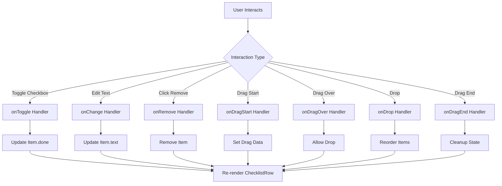

# ChecklistRow Component
**Last Updated:** January 21, 2026  
**Version:** 1.0  
**Status:** ✅ Production Ready

---

## Overview

`ChecklistRow` is an individual checklist item component that supports checkbox toggling, text editing, removal, and drag-and-drop reordering. It features responsive sizing, read-only mode, and visual feedback for various states.

---

## Purpose

Provide flexible checklist item with:
- Checkbox with done/undone state
- Editable or read-only text
- Remove button with hover visibility
- Drag-and-drop reordering support
- Responsive sizing (sm, md, lg)
- Visual feedback for dragging
- Accessibility features
- Dark mode support

---

## Key Responsibilities

### 1. Item State Management
- Checkbox state (done/undone)
- Text content (editable or read-only)
- Dragging state (visual feedback)

### 2. User Interaction
- Toggle checkbox
- Edit text (if not read-only)
- Remove item
- Drag and drop (if enabled)

### 3. Visual Feedback
- Hover effects on remove button
- Drag handle visibility
- Opacity change during drag
- Strikethrough for completed items

### 4. Responsive Design
- Multiple size variants (sm, md, lg)
- Mobile and desktop sizing
- Responsive padding and gaps

---

## Component Structure

```
ChecklistRow
├── Drag Handle (conditional)
│   └── Gripper Icon
├── Checkbox
│   ├── Checked/unchecked state
│   └── Disabled state support
├── Text Content
│   ├── Editable Input (mode: edit)
│   └── Read-only Span (mode: read)
└── Remove Button (conditional)
    └── Close (×) icon
```

---

## Props

```javascript
{
  item: {                     // Checklist item object
    done: boolean,             // Completion state
    text: string               // Item text
  },
  onToggle: (checked: boolean, event: Event) => void,  // Toggle handler
  onChange: (text: string) => void,                   // Text change handler
  onRemove: () => void,                                  // Remove handler
  readOnly: boolean,            // Read-only mode (default: false)
  disableToggle: boolean,       // Disable checkbox (default: false)
  showRemove: boolean,          // Always show remove button (default: false)
  size: "sm" | "md" | "lg",  // Size variant (default: "md")
  draggable: boolean,           // Enable drag-and-drop (default: false)
  onDragStart: (event: Event) => void,      // Drag start handler
  onDragOver: (event: Event) => void,       // Drag over handler
  onDragLeave: (event: Event) => void,      // Drag leave handler
  onDrop: (event: Event) => void,           // Drop handler
  onDragEnd: (event: Event) => void,         // Drag end handler
  isDragging: boolean           // Currently being dragged (default: false)
}
```

### item
- **Type:** `{done: boolean, text: string}`
- **Default:** Required
- **Purpose:** Checklist item data
- **Properties:**
  - `done`: Completion state (boolean)
  - `text`: Item text (string)

### onToggle
- **Type:** `(checked: boolean, event: Event) => void`
- **Default:** Optional
- **Purpose:** Handle checkbox toggle
- **Arguments:** 
  - `checked`: New checkbox state
  - `event`: Checkbox event

### onChange
- **Type:** `(text: string) => void`
- **Default:** Optional
- **Purpose:** Handle text input changes
- **Arguments:** New text value

### onRemove
- **Type:** `() => void`
- **Default:** Optional
- **Purpose:** Handle item removal

### readOnly
- **Type:** `boolean`
- **Default:** `false`
- **Purpose:** Enable read-only mode
- **Usage:** Shows text as span instead of input

### disableToggle
- **Type:** `boolean`
- **Default:** `false`
- **Purpose:** Disable checkbox
- **Usage:** Prevent toggling (e.g., during drag)

### showRemove
- **Type:** `boolean`
- **Default:** `false`
- **Purpose:** Always show remove button
- **Usage:** Bypass hover visibility

### size
- **Type:** `"sm" | "md" | "lg"`
- **Default:** `"md"`
- **Purpose:** Size variant
- **Values:**
  - `"sm"`: Small (16px checkbox)
  - `"md"`: Medium (20px checkbox)
  - `"lg"`: Large (28px checkbox)

### draggable
- **Type:** `boolean`
- **Default:** `false`
- **Purpose:** Enable drag-and-drop
- **Usage:** Shows drag handle, enables HTML5 drag API

### onDragStart
- **Type:** `(event: Event) => void`
- **Default:** Optional
- **Purpose:** Handle drag start
- **Usage:** Set drag data, highlight drop zones

### onDragOver
- **Type:** `(event: Event) => void`
- **Default:** Optional
- **Purpose:** Handle drag over
- **Usage:** Allow drop, show drop indicator

### onDragLeave
- **Type:** `(event: Event) => void`
- **Default:** Optional
- **Purpose:** Handle drag leave
- **Usage:** Remove drop indicator

### onDrop
- **Type:** `(event: Event) => void`
- **Purpose:** Handle drop
- **Usage:** Reorder items, update state

### onDragEnd
- **Type:** `(event: Event) => void`
- **Default:** Optional
- **Purpose:** Handle drag end
- **Usage:** Cleanup drag state, clear indicators

### isDragging
- **Type:** `boolean`
- **Default:** `false`
- **Purpose:** Visual feedback during drag
- **Usage:** Reduce opacity when dragging

---

## Key Features

### 1. Drag Handle

```javascript
{draggable && !readOnly && (
  <div className="mt-1 cursor-grab opacity-30 group-hover:opacity-100 transition-opacity">
    <svg className="w-4 h-4" fill="currentColor" viewBox="0 0 24 24">
      <path d="M11 18c0 1.1-.9 2-2 2s-2-.9-2-2 .9-2 2-2 2 .9 2 2zm-2-8c-1.1 0-2 .9-2 2s.9 2 2 2 2-.9 2-2-.9-2-2-2zm0-6c-1.1 0-2 .9-2 2s.9 2 2 2 2-.9 2-2-.9-2-2-2zm6 4c1.1 0 2-.9 2-2s-.9-2-2-2-2 .9-2 2 .9 2 2 2zm0 2c-1.1 0-2 .9-2 2s.9 2 2 2 2-.9 2-2-.9-2-2-2zm0 6c-1.1 0-2 .9-2 2s.9 2 2 2 2-.9 2-2-.9-2-2-2z" />
    </svg>
  </div>
)}
```

**Features:**
- 6-dot gripper icon
- Cursor: grab
- Low opacity (30%) by default
- Full opacity on hover (100%)
- Only shown when draggable and not read-only
- Smooth opacity transition

---

### 2. Checkbox

```javascript
<input
  type="checkbox"
  className={`mt-0.5 ${boxSize} cursor-pointer`}
  checked={!!item.done}
  onChange={(e) => {
    e.stopPropagation();
    onToggle?.(e.target.checked, e);
  }}
  onClick={(e) => e.stopPropagation()}
  disabled={!!disableToggle}
/>
```

**Classes:**
- `mt-0.5` - Top margin (2px)
- `boxSize` - Size variant (h-5 w-5, h-4 w-4, h-7 w-7)
- `cursor-pointer` - Pointer cursor

**Behavior:**
- Controlled component (checked prop)
- Stops event propagation (prevents parent clicks)
- Calls onToggle with checked state
- Disabled when disableToggle is true
- Visual feedback on disabled state

---

### 3. Text Input (Editable Mode)

```javascript
<input
  className={`flex-1 bg-transparent text-sm focus:outline-none border-b border-transparent focus:border-[var(--border-light)] pb-0.5 ${item.done ? "line-through text-gray-500 dark:text-gray-400" : ""}`}
  value={item.text}
  onChange={(e) => onChange?.(e.target.value)}
  placeholder="List item"
/>
```

**Classes:**
- `flex-1` - Flexible width
- `bg-transparent` - Transparent background
- `text-sm` - Small text (14px)
- `focus:outline-none` - Remove default focus
- `border-b` - Bottom border
- `border-transparent` - Transparent border default
- `focus:border-[var(--border-light)]` - Focus border color
- `pb-0.5` - Bottom padding (2px)
- `line-through` - Strikethrough when done
- `text-gray-500` / `dark:text-gray-400` - Gray when done

**Behavior:**
- Controlled component (value prop)
- Updates on every keystroke
- Shows placeholder when empty
- Strikethrough when done
- Border appears on focus

---

### 4. Text Display (Read-Only Mode)

```javascript
<span className={`text-sm ${item.done ? "line-through text-gray-500 dark:text-gray-400" : ""}`}>
  {item.text}
</span>
```

**Classes:**
- `text-sm` - Small text (14px)
- `line-through` - Strikethrough when done
- `text-gray-500` / `dark:text-gray-400` - Gray when done

**Behavior:**
- Display-only (no editing)
- Strikethrough when done
- Gray text when done

---

### 5. Remove Button

```javascript
<button
  className={`${removeVisibility} transition-opacity text-gray-500 hover:text-red-600 rounded-full border border-[var(--border-light)] flex items-center justify-center ${removeSize}`}
  title="Remove item"
  onClick={onRemove}
>
  ×
</button>
```

**Classes:**
- `removeVisibility` - Visibility (opacity-80 or opacity-0 group-hover:opacity-100)
- `transition-opacity` - Smooth opacity transition
- `text-gray-500` - Gray text default
- `hover:text-red-600` - Red on hover
- `rounded-full` - Circular shape
- `border` - Border
- `border-[var(--border-light)]` - Border color
- `flex items-center justify-center` - Center content
- `removeSize` - Size variant (w-6 h-6, w-5 h-5, w-7 h-7)

**Behavior:**
- Visible when showRemove is true
- Visible on group hover (default)
- Red color on hover
- Circular border
- Click to remove item

---

### 6. Size Variants

#### Small (sm)

```javascript
boxSize: "h-4 w-4 md:h-3.5 md:w-3.5"
removeSize: "w-5 h-5 text-xs md:w-4 md:h-4"
```

- Checkbox: 16px × 16px (desktop: 14px × 14px)
- Remove button: 20px × 20px (desktop: 16px × 16px)
- Text: 12px (desktop: 10px)

#### Medium (md) - Default

```javascript
boxSize: "h-5 w-5 md:h-4 md:w-4"
removeSize: "w-6 h-6 text-sm md:w-5 md:h-5"
```

- Checkbox: 20px × 20px (desktop: 16px × 16px)
- Remove button: 24px × 24px (desktop: 20px × 20px)
- Text: 14px (desktop: 14px)

#### Large (lg)

```javascript
boxSize: "h-7 w-7 md:h-6 md:w-6"
removeSize: "w-7 h-7 text-base md:w-6 md:h-6"
```

- Checkbox: 28px × 28px (desktop: 24px × 24px)
- Remove button: 28px × 28px (desktop: 24px × 24px)
- Text: 16px (desktop: 16px)

---

### 7. Drag-and-Drop Support

```javascript
<div
  className={`flex items-start gap-3 md:gap-2 group ${isDragging ? "opacity-40" : ""}`}
  draggable={draggable}
  onDragStart={onDragStart}
  onDragOver={onDragOver}
  onDragLeave={onDragLeave}
  onDrop={onDrop}
  onDragEnd={onDragEnd}
>
  {/* Content */}
</div>
```

**Features:**
- Draggable attribute (HTML5 drag API)
- Event handlers for all drag events
- Opacity reduction (40%) when dragging
- Gap: 12px mobile, 8px desktop
- Group class for hover effects

**Event Flow:**
1. `onDragStart`: Drag begins, set drag data
2. `onDragOver`: Drag over item, allow drop
3. `onDragLeave`: Drag leaves item, remove indicator
4. `onDrop`: Drop on item, reorder
5. `onDragEnd`: Drag ends, cleanup state

---

## Styling

### Container

```javascript
className="flex items-start gap-3 md:gap-2 group"
```

- `flex` - Flex layout
- `items-start` - Align items at top
- `gap-3` - 12px gap (mobile)
- `md:gap-2` - 8px gap (desktop)
- `group` - Enable group hover

### Dragging State

```javascript
isDragging ? "opacity-40" : ""
```

- `opacity-40` - 40% opacity when dragging
- Provides visual feedback

### Remove Button Visibility

```javascript
showRemove ? "opacity-80 hover:opacity-100" : "opacity-0 group-hover:opacity-100"
```

- `showRemove=true`: Always visible (80% opacity, 100% on hover)
- `showRemove=false`: Hidden until hover (0% opacity, 100% on hover)

### Completed State

```javascript
item.done ? "line-through text-gray-500 dark:text-gray-400" : ""
```

- `line-through` - Strikethrough text
- `text-gray-500` - Gray text (light mode)
- `dark:text-gray-400` - Gray text (dark mode)

---

## Accessibility

### Checkbox Accessibility

```javascript
<input
  type="checkbox"
  checked={!!item.done}
  disabled={!!disableToggle}
/>
```

**Features:**
- Semantic checkbox input
- Checked/unchecked state
- Disabled state support
- Keyboard accessible (Tab, Space)

### Remove Button Accessibility

```javascript
<button
  title="Remove item"
  onClick={onRemove}
>
  ×
</button>
```

**Features:**
- Title attribute for context
- Semantic button element
- Click handler for removal

### Keyboard Navigation

- Tab to checkbox
- Space/Enter to toggle
- Tab to text input (if editable)
- Tab to remove button
- Enter/Space on remove button

---

## Data Flow



---

## Performance

### Lightweight Component
- No internal state
- No side effects
- Minimal re-renders
- Pure function component

### Optimized Rendering
- Conditional drag handle
- Conditional remove button
- Size variants computed once

---

## Responsive Design

### Mobile (< 768px)

**Size:**
- Checkbox: Full size (no reduction)
- Remove button: Full size
- Gap: 12px (gap-3)
- Padding: Standard

### Desktop (>= 768px)

**Size:**
- Checkbox: Reduced by 20% (if sm/md)
- Remove button: Reduced by 20% (if sm/md)
- Gap: 8px (gap-2)
- Padding: Standard

### Size Variants

All size variants support responsive sizing with md breakpoint adjustments.

---

## Usage Examples

### Basic Usage

```javascript
import { ChecklistRow } from './components/ChecklistRow'

function Checklist() {
  const [items, setItems] = useState([
    { id: 1, done: false, text: 'Buy groceries' },
    { id: 2, done: true, text: 'Walk the dog' }
  ])
  
  return (
    <div>
      {items.map(item => (
        <ChecklistRow
          key={item.id}
          item={item}
          onToggle={(checked) => {
            setItems(items.map(i => 
              i.id === item.id ? {...i, done: checked} : i
            ))
          }}
          onChange={(text) => {
            setItems(items.map(i => 
              i.id === item.id ? {...i, text} : i
            ))
          }}
          onRemove={() => {
            setItems(items.filter(i => i.id !== item.id))
          }}
        />
      ))}
    </div>
  )
}
```

### With Drag-and-Drop

```javascript
function Checklist() {
  const [items, setItems] = useState([...])
  const [draggedItem, setDraggedItem] = useState(null)
  const [dragOverItem, setDragOverItem] = useState(null)
  
  const handleDragStart = (item) => {
    setDraggedItem(item)
  }
  
  const handleDragOver = (item) => {
    if (draggedItem && draggedItem.id !== item.id) {
      setDragOverItem(item)
    }
  }
  
  const handleDrop = () => {
    if (draggedItem && dragOverItem) {
      const newItems = [...items]
      const draggedIndex = newItems.findIndex(i => i.id === draggedItem.id)
      const overIndex = newItems.findIndex(i => i.id === dragOverItem.id)
      
      newItems.splice(draggedIndex, 1)
      newItems.splice(overIndex, 0, draggedItem)
      
      setItems(newItems)
    }
    setDraggedItem(null)
    setDragOverItem(null)
  }
  
  return (
    <div>
      {items.map(item => (
        <ChecklistRow
          key={item.id}
          item={item}
          draggable
          isDragging={draggedItem?.id === item.id}
          onDragStart={() => handleDragStart(item)}
          onDragOver={() => handleDragOver(item)}
          onDrop={handleDrop}
          onDragEnd={() => {
            setDraggedItem(null)
            setDragOverItem(null)
          }}
          // ... other handlers
        />
      ))}
    </div>
  )
}
```

### Read-Only Mode

```javascript
function ChecklistDisplay({ items }) {
  return (
    <div>
      {items.map(item => (
        <ChecklistRow
          key={item.id}
          item={item}
          readOnly
          showRemove={false}
        />
      ))}
    </div>
  )
}
```

### With Size Variants

```javascript
function SmallChecklist({ items }) {
  return (
    <div>
      {items.map(item => (
        <ChecklistRow
          key={item.id}
          item={item}
          size="sm"
          // ... handlers
        />
      ))}
    </div>
  )
}

function LargeChecklist({ items }) {
  return (
    <div>
      {items.map(item => (
        <ChecklistRow
          key={item.id}
          item={item}
          size="lg"
          // ... handlers
        />
      ))}
    </div>
  )
}
```

---

## Testing

### Unit Tests

```javascript
describe('ChecklistRow Component', () => {
  it('should render checkbox', () => {
    // Test checkbox rendering
  });
  
  it('should render text input', () => {
    // Test text input rendering
  });
  
  it('should render read-only span', () => {
    // Test read-only mode
  });
  
  it('should toggle checkbox on change', () => {
    // Test onToggle handler
  });
  
  it('should update text on input', () => {
    // Test onChange handler
  });
  
  it('should call onRemove on click', () => {
    // Test remove button
  });
  
  it('should show remove button on hover', () => {
    // Test hover visibility
  });
  
  it('should apply size variants', () => {
    // Test sm, md, lg sizes
  });
  
  it('should show drag handle when draggable', () => {
    // Test drag handle visibility
  });
  
  it('should apply dragging opacity', () => {
    // Test isDragging state
  });
});
```

### Integration Tests

```javascript
describe('ChecklistRow Integration', () => {
  it('should complete toggle flow', () => {
    // Test: click checkbox -> onToggle -> update state -> re-render
  });
  
  it('should complete edit flow', () => {
    // Test: type text -> onChange -> update state -> re-render
  });
  
  it('should complete remove flow', () => {
    // Test: click remove -> onRemove -> remove item
  });
});
```

### E2E Tests (Playwright)

```javascript
test('Toggle checklist item', async ({ page }) => {
  await page.goto('/#/notes');
  await page.click('[data-testid="note-1"]');
  
  // Click checkbox
  await page.click('[data-testid="checklist-item-checkbox"]');
  
  // Verify strikethrough
  await expect(page.locator('[data-testid="checklist-item-text"]')).toHaveClass(/line-through/);
});

test('Edit checklist item', async ({ page }) => {
  await page.goto('/#/notes');
  await page.click('[data-testid="note-1"]');
  
  // Type in checklist item
  await page.fill('[data-testid="checklist-item-input"]', 'New item text');
  
  // Verify text updated
  await expect(page.locator('[data-testid="checklist-item-input"]')).toHaveValue('New item text');
});

test('Remove checklist item', async ({ page }) => {
  await page.goto('/#/notes');
  await page.click('[data-testid="note-1"]');
  
  // Hover over item
  await page.hover('[data-testid="checklist-row"]');
  
  // Click remove button
  await page.click('[data-testid="checklist-remove"]');
  
  // Verify item removed
  await expect(page.locator('[data-testid="checklist-row"]')).toHaveCount(0);
});
```

---

## Troubleshooting

### Issue: Checkbox not toggling

**Possible Causes:**
- onToggle not provided
- Event propagation blocked
- Checkbox disabled

**Solutions:**
1. Verify onToggle handler is provided
2. Check event.stopPropagation() calls
3. Verify disableToggle is false

---

### Issue: Text not updating

**Possible Causes:**
- onChange not provided
- Read-only mode enabled
- State not updating

**Solutions:**
1. Verify onChange handler is provided
2. Check readOnly prop is false
3. Test state update logic

---

### Issue: Remove button not showing

**Possible Causes:**
- showRemove is false
- Group hover not working
- CSS override

**Solutions:**
1. Verify showRemove prop
2. Check group class on container
3. Test hover state with inspector

---

### Issue: Drag handle not showing

**Possible Causes:**
- draggable is false
- Read-only mode enabled
- Event handlers missing

**Solutions:**
1. Verify draggable prop is true
2. Check readOnly prop is false
3. Ensure drag event handlers are provided

---

### Issue: Size not applying correctly

**Possible Causes:**
- Size prop invalid
- CSS override
- Responsive classes conflicting

**Solutions:**
1. Verify size prop is "sm", "md", or "lg"
2. Check CSS specificity
3. Test with inline styles to verify

---

## Related Components

- [Composer](./Composer.md) - Note composer (uses ChecklistRow)
- [NoteCard](./NoteCard.md) - Note card (displays checklists)

---

## Dependencies

- None (pure React component)

---

## Best Practices

1. **Always provide handlers for interactive elements**
2. **Use read-only mode for display-only checklists**
3. **Implement drag-and-drop with proper cleanup**
4. **Use size variants for different contexts**
5. **Stop event propagation on checkbox to prevent parent clicks**
6. **Provide onRemove handler to enable item deletion**
7. **Test drag-and-drop flow thoroughly**
8. **Use consistent size variants within same checklist**

---

**Component Version:** 1.0  
**Last Updated:** January 21, 2026  
**Status:** ✅ Production Ready