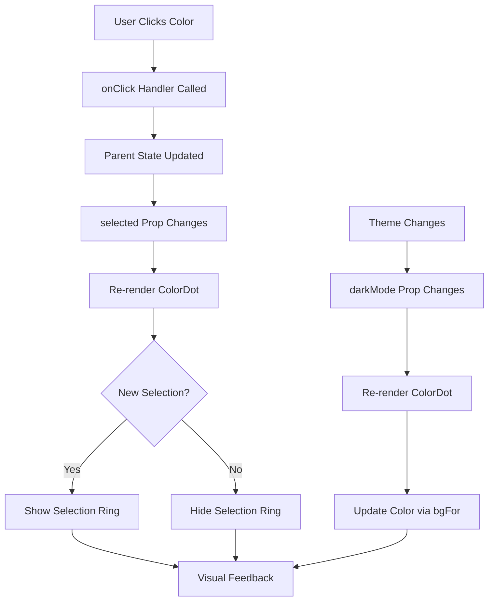

# ColorDot Component
**Last Updated:** January 21, 2026  
**Version:** 1.0  
**Status:** ✅ Production Ready

---

## Overview

`ColorDot` is a color picker button component that displays a circular color swatch with optional selection indicator. It supports a special "default" color state and dark mode theming, providing consistent color selection across the application.

---

## Purpose

Provide color picker button with:
- Circular color swatch display
- Selection indicator (ring)
- Special "default" color handling
- Dark mode support
- Consistent color definitions
- Keyboard accessibility
- Hover and focus states
- Tooltip support

---

## Key Responsibilities

### 1. Color Display
- Show color as circular dot
- Handle "default" color (transparent with inner dot)
- Apply theme-aware colors
- Maintain consistency with color definitions

### 2. Selection State
- Show ring when selected
- Use accent color for ring
- Visual feedback for active color

### 3. User Interaction
- Click to select color
- Keyboard accessible
- Focus ring on keyboard navigation
- Hover effects

### 4. Accessibility
- Title attribute for screen readers
- Focus indicators
- Keyboard navigation support
- Semantic button element

---

## Component Structure

```
ColorDot
├── Button Element
│   ├── Circular Container
│   ├── Color Background
│   │   ├── Standard Color (solid)
│   │   └── Default Color (transparent + inner dot)
│   ├── Selection Ring (conditional)
│   └── Focus Ring (on keyboard focus)
└── Title Tooltip
```

---

## Props

```javascript
{
  name: string,              // Color name (required)
  selected: boolean,        // Selection state (required)
  onClick: () => void,      // Click handler (required)
  darkMode: boolean         // Dark mode enabled (required)
}
```

### name
- **Type:** `string`
- **Default:** Required
- **Purpose:** Color identifier
- **Values:** Color names defined in helpers.js (e.g., "red", "blue", "green", "default")
- **Usage:** Determines color via `bgFor()` helper

### selected
- **Type:** `boolean`
- **Default:** Required
- **Purpose:** Selection state
- **Usage:** Shows selection ring when true

### onClick
- **Type:** `() => void`
- **Default:** Required
- **Purpose:** Click handler
- **Usage:** Called when user clicks the color dot

### darkMode
- **Type:** `boolean`
- **Default:** Required
- **Purpose:** Dark mode state
- **Usage:** Determines theme-aware color via `bgFor()` helper

---

## Key Features

### 1. Color Rendering

```javascript
style={{
  backgroundColor: name === "default" ? "transparent" : solid(bgFor(name, darkMode)),
  borderColor: name === "default" ? "#d1d5db" : "transparent",
}}
```

**Color Logic:**
- **Standard colors:** Use `solid(bgFor(name, darkMode))`
  - `bgFor(name, darkMode)` returns theme-aware hex color
  - `solid()` ensures solid color (removes gradients if present)
- **Default color:** Transparent background with gray border (`#d1d5db`)
  - Shows inner dot instead of background color

**Helper Functions:**
- `bgFor(name, darkMode)`: Returns hex color for given name and theme
- `solid(color)`: Ensures color is solid (no gradients)

---

### 2. Default Color State

```javascript
{
  name === "default" && (
    <div className="w-4 h-4 rounded-full" style={{ backgroundColor: darkMode ? "#1f2937" : "#fff" }} />
  )
}
```

**Special Handling:**
- Transparent background
- Gray border (`#d1d5db`)
- Inner dot (16px × 16px)
- Inner dot color: Dark gray (`#1f2937`) in dark mode, white (`#fff`) in light mode
- Used for "no color" or "transparent" selection

---

### 3. Selection Ring

```javascript
className={`... ${selected ? "ring-2 ring-accent" : ""}`}
```

**Visual Feedback:**
- `ring-2`: 2px ring
- `ring-accent`: Uses accent color (CSS variable)
- Only shows when `selected` is true
- Accent color defined in CSS variables

**Example:**
- Unselected: No ring
- Selected: 2px ring in accent color (e.g., blue, purple)

---

### 4. Focus Ring

```javascript
className={`... focus:outline-none focus:ring-2 focus:ring-offset-2 dark:focus:ring-offset-gray-800`}
```

**Keyboard Focus:**
- `focus:outline-none`: Remove default browser outline
- `focus:ring-2`: 2px ring on focus
- `focus:ring-offset-2`: 2px ring offset (gap between ring and button)
- `dark:focus:ring-offset-gray-800`: Dark mode ring offset color

**Purpose:** Provides visible focus indicator for keyboard navigation

---

### 5. Hover and Active States

```javascript
className={`... rounded-full border-2 border-transparent`}
```

**Default State:**
- `rounded-full`: Circular shape
- `border-2`: 2px border
- `border-transparent`: Transparent border (except default color)

**Hover:** Button element provides native hover feedback
**Active:** Button element provides native active feedback

---

## Styling

### Button Container

```javascript
className={`w-6 h-6 rounded-full border-2 border-transparent focus:outline-none focus:ring-2 focus:ring-offset-2 dark:focus:ring-offset-gray-800 ${name === "default" ? "flex items-center justify-center" : ""} ${selected ? "ring-2 ring-accent" : ""}`}
```

**Classes Breakdown:**
- `w-6` - Width: 24px
- `h-6` - Height: 24px
- `rounded-full` - Circular shape
- `border-2` - 2px border
- `border-transparent` - Transparent border
- `focus:outline-none` - Remove default focus
- `focus:ring-2` - 2px focus ring
- `focus:ring-offset-2` - 2px ring offset
- `dark:focus:ring-offset-gray-800` - Dark mode ring offset
- `flex items-center justify-center` - Center content (default color only)
- `ring-2` - Selection ring (conditional)
- `ring-accent` - Accent color ring (conditional)

### Default Color Inner Dot

```javascript
<div className="w-4 h-4 rounded-full" style={{ backgroundColor: darkMode ? "#1f2937" : "#fff" }} />
```

**Classes:**
- `w-4` - Width: 16px
- `h-4` - Height: 16px
- `rounded-full` - Circular shape

**Style:**
- `backgroundColor`: Dark gray (`#1f2937`) in dark mode, white (`#fff`) in light mode

---

## Color System

### Color Names

The component uses color names defined in `../utils/helpers.js`. Common examples:

```javascript
// Example colors (actual list depends on helpers.js)
const COLORS = [
  "red",
  "orange",
  "yellow",
  "green",
  "blue",
  "purple",
  "pink",
  "default"
]
```

### Theme-Aware Colors

The `bgFor(name, darkMode)` helper returns theme-appropriate hex colors:

```javascript
// Example mapping
const bgFor = (name, darkMode) => {
  const colors = {
    red: darkMode ? "#ef4444" : "#ef4444",
    blue: darkMode ? "#3b82f6" : "#3b82f6",
    green: darkMode ? "#10b981" : "#10b981",
    // ... other colors
  }
  return colors[name] || "#000000"
}
```

### Solid Color

The `solid(color)` helper ensures color is solid (no gradients):

```javascript
const solid = (color) => {
  // Remove any gradient syntax, return solid hex
  return color.replace(/gradient.*/, "#000000")
}
```

---

## Accessibility

### ARIA Attributes

```javascript
<button
  type="button"
  onClick={onClick}
  title={name}
  // ...
>
```

- `type="button"`: Explicit button type
- `title={name}`: Tooltip with color name for screen readers

### Keyboard Navigation

- Tab to navigate to color dot
- Enter/Space to select color
- Focus ring provides visual indicator
- Logical tab order in color picker

### Screen Readers

- Title attribute provides color name
- Button semantics indicate interactive element
- Selection state visible to screen readers (via ring)

---

## Data Flow



---

## Performance

### Lightweight Component
- No internal state
- No side effects
- Minimal DOM
- Pure function component

### Optimized Rendering
- Conditional inner dot (only for default color)
- Computed styles once per render
- No unnecessary re-renders

---

## Responsive Design

### Fixed Size

The component has a fixed size of 24px × 24px, making it consistent across all screen sizes:

```javascript
className="w-6 h-6"
```

### Mobile vs Desktop

- Same size on all devices
- Touch-friendly target (24px minimum)
- Keyboard accessible on all platforms

---

## Usage Examples

### Basic Usage

```javascript
import { ColorDot } from './components/ColorDot'

function ColorPicker() {
  const [selectedColor, setSelectedColor] = useState('blue')
  const [darkMode, setDarkMode] = useState(false)
  
  const colors = ['red', 'blue', 'green', 'yellow', 'default']
  
  return (
    <div className="flex gap-2">
      {colors.map(color => (
        <ColorDot
          key={color}
          name={color}
          selected={selectedColor === color}
          onClick={() => setSelectedColor(color)}
          darkMode={darkMode}
        />
      ))}
    </div>
  )
}
```

### With Custom Colors

```javascript
function CustomColorPicker() {
  const colors = [
    { name: 'primary', color: '#3b82f6' },
    { name: 'secondary', color: '#10b981' },
    { name: 'accent', color: '#f59e0b' }
  ]
  
  // Note: Custom colors require updating helpers.js
  return (
    <div className="flex gap-2">
      {colors.map(({ name }) => (
        <ColorDot
          key={name}
          name={name}
          selected={false}
          onClick={() => console.log(name)}
          darkMode={false}
        />
      ))}
    </div>
  )
}
```

### In Note Editor

```javascript
function NoteEditor({ note, darkMode }) {
  const handleColorChange = (color) => {
    updateNoteColor(note.id, color)
  }
  
  return (
    <div className="color-picker">
      <h3>Color</h3>
      <div className="flex gap-2">
        {['red', 'blue', 'green', 'default'].map(color => (
          <ColorDot
            key={color}
            name={color}
            selected={note.color === color}
            onClick={() => handleColorChange(color)}
            darkMode={darkMode}
          />
        ))}
      </div>
    </div>
  )
}
```

### With Dark Mode Toggle

```javascript
function ColorPickerWithTheme() {
  const [darkMode, setDarkMode] = useState(false)
  const [selectedColor, setSelectedColor] = useState('blue')
  
  return (
    <div>
      <button onClick={() => setDarkMode(!darkMode)}>
        Toggle Theme
      </button>
      
      <div className="flex gap-2 mt-4">
        {['red', 'blue', 'green', 'default'].map(color => (
          <ColorDot
            key={color}
            name={color}
            selected={selectedColor === color}
            onClick={() => setSelectedColor(color)}
            darkMode={darkMode}
          />
        ))}
      </div>
    </div>
  )
}
```

---

## Testing

### Unit Tests

```javascript
describe('ColorDot Component', () => {
  it('should render color dot', () => {
    // Test basic rendering
  });
  
  it('should show selection ring when selected', () => {
    // Test selected state
  });
  
  it('should show default color inner dot', () => {
    // Test default color rendering
  });
  
  it('should call onClick on click', () => {
    // Test click handler
  });
  
  it('should render theme-aware colors', () => {
    // Test dark mode colors
  });
  
  it('should show focus ring on keyboard focus', () => {
    // Test focus state
  });
  
  it('should have title attribute', () => {
    // Test tooltip
  });
});
```

### Integration Tests

```javascript
describe('ColorDot Integration', () => {
  it('should select color on click', () => {
    // Test: click -> onClick -> state update -> re-render
  });
  
  it('should update color on theme change', () => {
    // Test: theme change -> color update
  });
});
```

### E2E Tests (Playwright)

```javascript
test('Select color', async ({ page }) => {
  await page.goto('/#/notes');
  await page.click('[data-testid="note-1"]');
  
  // Click color dot
  await page.click('[data-testid="color-dot-blue"]');
  
  // Verify selection
  await expect(page.locator('[data-testid="color-dot-blue"]')).toHaveClass(/ring-accent/);
});
```

---

## Troubleshooting

### Issue: Color not showing

**Possible Causes:**
- Color name not defined in helpers.js
- bgFor() returns undefined
- solid() returns transparent

**Solutions:**
1. Verify color name exists in helpers.js
2. Check bgFor() function logic
3. Test with known color (e.g., "red")

---

### Issue: Selection ring not showing

**Possible Causes:**
- selected prop is false
- accent color not defined
- CSS override

**Solutions:**
1. Verify selected prop is true
2. Check CSS variable for accent color
3. Inspect styles with browser tools

---

### Issue: Focus ring not showing

**Possible Causes:**
- Focus not on button
- Focus styles overridden
- Keyboard not used

**Solutions:**
1. Tab to button to test focus
2. Check for CSS overrides
3. Test with keyboard navigation

---

### Issue: Default color not showing inner dot

**Possible Causes:**
- name is not "default"
- Conditional rendering error
- Dark mode prop incorrect

**Solutions:**
1. Verify name prop is "default"
2. Check conditional logic
3. Verify darkMode prop value

---

### Issue: Color not updating with theme

**Possible Causes:**
- darkMode prop not updating
- bgFor() not using darkMode
- Component not re-rendering

**Solutions:**
1. Verify darkMode prop changes
2. Check bgFor() implementation
3. Test re-render with prop change

---

## Related Components

- [FormatToolbar](./FormatToolbar.md) - Format toolbar (uses ColorDot)
- [Composer](./Composer.md) - Note composer (uses ColorDot)

---

## Dependencies

- `../utils/helpers` - Helper functions (`bgFor`, `solid`)

---

## Best Practices

1. **Always provide onClick handler**
2. **Use consistent color names from helpers.js**
3. **Maintain selected state in parent**
4. **Test with both light and dark modes**
5. **Use semantic button element**
6. **Provide title for accessibility**
7. **Include keyboard navigation support**
8. **Test selection state visually**

---

## Helper Functions

### bgFor(name, darkMode)

Returns theme-aware hex color for given color name.

**Parameters:**
- `name`: Color name (string)
- `darkMode`: Dark mode enabled (boolean)

**Returns:** Hex color string (e.g., "#3b82f6")

**Example:**
```javascript
bgFor("blue", false) // "#3b82f6"
bgFor("blue", true)  // "#3b82f6" (may vary)
```

### solid(color)

Ensures color is solid (removes gradients).

**Parameters:**
- `color`: Color string (hex, gradient, etc.)

**Returns:** Solid hex color string

**Example:**
```javascript
solid("linear-gradient(to right, red, blue)") // "#000000"
solid("#3b82f6") // "#3b82f6"
```

---

**Component Version:** 1.0  
**Last Updated:** January 21, 2026  
**Status:** ✅ Production Ready