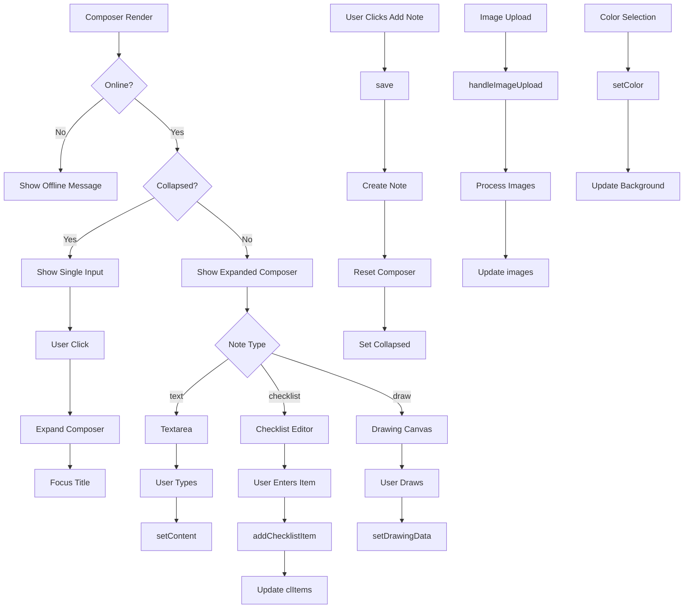

# Composer Component
**Last Updated:** January 21, 2026  
**Version:** 1.0  
**Status:** ✅ Production Ready

---

## Overview

`Composer` is the primary note creation component that provides a clean, intuitive interface for creating new notes. It supports three note types (text, checklist, drawing), includes rich text formatting, image upload, color customization, and features a collapsed/expanded state for better UX.

---

## Purpose

Provide intuitive note creation interface with:
- Three note types: Text, Checklist, Drawing
- Rich text formatting for text notes
- Image upload and preview
- Color picker with glassmorphism
- Tag management
- Collapsed/expanded states
- Offline state handling
- Responsive design
- Accessibility features

---

## Key Responsibilities

### 1. Note Type Support
- Text notes with formatting
- Checklist notes with item management
- Drawing notes with canvas

### 2. User Input
- Title input
- Content textarea (text type)
- Checklist item input and list
- Drawing canvas
- Tags input

### 3. Customization
- Color picker
- Image upload
- Format toolbar (text type)
- Type selection buttons

### 4. State Management
- Collapsed/expanded state
- Form inputs (title, content, tags)
- Color selection
- Image management
- Note type selection

---

## Component Structure

```
Composer
├── Offline State (when !isOnline)
│   ├── Warning Icon
│   ├── Warning Message
│   └── Instructions
└── Online State
    ├── Collapsed View
    │   └── Single Input (click to expand)
    └── Expanded View
        ├── Title Input
        ├── Content Area (by type)
        │   ├── Textarea (text type)
        │   ├── Checklist Editor (checklist type)
        │   └── Drawing Canvas (draw type)
        ├── Image Thumbnails (when images exist)
        └── Footer
            ├── Tags Input
            ├── Formatting Button (text type)
            │   └── Format Toolbar Popover
            ├── Type Selection Buttons
            │   ├── Text Button
            │   ├── Checklist Button
            │   └── Draw Button
            ├── Color Picker Button
            │   └── Color Popover
            ├── Image Upload Button
            └── Add Note Button
```

---

## State Management

### Context Consumption

```javascript
// Composer Context
const {
  type,                    // Note type (text/checklist/draw)
  setType,                 // Set note type
  title,                   // Note title
  setTitle,               // Set title
  content,                // Note content
  setContent,             // Set content
  tags,                   // Tags string
  setTags,               // Set tags
  color,                  // Note color
  setColor,              // Set color
  images,                // Attached images
  collapsed,              // Collapsed state
  setCollapsed,           // Toggle collapsed
  clItems,               // Checklist items
  clInput,                // Checklist input value
  setClInput,             // Set checklist input
  drawingData,            // Drawing paths
  setDrawingData,        // Set drawing data
  showFormatting,         // Format toolbar open
  setShowFormatting,      // Toggle format toolbar
  showColorPicker,        // Color picker open
  setShowColorPicker,    // Toggle color picker
  titleRef,               // Title input ref
  contentRef,             // Content textarea ref
  fileInputRef,           // File input ref
  fmtBtnRef,              // Format button ref
  colorBtnRef,            // Color button ref
  addChecklistItem,        // Add checklist item
  onKeyDown,             // Keydown handler
  format,                // Format text handler
  handleImageUpload,      // Image upload handler
  removeImage,            // Remove image handler
  save                    // Save note handler
} = useComposer()

// Settings Context
const { dark, cardTransparency } = useSettings()

// Notes Context
const { isOnline } = useNotes()
```

---

## Key Features

### 1. Offline State

```javascript
{!isOnline ? (
  <div className="glass-card rounded-xl p-6 mb-8 text-center">
    <div className="text-orange-600 mb-2">
      <svg className="w-8 h-8 mx-auto mb-3">
        Warning Icon
      </svg>
    </div>
    <h3 className="text-lg font-semibold mb-2">You're offline</h3>
    <p className="text-gray-600 dark:text-gray-400">
      Please go back online to add notes.
    </p>
  </div>
) : /* Online state */}
```

**Behavior:**
- Shows warning message when offline
- Disables all note creation
- Provides clear visual feedback
- Returns early, no render

---

### 2. Collapsed State

```javascript
{collapsed ? (
  <input
    value={content}
    onChange={() => {}}
    onFocus={() => {
      setCollapsed(false)
      setTimeout(() => titleRef.current?.focus(), 10)
    }}
    placeholder="Write a note..."
    className="w-full bg-transparent placeholder-gray-500 focus:outline-none p-2"
  />
) : /* Expanded state */}
```

**Behavior:**
- Shows single input field
- Click to expand
- Auto-focus title input after expansion
- Smooth transition

---

### 3. Title Input

```javascript
<input
  ref={titleRef}
  value={title}
  onChange={e => setTitle(e.target.value)}
  placeholder="Title"
  className="w-full bg-transparent text-lg font-semibold placeholder-gray-500 focus:outline-none mb-2 p-2"
/>
```

**Features:**
- Transparent background
- Large font size
- Placeholder text
- Focus management
- Controlled input

---

### 4. Text Editor

```javascript
{type === 'text' && (
  <textarea
    ref={contentRef}
    value={content}
    onChange={e => setContent(e.target.value)}
    onKeyDown={onKeyDown}
    placeholder="Write a note..."
    className="w-full bg-transparent placeholder-gray-500 focus:outline-none resize-none p-2"
    rows={1}
  />
)}
```

**Features:**
- Auto-resize (via useEffect)
- Keyboard shortcuts (via onKeyDown)
- Placeholder text
- Transparent background
- Single row minimum

---

### 5. Checklist Editor

```javascript
{type === 'checklist' && (
  <div className="space-y-3">
    <div className="flex gap-2">
      <input
        value={clInput}
        onChange={e => setClInput(e.target.value)}
        onKeyDown={e => {
          if (e.key === 'Enter') {
            e.preventDefault()
            addChecklistItem()
          }
        }}
        placeholder="List item…"
        className="flex-1 bg-transparent placeholder-gray-500 focus:outline-none p-2 border-b border-[var(--border-light)]"
      />
      <button
        onClick={addChecklistItem}
        className="px-3 py-1.5 rounded-lg whitespace-nowrap bg-accent text-white hover:bg-accent-hover"
      >
        Add
      </button>
    </div>
    {clItems.length > 0 && (
      <div className="space-y-2">
        {clItems.map(it => (
          <ChecklistRow
            key={it.id}
            item={it}
            readOnly
            disableToggle
          />
        ))}
      </div>
    )}
  </div>
)}
```

**Features:**
- Input for new items
- Enter to add
- Add button
- Read-only display of existing items
- List styling

---

### 6. Drawing Canvas

```javascript
{type === 'draw' && (
  <DrawingCanvas
    data={drawingData}
    onChange={setDrawingData}
    width={650}
    height={450}
    darkMode={dark}
    hideModeToggle={true}
  />
)}
```

**Features:**
- Canvas-based drawing
- Path data storage
- Dark mode support
- Mode toggle hidden
- Fixed dimensions

---

### 7. Image Thumbnails

```javascript
{images.length > 0 && (
  <div className="mt-3 flex gap-2 overflow-x-auto">
    {images.map(im => (
      <div key={im.id} className="relative">
        
        <button
          title="Remove image"
          className="absolute -top-2 -right-2 bg-black/70 text-white rounded-full w-5 h-5 text-xs"
          onClick={() => removeImage(im.id)}
        >
          ×
        </button>
      </div>
    ))}
  </div>
)}
```

**Features:**
- Horizontal scroll
- Thumbnail display
- Remove button
- Rounded corners
- Border styling

---

### 8. Tags Input

```javascript
<input
  value={tags}
  onChange={e => setTags(e.target.value)}
  type="text"
  placeholder="Add tags (comma-separated)"
  className="w-full sm:flex-1 bg-transparent text-sm placeholder-gray-500 focus:outline-none p-2"
/>
```

**Features:**
- Comma-separated tags
- Placeholder text
- Responsive width
- Transparent background
- Smaller text size

---

### 9. Formatting Button

```javascript
{type === 'text' && (
  <>
    <button
      ref={fmtBtnRef}
      type="button"
      onClick={() => setShowFormatting(v => !v)}
      className="p-2 rounded-lg border border-[var(--border-light)] hover:bg-black/5 dark:hover:bg-white/10 transition-all"
      title="Formatting"
      aria-label="Open formatting options"
    >
      <FormatIcon />
    </button>
    <Popover
      anchorRef={fmtBtnRef}
      open={showFormatting}
      onClose={() => setShowFormatting(false)}
    >
      <FormatToolbar
        dark={dark}
        onAction={t => {
          setShowFormatting(false)
          format(t)
        }}
      />
    </Popover>
  </>
)}
```

**Features:**
- Only shown for text type
- Toggle visibility
- Position relative to button
- Close on action
- ARIA label for accessibility

---

### 10. Type Selection Buttons

```javascript
<div className="flex gap-1">
  <button
    type="button"
    onClick={() => setType('text')}
    className={`p-2 rounded-lg border transition-all duration-200 focus:outline-none focus:ring-2 focus:ring-accent ${
      type === 'text'
        ? 'border-accent bg-accent/10 text-accent dark:bg-accent/20'
        : 'border-[var(--border-light)] hover:bg-black/5 text-gray-600 dark:text-gray-400'
    }`}
    title="Text note"
    aria-label="Text note"
  >
    <Text />
  </button>
  
  <button
    type="button"
    onClick={() => setType('checklist')}
    className={`p-2 rounded-lg border transition-all duration-200 focus:outline-none focus:ring-2 focus:ring-accent ${
      type === 'checklist'
        ? 'border-accent bg-accent/10 text-accent dark:bg-accent/20'
        : 'border-[var(--border-light)] hover:bg-black/5 text-gray-600 dark:text-gray-400'
    }`}
    title="Checklist"
    aria-label="Checklist note"
  >
    <Checklist />
  </button>
  
  <button
    type="button"
    onClick={() => setType('draw')}
    className={`p-2 rounded-lg border transition-all duration-200 focus:outline-none focus:ring-2 focus:ring-accent ${
      type === 'draw'
        ? 'border-accent bg-accent/10 text-accent dark:bg-accent/20'
        : 'border-[var(--border-light)] hover:bg-black/5 text-gray-600 dark:text-gray-400'
    }`}
    title="Drawing"
    aria-label="Drawing note"
  >
    <DrawIcon />
  </button>
</div>
```

**Features:**
- Three type buttons
- Active state styling
- Hover effects
- Focus rings
- ARIA labels
- Title tooltips

---

### 11. Color Picker

```javascript
<button
  ref={colorBtnRef}
  type="button"
  onClick={() => setShowColorPicker(v => !v)}
  className="w-6 h-6 rounded-full border-2 border-[var(--border-light)] hover:opacity-80 focus:outline-none focus:ring-2 focus:ring-offset-2 focus:ring-accent flex items-center justify-center"
  title="Color"
  style={{
    backgroundColor:
      color === 'default'
        ? 'transparent'
        : solid(bgFor(color, dark, cardTransparency)),
    borderColor:
      color === 'default' ? '#d1d5db' : solid(bgFor(color, dark, cardTransparency)),
  }}
>
  {color === 'default' && (
    <div
      className="w-4 h-4 rounded-full"
      style={{ backgroundColor: dark ? '#1f2937' : '#fff' }}
    />
  )}
</button>
<Popover
  anchorRef={colorBtnRef}
  open={showColorPicker}
  onClose={() => setShowColorPicker(false)}
>
  <div className={`fmt-pop ${dark ? 'bg-gray-800 text-gray-100' : 'bg-white text-gray-800'}`}>
    <div className="grid grid-cols-6 gap-2">
      {COLOR_ORDER.filter(name => LIGHT_COLORS[name]).map(name => (
        <ColorDot
          key={name}
          name={name}
          darkMode={dark}
          selected={color === name}
          onClick={e => {
            e.stopPropagation()
            setColor(name)
            setShowColorPicker(false)
          }}
        />
      ))}
    </div>
  </div>
</Popover>
```

**Features:**
- Visual color preview
- Grid of color options
- Selected state indicator
- Click to select and close
- Default color styling

---

### 12. Image Upload

```javascript
<input
  ref={fileInputRef}
  type="file"
  accept="image/*"
  multiple
  className="hidden"
  onChange={e => {
    handleImageUpload(Array.from(e.target.files || []))
    e.target.value = ''
  }}
/>
<button
  onClick={() => fileInputRef.current?.click()}
  className="px-2 py-1 rounded-lg border border-[var(--border-light)] hover:bg-black/5 dark:hover:bg-white/10 flex-shrink-0 text-lg"
  title="Add images"
>
  🖼️
</button>
```

**Features:**
- Multiple file selection
- Image files only
- Hidden file input
- Button trigger
- Reset after upload

---

### 13. Add Note Button

```javascript
<button
  onClick={save}
  className="px-4 py-2 rounded-lg bg-accent text-white hover:bg-accent-hover focus:outline-none focus:ring-2 focus:ring-offset-2 focus:ring-accent transition-colors whitespace-nowrap flex-shrink-0"
>
  Add Note
</button>
```

**Features:**
- Primary action button
- Accent color
- Hover effect
- Focus ring
- Whitespace handling
- Prevents shrink

---

### 14. Auto-Resize Textarea

```javascript
useEffect(() => {
  if (!contentRef.current) return
  contentRef.current.style.height = 'auto'
  contentRef.current.style.height = contentRef.current.scrollHeight + 'px'
}, [content, type, contentRef])
```

**Behavior:**
- Auto-expands with content
- Resets height before setting
- Triggers on content change
- Triggers on type change
- Uses scrollHeight for accurate sizing

---

## Responsive Design

### Breakpoints

**Mobile (< sm):**
- Vertical layout for footer
- Full-width inputs
- Stacked buttons

**Tablet/Desktop (sm+):**
- Horizontal layout for footer
- Flex inputs
- Inline buttons

### Layout Changes

```javascript
// Mobile
<div className="flex flex-col gap-3">
  <input className="w-full" />
  <div className="flex flex-wrap gap-3">
    <button />
    <button />
  </div>
</div>

// Desktop
<div className="flex flex-col sm:flex-row sm:items-center sm:gap-3">
  <input className="w-full sm:flex-1" />
  <div className="flex items-center gap-3 flex-wrap sm:flex-nowrap">
    <button />
    <button />
  </div>
</div>
```

---

## Accessibility

### Keyboard Navigation
- Tab order maintained
- Focus visible on interactive elements
- Enter to add checklist items
- Escape to close popovers

### Screen Readers
- ARIA labels on buttons
- Meaningful placeholder text
- Alt text on images
- Semantic HTML structure

### Focus Management
- Auto-focus title on expand
- Visible focus indicators
- Focus rings on buttons
- Proper tab order

---

## Data Flow



---

## Performance Optimizations

### 1. Controlled Inputs
```javascript
<input value={title} onChange={e => setTitle(e.target.value)} />
```

**Purpose:** Prevent unnecessary re-renders

### 2. useEffect Dependencies
```javascript
useEffect(() => {
  // Auto-resize logic
}, [content, type, contentRef])
```

**Purpose:** Only run when content or type changes

### 3. Conditional Rendering
```javascript
{type === 'text' && <FormatToolbar />}
```

**Purpose:** Only render formatting for text notes

---

## Styling

### Glassmorphism

```javascript
className="glass-card rounded-xl shadow-lg p-4 mb-8 relative"
style={{ backgroundColor: bgFor(color, dark, cardTransparency) }}
```

**Classes:**
- `glass-card` - Glass effect
- `rounded-xl` - Rounded corners
- `shadow-lg` - Large shadow
- `p-4` - Padding
- `mb-8` - Bottom margin
- `relative` - Positioning context

### Color Preview

```javascript
style={{
  backgroundColor:
    color === 'default'
      ? 'transparent'
      : solid(bgFor(color, dark, cardTransparency)),
  borderColor:
    color === 'default' ? '#d1d5db' : solid(bgFor(color, dark, cardTransparency)),
}}
```

**Logic:**
- Default color: transparent background, gray border
- Selected color: color background, matching border
- Dark mode: considers dark parameter
- Transparency: considers cardTransparency

---

## Testing

### Unit Tests

```javascript
describe('Composer Component', () => {
  it('should show offline message when offline', () => {
    // Test offline state rendering
  });
  
  it('should expand on click when collapsed', () => {
    // Test collapsed state expansion
  });
  
  it('should render text editor for text type', () => {
    // Test text type rendering
  });
  
  it('should render checklist editor for checklist type', () => {
    // Test checklist type rendering
  });
  
  it('should render drawing canvas for draw type', () => {
    // Test drawing type rendering
  });
  
  it('should show color picker', () => {
    // Test color picker
  });
  
  it('should add checklist item on enter', () => {
    // Test checklist item addition
  });
});
```

### Integration Tests

```javascript
describe('Composer Integration', () => {
  it('should complete note creation flow', () => {
    // Test: expand -> type -> add -> save
  });
  
  it('should handle image upload', () => {
    // Test: upload -> preview -> remove
  });
  
  it('should handle type switching', () => {
    // Test: text -> checklist -> draw
  });
});
```

### E2E Tests (Playwright)

```javascript
test('Create note', async ({ page }) => {
  await page.goto('/#/notes');
  
  // Click composer
  await page.click('[data-testid="composer-input"]');
  
  // Enter title
  await page.fill('[data-testid="composer-title"]', 'Test Note');
  
  // Enter content
  await page.fill('[data-testid="composer-content"]', 'Test content');
  
  // Add note
  await page.click('[data-testid="add-note-button"]');
  
  // Verify
  await expect(page.locator('text=Test Note')).toBeVisible();
});
```

---

## Troubleshooting

### Issue: Composer not expanding on click

**Possible Causes:**
- Collapsed state not updating
- Focus timeout issue
- State update error

**Solutions:**
1. Verify collapsed state
2. Check focus timeout value
3. Test state update
4. Check console for errors

---

### Issue: Textarea not auto-resizing

**Possible Causes:**
- Ref not attached
- useEffect not running
- scrollHeight incorrect
- CSS overflow issue

**Solutions:**
1. Verify contentRef is set
2. Check useEffect dependencies
3. Test scrollHeight value
4. Verify CSS overflow settings

---

### Issue: Images not uploading

**Possible Causes:**
- File input ref not attached
- handleImageUpload error
- File format not supported
- Offline mode

**Solutions:**
1. Verify fileInputRef is set
2. Test handleImageUpload function
3. Verify file types are images
4. Check online status

---

### Issue: Checklist items not adding

**Possible Causes:**
- clInput value empty
- addChecklistItem error
- Enter key not triggering
- Event preventDefault issue

**Solutions:**
1. Verify clInput has value
2. Test addChecklistItem function
3. Check onKeyDown handler
4. Verify event handling

---

### Issue: Color not changing

**Possible Causes:**
- Color state not updating
- bgFor function error
- Style not applying
- Default color logic

**Solutions:**
1. Verify setColor is called
2. Test bgFor function
3. Check style application
4. Test default color handling

---

## Related Components

- [FormatToolbar](./FormatToolbar.md) - Rich text formatting
- [ChecklistRow](./ChecklistRow.md) - Checklist item component
- [DrawingCanvas](../DrawingCanvas.md) - Drawing component
- [Popover](./Popover.md) - Popover container
- [ColorDot](./ColorDot.md) - Color selection dot

---

## Related Contexts

- [ComposerContext](../contexts/ComposerContext.md) - Composer state management
- [SettingsContext](../contexts/SettingsContext.md) - Dark mode, transparency
- [NotesContext](../contexts/NotesContext.md) - Online status

---

## Best Practices

1. **Always validate online status before actions**
2. **Use refs for focus management**
3. **Auto-resize textareas for better UX**
4. **Provide clear placeholder text**
5. **Handle keyboard shortcuts**
6. **Use ARIA labels for accessibility**
7. **Reset forms after submission**
8. **Provide visual feedback for actions**

---

**Component Version:** 1.0  
**Last Updated:** January 21, 2026  
**Status:** ✅ Production Ready