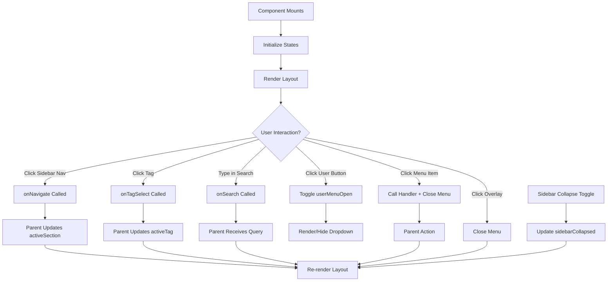

# DashboardLayout Component
**Last Updated:** January 21, 2026  
**Version:** 1.0  
**Status:** ✅ Production Ready

---

## Overview

`DashboardLayout` is the main application layout component that provides a sidebar navigation, top header with search and user menu, and scrollable content area. It features a refined glassmorphism design with decorative background elements.

---

## Purpose

Provide comprehensive layout with:
- Sidebar navigation with collapse support
- Top header with title and search
- User profile menu with dropdown
- Status indicator (online)
- Scrollable content area
- Glassmorphism design
- Decorative background elements
- Responsive design
- Admin panel access (conditional)

---

## Key Responsibilities

### 1. Layout Structure
- Fixed sidebar navigation
- Flexible content area
- Sticky top header
- Scrollable main content

### 2. Navigation
- Section navigation via sidebar
- Tag navigation via sidebar
- Settings navigation via user menu
- Admin panel access (conditional)

### 3. User Interface
- User profile display
- User menu dropdown
- Search functionality
- Status indicator

### 4. Visual Design
- Glassmorphism effects
- Decorative blur elements
- Smooth transitions
- Dark mode support

---

## Component Structure

```
DashboardLayout
├── Sidebar
│   ├── Navigation Items
│   ├── Tag List
│   └── Collapse Toggle
├── Top Header
│   ├── Title
│   ├── Search Bar
│   ├── Status Indicator
│   └── User Profile
│       └── User Menu Dropdown
│           ├── User Info
│           ├── Settings
│           ├── Admin Panel (conditional)
│           └── Sign Out
├── Main Content
│   └── Children
└── Background Elements
    ├── Accent Blur (top right)
    └── Violet Blur (bottom left)
```

---

## Props

```javascript
{
  children: React.ReactNode,              // Main content (required)
  activeSection: string,                 // Current section (required)
  onNavigate: (section: string) => void, // Navigation handler (required)
  user: {                             // User object (optional)
    name: string,
    email: string
  },
  onSearch: (query: string) => void,    // Search handler (optional)
  tags: Array<{                       // Tags list (optional)
    id: string,
    name: string
  }>,
  onTagSelect: (tagId: string) => void, // Tag select handler (optional)
  activeTag: string,                   // Active tag ID (optional)
  isAdmin: boolean,                    // Admin status (optional)
  title: string,                       // Custom title (optional)
  onSignOut: () => void                 // Sign out handler (optional)
}
```

### children
- **Type:** `React.ReactNode`
- **Default:** Required
- **Purpose:** Main content to render
- **Usage:** Rendered in main content area

### activeSection
- **Type:** `string`
- **Default:** Required
- **Purpose:** Current active section
- **Values:** 'notes', 'trash', 'settings', 'admin', etc.
- **Usage:** Highlights active nav item, displays title

### onNavigate
- **Type:** `(section: string) => void`
- **Default:** Required
- **Purpose:** Navigation handler
- **Usage:** Called when user navigates to section

### user
- **Type:** `{name: string, email: string}`
- **Default:** Optional
- **Purpose:** User information
- **Properties:**
  - `name`: User's name
  - `email`: User's email
- **Usage:** Displayed in profile and menu

### onSearch
- **Type:** `(query: string) => void`
- **Default:** Optional
- **Purpose:** Search handler
- **Usage:** Called when user types in search bar

### tags
- **Type:** `Array<{id: string, name: string}>`
- **Default:** Optional
- **Purpose:** Tags list
- **Usage:** Displayed in sidebar

### onTagSelect
- **Type:** `(tagId: string) => void`
- **Default:** Optional
- **Purpose:** Tag selection handler
- **Usage:** Called when user selects a tag

### activeTag
- **Type:** `string`
- **Default:** Optional
- **Purpose:** Active tag ID
- **Usage:** Highlights active tag in sidebar

### isAdmin
- **Type:** `boolean`
- **Default:** Optional
- **Purpose:** Admin status
- **Usage:** Shows admin panel link in user menu

### title
- **Type:** `string`
- **Default:** Optional
- **Purpose:** Custom page title
- **Usage:** If provided, overrides activeSection title

### onSignOut
- **Type:** `() => void`
- **Default:** Optional
- **Purpose:** Sign out handler
- **Usage:** Called when user clicks sign out

---

## Key Features

### 1. Sidebar Navigation

```javascript
<Sidebar 
  activeSection={activeSection} 
  onNavigate={onNavigate} 
  className="flex-shrink-0 z-20"
  tags={tags}
  onTagSelect={onTagSelect}
  activeTag={activeTag}
  isAdmin={isAdmin}
  collapsed={sidebarCollapsed}
  onToggleCollapse={() => setSidebarCollapsed(!sidebarCollapsed)}
/>
```

**Features:**
- Section navigation (notes, trash, settings, admin)
- Tag list with filtering
- Collapse/expand toggle
- Active state highlighting
- Admin panel access (conditional)

**State:**
- `sidebarCollapsed`: Boolean state for collapse state

---

### 2. Top Header

```javascript
<header className="h-16 flex items-center justify-between px-6 border-b border-white/[0.06] bg-[#0c0c14]/50 backdrop-blur-xl z-10 sticky top-0">
```

**Classes:**
- `h-16` - Height: 64px
- `flex` - Flex layout
- `items-center` - Center vertically
- `justify-between` - Space between left and right
- `px-6` - Horizontal padding: 24px
- `border-b` - Bottom border
- `border-white/[0.06]` - Border color (white, 6% opacity)
- `bg-[#0c0c14]/50` - Background color (dark, 50% opacity)
- `backdrop-blur-xl` - Backdrop blur (extra large)
- `z-10` - Z-index: 10
- `sticky top-0` - Sticky at top

---

### 3. Page Title

```javascript
<h1 className="text-xl font-semibold text-white tracking-wide">
  {title || activeSection.charAt(0).toUpperCase() + activeSection.slice(1).replace('-', ' ')}
</h1>
```

**Logic:**
- If `title` prop provided: Use custom title
- Otherwise: Format `activeSection`:
  1. Uppercase first letter
  2. Lowercase rest
  3. Replace hyphens with spaces

**Examples:**
- `activeSection="notes"` → "Notes"
- `activeSection="user-settings"` → "User settings"
- `title="Custom Page"` → "Custom Page"

---

### 4. Search Bar

```javascript
<div className="hidden md:flex ml-4 items-center px-3 py-1.5 rounded-xl bg-white/[0.03] border border-white/[0.06] focus-within:bg-white/[0.06] focus-within:border-[var(--color-accent)]/30 transition-all w-64 group">
  <Search size={16} className="text-gray-500 mr-2 group-focus-within:text-[var(--color-accent)] transition-colors" />
  <input 
    type="text" 
    placeholder="Search notes..." 
    className="bg-transparent border-none outline-none text-sm text-gray-200 placeholder-gray-500 w-full"
    onChange={(e) => onSearch && onSearch(e.target.value)}
  />
</div>
```

**Classes:**
- `hidden md:flex` - Hidden on mobile, flex on desktop
- `ml-4` - Left margin: 16px
- `px-3 py-1.5` - Padding: 12px × 6px
- `rounded-xl` - Rounded corners (large)
- `bg-white/[0.03]` - Background (white, 3% opacity)
- `border` - Border
- `border-white/[0.06]` - Border color (white, 6% opacity)
- `focus-within:bg-white/[0.06]` - Background on focus (white, 6%)
- `focus-within:border-[var(--color-accent)]/30` - Border on focus (accent, 30%)
- `transition-all` - Transition all properties
- `w-64` - Width: 256px
- `group` - Enable group focus

**Icon Classes:**
- `text-gray-500` - Gray text
- `mr-2` - Right margin: 8px
- `group-focus-within:text-[var(--color-accent)]` - Accent color on group focus
- `transition-colors` - Transition colors

**Input Classes:**
- `bg-transparent` - Transparent background
- `border-none` - No border
- `outline-none` - No outline
- `text-sm` - Small text (14px)
- `text-gray-200` - Light gray text
- `placeholder-gray-500` - Gray placeholder
- `w-full` - Full width

---

### 5. Status Indicator

```javascript
<div className="hidden sm:flex items-center gap-2 px-3 py-1.5 rounded-full bg-emerald-500/5 border border-emerald-500/10">
  <div className="w-1.5 h-1.5 rounded-full bg-emerald-400 shadow-[0_0_6px_currentColor] animate-pulse" />
  <span className="text-xs font-medium text-emerald-400/80">Online</span>
</div>
```

**Classes:**
- `hidden sm:flex` - Hidden on mobile, flex on small screens+
- `items-center` - Center vertically
- `gap-2` - Gap: 8px
- `px-3 py-1.5` - Padding: 12px × 6px
- `rounded-full` - Circular
- `bg-emerald-500/5` - Background (emerald, 5% opacity)
- `border` - Border
- `border-emerald-500/10` - Border color (emerald, 10% opacity)

**Dot Classes:**
- `w-1.5 h-1.5` - Size: 6px × 6px
- `rounded-full` - Circular
- `bg-emerald-400` - Emerald background
- `shadow-[0_0_6px_currentColor]` - Glow effect
- `animate-pulse` - Pulsing animation

**Text Classes:**
- `text-xs` - Extra small text (12px)
- `font-medium` - Medium font weight
- `text-emerald-400/80` - Emerald text (80% opacity)

---

### 6. User Profile Button

```javascript
<button 
  onClick={() => setUserMenuOpen(!userMenuOpen)}
  className="w-9 h-9 rounded-xl bg-gradient-to-tr from-[var(--color-accent)] to-violet-500 p-[1px] shadow-lg shadow-[var(--color-accent)]/20 transition-all hover:scale-105 hover:shadow-[var(--color-accent)]/30 active:scale-95"
>
  <div className="w-full h-full rounded-[10px] bg-[#1a1a24] flex items-center justify-center text-xs font-bold uppercase text-white">
    {user?.name?.[0] || 'U'}
  </div>
</button>
```

**Classes:**
- `w-9 h-9` - Size: 36px × 36px
- `rounded-xl` - Rounded corners (large)
- `bg-gradient-to-tr` - Gradient (top-right)
- `from-[var(--color-accent)]` - Gradient start (accent color)
- `to-violet-500` - Gradient end (violet)
- `p-[1px]` - Padding: 1px (for gradient border)
- `shadow-lg` - Large shadow
- `shadow-[var(--color-accent)]/20` - Accent shadow (20% opacity)
- `transition-all` - Transition all properties
- `hover:scale-105` - Scale up on hover (105%)
- `hover:shadow-[var(--color-accent)]/30` - Accent shadow on hover (30%)
- `active:scale-95` - Scale down on active (95%)

**Inner Div Classes:**
- `w-full h-full` - Full size
- `rounded-[10px]` - Rounded corners (10px)
- `bg-[#1a1a24]` - Dark background
- `flex items-center justify-center` - Center content
- `text-xs` - Extra small text (12px)
- `font-bold` - Bold font
- `uppercase` - Uppercase text
- `text-white` - White text

**Content:**
- First letter of user name, or 'U' if no name

---

### 7. User Menu Dropdown

```javascript
{userMenuOpen && (
  <>
    <div className="fixed inset-0 z-40" onClick={() => setUserMenuOpen(false)} />
    <div className="absolute right-0 mt-2 w-56 rounded-xl bg-[#16161c]/95 backdrop-blur-xl border border-white/[0.08] shadow-2xl shadow-black/50 py-1 z-50 animate-in fade-in slide-in-from-top-2">
      {/* Content */}
    </div>
  </>
)}
```

**Overlay Classes:**
- `fixed` - Fixed positioning
- `inset-0` - All edges (top, right, bottom, left: 0)
- `z-40` - Z-index: 40

**Dropdown Classes:**
- `absolute` - Absolute positioning
- `right-0` - Right aligned
- `mt-2` - Top margin: 8px
- `w-56` - Width: 224px
- `rounded-xl` - Rounded corners (large)
- `bg-[#16161c]/95` - Background (dark, 95% opacity)
- `backdrop-blur-xl` - Backdrop blur (extra large)
- `border` - Border
- `border-white/[0.08]` - Border color (white, 8% opacity)
- `shadow-2xl` - Extra large shadow
- `shadow-black/50` - Black shadow (50% opacity)
- `py-1` - Vertical padding: 4px
- `z-50` - Z-index: 50
- `animate-in` - Animate in
- `fade-in` - Fade in animation
- `slide-in-from-top-2` - Slide in from top (8px)

---

### 8. User Menu Sections

#### User Info Section

```javascript
<div className="px-4 py-3 border-b border-white/[0.06]">
  <p className="text-sm font-semibold text-white">{user?.name || 'User'}</p>
  <p className="text-xs text-gray-500 truncate">{user?.email}</p>
</div>
```

**Classes:**
- `px-4 py-3` - Padding: 16px × 12px
- `border-b` - Bottom border
- `border-white/[0.06]` - Border color (white, 6% opacity)

**Name Classes:**
- `text-sm` - Small text (14px)
- `font-semibold` - Semibold font
- `text-white` - White text

**Email Classes:**
- `text-xs` - Extra small text (12px)
- `text-gray-500` - Gray text
- `truncate` - Truncate with ellipsis

#### Menu Items Section

```javascript
<div className="p-1">
  <button 
    onClick={() => { setUserMenuOpen(false); onNavigate('settings'); }}
    className="w-full text-left px-3 py-2 rounded-lg text-sm text-gray-300 hover:text-white hover:bg-white/5 flex items-center gap-2 transition-colors"
  >
    <Settings size={16} />
    Settings
  </button>
  {isAdmin && (
    <button 
      onClick={() => { setUserMenuOpen(false); onNavigate('admin'); }}
      className="w-full text-left px-3 py-2 rounded-lg text-sm text-gray-300 hover:text-white hover:bg-white/5 flex items-center gap-2 transition-colors"
    >
      <Shield size={16} />
      Admin Panel
    </button>
  )}
</div>
```

**Button Classes:**
- `w-full` - Full width
- `text-left` - Left align text
- `px-3 py-2` - Padding: 12px × 8px
- `rounded-lg` - Rounded corners (large)
- `text-sm` - Small text (14px)
- `text-gray-300` - Light gray text
- `hover:text-white` - White text on hover
- `hover:bg-white/5` - Background on hover (white, 5%)
- `flex` - Flex layout
- `items-center` - Center vertically
- `gap-2` - Gap: 8px
- `transition-colors` - Transition colors

#### Sign Out Section

```javascript
<div className="p-1 border-t border-white/[0.06]">
  <button 
    onClick={() => { setUserMenuOpen(false); onSignOut?.(); }}
    className="w-full text-left px-3 py-2 rounded-lg text-sm text-red-400 hover:bg-red-500/10 flex items-center gap-2 transition-colors"
  >
    <LogOut size={16} />
    Sign Out
  </button>
</div>
```

**Classes:**
- `p-1` - Padding: 4px
- `border-t` - Top border
- `border-white/[0.06]` - Border color (white, 6% opacity)

**Button Classes:**
- `text-red-400` - Red text
- `hover:bg-red-500/10` - Background on hover (red, 10%)

---

### 9. Main Content Area

```javascript
<main className="flex-1 overflow-y-auto overflow-x-hidden p-6 relative scrollbar-thin scrollbar-thumb-white/10">
  <div className="container mx-auto max-w-7xl">
    {children}
  </div>
</main>
```

**Main Classes:**
- `flex-1` - Flexible width
- `overflow-y-auto` - Vertical scroll
- `overflow-x-hidden` - No horizontal scroll
- `p-6` - Padding: 24px
- `relative` - Relative positioning
- `scrollbar-thin` - Thin scrollbar
- `scrollbar-thumb-white/10` - Scrollbar thumb (white, 10% opacity)

**Container Classes:**
- `container` - Container
- `mx-auto` - Center horizontally
- `max-w-7xl` - Max width: 1280px

---

### 10. Background Decorative Elements

```javascript
<div className="fixed top-20 right-20 w-96 h-96 bg-[var(--color-accent)]/10 rounded-full blur-[150px] pointer-events-none -z-10" />
<div className="fixed bottom-20 left-40 w-80 h-80 bg-violet-600/8 rounded-full blur-[120px] pointer-events-none -z-10" />
```

**First Blur Classes:**
- `fixed` - Fixed positioning
- `top-20 right-20` - Top 80px, right 80px
- `w-96 h-96` - Size: 384px × 384px
- `bg-[var(--color-accent)]/10` - Background (accent, 10% opacity)
- `rounded-full` - Circular
- `blur-[150px]` - Blur radius: 150px
- `pointer-events-none` - No pointer events
- `-z-10` - Negative z-index: -10

**Second Blur Classes:**
- `fixed` - Fixed positioning
- `bottom-20 left-40` - Bottom 80px, left 160px
- `w-80 h-80` - Size: 320px × 320px
- `bg-violet-600/8` - Background (violet, 8% opacity)
- `rounded-full` - Circular
- `blur-[120px]` - Blur radius: 120px
- `pointer-events-none` - No pointer events
- `-z-10` - Negative z-index: -10

---

## Styling

### Glassmorphism

The component uses glassmorphism design with:

```javascript
bg-[#0c0c14]/50 backdrop-blur-xl
```

- Semi-transparent background
- Backdrop blur effect
- White borders with low opacity

---

### Transitions

```javascript
transition-all
transition-colors
```

- Smooth state changes
- Hover effects
- Focus effects

---

### Gradients

```javascript
bg-gradient-to-tr from-[var(--color-accent)] to-violet-500
```

- Gradient border for user button
- Accent color to violet transition

---

## Accessibility

### Keyboard Navigation

- Tab through header elements
- Enter/Space to activate buttons
- Escape to close user menu
- Logical tab order

### ARIA Attributes

**User Button:**
```javascript
<button
  aria-haspopup="true"
  aria-expanded={userMenuOpen}
>
  {/* Content */}
</button>
```

**User Menu:**
```javascript
<div role="menu">
  {/* Menu items */}
</div>
```

### Focus Management

- Focus indicators on interactive elements
- Focus-within states for search bar
- Return focus after menu close

---

## Data Flow



---

## Performance

### Optimizations

1. **Conditional Rendering**
   - Only render user menu when open
   - Only render admin button when isAdmin
   - Hide search on mobile

2. **Event Handlers**
   - Inline arrow functions (acceptable for layout)
   - Minimal state updates

3. **CSS Transitions**
   - Hardware-accelerated transforms
   - Smooth animations
   - No layout thrashing

4. **Backdrop Blur**
   - Uses browser-native backdrop-filter
   - GPU accelerated

---

## Responsive Design

### Mobile (< 640px)

- Sidebar: Collapsed by default
- Search bar: Hidden
- Status indicator: Hidden
- User menu: Full width dropdown

### Small Screens (640px+)

- Status indicator: Visible
- Search bar: Hidden

### Desktop (768px+)

- Search bar: Visible
- All features enabled

### Sidebar Behavior

- Collapsed: Icons only
- Expanded: Full navigation

---

## Usage Examples

### Basic Usage

```javascript
import DashboardLayout from './components/DashboardLayout'

function App() {
  const [activeSection, setActiveSection] = useState('notes')
  const [user] = useState({ name: 'John Doe', email: 'john@example.com' })
  const [tags] = useState([
    { id: '1', name: 'Work' },
    { id: '2', name: 'Personal' }
  ])
  
  return (
    <DashboardLayout
      activeSection={activeSection}
      onNavigate={setActiveSection}
      user={user}
      tags={tags}
    >
      <div>Content here</div>
    </DashboardLayout>
  )
}
```

### With All Features

```javascript
function App() {
  const [activeSection, setActiveSection] = useState('notes')
  const [activeTag, setActiveTag] = useState(null)
  const [searchQuery, setSearchQuery] = useState('')
  const [user] = useState({ name: 'John Doe', email: 'john@example.com' })
  const [tags] = useState([...])
  const isAdmin = true
  
  const handleSearch = (query) => {
    setSearchQuery(query)
    // Filter notes based on query
  }
  
  const handleSignOut = () => {
    // Sign out logic
    window.location.href = '/login'
  }
  
  return (
    <DashboardLayout
      activeSection={activeSection}
      onNavigate={setActiveSection}
      user={user}
      onSearch={handleSearch}
      tags={tags}
      onTagSelect={setActiveTag}
      activeTag={activeTag}
      isAdmin={isAdmin}
      title="My Notes"
      onSignOut={handleSignOut}
    >
      <div>
        {activeSection === 'notes' && <NotesView query={searchQuery} tag={activeTag} />}
        {activeSection === 'settings' && <SettingsView />}
        {activeSection === 'admin' && <AdminView />}
      </div>
    </DashboardLayout>
  )
}
```

### With Custom Title

```javascript
function NotesPage() {
  return (
    <DashboardLayout
      activeSection="notes"
      onNavigate={() => {}}
      title="My Personal Notes"
    >
      <div>Notes content</div>
    </DashboardLayout>
  )
}
```

---

## Testing

### Unit Tests

```javascript
describe('DashboardLayout Component', () => {
  it('should render sidebar', () => {
    // Test sidebar rendering
  });
  
  it('should render header with title', () => {
    // Test header and title
  });
  
  it('should render search bar', () => {
    // Test search bar
  });
  
  it('should render user profile', () => {
    // Test user profile
  });
  
  it('should toggle user menu', () => {
    // Test menu toggle
  });
  
  it('should call onNavigate', () => {
    // Test navigation
  });
  
  it('should call onSearch', () => {
    // Test search
  });
  
  it('should show admin link when isAdmin', () => {
    // Test admin visibility
  });
  
  it('should hide admin link when not isAdmin', () => {
    // Test admin hidden
  });
});
```

### Integration Tests

```javascript
describe('DashboardLayout Integration', () => {
  it('should complete navigation flow', () => {
    // Test: click nav → onNavigate → update section → re-render
  });
  
  it('should complete search flow', () => {
    // Test: type → onSearch → filter notes
  });
});
```

### E2E Tests (Playwright)

```javascript
test('Navigate to settings', async ({ page }) => {
  await page.goto('/#/notes');
  
  // Click settings in sidebar
  await page.click('[data-testid="nav-settings"]');
  
  // Verify URL changed
  await expect(page).toHaveURL('/#/settings');
});

test('Open user menu', async ({ page }) => {
  await page.goto('/#/notes');
  
  // Click user profile
  await page.click('[data-testid="user-profile"]');
  
  // Verify menu is visible
  await expect(page.locator('[data-testid="user-menu"]')).toBeVisible();
});

test('Search notes', async ({ page }) => {
  await page.goto('/#/notes');
  
  // Type in search
  await page.fill('[data-testid="search-input"]', 'meeting');
  
  // Verify search called
  // (Check API calls or note filtering)
});
```

---

## Troubleshooting

### Issue: Sidebar not collapsing

**Possible Causes:**
- sidebarCollapsed state not updating
- Collapse handler not called
- Sidebar component issue

**Solutions:**
1. Verify sidebarCollapsed state
2. Check onToggleCollapse handler
3. Test Sidebar component independently

---

### Issue: User menu not showing

**Possible Causes:**
- userMenuOpen state false
- onClick handler not working
- Z-index conflict

**Solutions:**
1. Verify userMenuOpen state
2. Check onClick handler
3. Inspect z-index values

---

### Issue: Search not working

**Possible Causes:**
- onSearch not provided
- onChange handler not called
- Input disabled

**Solutions:**
1. Verify onSearch handler is provided
2. Check onChange event
3. Test with simple input

---

### Issue: Background elements not visible

**Possible Causes:**
- CSS not loading
- Z-index too low
- Pointer events blocking

**Solutions:**
1. Check CSS for background elements
2. Verify z-index is negative
3. Check pointer-events-none

---

### Issue: Responsive behavior issues

**Possible Causes:**
- Breakpoints not working
- Tailwind classes incorrect
- Mobile styles overriding

**Solutions:**
1. Test on different screen sizes
2. Verify Tailwind breakpoints
3. Check responsive classes

---

## Related Components

- [Sidebar](./Sidebar.md) - Sidebar navigation (used by DashboardLayout)
- [SearchBar](./SearchBar.md) - Search bar component (alternative)

---

## Dependencies

- `react` - React hooks (useState)
- `./Sidebar` - Sidebar component
- `lucide-react` - Icons (Settings, Shield, LogOut, Search)

---

## Best Practices

1. **Always provide onNavigate handler**
2. **Handle user authentication state**
3. **Provide tags for filtering**
4. **Implement search functionality**
5. **Handle admin permissions**
6. **Use responsive design**
7. **Test on different screen sizes**
8. **Maintain consistent design system**

---

**Component Version:** 1.0  
**Last Updated:** January 21, 2026  
**Status:** ✅ Production Ready