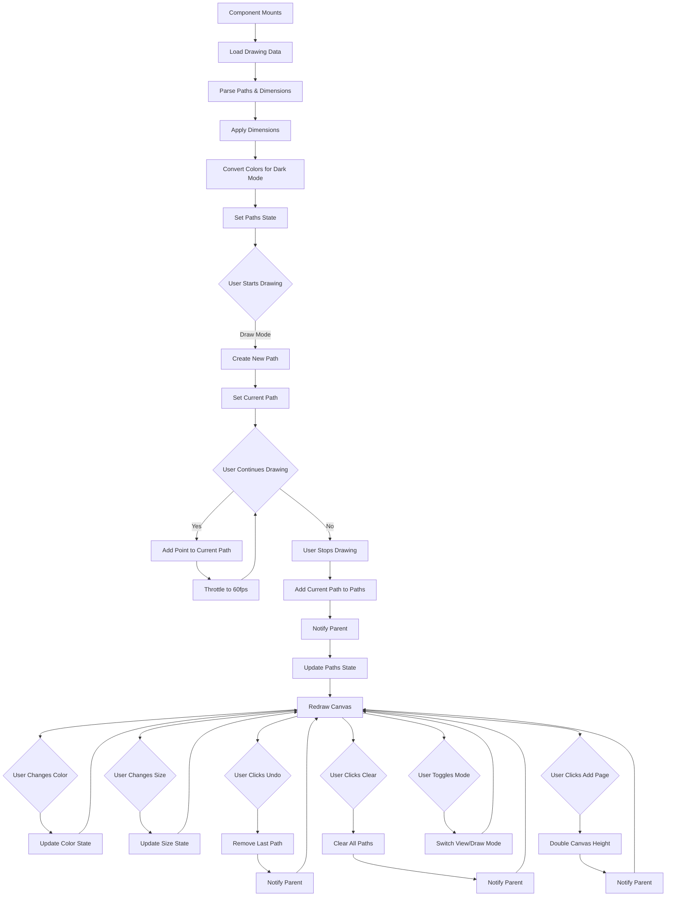

# DrawingCanvas Component
**Last Updated:** January 21, 2026  
**Version:** 1.0  
**Status:** ✅ Production Ready

---

## Overview

`DrawingCanvas` is a React component that provides an interactive drawing canvas for creating freehand drawings within GlassKeep notes. Supports pen and eraser tools, multiple colors and sizes, undo/clear operations, view/draw modes, and multi-page canvas functionality.

---

## Purpose

Provide drawing capabilities with:
- Freehand drawing with pen tool
- Eraser for removing strokes
- Color selection (13 colors)
- Brush size selection (8 sizes)
- Undo last stroke
- Clear all strokes
- View/Draw mode toggle
- Multi-page canvas support
- Touch support for mobile
- Dark mode color adaptation
- Canvas dimension persistence

---

## Component Structure

```
DrawingCanvas
├── Mode Toggle (view/draw)
├── Toolbar (draw mode only)
│   ├── Tool Selection (pen/eraser)
│   ├── Color Picker (dropdown)
│   ├── Size Picker (select)
│   └── Actions (undo, clear)
├── Canvas
│   ├── Completed paths
│   └── Current path
├── Add Page Button (draw mode only)
└── Info (stroke count, mode)
```

---

## Props

```javascript
{
  data: object | array,              // Drawing data (optional)
  onChange?: (data: object) => void, // Change handler (optional)
  width?: number,                    // Canvas width (optional)
  height?: number,                   // Canvas height (optional)
  readOnly?: boolean,                // Read-only mode (optional)
  darkMode?: boolean,                // Dark mode (optional)
  hideModeToggle?: boolean,          // Hide mode toggle (optional)
  initialMode?: 'view' | 'draw'      // Initial mode (optional)
}
```

### data
- **Type:** `object | array`
- **Default:** `null`
- **Purpose:** Drawing data to load
- **Formats:**
  - **Old format:** `Array` of path objects
  - **New format:** `Object` with `{ paths, dimensions }`
- **Example:**
```javascript
// Old format
[
  {
    tool: 'pen',
    color: '#000000',
    size: 4,
    points: [{ x: 10, y: 10 }, { x: 20, y: 20 }]
  }
]

// New format
{
  paths: [...],
  dimensions: {
    width: 800,
    height: 600,
    originalHeight: 600
  }
}
```

### onChange
- **Type:** `(data: object) => void`
- **Default:** Optional
- **Purpose:** Called when drawing changes
- **Payload:**
```javascript
{
  paths: Array,           // Array of path objects
  dimensions: {
    width: number,        // Current width
    height: number,      // Current height
    originalHeight: number // Original first page height
  }
}
```

### width
- **Type:** `number`
- **Default:** `800`
- **Purpose:** Initial canvas width
- **Usage:** Default width for new drawings

### height
- **Type:** `number`
- **Default:** `600`
- **Purpose:** Initial canvas height
- **Usage:** Default height for new drawings

### readOnly
- **Type:** `boolean`
- **Default:** `false`
- **Purpose:** Disable drawing
- **Effects:**
  - Disables all drawing actions
  - Hides toolbar
  - Hides mode toggle
  - Canvas is view-only

### darkMode
- **Type:** `boolean`
- **Default:** `false`
- **Purpose:** Enable dark mode
- **Effects:**
  - Converts black strokes to white
  - Converts white strokes to black
  - Adjusts default color
  - Adapts UI colors

### hideModeToggle
- **Type:** `boolean`
- **Default:** `false`
- **Purpose:** Hide view/draw toggle
- **Usage:** Always in draw mode (e.g., Composer)

### initialMode
- **Type:** `'view' | 'draw'`
- **Default:** Auto-detect
- **Purpose:** Set initial mode
- **Auto-detect logic:**
  - `initialMode` prop (if provided)
  - `view` if `readOnly` is true
  - `draw` if `hideModeToggle` is true
  - `view` (default for Modal)

---

## Key Features

### 1. Drawing Tools

#### Pen Tool
- Freehand drawing
- Configurable color
- Configurable size
- Smooth lines (round caps/joins)

#### Eraser Tool
- Remove strokes
- Configurable size
- Round eraser tip

---

### 2. Color Selection

**Available Colors:**
```javascript
const DRAWING_COLORS = [
  '#000000', // black
  '#FFFFFF', // white
  '#FF0000', // red
  '#00FF00', // green
  '#0000FF', // blue
  '#FFFF00', // yellow
  '#FF00FF', // magenta
  '#00FFFF', // cyan
  '#FFA500', // orange
  '#800080', // purple
  '#FFC0CB', // pink
  '#A52A2A', // brown
  '#808080', // gray
];
```

**Color Picker:**
- Dropdown grid layout
- 6 columns × 3 rows
- Visual color preview
- Selection indicator
- Click outside to close

---

### 3. Brush Sizes

**Available Sizes:**
```javascript
const PEN_SIZES = [1, 2, 4, 8, 12, 16, 24, 32];
```

**Size Picker:**
- Dropdown selection
- Pixel values
- Current size highlighted

---

### 4. Path Data Structure

```javascript
{
  tool: 'pen' | 'eraser',
  color: string,           // Hex color code
  size: number,           // Brush size in pixels
  points: [
    { x: number, y: number },
    { x: number, y: number },
    // ... more points
  ]
}
```

**Points:**
- Array of X,Y coordinates
- Captured during drawing
- Stored in drawing data

---

### 5. View/Draw Mode

**View Mode:**
- Display drawing only
- No drawing actions
- Scrollable on touch devices
- Cursor: default

**Draw Mode:**
- Full drawing capabilities
- Touch handling disabled (prevents scroll)
- Cursor: crosshair
- Toolbar visible

**Mode Toggle:**
- Button to switch modes
- Only visible when not read-only and toggle not hidden
- Button text reflects current mode

---

### 6. Multi-Page Support

**Add Page:**
- Doubles canvas height
- Preserves existing content
- Maintains original first page height
- Only available in draw mode

**Dimensions:**
```javascript
{
  width: 800,           // Current width
  height: 1200,         // Current height (after adding page)
  originalHeight: 600   // Original first page height
}
```

---

### 7. Dark Mode Adaptation

**Color Conversion:**
```javascript
// Dark mode
if (path.color === '#000000') {
  return { ...path, color: '#FFFFFF' };
}

// Light mode
if (path.color === '#FFFFFF') {
  return { ...path, color: '#000000' };
}
```

**Behavior:**
- Black strokes → White (dark mode)
- White strokes → Black (light mode)
- Other colors unchanged
- Default color adapts to mode

---

### 8. Touch Support

**Events Handled:**
- `touchStart` - Start drawing
- `touchMove` - Continue drawing
- `touchEnd` - Stop drawing

**Touch Behavior:**
- Draw mode: Prevent default, handle drawing
- View mode: Allow default, enable scrolling
- Touch coordinates converted to canvas space

---

### 9. Performance Optimizations

**Drawing Throttle:**
```javascript
const now = Date.now();
if (now - lastDrawTime.current < 16) return; // ~60fps
lastDrawTime.current = now;
```

**Benefits:**
- Limits draw updates to ~60fps
- Reduces CPU usage
- Smoother performance

**Canvas Redraw:**
- Only redraw when paths change
- Efficient clearing and rendering
- Batch operations

---

## State Management

```javascript
{
  isDrawing: boolean,          // Currently drawing
  tool: 'pen' | 'eraser',     // Current tool
  color: string,               // Current color
  size: number,                // Current brush size
  showColorPicker: boolean,    // Color picker visibility
  paths: Array,                // Completed paths
  currentPath: object | null,  // Path being drawn
  mode: 'view' | 'draw',      // Current mode
  canvasWidth: number,         // Current canvas width
  canvasHeight: number         // Current canvas height
}
```

---

## Styling

### Container

```javascript
className="drawing-canvas-container"
```

- Flex column layout
- Gap between elements
- Full width

---

### Mode Toggle

```javascript
className="flex items-center justify-between mb-3"
```

- Flex row layout
- Centered content
- Bottom margin

**Button:**
```javascript
className="px-3 py-1.5 rounded-lg border border-[var(--border-light)] hover:bg-black/5 dark:hover:bg-white/10 text-sm"
```

- Padding: 12px × 6px
- Rounded corners (large)
- Border with CSS variable
- Hover effect
- Small text

---

### Toolbar

```javascript
className="flex items-center gap-3 mb-3 p-2 bg-gray-50 dark:bg-gray-800 rounded-lg"
```

- Flex row layout
- Gap between items
- Bottom margin
- Padding: 8px
- Gray background (light mode)
- Dark gray background (dark mode)
- Rounded corners (large)

---

### Tool Buttons

```javascript
className={`px-2 py-1 rounded text-sm ${
  tool === 'pen' 
    ? 'bg-blue-500 text-white' 
    : 'bg-gray-200 dark:bg-gray-700 hover:bg-gray-300 dark:hover:bg-gray-600'
}`}
```

- Padding: 8px × 4px
- Rounded corners
- Small text
- Active: Blue background, white text
- Inactive: Gray background, hover effect

---

### Color Picker Button

```javascript
className="flex items-center gap-1 px-2 py-1 bg-gray-200 dark:bg-gray-700 rounded text-sm hover:bg-gray-300 dark:hover:bg-gray-600"
```

- Flex row layout
- Gap between color and arrow
- Gray background
- Rounded corners
- Hover effect

**Color Preview:**
```javascript
className="w-4 h-4 rounded border border-gray-400"
```

- Size: 16px × 16px
- Rounded (circular)
- Gray border

---

### Color Picker Dropdown

```javascript
className="absolute top-full mt-1 p-3 bg-white dark:bg-gray-700 border border-gray-300 dark:border-gray-600 rounded-lg shadow-lg z-10 min-w-[200px]"
```

- Absolute positioning
- Below button
- Top margin: 4px
- Padding: 12px
- White background (light mode)
- Dark gray background (dark mode)
- Border
- Rounded corners (large)
- Large shadow
- High z-index
- Minimum width: 200px

**Color Grid:**
```javascript
className="grid grid-cols-6 gap-2"
```

- Grid layout
- 6 columns
- 8px gap

**Color Button:**
```javascript
className={`w-6 h-6 rounded-full border-2 ${
  color === c 
    ? 'border-gray-600 ring-2 ring-gray-400' 
    : 'border-gray-300'
}`}
```

- Size: 24px × 24px
- Circular
- Border: 2px
- Selected: Dark border, gray ring
- Unselected: Light gray border

---

### Size Picker

```javascript
className="px-2 py-1 bg-gray-200 dark:bg-gray-700 rounded text-sm"
```

- Padding: 8px × 4px
- Gray background
- Rounded corners
- Small text

---

### Action Buttons

**Undo Button:**
```javascript
className="px-2 py-1 bg-gray-200 dark:bg-gray-700 rounded text-sm disabled:opacity-50 hover:bg-gray-300 dark:hover:bg-gray-600"
```

- Padding: 8px × 4px
- Gray background
- Rounded corners
- Small text
- Disabled: 50% opacity
- Hover effect

**Clear Button:**
```javascript
className="px-2 py-1 bg-red-500 text-white rounded text-sm hover:bg-red-600"
```

- Padding: 8px × 4px
- Red background
- White text
- Rounded corners
- Small text
- Hover effect (darker red)

---

### Canvas Container

```javascript
className="border border-gray-300 dark:border-gray-600 rounded-lg overflow-hidden"
```

- Border
- Gray border (light mode)
- Dark gray border (dark mode)
- Rounded corners (large)
- Overflow hidden

---

### Canvas

```javascript
className={`block ${
  mode === 'draw' && !readOnly 
    ? 'cursor-crosshair' 
    : 'cursor-default'
}`}
```

- Block display
- Draw mode: Crosshair cursor
- View mode: Default cursor

**Styles:**
```javascript
style={{
  maxWidth: '100%',
  height: 'auto',
  touchAction: mode === 'draw' && !readOnly ? 'none' : 'auto'
}}
```

- Max width: 100%
- Height: Auto (maintain aspect ratio)
- Touch action: None (draw mode), Auto (view mode)

---

### Add Page Button

```javascript
className="px-4 py-2 bg-blue-500 text-white rounded-lg hover:bg-blue-600 text-sm font-medium transition-colors"
```

- Padding: 16px × 8px
- Blue background
- White text
- Rounded corners (large)
- Small text
- Medium font weight
- Hover effect (darker blue)
- Transition colors

---

### Info

```javascript
className="text-xs text-gray-500 mt-2"
```

- Extra small text
- Gray color
- Top margin: 8px

---

## Data Flow



---

## Usage Examples

### Basic Usage

```javascript
import DrawingCanvas from './DrawingCanvas'

function NoteEditor() {
  const [drawing, setDrawing] = useState(null)
  
  const handleDrawingChange = (newData) => {
    setDrawing(newData)
  }
  
  return (
    <DrawingCanvas
      data={drawing}
      onChange={handleDrawingChange}
    />
  )
}
```

### With Custom Dimensions

```javascript
function LargeCanvas() {
  const [drawing, setDrawing] = useState(null)
  
  return (
    <DrawingCanvas
      data={drawing}
      onChange={setDrawing}
      width={1200}
      height={800}
    />
  )
}
```

### Read-Only Mode

```javascript
function NoteViewer({ drawing }) {
  return (
    <DrawingCanvas
      data={drawing}
      readOnly={true}
    />
  )
}
```

### Dark Mode

```javascript
function DarkCanvas() {
  const [drawing, setDrawing] = useState(null)
  const [darkMode, setDarkMode] = useState(true)
  
  return (
    <div>
      <button onClick={() => setDarkMode(!darkMode)}>
        Toggle Dark Mode
      </button>
      <DrawingCanvas
        data={drawing}
        onChange={setDrawing}
        darkMode={darkMode}
      />
    </div>
  )
}
```

### Hide Mode Toggle (Always Draw Mode)

```javascript
function ComposerDrawing() {
  const [drawing, setDrawing] = useState(null)
  
  return (
    <DrawingCanvas
      data={drawing}
      onChange={setDrawing}
      hideModeToggle={true}
    />
  )
}
```

### Set Initial Mode

```javascript
function ViewFirst() {
  const [drawing, setDrawing] = useState(null)
  
  return (
    <DrawingCanvas
      data={drawing}
      onChange={setDrawing}
      initialMode="view"
    />
  )
}
```

### Load and Save Drawing

```javascript
function DrawingNote() {
  const [note, setNote] = useState(null)
  
  useEffect(() => {
    // Load drawing from database
    async function loadDrawing() {
      const data = await api.getDrawing(noteId)
      if (data.drawing) {
        setNote(data)
      }
    }
    loadDrawing()
  }, [noteId])
  
  const handleDrawingChange = async (newDrawing) => {
    setNote({ ...note, drawing: newDrawing })
    
    // Save to database
    await api.saveDrawing(noteId, newDrawing)
  }
  
  return note ? (
    <DrawingCanvas
      data={note.drawing}
      onChange={handleDrawingChange}
    />
  ) : null
}
```

---

## Testing

### Unit Tests

```javascript
describe('DrawingCanvas Component', () => {
  it('should render canvas', () => {
    // Test: canvas element present
  });
  
  it('should load drawing data', () => {
    // Test: data prop → paths loaded
  });
  
  it('should handle new format data', () => {
    // Test: object format with paths and dimensions
  });
  
  it('should handle old format data', () => {
    // Test: array format (backward compatibility)
  });
  
  it('should start drawing in draw mode', () => {
    // Test: mouse down → new path created
  });
  
  it('should not draw in read-only mode', () => {
    // Test: readOnly → no drawing
  });
  
  it('should not draw in view mode', () => {
    // Test: view mode → no drawing
  });
  
  it('should add points to path', () => {
    // Test: mouse move → points added
  });
  
  it('should complete path on mouse up', () => {
    // Test: mouse up → path added to paths
  });
  
  it('should notify parent on change', () => {
    // Test: path complete → onChange called
  });
  
  it('should change color', () => {
    // Test: color selection → color state updated
  });
  
  it('should change size', () => {
    // Test: size selection → size state updated
  });
  
  it('should switch tool', () => {
    // Test: tool click → tool state updated
  });
  
  it('should undo last path', () => {
    // Test: undo → last path removed
  });
  
  it('should clear canvas', () => {
    // Test: clear → all paths removed
  });
  
  it('should add page', () => {
    // Test: add page → canvas height doubled
  });
  
  it('should toggle mode', () => {
    // Test: mode click → mode switched
  });
  
  it('should adapt colors for dark mode', () => {
    // Test: dark mode → black → white
  });
  
  it('should adapt colors for light mode', () => {
    // Test: light mode → white → black
  });
  
  it('should handle touch events', () => {
    // Test: touch start/move/end → drawing
  });
  
  it('should throttle drawing', () => {
    // Test: fast drawing → limited to ~60fps
  });
});
```

### Integration Tests

```javascript
describe('DrawingCanvas Integration', () => {
  it('should save and load drawing', () => {
    // Test: draw → save → load → display
  });
  
  it('should handle multi-page drawings', () => {
    // Test: add page → save → load → display
  });
  
  it('should maintain dimensions across save/load', () => {
    // Test: dimensions → save → load → same dimensions
  });
});
```

### E2E Tests (Playwright)

```javascript
test('User draws on canvas', async ({ page }) => {
  await page.goto('/#/notes');
  
  // Switch to draw mode
  await page.click('text=Draw mode');
  
  // Draw a line
  const canvas = page.locator('canvas');
  await canvas.click({ position: { x: 100, y: 100 } });
  await canvas.dragTo(canvas, { sourcePosition: { x: 100, y: 100 }, targetPosition: { x: 200, y: 100 } });
  
  // Verify stroke count
  await expect(page.locator('text=1 stroke')).toBeVisible();
});

test('User changes color and size', async ({ page }) => {
  await page.goto('/#/notes');
  await page.click('text=Draw mode');
  
  // Open color picker
  await page.click('[title="Change color"]');
  
  // Select red color
  await page.click('[title="#FF0000"]');
  
  // Change size
  await page.selectOption('select[title="Brush size"]', '8');
  
  // Verify changes
  // (Check drawing uses red color and 8px size)
});

test('User uses eraser', async ({ page }) => {
  await page.goto('/#/notes');
  await page.click('text=Draw mode');
  
  // Draw something
  const canvas = page.locator('canvas');
  await canvas.click({ position: { x: 100, y: 100 } });
  await canvas.dragTo(canvas, { sourcePosition: { x: 100, y: 100 }, targetPosition: { x: 200, y: 100 } });
  
  // Switch to eraser
  await page.click('[title="Eraser"]');
  
  // Erase part of drawing
  await canvas.click({ position: { x: 150, y: 100 } });
  await canvas.dragTo(canvas, { sourcePosition: { x: 150, y: 100 }, targetPosition: { x: 180, y: 100 } });
  
  // Verify erasure
  // (Check that middle part is erased)
});

test('User adds page', async ({ page }) => {
  await page.goto('/#/notes');
  await page.click('text=Draw mode');
  
  // Get initial canvas height
  const canvas = page.locator('canvas');
  const initialHeight = await canvas.evaluate(el => el.height);
  
  // Click add page
  await page.click('text=Add Page');
  
  // Verify canvas height doubled
  const newHeight = await canvas.evaluate(el => el.height);
  expect(newHeight).toBe(initialHeight * 2);
});
```

---

## Troubleshooting

### Issue: Drawing not visible

**Possible Causes:**
- Canvas not rendering
- Paths not being drawn
- Color matches background
- Canvas size issue

**Solutions:**
1. Verify canvas is present in DOM
2. Check paths state is populated
3. Test with different color
4. Verify canvas dimensions

---

### Issue: Drawing offset

**Possible Causes:**
- Canvas scaling issue
- Coordinate calculation error
- CSS transform interference

**Solutions:**
1. Check canvas.getBoundingClientRect()
2. Verify scale calculations
3. Remove CSS transforms
4. Test in different browsers

---

### Issue: Touch not working

**Possible Causes:**
- Touch events not handled
- PreventDefault blocking
- Mode is view mode

**Solutions:**
1. Ensure mode is 'draw'
2. Check touch event handlers
3. Verify preventDefault logic
4. Test on mobile device

---

### Issue: Colors not adapting

**Possible Causes:**
- Dark mode prop not set
- Color conversion logic issue
- Old format data

**Solutions:**
1. Verify darkMode prop
2. Check color conversion logic
3. Use new data format
4. Test color conversion manually

---

### Issue: Undo not working

**Possible Causes:**
- No paths to undo
- Undo handler not called
- State not updating

**Solutions:**
1. Verify paths exist
2. Check undo click handler
3. Verify state update
4. Test with single stroke

---

### Issue: Canvas size not persisting

**Possible Causes:**
- Dimensions not saved
- Old data format
- onChange not called

**Solutions:**
1. Verify onChange is called
2. Use new data format
3. Check dimensions payload
4. Test save/load flow

---

## Best Practices

1. **Use new data format** for better dimension tracking
2. **Handle both formats** for backward compatibility
3. **Implement debounced saving** for performance
4. **Validate drawing data** before saving
5. **Provide clear UI** for mode switching
6. **Test on mobile devices** for touch support
7. **Optimize canvas size** for better performance
8. **Use appropriate colors** for accessibility

---

## Performance Considerations

### Optimizations

1. **Drawing Throttle**
   - Limits updates to ~60fps
   - Reduces CPU usage
   - Smoother performance

2. **Canvas Redraw**
   - Only redraw when paths change
   - Efficient clearing and rendering
   - Batch operations

3. **State Management**
   - Minimal re-renders
   - Efficient state updates
   - Callback memoization

4. **Event Handling**
   - Efficient event listeners
   - Proper cleanup
   - Click outside detection

---

## Accessibility

### Keyboard Navigation

- Tab to toolbar buttons
- Enter/Space to activate
- Logical tab order
- Focus management

### Screen Reader Support

- Button labels via title attribute
- Mode indicator in info text
- Semantic HTML structure

### Touch Support

- Touch events handled
- Mode-specific touch behavior
- Prevent scroll in draw mode

---

## Related Components

- [DrawingPreview](./DrawingPreview.md) - Drawing preview component
- [Composer](./Composer.md) - Note composer component
- [Modal](./Modal.md) - Modal component for viewing

---

## Dependencies

- `react` - React (useRef, useEffect, useState, useCallback)

---

## Data Format Evolution

### Old Format (Deprecated)

```javascript
[
  {
    tool: 'pen',
    color: '#000000',
    size: 4,
    points: [{ x: 10, y: 10 }, { x: 20, y: 20 }]
  }
]
```

**Issues:**
- No dimension tracking
- Multi-page not supported
- Limited functionality

### New Format (Recommended)

```javascript
{
  paths: [
    {
      tool: 'pen',
      color: '#000000',
      size: 4,
      points: [{ x: 10, y: 10 }, { x: 20, y: 20 }]
    }
  ],
  dimensions: {
    width: 800,
    height: 600,
    originalHeight: 600
  }
}
```

**Benefits:**
- Dimension tracking
- Multi-page support
- Better data organization

---

**Component Version:** 1.0  
**Last Updated:** January 21, 2026  
**Status:** ✅ Production Ready