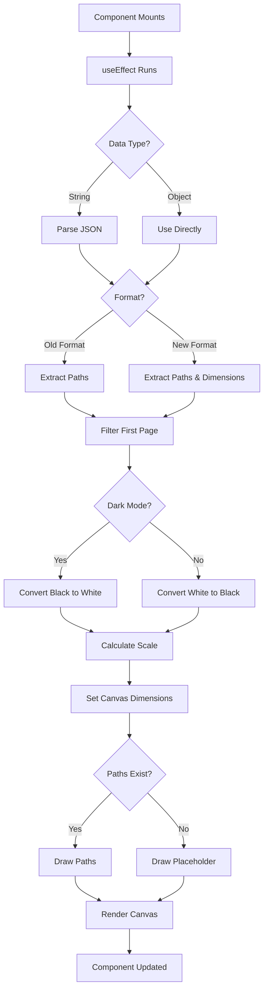

# DrawingPreview Component
**Last Updated:** January 21, 2026  
**Version:** 1.0  
**Status:** ✅ Production Ready

---

## Overview

`DrawingPreview` is a canvas-based drawing preview component that renders stored drawing data with support for multiple data formats, theme-aware color conversion, first-page filtering, and responsive scaling. It provides optimized previews with placeholder rendering for empty drawings.

---

## Purpose

Provide flexible drawing preview with:
- Canvas-based rendering
- Multiple data format support (old/new)
- First-page filtering (multi-page drawings)
- Dark/light mode color conversion
- Responsive scaling
- Placeholder for empty drawings
- Eraser tool support
- Performance optimization

---

## Key Responsibilities

### 1. Data Parsing
- Parse JSON string or object data
- Handle old format (array of paths)
- Handle new format (object with paths and dimensions)
- Error handling for invalid data

### 2. Rendering
- Scale drawing to fit preview dimensions
- Draw paths with proper styling
- Handle eraser strokes
- Apply theme-aware color conversion
- Filter to first page only

### 3. Performance
- Use canvas for efficient rendering
- Scale paths once
- Minimize re-renders
- Optimize path filtering

### 4. User Experience
- Show placeholder for empty drawings
- Maintain aspect ratio
- Dark mode support
- Responsive sizing

---

## Component Structure

```
DrawingPreview
├── Canvas Container
│   └── Canvas Element
└── Rendering Logic (useEffect)
    ├── Data Parsing
    │   ├── Old Format Detection
    │   ├── New Format Detection
    │   └── Error Handling
    ├── Path Filtering
    │   └── First Page Only
    ├── Color Conversion
    │   ├── Dark Mode: Black → White
    │   └── Light Mode: White → Black
    ├── Scaling
    │   ├── Calculate Scale Factor
    │   └── Apply to Coordinates
    └── Drawing
        ├── Clear Canvas
        ├── Draw Placeholder (if empty)
        └── Draw Paths
```

---

## Props

```javascript
{
  data: string | object,     // Drawing data (JSON string or object)
  width: number,              // Preview width (required)
  height: number,             // Preview height (required)
  darkMode: boolean           // Dark mode enabled (default: false)
}
```

### data
- **Type:** `string | object`
- **Default:** Required
- **Purpose:** Drawing data to render
- **Formats:**
  - **Old format:** Array of paths `[{points: [{x, y}], color, size, tool}, ...]`
  - **New format:** Object `{paths: [...], dimensions: {width, height, originalHeight}}`

### width
- **Type:** `number`
- **Default:** Required
- **Purpose:** Preview width in pixels
- **Usage:** Maximum width of canvas

### height
- **Type:** `number`
- **Default:** Required
- **Purpose:** Preview height in pixels
- **Usage:** Maximum height of canvas

### darkMode
- **Type:** `boolean`
- **Default:** `false`
- **Purpose:** Enable dark mode color conversion
- **Usage:** Convert black/white strokes for better contrast

---

## Key Features

### 1. Data Parsing

```javascript
let parsedData;
if (typeof data === 'string') {
  parsedData = JSON.parse(data) || [];
} else {
  parsedData = data;
}

if (Array.isArray(parsedData)) {
  // Old format: just an array of paths
  paths = parsedData;
} else if (parsedData && typeof parsedData === 'object' && Array.isArray(parsedData.paths)) {
  // New format: object with paths and dimensions
  paths = parsedData.paths;
  if (parsedData.dimensions && parsedData.dimensions.width && parsedData.dimensions.height) {
    originalWidth = parsedData.dimensions.width;
    originalHeight = parsedData.dimensions.height;
    if (parsedData.dimensions.originalHeight) {
      firstPageHeight = parsedData.dimensions.originalHeight;
    } else if (originalHeight > 1000) {
      firstPageHeight = originalHeight / 2;
    } else {
      firstPageHeight = originalHeight;
    }
  }
}
```

**Formats Supported:**

#### Old Format (Array)
```javascript
[
  {
    points: [{x: 100, y: 100}, {x: 200, y: 150}],
    color: "#000000",
    size: 2,
    tool: "pen"
  }
]
```

#### New Format (Object)
```javascript
{
  paths: [
    {
      points: [{x: 100, y: 100}, {x: 200, y: 150}],
      color: "#000000",
      size: 2,
      tool: "pen"
    }
  ],
  dimensions: {
    width: 800,
    height: 1200,
    originalHeight: 600
  }
}
```

**Features:**
- Automatic format detection
- JSON string parsing
- Error handling
- Backward compatibility

---

### 2. First-Page Filtering

```javascript
paths = paths.filter(path => {
  if (!path.points || path.points.length === 0) return false;
  // Check if any point in path is within first page
  return path.points.some(point => point.y < firstPageHeight);
});
```

**Purpose:**
- Multi-page drawings may have paths beyond first page
- Preview shows only first page for cleaner display
- Prevents blank space in preview

**Logic:**
- Filter paths with points in first page
- Use `firstPageHeight` from dimensions (if available)
- Estimate first page height if not stored (originalHeight > 1000 → divided by 2)

---

### 3. Color Conversion

```javascript
paths = paths.map(path => {
  if (darkMode) {
    // In dark mode, ensure black strokes are white for visibility
    if (path.color === '#000000') {
      return { ...path, color: '#FFFFFF' };
    }
  } else {
    // In light mode, ensure white strokes are black for visibility
    if (path.color === '#FFFFFF') {
      return { ...path, color: '#000000' };
    }
  }
  return path;
});
```

**Conversion Rules:**

| Mode | Original Color | Converted Color | Reason |
|------|---------------|-----------------|---------|
| Dark | `#000000` | `#FFFFFF` | Black invisible on dark background |
| Light | `#FFFFFF` | `#000000` | White invisible on light background |
| Dark | Other colors | Unchanged | Preserve custom colors |
| Light | Other colors | Unchanged | Preserve custom colors |

**Features:**
- Automatic contrast optimization
- Preserves custom colors
- Theme-aware conversion
- No performance impact

---

### 4. Scaling

```javascript
const scaleX = width / originalWidth;
const scaleY = height / firstPageHeight;
const scale = Math.min(scaleX, scaleY);

const previewWidth = width;
const previewHeight = firstPageHeight * scale;

canvas.width = previewWidth;
canvas.height = previewHeight;
```

**Scaling Logic:**
1. Calculate scale factors for X and Y axes
2. Use minimum scale to maintain aspect ratio
3. Apply scale to all point coordinates
4. Set canvas to scaled dimensions

**Example:**
- Original: 800×600px (first page)
- Preview: 400×300px
- Scale X: 0.5 (400/800)
- Scale Y: 0.5 (300/600)
- Final Scale: 0.5 (min of both)
- Preview: 400×300px

---

### 5. Path Drawing

```javascript
paths.forEach(path => {
  if (path.points && path.points.length > 0) {
    ctx.strokeStyle = path.color;
    ctx.lineWidth = Math.max(1, path.size * scale);
    ctx.lineCap = 'round';
    ctx.lineJoin = 'round';

    if (path.tool === 'eraser') {
      ctx.globalCompositeOperation = 'destination-out';
    } else {
      ctx.globalCompositeOperation = 'source-over';
    }

    ctx.beginPath();
    if (path.points && path.points.length > 0) {
      ctx.moveTo(path.points[0].x * scale, path.points[0].y * scale);

      for (let i = 1; i < path.points.length; i++) {
        ctx.lineTo(path.points[i].x * scale, path.points[i].y * scale);
      }

      ctx.stroke();
    }
    ctx.globalCompositeOperation = 'source-over';
  }
});
```

**Drawing Properties:**
- `strokeStyle`: Path color
- `lineWidth`: Scaled stroke width (minimum 1px)
- `lineCap`: 'round' (rounded line ends)
- `lineJoin`: 'round' (rounded line joins)
- `globalCompositeOperation`: 'source-over' (normal) or 'destination-out' (eraser)

**Tools:**
- **Pen:** Standard drawing
- **Eraser:** Removes content (`destination-out`)

---

### 6. Placeholder Rendering

```javascript
if (paths.length === 0) {
  // Draw a subtle placeholder
  ctx.strokeStyle = '#e5e7eb';
  ctx.lineWidth = 2;
  ctx.setLineDash([5, 5]);
  ctx.strokeRect(10, 10, previewWidth - 20, previewHeight - 20);

  ctx.fillStyle = '#9ca3af';
  ctx.font = '10px sans-serif';
  ctx.textAlign = 'center';
  ctx.fillText('Empty', previewWidth / 2, previewHeight / 2 + 3);
  return;
}
```

**Features:**
- Dashed border rectangle
- "Empty" text centered
- Gray colors for subtlety
- Shows when no paths exist

---

## Styling

### Container

```javascript
className="flex items-center justify-center h-32 rounded overflow-hidden"
```

- `flex` - Flex layout
- `items-center` - Center vertically
- `justify-center` - Center horizontally
- `h-32` - Fixed height (128px)
- `rounded` - Rounded corners
- `overflow-hidden` - Hide overflow

### Canvas

```javascript
<canvas
  ref={canvasRef}
  width={width}
  height={height}
  className="block"
  style={{ maxWidth: '100%', maxHeight: '100%' }}
/>
```

- `ref={canvasRef}` - Reference for canvas element
- `width` - Canvas width attribute
- `height` - Canvas height attribute
- `className="block"` - Block display
- `maxWidth: '100%'` - Max width 100%
- `maxHeight: '100%'` - Max height 100%

---

## Data Flow



---

## Performance

### Optimizations

1. **Canvas Rendering**
   - Hardware-accelerated
   - Efficient path drawing
   - Minimal DOM manipulation

2. **Path Filtering**
   - Filter once on data change
   - Reduce paths to render
   - Skip empty paths

3. **Scaling**
   - Calculate scale once
   - Apply to all coordinates
   - Maintain aspect ratio

4. **Memoization**
   - useEffect with dependencies
   - Only re-render on data/dimensions/theme change

---

## Responsive Design

### Preview Sizing

```javascript
const previewWidth = width;
const previewHeight = firstPageHeight * scale;
```

- Width: Fixed to prop value
- Height: Scaled based on aspect ratio
- Maintains original proportions
- No distortion

### Canvas Scaling

```javascript
style={{ maxWidth: '100%', maxHeight: '100%' }}
```

- Responsive within container
- Maximum 100% of parent
- Maintains aspect ratio
- No overflow

---

## Usage Examples

### Basic Usage

```javascript
import { DrawingPreview } from './components/DrawingPreview'

function NoteCard({ drawingData }) {
  return (
    <DrawingPreview
      data={drawingData}
      width={400}
      height={300}
    />
  )
}
```

### With Dark Mode

```javascript
function NoteCard({ drawingData, darkMode }) {
  return (
    <DrawingPreview
      data={drawingData}
      width={400}
      height={300}
      darkMode={darkMode}
    />
  )
}
```

### With Old Format Data

```javascript
const oldFormatData = [
  {
    points: [{x: 100, y: 100}, {x: 200, y: 150}],
    color: "#000000",
    size: 2,
    tool: "pen"
  }
]

function NoteCard() {
  return (
    <DrawingPreview
      data={oldFormatData}
      width={400}
      height={300}
    />
  )
}
```

### With New Format Data

```javascript
const newFormatData = {
  paths: [
    {
      points: [{x: 100, y: 100}, {x: 200, y: 150}],
      color: "#000000",
      size: 2,
      tool: "pen"
    }
  ],
  dimensions: {
    width: 800,
    height: 1200,
    originalHeight: 600
  }
}

function NoteCard() {
  return (
    <DrawingPreview
      data={newFormatData}
      width={400}
      height={300}
    />
  )
}
```

### With JSON String

```javascript
const jsonString = JSON.stringify({
  paths: [...],
  dimensions: {...}
})

function NoteCard() {
  return (
    <DrawingPreview
      data={jsonString}
      width={400}
      height={300}
      darkMode={true}
    />
  )
}
```

---

## Testing

### Unit Tests

```javascript
describe('DrawingPreview Component', () => {
  it('should render canvas', () => {
    // Test canvas rendering
  });
  
  it('should parse old format data', () => {
    // Test old format (array)
  });
  
  it('should parse new format data', () => {
    // Test new format (object)
  });
  
  it('should filter to first page', () => {
    // Test path filtering
  });
  
  it('should convert colors in dark mode', () => {
    // Test color conversion (black → white)
  });
  
  it('should convert colors in light mode', () => {
    // Test color conversion (white → black)
  });
  
  it('should scale drawing correctly', () => {
    // Test scaling logic
  });
  
  it('should draw placeholder for empty data', () => {
    // Test placeholder rendering
  });
  
  it('should handle eraser strokes', () => {
    // test eraser tool
  });
});
```

### Integration Tests

```javascript
describe('DrawingPreview Integration', () => {
  it('should render drawing from note data', () => {
    // Test: note data → preview
  });
  
  it('should update preview on data change', () => {
    // Test: data change → re-render
  });
  
  it('should update colors on theme change', () => {
    // Test: theme change → color conversion
  });
});
```

### E2E Tests (Playwright)

```javascript
test('Display drawing preview', async ({ page }) => {
  await page.goto('/#/notes');
  await page.click('[data-testid="note-1"]');
  
  // Verify preview renders
  await expect(page.locator('canvas')).toBeVisible();
  
  // Verify canvas dimensions
  const canvas = page.locator('canvas');
  const width = await canvas.getAttribute('width');
  const height = await canvas.getAttribute('height');
  expect(width).toBe('400');
  expect(height).toBeLessThanOrEqual(300);
});
```

---

## Troubleshooting

### Issue: Preview not showing

**Possible Causes:**
- Invalid data format
- Canvas ref not set
- useEffect not running
- Error in data parsing

**Solutions:**
1. Verify data format (old or new)
2. Check canvas ref is set
3. Inspect useEffect dependencies
4. Test with valid data

---

### Issue: Wrong dimensions

**Possible Causes:**
- Width/height props incorrect
- Scaling calculation error
- firstPageHeight not set

**Solutions:**
1. Verify width/height props
2. Check dimensions in data
3. Test with simple dimensions

---

### Issue: Colors not converting

**Possible Causes:**
- darkMode prop not updated
- Color format mismatch
- Color conversion logic error

**Solutions:**
1. Verify darkMode prop value
2. Check color format (hex)
3. Test with black/white colors

---

### Issue: Empty preview

**Possible Causes:**
- No paths in data
- All paths filtered out
- Canvas not drawing
- Placeholder not rendering

**Solutions:**
1. Verify paths exist in data
2. Check firstPageHeight value
3. Test canvas drawing logic
4. Verify placeholder rendering

---

### Issue: Performance issues

**Possible Causes:**
- Too many paths
- Large canvas size
- Frequent re-renders

**Solutions:**
1. Reduce path count
2. Optimize canvas size
3. Memoize data
4. Use lazy loading

---

## Related Components

- [NoteCard](./NoteCard.md) - Note card (uses DrawingPreview)
- [Composer](./Composer.md) - Note composer (creates drawings)

---

## Dependencies

- None (pure React component)

---

## Best Practices

1. **Always provide width and height props**
2. **Use consistent data format (new format preferred)**
3. **Store originalHeight in dimensions for accuracy**
4. **Test with both light and dark modes**
5. **Handle invalid data gracefully**
6. **Optimize path count for performance**
7. **Use placeholder for empty drawings**
8. **Maintain aspect ratio in scaling**

---

**Component Version:** 1.0  
**Last Updated:** January 21, 2026  
**Status:** ✅ Production Ready