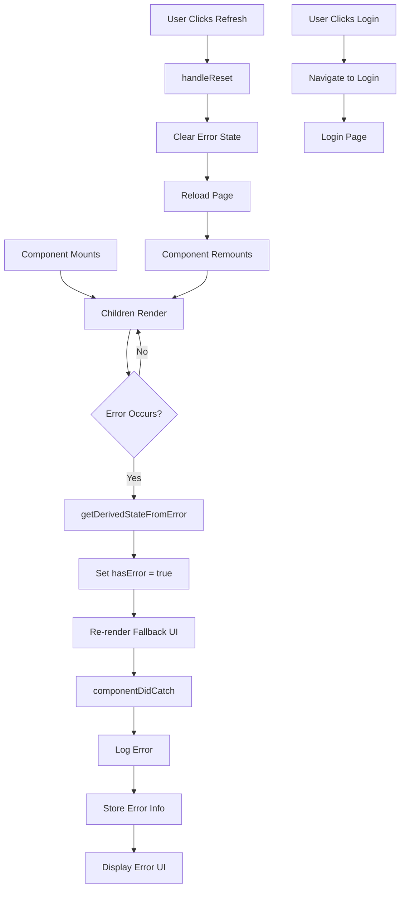

# ErrorBoundary Component
**Last Updated:** January 21, 2026  
**Version:** 1.0  
**Status:** ✅ Production Ready

---

## Overview

`ErrorBoundary` is a React class component that catches JavaScript errors anywhere in the child component tree, logs those errors, and displays a fallback UI instead of the entire app crashing. It prevents white screen of death and provides user-friendly error recovery.

---

## Purpose

Provide error handling with:
- Catch JavaScript errors in child components
- Prevent entire app from crashing
- Log errors for debugging
- Display user-friendly error UI
- Provide recovery options (refresh, login)
- Show error details (expandable)
- Dark mode support
- Automatic page refresh on reset

---

## Key Responsibilities

### 1. Error Detection
- Catch errors in child components
- Detect rendering errors
- Catch JavaScript errors
- Detect component lifecycle errors

### 2. Error Logging
- Log errors to logger
- Include component stack
- Store error info
- Track boundary name

### 3. User Experience
- Show friendly error message
- Provide recovery options
- Display error details (optional)
- Maintain app appearance

### 4. Recovery
- Refresh page on reset
- Navigate to login
- Clear error state
- Reload application

---

## Component Structure

```
ErrorBoundary
├── Children (when no error)
└── Fallback UI (when error)
    ├── Error Icon
    ├── Error Message
    ├── Error Details (expandable)
    │   ├── Error Stack
    │   └── Component Stack
    └── Recovery Actions
        ├── Refresh Page
        └── Go to Login
```

---

## Props

```javascript
{
  name: string,           // Boundary name (optional)
  children: ReactNode    // Child components (required)
}
```

### name
- **Type:** `string`
- **Default:** `'Unknown'`
- **Purpose:** Boundary identifier
- **Usage:** Logged with error for debugging
- **Example:** `'NoteEditorBoundary'`, `'ComposerBoundary'`

### children
- **Type:** `ReactNode`
- **Default:** Required
- **Purpose:** Components to wrap
- **Usage:** Any React content to protect

---

## Key Features

### 1. Error Catching

```javascript
static getDerivedStateFromError(error) {
  // Update state so next render will show fallback UI
  return { hasError: true };
}
```

**Lifecycle:**
- Called during render phase
- Updates state to show fallback UI
- Receives error object
- Returns partial state update

**Usage:**
- Set `hasError: true`
- Trigger re-render with fallback

---

### 2. Error Logging

```javascript
componentDidCatch(error, errorInfo) {
  // Log error to our logger
  logger.error('react_error_boundary', {
    componentStack: errorInfo.componentStack,
    errorBoundary: true,
    boundaryName: this.props.name || 'Unknown'
  }, error);

  // Store error info for display
  this.setState({
    error,
    errorInfo
  });
}
```

**Logged Information:**
- Error type: `'react_error_boundary'`
- Component stack: Full component tree
- Boundary name: Identifier for error boundary
- Error object: Complete error details

**Logger Integration:**
- Uses custom logger utility
- Structured logging
- Error metadata
- Debug-friendly

---

### 3. State Management

```javascript
this.state = {
  hasError: false,      // Error occurred
  error: null,          // Error object
  errorInfo: null       // React error info
};
```

**State Properties:**
- `hasError`: Boolean indicating error state
- `error`: JavaScript Error object
- `errorInfo`: React error info (componentStack)

---

### 4. Recovery Handler

```javascript
handleReset = () => {
  this.setState({
    hasError: false,
    error: null,
    errorInfo: null
  });
  
  // Optional: Reload page to clear state
  if (typeof window !== 'undefined') {
    window.location.reload();
  }
};
```

**Actions:**
1. Clear error state
2. Reset component state
3. Reload page (optional)
4. Clear all cached state

---

### 5. Fallback UI

```javascript
if (this.state.hasError) {
  const { error, errorInfo } = this.state;
  
  return (
    <div className="min-h-screen flex items-center justify-center bg-gray-50 dark:bg-gray-900 p-4">
      {/* Error UI */}
    </div>
  );
}

return this.props.children;
```

**Conditional Rendering:**
- Show fallback UI when `hasError: true`
- Show children when no error
- Clean state transition

---

## Styling

### Container

```javascript
className="min-h-screen flex items-center justify-center bg-gray-50 dark:bg-gray-900 p-4"
```

- `min-h-screen` - Minimum height: 100vh
- `flex` - Flex layout
- `items-center` - Center vertically
- `justify-center` - Center horizontally
- `bg-gray-50` - Light gray background (light mode)
- `dark:bg-gray-900` - Dark gray background (dark mode)
- `p-4` - Padding: 16px

### Error Card

```javascript
className="max-w-lg w-full bg-white dark:bg-gray-800 rounded-2xl shadow-2xl p-8 text-center"
```

- `max-w-lg` - Max width: 512px
- `w-full` - Full width (up to max)
- `bg-white` - White background (light mode)
- `dark:bg-gray-800` - Dark gray background (dark mode)
- `rounded-2xl` - Rounded corners (extra large)
- `shadow-2xl` - Extra large shadow
- `p-8` - Padding: 32px
- `text-center` - Center text

### Error Icon Container

```javascript
className="w-16 h-16 mx-auto mb-4 rounded-full bg-red-100 dark:bg-red-900/30 flex items-center justify-center"
```

- `w-16 h-16` - Size: 64px × 64px
- `mx-auto` - Center horizontally
- `mb-4` - Bottom margin: 16px
- `rounded-full` - Circular
- `bg-red-100` - Light red background (light mode)
- `dark:bg-red-900/30` - Dark red background (dark mode, 30% opacity)
- `flex items-center justify-center` - Center content

### Error Icon

```javascript
className="w-8 h-8 text-red-600 dark:text-red-400"
```

- `w-8 h-8` - Size: 32px × 32px
- `text-red-600` - Red color (light mode)
- `dark:text-red-400` - Light red color (dark mode)

### Error Details

```javascript
className="text-left bg-gray-100 dark:bg-gray-700/50 rounded-lg p-4 mb-6 text-sm"
```

- `text-left` - Left align text
- `bg-gray-100` - Light gray background (light mode)
- `dark:bg-gray-700/50` - Dark gray background (dark mode, 50% opacity)
- `rounded-lg` - Rounded corners (large)
- `p-4` - Padding: 16px
- `mb-6` - Bottom margin: 24px
- `text-sm` - Small text (14px)

### Buttons

#### Refresh Button

```javascript
className="px-6 py-2.5 bg-[var(--color-accent)] hover:brightness-110 text-white rounded-lg font-medium transition-colors shadow-lg shadow-[var(--color-accent)]/20"
```

- `px-6` - Horizontal padding: 24px
- `py-2.5` - Vertical padding: 10px
- `bg-[var(--color-accent)]` - Accent color background
- `hover:brightness-110` - Brighten on hover (110%)
- `text-white` - White text
- `rounded-lg` - Rounded corners (large)
- `font-medium` - Medium font weight
- `transition-colors` - Transition colors
- `shadow-lg` - Large shadow
- `shadow-[var(--color-accent)]/20` - Accent color shadow (20% opacity)

#### Login Button

```javascript
className="px-6 py-2.5 border border-gray-300 dark:border-gray-600 hover:bg-gray-100 dark:hover:bg-gray-700 text-gray-700 dark:text-gray-300 rounded-lg font-medium transition-colors"
```

- `border` - Border
- `border-gray-300` - Gray border (light mode)
- `dark:border-gray-600` - Dark gray border (dark mode)
- `hover:bg-gray-100` - Light gray background on hover (light mode)
- `dark:hover:bg-gray-700` - Dark gray background on hover (dark mode)
- `text-gray-700` - Gray text (light mode)
- `dark:text-gray-300` - Light gray text (dark mode)

---

## Data Flow



---

## Performance

### Optimizations

1. **Class Component**
   - No re-renders when no error
   - State updates only on error
   - Minimal overhead

2. **Error Logging**
   - Asynchronous logging
   - Non-blocking
   - Structured data

3. **Conditional Rendering**
   - Only render fallback UI when needed
   - No unnecessary DOM nodes
   - Clean state transition

4. **Page Reload**
   - Quick recovery
   - Clear all state
   - Fresh application state

---

## Accessibility

### Keyboard Navigation

- Tab to buttons
- Enter/Space to activate
- Logical tab order
- Focus management

### ARIA Attributes

Currently, the component does not use ARIA attributes. Consider adding:

```javascript
<div role="alert" aria-live="polite">
  {/* Error content */}
</div>
```

### Screen Reader Support

- Clear error message
- Actionable buttons
- Descriptive labels

---

## Usage Examples

### Basic Usage

```javascript
import ErrorBoundary from './components/ErrorBoundary'

function App() {
  return (
    <ErrorBoundary name="AppBoundary">
      <YourApp />
    </ErrorBoundary>
  )
}
```

### Wrap Specific Component

```javascript
function NoteEditor() {
  return (
    <ErrorBoundary name="NoteEditorBoundary">
      <Editor />
    </ErrorBoundary>
  )
}
```

### Wrap Multiple Boundaries

```javascript
function Dashboard() {
  return (
    <ErrorBoundary name="DashboardBoundary">
      <Header />
      <ErrorBoundary name="ContentBoundary">
        <NotesList />
      </ErrorBoundary>
      <ErrorBoundary name="SidebarBoundary">
        <Sidebar />
      </ErrorBoundary>
    </ErrorBoundary>
  )
}
```

### With Custom Error Handler

```javascript
function CustomErrorBoundary() {
  const handleReset = () => {
    // Custom reset logic
    console.log('Resetting error boundary')
    window.location.reload()
  }
  
  return (
    <ErrorBoundary name="CustomBoundary">
      <YourComponent />
    </ErrorBoundary>
  )
}
```

---

## Testing

### Unit Tests

```javascript
describe('ErrorBoundary Component', () => {
  it('should render children when no error', () => {
    // Test: children render normally
  });
  
  it('should catch errors in children', () => {
    // Test: error in child → fallback UI
  });
  
  it('should log errors', () => {
    // Test: error → logger.error called
  });
  
  it('should reset error state on refresh', () => {
    // Test: refresh → clear state → reload
  });
  
  it('should display error details', () => {
    // Test: error details shown in details element
  });
  
  it('should navigate to login', () => {
    // Test: login button → navigate
  });
});
```

### Integration Tests

```javascript
describe('ErrorBoundary Integration', () => {
  it('should prevent app crash', () => {
    // Test: error → fallback UI → app still running
  });
  
  it('should recover on refresh', () => {
    // Test: refresh → reload → normal operation
  });
});
```

### E2E Tests (Playwright)

```javascript
test('Error boundary catches error and shows fallback', async ({ page }) => {
  await page.goto('/#/notes');
  
  // Trigger error (simulate)
  await page.evaluate(() => {
    throw new Error('Test error')
  })
  
  // Verify fallback UI is visible
  await expect(page.locator('text=Something went wrong')).toBeVisible();
  
  // Verify refresh button is visible
  await expect(page.locator('text=Refresh Page')).toBeVisible();
});

test('Error boundary refresh recovers app', async ({ page }) => {
  await page.goto('/#/notes');
  
  // Trigger error
  await page.evaluate(() => {
    throw new Error('Test error')
  })
  
  // Click refresh
  await page.click('text=Refresh Page')
  
  // Wait for reload
  await page.waitForLoadState('networkidle')
  
  // Verify app is back to normal
  await expect(page.locator('text=Something went wrong')).not.toBeVisible();
});
```

---

## Troubleshooting

### Issue: Error boundary not catching errors

**Possible Causes:**
- Error in event handlers
- Async errors
- Errors during server rendering
- Errors in error boundary itself

**Solutions:**
1. Wrap event handlers with try-catch
2. Use Promise.catch() for async errors
3. Check error boundary placement
4. Test error boundary independently

---

### Issue: Error details not showing

**Possible Causes:**
- Error state not set
- Error info not stored
- CSS hiding details

**Solutions:**
1. Verify componentDidCatch is called
2. Check error and errorInfo state
3. Inspect details element visibility

---

### Issue: Page not reloading

**Possible Causes:**
- Window object undefined (SSR)
- Reload blocked
- State not clearing

**Solutions:**
1. Verify window exists
2. Check browser console for errors
3. Test reload in different browsers

---

### Issue: Logger not working

**Possible Causes:**
- Logger import error
- Logger not configured
- Logging disabled

**Solutions:**
1. Verify logger import
2. Check logger configuration
3. Test logger independently

---

## Best Practices

1. **Wrap critical sections** with error boundaries
2. **Use meaningful boundary names** for debugging
3. **Log all errors** for debugging
4. **Provide recovery options** to users
5. **Test error scenarios** regularly
6. **Keep error UI simple** and user-friendly
7. **Show error details** only in development
8. **Use multiple boundaries** for granular error handling

---

## Error Boundary Strategies

### 1. Top-Level Boundary

```javascript
<ErrorBoundary name="AppBoundary">
  <App />
</ErrorBoundary>
```

**Pros:**
- Catches all errors
- Simple setup
- Consistent error UI

**Cons:**
- Coarse-grained error handling
- May catch non-critical errors

### 2. Component-Level Boundaries

```javascript
<ErrorBoundary name="NotesBoundary">
  <NotesList />
</ErrorBoundary>

<ErrorBoundary name="SidebarBoundary">
  <Sidebar />
</ErrorBoundary>
```

**Pros:**
- Granular error handling
- Isolated failures
- Better UX

**Cons:**
- More setup
- More code maintenance

### 3. Feature-Level Boundaries

```javascript
<ErrorBoundary name="EditorBoundary">
  <Editor />
</ErrorBoundary>

<ErrorBoundary name="PreviewBoundary">
  <Preview />
</ErrorBoundary>
```

**Pros:**
- Feature-specific error handling
- Targeted recovery
- Better debugging

**Cons:**
- More boundaries to manage
- Potential for overlapping

---

## Related Components

- [ErrorMessage](./ErrorMessage.md) - Error message component

---

## Dependencies

- `react` - React (Component)
- `../utils/logger` - Logger utility

---

## Error Types Handled

### Rendering Errors
- Component render errors
- Lifecycle method errors
- Props validation errors
- State update errors

### JavaScript Errors
- Reference errors
- Type errors
- Syntax errors
- Runtime errors

### Limitations

**Not Handled:**
- Event handler errors (use try-catch)
- Async errors (use Promise.catch)
- Errors during server rendering
- Errors in error boundary itself

**Best Practices:**
- Wrap event handlers with try-catch
- Use Promise.catch() for async operations
- Test error boundary placement

---

## Production vs Development

### Production
- Show user-friendly error message
- Hide stack traces
- Provide recovery options
- Log errors for debugging

### Development
- Show detailed error information
- Display component stacks
- Show error boundaries
- Enhanced debugging

**Recommendation:** Use environment variables to toggle error details display.

---

**Component Version:** 1.0  
**Last Updated:** January 21, 2026  
**Status:** ✅ Production Ready