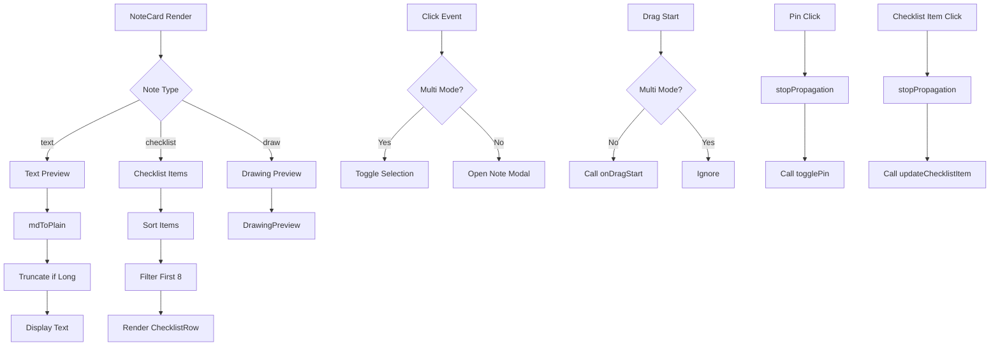

# NoteCard Component
**Last Updated:** January 24, 2026  
**Version:** 1.1  
**Status:** ✅ Production Ready

---

## Overview

`NoteCard` is the primary display component for individual notes. It renders note previews, handles interactions (click, pin, drag-and-drop), supports multiple note types (text, checklist, drawing), and provides visual feedback for multi-select mode and collaboration status.

---

## Purpose

Display individual notes with:
- Note preview (title, content, images, drawings, checklists)
- Multi-select checkbox support
- Pin/unpin functionality
- Drag-and-drop reordering
- Collaboration indicators
- Note type detection and appropriate rendering
- Tag display with truncation
- Responsive design for all screen sizes

---

## Key Responsibilities

### 1. Note Display
- Render note title
- Display content preview (text, checklist, drawing)
- Show main image with count indicator
- Display tags with truncation

### 2. Interactions
- Click to open note for editing
- Toggle pin state
- Select/deselect in multi-mode
- Drag-and-drop support

### 3. Visual Feedback
- Hover effects (scale transform)
- Selected state ring in multi-mode
- Pin button visibility on hover
- Collaboration indicator
- Background color based on note color

### 4. Type-Specific Rendering
- Text notes: Content preview with markdown stripping
- Checklist notes: Item list with completion count
- Drawing notes: Drawing preview canvas

---

## Props

```javascript
{
  n: Note,                    // Note object (required)
  multiMode: boolean,          // Multi-select mode active (default: false)
  selected: boolean,            // Note selected state (default: false)
  onToggleSelect: (id, checked) => void,  // Toggle selection handler
  disablePin: boolean,          // Disable pin button (default: false)
  onDragStart: (id, event) => void,  // Drag start handler
  onDragOver: (id, group, event) => void,  // Drag over handler
  onDragLeave: (event) => void,  // Drag leave handler
  onDrop: (id, group, event) => void,  // Drop handler
  onDragEnd: (event) => void,  // Drag end handler
}
```

---

## Note Object Structure

```javascript
{
  id: string,              // Note ID
  user_id: number,         // User ID
  type: 'text' | 'checklist' | 'draw',  // Note type
  title: string,           // Note title
  content: string,         // Note content
  items: Array<{          // Checklist items (checklist type)
    id: string,
    text: string,
    done: boolean
  }>,
  images: Array<{          // Attached images
    src: string,
    name: string
  }>,
  tags: string[],          // Note tags
  color: string,           // Note color
  pinned: boolean,         // Pin state
  archived: boolean,       // Archive state
  position: number,         // Sort position
  timestamp: string,       // Creation time
  updated_at: string,      // Last update time
  collaborators: any[],    // Collaborator data
}
```

---

## Component Structure

### Layout

```
NoteCard (draggable container)
├── Multi-Select Checkbox (when multiMode)
├── Collaboration Icon (when shared)
├── Pin Button (when !multiMode && !disablePin)
├── Title (when exists)
├── Main Image (when images.length > 0)
│   └── Image Count Badge (when > 1 image)
├── Content Preview
│   ├── Text Preview (when type = 'text')
│   ├── Drawing Preview (when type = 'draw')
│   └── Checklist Items (when type = 'checklist')
│       └── Completion Count
└── Tags (when tags.length > 0)
    └── Ellipsis Chip (when > 4 tags)
```

---

## Key Features

### 1. Multi-Select Support

```javascript
{multiMode && (
  <div className="absolute top-3 right-3">
    <div
      className={`w-6 h-6 rounded-md border-2 flex items-center justify-center ${
        selected
          ? 'bg-accent border-accent text-white'
          : 'border-gray-300 bg-white/80'
      }`}
      onClick={e => {
        e.stopPropagation()
        onToggleSelect?.(n.id, !selected)
      }}
    >
      {selected && <Checkmark />}
    </div>
  </div>
)}
```

**Behavior:**
- Shows checkbox in multi-mode
- Checked state highlights card with ring
- Click toggles selection
- Prevents note click event

---

### 2. Pin Button

```javascript
{!multiMode && !disablePin && (
  <div className="absolute top-3 right-3 opacity-0 group-hover:opacity-100">
    <button
      onClick={e => {
        e.stopPropagation()
        togglePin(n.id, !n.pinned)
      }}
      disabled={disablePin}
    >
      {n.pinned ? <PinFilled /> : <PinOutline />}
    </button>
  </div>
)}
```

**Behavior:**
- Shows on hover
- Filled icon when pinned
- Outline icon when unpinned
- Prevents note click event
- Disabled when `disablePin` prop is true

---

### 3. Collaboration Indicator

```javascript
{((n.collaborators !== undefined && n.collaborators !== null) ||
  (n.user_id && currentUser && n.user_id !== currentUser.id)) && (
  <div className="absolute bottom-3 right-3">
    <div title="Collaborated note">
      <svg>Users Icon</svg>
      <svg>Plus Badge</svg>
    </div>
  </div>
)}
```

**Behavior:**
- Shows when note has collaborators
- Shows when note belongs to different user
- Bottom-right positioning
- Visual indicator of shared content

---

### 4. Drag-and-Drop

```javascript
<div
  draggable={!multiMode}
  onDragStart={e => {
    if (!multiMode) onDragStart(n.id, e)
  }}
  onDragOver={e => {
    if (!multiMode) onDragOver(n.id, group, e)
  }}
  onDragLeave={e => {
    if (!multiMode) onDragLeave(e)
  }}
  onDrop={e => {
    if (!multiMode) onDrop(n.id, group, e)
  }}
  onDragEnd={e => {
    if (!multiMode) onDragEnd(e)
  }}
>
  {/* Card content */}
</div>
```

**Behavior:**
- Draggable only in normal mode (not multi-mode)
- All drag handlers check multi-mode
- Passes note ID and group to handlers
- Prevents drag in multi-select mode

---

### 5. Click Handler

The click handler has been updated to properly open notes in the composer modal. The click event is now handled on the content wrapper instead of the outer card container to ensure proper event propagation.

**Behavior:**
- Multi-mode: Toggle selection
- Normal mode: Open note for editing in composer
- Validates `openNote` is a function from ModalContext
- Logs error if not function
- Proper event propagation handling

**Note:** As of v1.1, the click handler is attached to the content wrapper to prevent conflicts with drag-and-drop and ensure reliable note opening.

---

### 6. Note Type Rendering

#### Text Notes
```javascript
{!isChecklist && !isDraw ? (
  <div className="text-sm break-words whitespace-pre-wrap">
    {displayText}
  </div>
) : /* other types */}
```

**Features:**
- Markdown to plain text conversion
- Character limit (600 chars)
- Truncation with ellipsis
- **Full content display (no line clamping as of v1.1)**
- Word wrapping

**Note:** As of v1.1, the `line-clamp-6` class has been removed to allow full content display within the card boundaries. Content is now managed by overflow handling in the parent NotesView component.

---

#### Checklist Notes
```javascript
{isChecklist ? (
  <div className="space-y-2">
    {visibleItems.map(it => (
      <ChecklistRow
        key={it.id}
        item={it}
        size="md"
        readOnly={true}
        showRemove={false}
        onToggle={async (checked, e) => {
          e?.stopPropagation()
          await updateChecklistItem(n.id, it.id, checked)
        }}
      />
    ))}
    {extraCount > 0 && (
      <div>+{extraCount} more…</div>
    )}
    <div>{done}/{total} completed</div>
  </div>
) : /* other types */}
```

**Features:**
- Show first 8 items
- Sort by completion (done items last)
- Interactive checkboxes (click to toggle)
- Extra items count indicator
- Completion ratio display

---

#### Drawing Notes
```javascript
{isDraw ? (
  <DrawingPreview
    data={n.content}
    width={100}
    height={150}
    darkMode={dark}
  />
) : /* other types */}
```

**Features:**
- Canvas-based preview
- Responsive dimensions
- Dark mode color conversion
- Path data rendering

---

### 7. Tags Display

```javascript
{!!displayTags.length && (
  <div className="mt-4 text-xs flex flex-wrap gap-2">
    {displayTags.map(tag => (
      <span key={tag} className="bg-gray-200 text-gray-700 dark:bg-gray-700 dark:text-gray-200 text-xs font-medium px-2.5 py-0.5 rounded-full">
        {tag}
      </span>
    ))}
    {showEllipsisChip && (
      <span className="bg-gray-200 text-gray-700 dark:bg-gray-700 dark:text-gray-200 text-xs font-medium px-2.5 py-0.5 rounded-full">
        …
      </span>
    )}
  </div>
)}
```

**Features:**
- Show max 4 tags
- Truncate with ellipsis
- Rounded pill style
- Dark mode support
- Responsive flex layout

---

### 8. Image Display

```javascript
{mainImg && (
  <div className="mb-3 relative overflow-hidden rounded-lg">
    
    {imgs.length > 1 && (
      <span className="absolute bottom-2 right-2 text-xs bg-black/60 text-white px-2 py-0.5 rounded-full">
        +{imgs.length - 1} more
      </span>
    )}
  </div>
)}
```

**Features:**
- First image as main display
- Fixed height (40 units)
- Object-cover for aspect ratio
- Badge for additional images
- Rounded corners

---

## Helper Functions

### mdToPlain

```javascript
const mdToPlain = md => {
  if (!md || typeof md !== 'string') return ''
  
  const text = md
    .replace(/^#{1,6}\s+(.+)$/gm, '$1')           // Remove headings
    .replace(/\*\*(.+?)\*\*/g, '$1')              // Remove bold
    .replace(/\*(.+?)\*/g, '$1')                  // Remove italic
    .replace(/__(.+?)__/g, '$1')                  // Remove bold (alt)
    .replace(/_(.+?)_/g, '$1')                    // Remove italic (alt)
    .replace(/```[\s\S]*?```/g, '')               // Remove code blocks
    .replace(/`([^`]+)`/g, '$1')                  // Remove inline code
    .replace(/\[(.+?)\]\(.+?\)/g, '$1')         // Remove links
    .replace(/>\s(.+?)$/gm, '$1')                 // Remove blockquotes
    .replace(/\n{3,}/g, '\n\n')                 // Reduce newlines
  
  return text
}
```

**Purpose:** Convert markdown to plain text for preview

**Stripped Elements:**
- Headings (保留文本)
- Bold formatting
- Italic formatting
- Code blocks
- Inline code
- Links (保留文本)
- Blockquotes (保留文本)

---

## State Management

### Context Consumption

```javascript
// Modal Context
const { openNote } = useModal()

// Notes Context
const { togglePin, updateChecklistItem } = useNotes()

// Auth Context
const { currentUser } = useAuth()

// Settings Context
const { dark, cardTransparency } = useSettings()

// UI Context
const { isOnline } = useUI()
```

---

## Derived State

```javascript
// Note type detection
const isChecklist = n.type === 'checklist'
const isDraw = n.type === 'draw'

// Content preview
const previewText = useMemo(() => mdToPlain(n.content || ''), [n.content])
const MAX_CHARS = 600
const isLong = previewText.length > MAX_CHARS
const displayText = isLong ? previewText.slice(0, MAX_CHARS).trimEnd() + '…' : previewText

// Checklist statistics
const total = (n.items || []).length
const done = (n.items || []).filter(i => i.done).length
const sortedItems = (n.items || []).sort((a, b) => {
  if (a.done === b.done) return 0
  return a.done ? 1 : -1  // Undone items first
})
const visibleItems = sortedItems.slice(0, 8)
const extraCount = total > visibleItems.length ? total - visibleItems.length : 0

// Images
const imgs = n.images || []
const mainImg = imgs[0]

// Tags
const MAX_TAG_CHIPS = 4
const allTags = Array.isArray(n.tags) ? n.tags : []
const showEllipsisChip = allTags.length > MAX_TAG_CHIPS
const displayTags = allTags.slice(0, MAX_TAG_CHIPS)

// Group for drag-and-drop
const group = n.pinned ? 'pinned' : 'others'
```

---

## Styling

### Card Container

```javascript
className={`note-card glass-card rounded-xl p-4 mb-6 cursor-pointer transform hover:scale-[1.02] transition-transform duration-200 relative min-h-[54px] group ${
  multiMode && selected ? 'ring-2 ring-accent ring-offset-2 ring-offset-transparent' : ''
}`}
style={{
  backgroundColor: bgFor(n.color || 'default', dark, cardTransparency),
}}
```

**Classes:**
- `glass-card` - Glassmorphism effect
- `rounded-xl` - Rounded corners
- `p-4` - Padding
- `mb-6` - Bottom margin
- `cursor-pointer` - Clickable
- `transform` - Hover scale effect
- `group` - For child hover effects
- `ring-2` - Selection ring (when selected)

---

## Data Flow



---

## Responsive Design

### Mobile Considerations
- Optimized touch targets
- Readable text sizes
- Proper spacing on small screens
- Image responsive sizing

### Desktop Considerations
- Hover effects enabled
- Larger click areas
- More content visible

---

## Accessibility

### Keyboard Navigation
- Note card is focusable via drag
- Checkbox in multi-mode
- Pin button has proper focus
- Checklist items are interactive

### Screen Readers
- Semantic HTML structure
- ARIA labels on buttons
- Alt text on images
- Meaningful text content

### Focus Management
- Visible focus indicators
- Tab order maintained
- Focus trap in modals (opened by click)

---

## Performance Optimizations

### 1. useMemo
```javascript
const previewText = useMemo(() => mdToPlain(n.content || ''), [n.content])
```

**Purpose:** Only recompute preview when content changes

### 2. Memoized Helper
```javascript
// Helper function (not memoized but simple)
const mdToPlain = md => { /* ... */ }
```

### 3. Conditional Rendering
- Only render checklist items when needed
- Only show images when present
- Only show tags when array has items

### 4. Truncation
- Limit character count
- Limit visible items
- Limit visible tags

---

## Testing

### Unit Tests

```javascript
describe('NoteCard Component', () => {
  it('should render text note preview', () => {
    // Test text rendering
  });
  
  it('should render checklist items', () => {
    // Test checklist rendering
  });
  
  it('should render drawing preview', () => {
    // Test drawing rendering
  });
  
  it('should show pin button on hover', () => {
    // Test pin visibility
  });
  
  it('should show checkbox in multi-mode', () => {
    // Test multi-select
  });
  
  it('should truncate long content', () => {
    // Test content truncation
  });
  
  it('should display tags', () => {
    // Test tag display
  });
  
  it('should show collaboration indicator', () => {
    // Test shared note indicator
  });
});
```

### Integration Tests

```javascript
describe('NoteCard Integration', () => {
  it('should open note on click', () => {
    // Test: click -> open modal
  });
  
  it('should toggle pin', () => {
    // Test: pin click -> update state
  });
  
  it('should toggle checklist item', () => {
    // Test: item click -> update item
  });
  
  it('should handle drag start', () => {
    // Test: drag -> call handler
  });
});
```

### E2E Tests (Playwright)

```javascript
test('Note interactions', async ({ page }) => {
  await page.goto('/#/notes');
  
  // Click note to open
  await page.click('[data-testid="note-1"]');
  await expect(page.locator('[data-testid="note-modal"]')).toBeVisible();
  
  // Pin note
  await page.hover('[data-testid="note-1"]');
  await page.click('[data-testid="pin-button"]');
  await expect(page.locator('[data-testid="note-1"] [data-testid="pin-icon"]')).toHaveAttribute('fill');
  
  // Toggle checklist item
  await page.click('[data-testid="checklist-item-1"] [data-testid="checkbox"]');
  await expect(page.locator('[data-testid="checklist-item-1"]')).toHaveClass(/done/);
});
```

---

## Troubleshooting

### Issue: Note not opening on click

**Possible Causes:**
- `openNote` not a function
- Click event not propagated
- Multi-mode interfering
- Click handler attached to wrong element

**Solutions:**
1. Verify `openNote` from modal context is a function
2. Check event propagation in content wrapper
3. Verify multi-mode state
4. Check console for errors
5. Ensure click handler is on content wrapper (v1.1+)

---

### Issue: Drag not working

**Possible Causes:**
- Multi-mode active
- Handlers not connected
- Draggable attribute missing

**Solutions:**
1. Verify multi-mode is false
2. Check drag handlers are passed
3. Verify draggable attribute is set
4. Test onDragStart handler

---

### Issue: Pin button not showing

**Possible Causes:**
- `disablePin` prop is true
- CSS hiding button
- Group hover not working

**Solutions:**
1. Check `disablePin` prop value
2. Verify hover CSS is active
3. Check opacity transitions
4. Test with different browsers

---

### Issue: Tags not displaying

**Possible Causes:**
- Tags array empty
- Tags not array
- CSS hiding tags

**Solutions:**
1. Verify `n.tags` is array
2. Check tags array has items
3. Verify CSS for tag display
4. Test with different tag values

---

### Issue: Content preview too long or overflowing

**Possible Causes:**
- Truncation not working
- MAX_CHARS too high
- Markdown conversion failing
- Overflow CSS not properly configured

**Solutions:**
1. Verify MAX_CHARS constant (should be 600)
2. Check slice logic
3. Test mdToPlain function
4. Verify text wrapping CSS
5. Check parent NotesView overflow handling (v1.1+)

**Note:** As of v1.1, content overflow is managed by the NotesView component through proper CSS overflow handling on the `.note-content` class. The NoteCard no longer applies line clamping.

---

## Related Components

- [DrawingPreview](./DrawingPreview.md) - Drawing preview canvas
- [ChecklistRow](./ChecklistRow.md) - Checklist item component
- [Modal](./Modal.md) - Note edit modal
- [NotesView](./NotesView.md) - Parent component

---

## Related Contexts

- [ModalContext](../contexts/ModalContext.md) - Modal state and openNote
- [NotesContext](../contexts/NotesContext.md) - Note operations
- [AuthContext](../contexts/AuthContext.md) - Current user
- [SettingsContext](../contexts/SettingsContext.md) - Dark mode, transparency
- [UIContext](../contexts/UIContext.md) - Online status

---

## Best Practices

1. **Always memoize expensive computations**
2. **Stop propagation on nested clicks**
3. **Validate functions before calling**
4. **Provide meaningful alt text**
5. **Use proper semantic HTML**
6. **Handle empty states gracefully**
7. **Maintain consistent spacing**
8. **Optimize for accessibility**


---

**Component Version:** 1.1  
**Last Updated:** January 24, 2026  
**Status:** ✅ Production Ready
