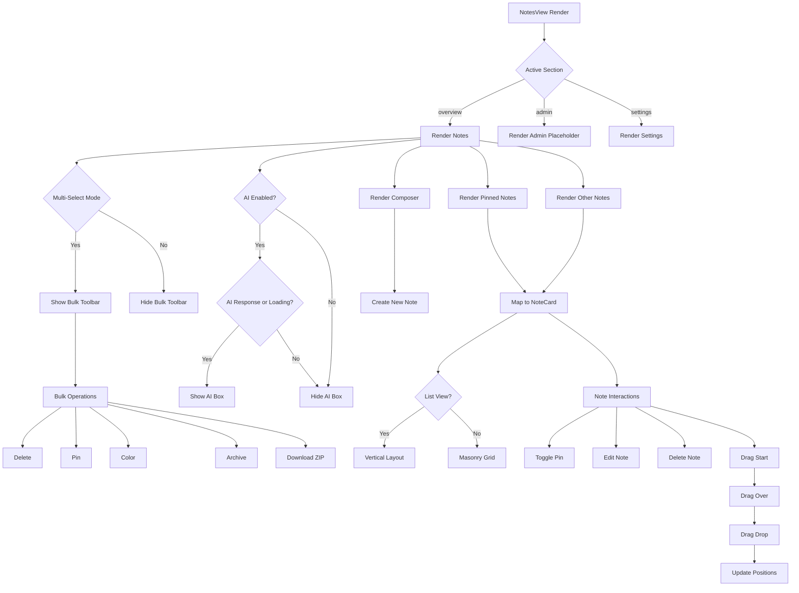

# NotesView Component
**Last Updated:** January 21, 2026  
**Version:** 1.0  
**Status:** ✅ Production Ready

---

## Overview

`NotesView` is the main interface for viewing and managing notes. It provides a comprehensive dashboard with note lists, bulk operations, AI assistant integration, drag-and-drop reordering, and multiple view modes.

---

## Purpose

Provide the primary user interface for:
- Viewing notes in list or masonry layout
- Managing note collections (pinned, others)
- Bulk operations (delete, pin, color, archive, download)
- Creating new notes via Composer
- AI assistant integration
- Drag-and-drop note reordering
- Background customization
- Search and tag filtering

---

## Key Responsibilities

### 1. Note Display
- Render pinned notes in dedicated section
- Render unpinned notes in main section
- Support list and masonry view modes
- Show empty states appropriately

### 2. Bulk Operations
- Multi-select mode for notes
- Bulk delete with confirmation
- Bulk pin/unpin operations
- Bulk color changes
- Bulk archive/unarchive
- Bulk download as ZIP

### 3. AI Assistant
- Display AI responses
- Show loading progress
- Markdown rendering for responses
- Clear response functionality

### 4. Drag-and-Drop
- Note reordering support
- Drag start/over/leave/drop/end handlers
- Position-based reordering

### 5. Background Management
- Golden gradient background
- Custom image backgrounds
- Dark/light mode overlays
- Overlay opacity control

---

## State Management

### Context Consumption

```javascript
// Auth Context
const { currentUser, signOut } = useAuth()

// Notes Context
const {
  pinned,              // Pinned notes array
  others,              // Unpinned notes array
  setSearch,           // Set search query
  tagFilter,           // Active tag filter
  setTagFilter,         // Set tag filter
  tagsWithCounts,       // Tags with note counts
  notesLoading,         // Loading state
  filteredEmptyWithSearch, // No matches found
  allEmpty,            // No notes at all
  onDragStart,         // Drag start handler
  onDragOver,          // Drag over handler
  onDragLeave,         // Drag leave handler
  onDrop,             // Drop handler
  onDragEnd,           // Drag end handler
  togglePin,           // Toggle pin state
  multiMode,           // Multi-select mode active
  selectedIds,         // Selected note IDs
  onExitMulti,         // Exit multi-select
  onToggleSelect,      // Toggle note selection
  onBulkDelete,        // Bulk delete action
  onBulkPin,           // Bulk pin action
  onBulkArchive,       // Bulk archive action
  onBulkColor,         // Bulk color action
  onBulkDownloadZip,   // Bulk download ZIP
  onUpdateChecklistItem, // Update checklist item
  isOnline,            // Online status
} = useNotes()

// Settings Context
const {
  dark,                // Dark mode active
  backgroundImage,      // Background image ID
  backgroundOverlay,    // Show overlay
  cardTransparency,     // Card transparency level
  listView,            // List view mode
  localAiEnabled,       // AI assistant enabled
  overlayOpacity,       // Overlay opacity
} = useSettings()

// UI Context
const {
  headerMenuOpen,       // Header menu open
  setHeaderMenuOpen,    // Set header menu
  aiResponse,           // AI response text
  setAiResponse,        // Set AI response
  isAiLoading,         // AI loading state
  aiLoadingProgress,    // AI loading progress %
  onAiSearch,          // Trigger AI search
} = useUI()

// Modal Context
const { openModal } = useModal()
```

### Local State

```javascript
// Active section (overview, admin, settings)
const [activeSection, setActiveSection] = useState('overview')

// Multi-color button ref for popover
const multiColorBtnRef = useRef(null)

// Multi-color popover open state
const [showMultiColorPop, setShowMultiColorPop] = useState(false)
```

---

## Derived State

```javascript
// Tag label for display
const tagLabel =
  tagFilter === ALL_IMAGES
    ? 'All Images'
    : tagFilter === 'ARCHIVED'
      ? 'Archived Notes'
      : tagFilter

// Dashboard title based on section
const dashboardTitle =
  activeSection === 'overview'
    ? tagLabel || 'All Notes'
    : activeSection.charAt(0).toUpperCase() + activeSection.slice(1).replace('-', ' ')

// Current background object
const currentBg = useMemo(
  () => BACKGROUNDS.find(b => b.id === backgroundImage),
  [backgroundImage]
)
```

---

## Component Structure

### Layout

```
NotesView
├── Golden Gradient Background (conditional)
├── Image Background (conditional)
│   ├── Background Image
│   └── Dark Mode Overlay
├── DashboardLayout
│   ├── Header (via props)
│   │   ├── User profile
│   │   ├── Search
│   │   ├── Tags
│   │   └── Sign out
│   ├── Sidebar (via props)
│   └── Main Content
│       └── pb-20 Container
│           ├── Multi-Select Toolbar (when multiMode)
│           ├── AI Response Box (when localAiEnabled)
│           ├── Composer (create note)
│           └── Notes Lists
│               ├── Pinned Section (when pinned.length > 0)
│               └── Others Section (when others.length > 0)
└── Settings Panel (global)
```

---

## Key Features

### 1. Multi-Select Mode

```javascript
{multiMode && (
  <div className="p-3 sm:p-4 flex items-center justify-between sticky top-0 z-[50] glass-card">
    <div className="flex items-center gap-2 flex-wrap">
      {/* Download ZIP */}
      <button onClick={onBulkDownloadZip}>Download (.zip)</button>
      
      {/* Delete */}
      <button onClick={onBulkDelete}>Delete</button>
      
      {/* Color Picker */}
      <button 
        ref={multiColorBtnRef}
        onClick={() => setShowMultiColorPop(v => !v)}
      >🎨 Color</button>
      
      {/* Color Popover */}
      <Popover
        anchorRef={multiColorBtnRef}
        open={showMultiColorPop}
        onClose={() => setShowMultiColorPop(false)}
      >
        <ColorDots />
      </Popover>
      
      {/* Pin (not in archived view) */}
      {tagFilter !== 'ARCHIVED' && (
        <button onClick={() => onBulkPin(true)}>Pin</button>
      )}
      
      {/* Archive */}
      <button onClick={onBulkArchive}>
        {tagFilter === 'ARCHIVED' ? 'Unarchive' : 'Archive'}
      </button>
      
      {/* Selection Count */}
      <span>Selected: {selectedIds.length}</span>
    </div>
    
    {/* Exit Multi-Select */}
    <button onClick={onExitMulti}>Close</button>
  </div>
)}
```

---

### 2. AI Assistant

```javascript
{localAiEnabled && (aiResponse || isAiLoading) && (
  <div className="glass-card rounded-xl shadow-lg p-5 border border-accent/30">
    {/* Loading Progress */}
    {isAiLoading && (
      <div
        className="h-1 bg-accent transition-all duration-300"
        style={{ width: `${aiLoadingProgress}%` }}
      />
    )}
    
    {/* Header */}
    <div className="flex items-center gap-2 mb-3">
      <Sparkles />
      <h3>AI Assistant</h3>
      
      {/* Clear Button */}
      {aiResponse && !isAiLoading && (
        <button onClick={() => {
          setAiResponse(null)
          setSearch('')
        }}>
          <CloseIcon />
        </button>
      )}
    </div>
    
    {/* Content */}
    <div className="prose prose-sm">
      {isAiLoading ? (
        <p className="animate-pulse">
          AI Assistant is thinking...
        </p>
      ) : (
        <div dangerouslySetInnerHTML={{ __html: safeAiMarkdown(aiResponse) }} />
      )}
    </div>
  </div>
)}
```

---

### 3. Composer Integration

```javascript
<div className="px-4 sm:px-6 md:px-8 lg:px-12">
  <div className="max-w-2xl mx-auto">
    <Composer />
  </div>
</div>
```

**Purpose:** Create new notes from the main view

---

### 4. Notes Lists

```javascript
{/* Pinned Notes */}
{pinned.length > 0 && (
  <section className="mb-10">
    <h2>Pinned</h2>
    <div className={listView ? 'max-w-2xl mx-auto space-y-6' : 'masonry-grid'}>
      {pinned.map(n => (
        <NoteCard
          key={n.id}
          n={n}
          multiMode={multiMode}
          selected={selectedIds.includes(String(n.id))}
          onToggleSelect={onToggleSelect}
          disablePin={touchDevice || archivedView}
          onDragStart={onDragStart}
          onDragOver={onDragOver}
          onDragLeave={onDragLeave}
          onDrop={onDrop}
          onDragEnd={onDragEnd}
        />
      ))}
    </div>
  </section>
)}

{/* Other Notes */}
{others.length > 0 && (
  <section>
    {pinned.length > 0 && <h2>Others</h2>}
    <div className={listView ? 'max-w-2xl mx-auto space-y-6' : 'masonry-grid'}>
      {others.map(n => (
        <NoteCard
          key={n.id}
          n={n}
          multiMode={multiMode}
          selected={selectedIds.includes(String(n.id))}
          onToggleSelect={onToggleSelect}
          disablePin={touchDevice || archivedView}
          onDragStart={onDragStart}
          onDragOver={onDragOver}
          onDragLeave={onDragLeave}
          onDrop={onDrop}
          onDragEnd={onDragEnd}
        />
      ))}
    </div>
  </section>
)}
```

---

### 5. Empty States

```javascript
{/* Loading State */}
{notesLoading && pinned.length + others.length === 0 && (
  <p>Loading Notes...</p>
)}

{/* No Results */}
{!notesLoading && filteredEmptyWithSearch && (
  <p>No matching notes found.</p>
)}

{/* No Notes */}
{!notesLoading && allEmpty && (
  <p>No notes yet. Add one to get started!</p>
)}
```

---

### 6. Background Rendering

#### Golden Gradient
```javascript
{backgroundImage === 'golden_gradient' && (
  <div className="fixed inset-0 z-[-1]">
    <div style={{
      background: `
        radial-gradient(circle at 15% 50%, rgba(251, 191, 36, 0.2), transparent 30%),
        radial-gradient(circle at 85% 30%, rgba(253, 224, 71, 0.15), transparent 30%),
        linear-gradient(to bottom, #FFFBEB, #FEF3C7, #FDE68A)
      `
    }} />
    {backgroundOverlay && <Overlay />}
  </div>
)}
```

#### Image Background
```javascript
{currentBg && currentBg.paths?.desktop && (
  <div className="fixed inset-0 z-[-1]">
    
    {backgroundOverlay && <Overlay />}
    {dark && !backgroundOverlay && <div className="absolute inset-0 bg-black/40" />}
  </div>
)}
```

---

## Data Flow



---

## View Modes

### List View
```javascript
<div className="max-w-2xl mx-auto space-y-6">
  {/* Notes stacked vertically */}
</div>
```

**Characteristics:**
- Vertical stacking
- Fixed max-width
- Consistent spacing
- Better for long notes

### Masonry View
```javascript
<div className="masonry-grid">
  {/* Notes in responsive grid */}
</div>
```

**Characteristics:**
- Responsive columns
- Variable card heights
- Efficient use of space
- Better for visual browsing

---

## Effects

### Scroll to Close Header Menu

```javascript
useEffect(() => {
  if (!headerMenuOpen) return

  const handleScroll = () => setHeaderMenuOpen(false)
  const scrollContainer = document.querySelector('.min-h-screen')

  const cleanup = () => {
    if (scrollContainer) {
      scrollContainer.removeEventListener('scroll', handleScroll)
    }
    window.removeEventListener('scroll', handleScroll)
  }

  if (scrollContainer) {
    scrollContainer.addEventListener('scroll', handleScroll, { passive: true })
  } else {
    window.addEventListener('scroll', handleScroll, { passive: true })
  }

  return cleanup
}, [headerMenuOpen, setHeaderMenuOpen])
```

**Purpose:** Close header menu when user scrolls

---

## Props to DashboardLayout

```javascript
<DashboardLayout
  activeSection={activeSection}
  onNavigate={setActiveSection}
  user={currentUser}
  onSearch={setSearch}
  tags={tagsWithCounts}
  onTagSelect={setTagFilter}
  activeTag={tagFilter}
  isAdmin={currentUser?.is_admin}
  title={dashboardTitle}
  onSignOut={signOut}
>
  {/* Main Content */}
</DashboardLayout>
```

---

## Props to NoteCard

```javascript
<NoteCard
  key={n.id}
  n={n}                          // Note object
  multiMode={multiMode}           // Multi-select mode active
  selected={selectedIds.includes(String(n.id))}  // Note selected
  onToggleSelect={onToggleSelect} // Toggle selection handler
  disablePin={touchDevice || archivedView}  // Disable pin button
  onDragStart={onDragStart}       // Drag start handler
  onDragOver={onDragOver}         // Drag over handler
  onDragLeave={onDragLeave}       // Drag leave handler
  onDrop={onDrop}                 // Drop handler
  onDragEnd={onDragEnd}           // Drag end handler
/>
```

---

## Responsive Design

### Breakpoints
- **Mobile** (`< sm`): 2 column padding
- **Tablet** (`sm`): 3 column padding
- **Desktop** (`md`): 4 column padding
- **Large Desktop** (`lg`): 5 column padding
- **X-Large** (`xl`): 6 column padding

### Mobile Considerations
- Touch device detection
- Disabled pin button on touch
- Simplified UI layout
- Optimized tap targets

---

## Performance Optimizations

### 1. Memoization
```javascript
const currentBg = useMemo(
  () => BACKGROUNDS.find(b => b.id === backgroundImage),
  [backgroundImage]
)
```

### 2. Passive Event Listeners
```javascript
addEventListener('scroll', handleScroll, { passive: true })
```

### 3. Conditional Rendering
- Only render AI box when enabled
- Only show bulk toolbar in multi-mode
- Lazy loading of images

### 4. Key Props
- Stable keys for note lists
- Prevent unnecessary re-renders

---

## Accessibility

### Keyboard Navigation
- Tab order maintained
- Focus visible on interactive elements
- Escape key closes modals

### Screen Readers
- Semantic HTML structure
- ARIA labels on buttons
- Proper heading hierarchy

### Focus Management
- Focus trap in modals
- Focus restoration after close
- Visible focus indicators

---

## Testing

### Unit Tests

```javascript
describe('NotesView Component', () => {
  it('should render pinned notes section', () => {
    // Test pinned notes display
  });
  
  it('should render other notes section', () => {
    // test other notes display
  });
  
  it('should show bulk toolbar in multi-mode', () => {
    // Test bulk toolbar rendering
  });
  
  it('should show AI response when enabled', () => {
    // Test AI box rendering
  });
  
  it('should render composer', () => {
    // Test composer presence
  });
});
```

### Integration Tests

```javascript
describe('NotesView Integration', () => {
  it('should complete bulk delete flow', () => {
    // Test: select notes -> delete -> confirm
  });
  
  it('should complete bulk color flow', () => {
    // Test: select notes -> color -> apply
  });
  
  it('should drag and reorder notes', () => {
    // Test: drag note -> drop -> reorder
  });
});
```

### E2E Tests (Playwright)

```javascript
test('Bulk operations', async ({ page }) => {
  await page.goto('/#/notes');
  
  // Enter multi-select mode
  await page.click('[data-testid="start-multi-select"]');
  
  // Select notes
  await page.click('[data-testid="note-1"] [data-testid="checkbox"]');
  await page.click('[data-testid="note-2"] [data-testid="checkbox"]');
  
  // Bulk delete
  await page.click('[data-testid="bulk-delete"]');
  await page.click('[data-testid="confirm-delete"]');
  
  // Verify deletion
  await expect(page.locator('[data-testid="note-1"]')).not.toBeVisible();
});
```

---

## Troubleshooting

### Issue: Bulk operations not working

**Possible Causes:**
- Multi-mode not active
- No notes selected
- Handler not connected

**Solutions:**
1. Verify multiMode state is true
2. Check selectedIds array has values
3. Ensure handlers are passed correctly
4. Test with console logs

---

### Issue: Notes not reordering on drag

**Possible Causes:**
- Drag handlers not attached
- Position calculation error
- State not updating

**Solutions:**
1. Verify drag handlers are connected
2. Check position calculation logic
3. Ensure dragEnd updates state
4. Test drag sequence in console

---

### Issue: AI response not showing

**Possible Causes:**
- AI disabled in settings
- Response not in state
- Markdown rendering error

**Solutions:**
1. Check localAiEnabled setting
2. Verify aiResponse state is set
3. Test safeAiMarkdown function
4. Check console for errors

---

### Issue: Background not displaying

**Possible Causes:**
- Background ID invalid
- Image path missing
- CSS z-index issue

**Solutions:**
1. Verify backgroundImage ID
2. Check background paths in BACKGROUNDS
3. Verify CSS z-index is -1
4. Test with different backgrounds

---

## Related Components

- [DashboardLayout](./DashboardLayout.md) - Main layout wrapper
- [NoteCard](./NoteCard.md) - Individual note display
- [Composer](./Composer.md) - Note creation interface
- [SettingsPanel](./SettingsPanel.md) - Settings interface
- [Popover](./Popover.md) - Color picker popover
- [ColorDot](./ColorDot.md) - Color selection dot

---

## Related Contexts

- [NotesContext](../contexts/NotesContext.md) - Notes state and operations
- [SettingsContext](../contexts/SettingsContext.md) - View preferences
- [UIContext](../contexts/UIContext.md) - AI assistant state
- [AuthContext](../contexts/AuthContext.md) - User authentication

---

## Best Practices

1. **Always memoize expensive computations**
2. **Use passive event listeners for scroll**
3. **Provide stable keys for lists**
4. **Handle empty states gracefully**
5. **Optimize for mobile touch**
6. **Disable pins in archived view**
7. **Show loading states appropriately**
8. **Use semantic HTML structure**

---

**Component Version:** 1.0  
**Last Updated:** January 21, 2026  
**Status:** ✅ Production Ready