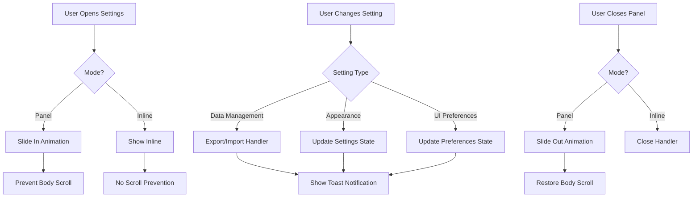

# SettingsPanel Component
**Last Updated:** January 21, 2026  
**Version:** 1.0  
**Status:** ✅ Production Ready

---

## Overview

`SettingsPanel` is a comprehensive settings interface that supports both inline and slide-out panel modes. It provides data management (export/import), appearance customization (themes, backgrounds, colors), and UI preferences (dark mode, AI, layout options).

---

## Purpose

Provide comprehensive settings management with:
- Data export/import (JSON, Google Keep, Markdown)
- Theme presets and customization
- Background image selection
- Accent color picker
- Card transparency controls
- UI preferences toggles
- Inline and panel modes
- Dark mode support
- AI assistant configuration

---

## Key Responsibilities

### 1. Data Management
- Export all notes as JSON
- Import notes from JSON
- Import Google Keep notes
- Import Markdown files
- Download encryption key

### 2. Appearance Customization
- Theme presets (predefined combinations)
- Accent color selection
- Card transparency levels
- Background images
- Background overlay controls
- Dark mode toggle

### 3. UI Preferences
- Dark mode toggle
- Local AI assistant enable/disable
- List view toggle
- Sidebar visibility preferences

### 4. User Experience
- Inline or panel modes
- Smooth animations
- Confirmation dialogs
- Toast notifications
- Responsive design
- Visual previews

---

## Component Structure

```
SettingsPanel
├── Mode Selection
│   ├── Inline Mode (embedded)
│   └── Panel Mode (slide-out)
├── Header (panel mode only)
│   ├── Settings icon
│   ├── Title
│   └── Close button
├── Settings Sections
│   ├── Data Management
│   │   ├── Export ALL notes
│   │   ├── Import notes (.json)
│   │   ├── Import Google Keep
│   │   ├── Import Markdown
│   │   └── Download secret key
│   ├── Appearance
│   │   ├── Theme Presets
│   │   ├── Accent Color Picker
│   │   ├── Card Transparency Picker
│   │   └── Background Selection
│   │       ├── Default/None
│   │       ├── Golden Gradient
│   │       └── Wallpapers
│   └── UI Preferences
│       ├── Dark Mode Toggle
│       ├── Local AI Assistant Toggle
│       ├── List View Toggle
│       └── Sidebar Visibility Toggle
└── Hidden File Inputs
    ├── Import JSON input
    ├── Import Google Keep input
    └── Import Markdown input
```

---

## Props

```javascript
{
  inline: boolean,           // Inline mode (default: false)
  open: boolean,             // Panel open state (default: undefined, uses context)
  onClose: () => void,       // Close handler (default: context handler)
}
```

### inline
- **Type:** `boolean`
- **Default:** `false`
- **Purpose:** Enable inline mode
- **Usage:** Embed in page instead of slide-out panel

### open
- **Type:** `boolean`
- **Default:** `undefined` (uses context value)
- **Purpose:** Control panel open state
- **Usage:** Override context state when provided

### onClose
- **Type:** `() => void`
- **Default:** Context handler
- **Purpose:** Handle panel close
- **Usage:** Custom close handler

---

## Context Dependencies

### useSettings
```javascript
const {
  dark,                           // Dark mode state
  toggleDark,                    // Toggle dark mode
  backgroundImage,               // Current background ID
  setBackgroundImage,            // Set background ID
  backgroundOverlay,             // Background overlay enabled
  setBackgroundOverlay,          // Toggle background overlay
  accentColor,                   // Current accent color ID
  setAccentColor,                // Set accent color
  cardTransparency,              // Current transparency ID
  setCardTransparency,           // Set transparency
  alwaysShowSidebarOnWide,       // Sidebar visibility preference
  setAlwaysShowSidebarOnWide,     // Toggle sidebar visibility
  localAiEnabled,                // AI assistant enabled
  setLocalAiEnabled,             // Toggle AI assistant
  listView,                      // List view enabled
  toggleListView,                // Toggle list view
  overlayOpacity,                // Overlay opacity (0.3-1.0)
  setOverlayOpacity,             // Set overlay opacity
} = useSettings()
```

### useUI
```javascript
const {
  settingsPanelOpen,             // Panel open state
  setSettingsPanelOpen,          // Set panel open state
  showToast,                     // Show toast notification
  showGenericConfirm,            // Show confirmation dialog
} = useUI()
```

### useNotes
```javascript
const {
  exportAllNotes,                // Export all notes to JSON
  importNotes,                   // Import notes from JSON
  importGoogleKeep,             // Import Google Keep notes
  importMarkdown,                // Import Markdown files
  downloadSecretKey,             // Download encryption key
} = useNotes()
```

---

## Key Features

### 1. Display Modes

#### Panel Mode (Default)

```javascript
<div className={`fixed top-0 right-0 z-50 h-full w-full sm:w-96 shadow-2xl transition-transform duration-200 ${open ? 'translate-x-0' : 'translate-x-full'}`}>
  {/* Content */}
</div>
```

**Features:**
- Fixed positioning (top, right)
- Slide-in animation
- Backdrop overlay
- Close button
- 384px width on desktop, full width on mobile
- Smooth transitions (200ms)

#### Inline Mode

```javascript
<div className="w-full h-full">
  {/* Content */}
</div>
```

**Features:**
- Full width/height of container
- No overlay
- No close button
- No scroll prevention
- Section headers

---

### 2. Data Management Section

#### Export ALL Notes

```javascript
<button onClick={async () => {
  onClose()
  try {
    await exportAllNotes()
    if (showToast) showToast('Notes exported successfully', 'success')
  } catch (e) {
    if (showToast) showToast(e.message || 'Export failed', 'error')
  }
}}>
  <div className="font-medium">Export ALL notes (.json)</div>
  <div className="text-sm text-gray-500">Download all notes as JSON file</div>
</button>
```

**Behavior:**
- Exports all notes to JSON file
- Shows success/error toast
- Closes panel on click
- Downloads file automatically

#### Import Notes (.json)

```javascript
<button onClick={() => {
  onClose()
  importFileRef.current?.click()
}}>
  <div className="font-medium">Import notes (.json)</div>
  <div className="text-sm text-gray-500">Import notes from JSON file</div>
</button>
<input
  ref={importFileRef}
  type="file"
  accept="application/json"
  className="hidden"
  onChange={async e => {
    if (e.target.files && e.target.files.length) {
      try {
        const count = await importNotes(e.target.files)
        if (showToast) showToast(`Imported ${count} note(s) successfully`, 'success')
      } catch (err) {
        if (showToast) showToast(err.message || 'Import failed', 'error')
      }
      e.target.value = ''
    }
  }}
/>
```

**Behavior:**
- Opens file picker (JSON only)
- Imports notes from selected file
- Shows count of imported notes
- Closes panel on click

---

### 3. Appearance Section

#### Theme Presets

```javascript
{THEME_PRESETS.map(preset => (
  <button onClick={() => {
    setBackgroundImage(preset.backgroundId)
    setAccentColor(preset.accentId)
    setBackgroundOverlay(preset.overlay)
    if (preset.transparencyId) setCardTransparency(preset.transparencyId)
    if (typeof preset.darkMode === 'boolean') {
      if (preset.darkMode !== dark) toggleDark()
    }
    if (typeof preset.overlayOpacity === 'number')
      setOverlayOpacity(preset.overlayOpacity)
  }}>
    {/* Preview thumbnail */}
  </button>
))}
```

**Features:**
- Applies complete theme (background, accent, overlay, transparency, dark mode)
- Visual preview with background image
- Accent color indicator
- Active state checkmark
- Hover effects

---

#### Accent Color Picker

```javascript
{ACCENT_COLORS.map(color => {
  const isSelected = accentColor === color.id
  return (
    <button
      onClick={() => setAccentColor(color.id)}
      style={{ backgroundColor: color.hex }}
      title={color.name}
    >
      {isSelected && <CheckIcon />}
    </button>
  )
})}
```

**Features:**
- Circular color buttons
- Selected state with checkmark
- Ring border on selected
- Scale animation on hover
- Tooltip with color name

---

#### Card Transparency Picker

```javascript
{TRANSPARENCY_PRESETS.map(preset => (
  <button
    onClick={() => setCardTransparency(preset.id)}
    title={`${Math.round(preset.opacity * 100)}% opacity`}
  >
    {preset.name}
  </button>
))}
```

**Presets:**
- Opaque (100%)
- Low Transparency (85%)
- Medium Transparency (70%)
- High Transparency (55%)
- Glassy (40%)

**Features:**
- Text labels with descriptions
- Selected state highlighting
- Hover effects
- Tooltip with exact opacity

---

#### Background Selection

```javascript
{/* Default Option */}
<button onClick={() => setBackgroundImage(null)}>
  <div className="w-full h-full bg-gradient-to-br from-[#0f0c29] via-[#302b63] to-[#24243e]">
    Default
  </div>
</button>

{/* Golden Gradient */}
<button onClick={() => setBackgroundImage('golden_gradient')}>
  <div className="w-full h-full bg-gradient-to-br from-amber-100 via-yellow-200 to-amber-300">
    Golden
  </div>
</button>

{/* Wallpapers */}
{BACKGROUNDS.map(bg => (
  <button onClick={() => setBackgroundImage(bg.id)}>
    
  </button>
))}
```

**Features:**
- Default gradient background
- Golden gradient option
- Wallpaper thumbnails
- Hover preview with name
- Active state checkmark
- Overlay toggle
- Opacity slider (when overlay enabled)

---

### 4. UI Preferences Section

#### Dark Mode Toggle

```javascript
<button onClick={toggleDark}>
  <span className={`inline-block h-4 w-4 transform rounded-full bg-white transition-transform ${dark ? 'translate-x-6' : 'translate-x-1'}`} />
</button>
```

**Features:**
- Toggle switch design
- Animated thumb
- Accent color when active
- Gray when inactive

---

#### Local AI Assistant Toggle

```javascript
<button onClick={() => {
  if (!localAiEnabled) {
    showGenericConfirm({
      title: 'Enable AI Assistant?',
      message: 'This will download a ~700MB AI model (Llama-3.2-1B) to server and may use significant CPU resources. The download will happen in background. Continue?',
      confirmText: 'Enable AI',
      cancelText: 'Cancel',
      danger: false,
      onConfirm: async () => {
        setLocalAiEnabled(true)
        showToast('AI Assistant enabled. Model will download on first use.', 'success')
      },
    })
  } else {
    setLocalAiEnabled(false)
    showToast('AI Assistant disabled', 'info')
  }
}}>
  <span className={`inline-block h-4 w-4 transform rounded-full bg-white transition-transform ${localAiEnabled ? 'translate-x-6' : 'translate-x-1'}`} />
</button>
```

**Features:**
- Confirmation dialog when enabling
- Warns about model size (~700MB)
- CPU usage warning
- Background download
- No confirmation when disabling
- Toast notifications

---

#### List View Toggle

```javascript
<button onClick={toggleListView}>
  <span className={`inline-block h-4 w-4 transform rounded-full bg-white transition-transform ${listView ? 'translate-x-6' : 'translate-x-1'}`} />
</button>
```

**Features:**
- Switch between grid and list view
- Instant toggle
- No confirmation needed

---

#### Sidebar Visibility Toggle

```javascript
<button onClick={() => setAlwaysShowSidebarOnWide(!alwaysShowSidebarOnWide)}>
  <span className={`inline-block h-4 w-4 transform rounded-full bg-white transition-transform ${alwaysShowSidebarOnWide ? 'translate-x-6' : 'translate-x-1'}`} />
</button>
```

**Features:**
- Keep sidebar visible on wide screens (>700px)
- Instant toggle
- No confirmation needed

---

## Styling

### Panel Mode

```javascript
className={`fixed top-0 right-0 z-50 h-full w-full sm:w-96 shadow-2xl transition-transform duration-200 ${open ? 'translate-x-0' : 'translate-x-full'}`}
style={{
  backgroundColor: dark ? '#222222' : 'rgba(255,255,255,0.95)',
  borderLeft: '1px solid var(--border-light)',
}}
```

**Classes:**
- `fixed` - Fixed positioning
- `top-0 right-0` - Top-right corner
- `z-50` - High z-index
- `h-full` - Full height
- `w-full sm:w-96` - Full width mobile, 384px desktop
- `shadow-2xl` - Large shadow
- `transition-transform` - Smooth transform transitions
- `duration-200` - 200ms duration
- `translate-x-0` / `translate-x-full` - Slide in/out

### Inline Mode

```javascript
className="w-full h-full"
```

**Classes:**
- `w-full` - Full width
- `h-full` - Full height

---

### Toggle Switch

```javascript
className={`relative inline-flex h-6 w-11 items-center rounded-full transition-colors ${dark ? 'bg-accent' : 'bg-gray-300 dark:bg-gray-600'}`}
```

**Classes:**
- `relative` - Relative positioning
- `inline-flex` - Inline flex container
- `h-6 w-11` - Height 24px, width 44px
- `items-center` - Center items vertically
- `rounded-full` - Rounded corners
- `transition-colors` - Smooth color transitions

**Thumb:**

```javascript
className={`inline-block h-4 w-4 transform rounded-full bg-white transition-transform ${dark ? 'translate-x-6' : 'translate-x-1'}`}
```

- `h-4 w-4` - Height 16px, width 16px
- `transform` - Enable transforms
- `rounded-full` - Circular
- `bg-white` - White background
- `translate-x-6` / `translate-x-1` - Slide position (24px / 4px)

---

## Accessibility

### ARIA Labels

```javascript
<button title="Close">
  <CloseIcon />
</button>
<button title="Open" onClick={() => setBackgroundOverlay(!backgroundOverlay)}>
  {/* Toggle */}
</button>
```

**Purpose:** Screen reader context

### Focus Management

```javascript
className="... focus:outline-none focus:ring-2 focus:ring-accent"
```

**Note:** Focus ring handled by global styles or added per element

### Keyboard Navigation

- Tab through settings
- Enter/Space to activate toggles
- Escape to close panel (when implemented)
- Logical tab order

---

## Data Flow



---

## Performance

### Conditional Rendering

```javascript
{!open && !inline && return null}
```

**Purpose:** Don't render when closed

### Lazy Loading

```javascript

```

**Purpose:** Defer wallpaper thumbnail loading

### Optimized Re-renders

- Memoized context values
- Minimal state updates
- Efficient event handlers

---

## Responsive Design

### Panel Mode

**Mobile:**
- Full width (100%)
- Full height
- Slide in/out
- Backdrop overlay

**Desktop (sm breakpoint):**
- Fixed width (384px / 24rem)
- Full height
- Slide in/out
- No backdrop needed (optional)

### Inline Mode

**All Sizes:**
- Full width of container
- Full height of container
- No overlay
- Scrollable content

---

## Usage Examples

### Panel Mode (Default)

```javascript
import { SettingsPanel } from './components/SettingsPanel'

function App() {
  return (
    <SettingsPanel />
  )
}
```

### Controlled Panel

```javascript
function App() {
  const [open, setOpen] = useState(false)
  
  return (
    <>
      <button onClick={() => setOpen(true)}>
        Open Settings
      </button>
      <SettingsPanel
        open={open}
        onClose={() => setOpen(false)}
      />
    </>
  )
}
```

### Inline Mode

```javascript
function SettingsPage() {
  return (
    <div className="p-6">
      <SettingsPanel inline />
    </div>
  )
}
```

---

## Testing

### Unit Tests

```javascript
describe('SettingsPanel Component', () => {
  it('should render settings sections', () => {
    // Test section rendering
  });
  
  it('should export notes on export button click', () => {
    // Test export functionality
  });
  
  it('should import notes on file selection', () => {
    // Test import functionality
  });
  
  it('should apply theme preset on click', () => {
    // Test theme preset application
  });
  
  it('should toggle dark mode', () => {
    // Test dark mode toggle
  });
  
  it('should show confirmation when enabling AI', () => {
    // Test AI enable confirmation
  });
  
  it('should close panel on close button click', () => {
    // Test panel close
  });
});
```

### Integration Tests

```javascript
describe('SettingsPanel Integration', () => {
  it('should complete export flow', () => {
    // Test: click export -> download file -> show toast
  });
  
  it('should complete import flow', () => {
    // Test: click import -> select file -> import -> show toast
  });
  
  it('should complete theme change flow', () => {
    // Test: click preset -> apply all theme properties
  });
});
```

### E2E Tests (Playwright)

```javascript
test('Change accent color', async ({ page }) => {
  await page.goto('/#/notes');
  await page.click('[data-testid="settings-button"]');
  
  // Click accent color
  await page.click('[data-testid="accent-color-purple"]');
  
  // Verify accent color changed
  const accentColor = await page.evaluate(() => {
    return getComputedStyle(document.documentElement).getPropertyValue('--color-accent');
  });
  expect(accentColor).toContain('#8b5cf6');
});

test('Export notes', async ({ page }) => {
  await page.goto('/#/notes');
  await page.click('[data-testid="settings-button"]');
  
  // Click export
  await page.click('[data-testid="export-notes"]');
  
  // Verify download (check downloads or response)
  // Note: Download verification depends on browser setup
});
```

---

## Troubleshooting

### Issue: Panel not opening

**Possible Causes:**
- settingsPanelOpen state false
- Handler not provided
- CSS override

**Solutions:**
1. Verify settingsPanelOpen state
2. Check setSettingsPanelOpen handler
3. Inspect transform styles

---

### Issue: Import not working

**Possible Causes:**
- File ref not set
- File input not triggered
- Handler error

**Solutions:**
1. Verify refs are set
2. Check click handler
3. Test file input directly

---

### Issue: Theme preset not applying

**Possible Causes:**
- Preset data invalid
- State update error
- Context not updating

**Solutions:**
1. Verify preset data structure
2. Check state updates
3. Test individual properties

---

### Issue: AI confirmation not showing

**Possible Causes:**
- showGenericConfirm not provided
- GenericConfirm not rendered
- Handler not called

**Solutions:**
1. Verify showGenericConfirm exists
2. Check GenericConfirm component
3. Test confirmation flow

---

### Issue: Body scroll not prevented

**Possible Causes:**
- inline mode enabled
- useEffect not running
- CSS override

**Solutions:**
1. Verify inline is false
2. Check useEffect dependencies
3. Inspect body overflow

---

## Related Components

- [Sidebar](./Sidebar.md) - Sidebar (navigation to settings)
- [Modal](./Modal.md) - Modal (alternative to panel)
- [Icons](./Icons.md) - Icons used (SettingsIcon, CloseIcon)

---

## Dependencies

- `../contexts` - Context hooks (useSettings, useUI, useNotes)
- `./Icons` - Icon components
- `../backgrounds` - Background images (BACKGROUNDS)
- `../themes` - Theme presets (ACCENT_COLORS, THEME_PRESETS, TRANSPARENCY_PRESETS)

---

## Best Practices

1. **Always provide context dependencies**
2. **Use inline mode for embedded settings**
3. **Show confirmations for destructive actions**
4. **Provide toast feedback for all actions**
5. **Lazy load wallpaper thumbnails**
6. **Optimize re-renders with memoization**
7. **Test both modes (panel/inline)**
8. **Handle errors gracefully**

---

**Component Version:** 1.0  
**Last Updated:** January 21, 2026  
**Status:** ✅ Production Ready