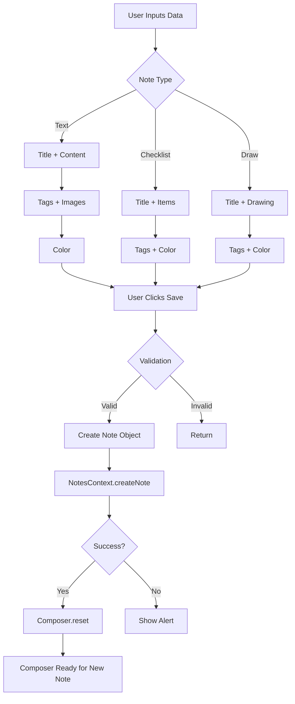

# ComposerContext
**Last Updated:** January 21, 2026  
**Version:** 1.0  
**Status:** ✅ Production Ready

---

## Overview

`ComposerContext` is a React Context API implementation that manages the state and operations for creating new notes in GlassKeep. Provides a centralized state management for the note composer, supporting text notes, checklists, and drawings.

---

## Purpose

Provide composer functionality with:
- Multiple note types (text, checklist, draw)
- Title and content management
- Tag support
- Color customization
- Image attachments
- Checklist item management
- Drawing support
- Smart text formatting
- Keyboard shortcuts
- Auto-save on Ctrl/Cmd+Enter
- Online/offline awareness
- Collapsible interface

---

## Context Structure

```
ComposerContext
├── Core State
│   ├── type
│   ├── title
│   ├── content
│   ├── tags
│   ├── color
│   ├── images
│   └── collapsed
├── Checklist State
│   ├── clItems
│   └── clInput
├── Drawing State
│   └── drawingData
├── UI State
│   ├── showFormatting
│   └── showColorPicker
├── Refs
│   ├── titleRef
│   ├── contentRef
│   ├── fileInputRef
│   ├── fmtBtnRef
│   └── colorBtnRef
└── Actions
    ├── reset()
    ├── addChecklistItem()
    ├── onKeyDown()
    ├── format()
    ├── handleImageUpload()
    ├── removeImage()
    └── save()
```

---

## Provider Value

```javascript
{
  // Core State
  type: string,              // Note type
  setType: (type) => void,   // Set note type
  title: string,              // Note title
  setTitle: (title) => void,  // Set title
  content: string,            // Note content
  setContent: (content) => void,  // Set content
  tags: string,               // Tags (comma-separated)
  setTags: (tags) => void,    // Set tags
  color: string,              // Note color
  setColor: (color) => void,  // Set color
  images: array,              // Image array
  setImages: (images) => void,  // Set images
  collapsed: boolean,         // Composer collapsed state
  setCollapsed: (collapsed) => void,  // Set collapsed
  
  // Checklist State
  clItems: array,             // Checklist items
  setClItems: (items) => void,  // Set checklist items
  clInput: string,            // Current checklist input
  setClInput: (input) => void,  // Set checklist input
  
  // Drawing State
  drawingData: object,        // Drawing data
  setDrawingData: (data) => void,  // Set drawing data
  
  // UI State
  showFormatting: boolean,    // Show formatting toolbar
  setShowFormatting: (show) => void,  // Set formatting visibility
  showColorPicker: boolean,   // Show color picker
  setShowColorPicker: (show) => void,  // Set color picker visibility
  
  // Refs
  titleRef: ReactRef,         // Title input ref
  contentRef: ReactRef,       // Content textarea ref
  fileInputRef: ReactRef,     // File input ref
  fmtBtnRef: ReactRef,        // Format button ref
  colorBtnRef: ReactRef,      // Color button ref
  
  // Actions
  reset: () => void,          // Reset composer state
  addChecklistItem: () => void,  // Add checklist item
  onKeyDown: (e) => void,     // Handle key events
  format: (type) => void,     // Apply formatting
  handleImageUpload: (files) => Promise,  // Upload images
  removeImage: (id) => void,   // Remove image
  save: () => Promise          // Save note
}
```

---

## State Properties

### Core State

#### type
- **Type:** `string`
- **Default:** `'text'`
- **Values:** `'text' | 'checklist' | 'draw'`
- **Purpose:** Note type selector

#### title
- **Type:** `string`
- **Default:** `''`
- **Purpose:** Note title
- **Validation:** Trimmed before save

#### content
- **Type:** `string`
- **Default:** `''`
- **Purpose:** Note content (text notes only)

#### tags
- **Type:** `string`
- **Default:** `''`
- **Purpose:** Comma-separated tags
- **Format:** `'tag1, tag2, tag3'`

#### color
- **Type:** `string`
- **Default:** `'default'`
- **Purpose:** Note color
- **Values:** Color codes or 'default'

#### images
- **Type:** `array`
- **Default:** `[]`
- **Purpose:** Attached images
- **Structure:**
```javascript
[
  {
    id: string,    // Unique ID
    src: string,   // Base64 data URL
    name: string   // Original filename
  }
]
```

#### collapsed
- **Type:** `boolean`
- **Default:** `true`
- **Purpose:** Composer collapsed state
- **Usage:** Show/hide composer

---

### Checklist State

#### clItems
- **Type:** `array`
- **Default:** `[]`
- **Purpose:** Checklist items
- **Structure:**
```javascript
[
  {
    id: string,    // Unique ID
    text: string,  // Item text
    done: boolean  // Completed flag
  }
]
```

#### clInput
- **Type:** `string`
- **Default:** `''`
- **Purpose:** Current checklist input
- **Usage:** Temp buffer before adding to list

---

### Drawing State

#### drawingData
- **Type:** `object`
- **Default:** `{ paths: [], dimensions: null }`
- **Purpose:** Drawing paths and dimensions
- **Structure:**
```javascript
{
  paths: [
    {
      tool: string,
      color: string,
      size: number,
      points: [{x, y}, ...]
    }
  ],
  dimensions: {
    width: number,
    height: number,
    originalHeight: number
  }
}
```

---

### UI State

#### showFormatting
- **Type:** `boolean`
- **Default:** `false`
- **Purpose:** Formatting toolbar visibility

#### showColorPicker
- **Type:** `boolean`
- **Default:** `false`
- **Purpose:** Color picker visibility

---

## Refs

### titleRef
- **Type:** `ReactRef`
- **Purpose:** Reference to title input
- **Usage:** Focus management, value access

### contentRef
- **Type:** `ReactRef`
- **Purpose:** Reference to content textarea
- **Usage:** Focus management, cursor positioning, auto-resize

### fileInputRef
- **Type:** `ReactRef`
- **Purpose:** Reference to file input
- **Usage:** Trigger file upload dialog

### fmtBtnRef
- **Type:** `ReactRef`
- **Purpose:** Reference to format button
- **Usage:** Position formatting toolbar

### colorBtnRef
- **Type:** `ReactRef`
- **Purpose:** Reference to color button
- **Usage:** Position color picker

---

## Actions

### reset()
- **Type:** `() => void`
- **Purpose:** Reset composer to initial state
- **Actions:**
  1. Clear title
  2. Clear content
  3. Clear tags
  4. Clear images
  5. Reset color to default
  6. Clear checklist items
  7. Clear checklist input
  8. Clear drawing data
  9. Reset type to text
  10. Collapse composer
  11. Hide formatting toolbar
  12. Hide color picker
  13. Reset textarea height

**Usage:**
```javascript
const { reset } = useComposer()

function handleCancel() {
  reset()
}
```

---

### addChecklistItem()
- **Type:** `() => void`
- **Purpose:** Add new checklist item
- **Validation:**
  - Input must not be empty after trim
- **Actions:**
  1. Create new item with unique ID
  2. Set text from input
  3. Set done to false
  4. Add to items array
  5. Clear input

**Usage:**
```javascript
const { addChecklistItem } = useComposer()

function handleAddItem(e) {
  if (e.key === 'Enter') {
    addChecklistItem()
  }
}
```

---

### onKeyDown()
- **Type:** `(e: KeyboardEvent) => void`
- **Purpose:** Handle keyboard events in content textarea
- **Shortcuts:**

#### Ctrl/Cmd + Enter
- **Action:** Save note
- **Behavior:** Prevent default, call save()

#### Enter (without modifiers)
- **Action:** Smart Enter
- **Behavior:**
  - Detect list syntax
  - Auto-indent next line
  - Maintain cursor position
  - Auto-resize textarea

**Validation:**
- Only processes Enter key
- Ignores if Shift/Alt/Ctrl/Meta held

**Usage:**
```javascript
const { onKeyDown } = useComposer()

<textarea
  ref={contentRef}
  value={content}
  onChange={(e) => setContent(e.target.value)}
  onKeyDown={onKeyDown}
/>
```

---

### format()
- **Type:** `(type: string) => void`
- **Purpose:** Apply text formatting
- **Parameters:**
  - `type`: Format type (bold, italic, etc.)
- **Actions:**
  1. Get selected text
  2. Apply formatting
  3. Update content
  4. Restore cursor position

**Supported Formats:**
- Bold
- Italic
- Underline
- Strikethrough
- Code
- Heading
- List
- Link
- Etc.

**Usage:**
```javascript
const { format } = useComposer()

function handleBold() {
  format('bold')
}
```

---

### handleImageUpload()
- **Type:** `(files: FileList) => Promise<void>`
- **Purpose:** Upload and compress images
- **Parameters:**
  - `files`: FileList from input
- **Actions:**
  1. Iterate through files
  2. Compress each image
  3. Convert to base64
  4. Create image object with ID and name
  5. Add to images array
- **Error Handling:** Silently fails on individual files

**Usage:**
```javascript
const { handleImageUpload, fileInputRef } = useComposer()

function triggerUpload() {
  fileInputRef.current.click()
}

function handleFileChange(e) {
  handleImageUpload(e.target.files)
}
```

---

### removeImage()
- **Type:** `(id: string) => void`
- **Purpose:** Remove image from composer
- **Parameters:**
  - `id`: Image ID to remove
- **Actions:**
  1. Filter images array
  2. Remove image with matching ID

**Usage:**
```javascript
const { removeImage } = useComposer()

function handleRemoveImage(imageId) {
  removeImage(imageId)
}
```

---

### save()
- **Type:** `() => Promise<void>`
- **Purpose:** Save note to database
- **Validation:**
  - **Text note:** Must have title, content, tags, or images
  - **Checklist note:** Must have title or items
  - **Drawing note:** Must have title or drawing paths
- **Actions:**
  1. Validate input
  2. Create note object
  3. Call NotesContext.createNote()
  4. Reset composer on success
  5. Show alert on failure

**Note Structure:**
```javascript
{
  id: string,              // Unique ID
  type: string,            // Note type
  title: string,           // Trimmed title
  content: string,         // Content or drawing data
  items: array,            // Checklist items (if checklist)
  tags: array,             // Parsed tags
  images: array,           // Attached images
  color: string,           // Note color
  pinned: boolean,         // Pinned status
  position: number,        // Sort position
  timestamp: string,        // ISO timestamp
  updated_at: string       // ISO timestamp
}
```

**Usage:**
```javascript
const { save } = useComposer()

async function handleSave() {
  try {
    await save()
    console.log('Note saved!')
  } catch (error) {
    console.error('Save failed:', error)
  }
}
```

---

## useComposer Hook

### Purpose
Convenience hook to access composer context from any component.

### Usage

```javascript
import { useComposer } from '../contexts/ComposerContext'

function MyComponent() {
  const {
    type, setType,
    title, setTitle,
    content, setContent,
    tags, setTags,
    color, setColor,
    images, setImages,
    collapsed, setCollapsed,
    clItems, setClItems,
    clInput, setClInput,
    drawingData, setDrawingData,
    showFormatting, setShowFormatting,
    showColorPicker, setShowColorPicker,
    titleRef,
    contentRef,
    fileInputRef,
    fmtBtnRef,
    colorBtnRef,
    reset,
    addChecklistItem,
    onKeyDown,
    format,
    handleImageUpload,
    removeImage,
    save,
  } = useComposer()
  
  // Use composer state and functions
  return <div>...</div>
}
```

### Error Handling
Throws error if used outside `ComposerProvider`:
```javascript
if (!context) {
  throw new Error('useComposer must be used within ComposerProvider');
}
```

---

## Provider Setup

### App Component

```javascript
import { ComposerProvider } from './contexts/ComposerContext'

function App() {
  return (
    <ComposerProvider>
      {/* App content */}
      <Routes />
    </ComposerProvider>
  )
}
```

### Component Tree

```
ComposerProvider
├── App
│   └── NotesView
│       └── Composer
│           ├── TitleInput
│           ├── ContentTextarea
│           ├── ChecklistInput
│           ├── DrawingCanvas
│           └── FormatToolbar
```

---

## Usage Examples

### Text Note Composer

```javascript
import { useComposer } from '../contexts/ComposerContext'

function TextNoteComposer() {
  const {
    type,
    title,
    content,
    tags,
    color,
    images,
    showFormatting,
    titleRef,
    contentRef,
    fileInputRef,
    onKeyDown,
    format,
    handleImageUpload,
    removeImage,
    save,
  } = useComposer()
  
  return (
    <div className="composer">
      <input
        ref={titleRef}
        type="text"
        value={title}
        onChange={(e) => setTitle(e.target.value)}
        placeholder="Title"
      />
      
      <textarea
        ref={contentRef}
        value={content}
        onChange={(e) => setContent(e.target.value)}
        onKeyDown={onKeyDown}
        placeholder="Write your note..."
      />
      
      {showFormatting && (
        <FormatToolbar format={format} />
      )}
      
      <input
        ref={fileInputRef}
        type="file"
        multiple
        accept="image/*"
        onChange={(e) => handleImageUpload(e.target.files)}
        style={{ display: 'none' }}
      />
      
      <button onClick={() => fileInputRef.current.click()}>
        Add Image
      </button>
      
      {images.map(img => (
        <div key={img.id}>
          
          <button onClick={() => removeImage(img.id)}>✕</button>
        </div>
      ))}
      
      <button onClick={save}>Save Note</button>
    </div>
  )
}
```

### Checklist Note Composer

```javascript
import { useComposer } from '../contexts/ComposerContext'

function ChecklistNoteComposer() {
  const {
    title,
    clItems,
    clInput,
    tags,
    addChecklistItem,
    save,
  } = useComposer()
  
  return (
    <div className="composer">
      <input
        type="text"
        value={title}
        onChange={(e) => setTitle(e.target.value)}
        placeholder="Title"
      />
      
      <div className="checklist-items">
        {clItems.map(item => (
          <div key={item.id} className="checklist-item">
            <input type="checkbox" checked={item.done} />
            <span>{item.text}</span>
          </div>
        ))}
      </div>
      
      <input
        type="text"
        value={clInput}
        onChange={(e) => setClInput(e.target.value)}
        onKeyDown={(e) => e.key === 'Enter' && addChecklistItem()}
        placeholder="Add item..."
      />
      
      <input
        type="text"
        value={tags}
        onChange={(e) => setTags(e.target.value)}
        placeholder="Tags (comma-separated)"
      />
      
      <button onClick={save}>Save Checklist</button>
    </div>
  )
}
```

### Drawing Note Composer

```javascript
import { useComposer } from '../contexts/ComposerContext'
import DrawingCanvas from '../DrawingCanvas'

function DrawingNoteComposer() {
  const {
    title,
    tags,
    color,
    drawingData,
    setDrawingData,
    save,
  } = useComposer()
  
  return (
    <div className="composer">
      <input
        type="text"
        value={title}
        onChange={(e) => setTitle(e.target.value)}
        placeholder="Title"
      />
      
      <DrawingCanvas
        data={drawingData}
        onChange={setDrawingData}
        hideModeToggle={true}
      />
      
      <input
        type="text"
        value={tags}
        onChange={(e) => setTags(e.target.value)}
        placeholder="Tags (comma-separated)"
      />
      
      <button onClick={save}>Save Drawing</button>
    </div>
  )
}
```

### Type Switcher

```javascript
import { useComposer } from '../contexts/ComposerContext'

function TypeSwitcher() {
  const { type, setType } = useComposer()
  
  return (
    <div className="type-switcher">
      <button
        className={type === 'text' ? 'active' : ''}
        onClick={() => setType('text')}
      >
        📝 Text
      </button>
      <button
        className={type === 'checklist' ? 'active' : ''}
        onClick={() => setType('checklist')}
      >
        ✅ Checklist
      </button>
      <button
        className={type === 'draw' ? 'active' : ''}
        onClick={() => setType('draw')}
      >
        🎨 Drawing
      </button>
    </div>
  )
}
```

### Collapsible Composer

```javascript
import { useComposer } from '../contexts/ComposerContext'

function CollapsibleComposer() {
  const { collapsed, setCollapsed, title } = useComposer()
  
  return (
    <div className={`composer ${collapsed ? 'collapsed' : ''}`}>
      <button onClick={() => setCollapsed(!collapsed)}>
        {collapsed ? '✏️ New Note' : '✕ Cancel'}
      </button>
      
      {!collapsed && (
        <>
          <input
            type="text"
            value={title}
            onChange={(e) => setTitle(e.target.value)}
            placeholder="Title"
          />
          {/* Rest of composer */}
        </>
      )}
    </div>
  )
}
```

---

## Data Flow



---

## Keyboard Shortcuts

### Ctrl/Cmd + Enter
- **Action:** Save note
- **Works in:** Content textarea
- **Behavior:** Prevent default, call save()

### Enter
- **Action:** Smart Enter
- **Works in:** Content textarea
- **Behavior:** Auto-indent, maintain cursor

---

## Testing

### Unit Tests

```javascript
describe('ComposerContext', () => {
  describe('ComposerProvider', () => {
    it('should initialize with default state', () => {
      // Test: default values set correctly
    });
    
    it('should reset composer state', () => {
      // Test: reset() → all state cleared
    });
    
    it('should add checklist item', () => {
      // Test: addChecklistItem() → item added to array
    });
    
    it('should not add empty checklist item', () => {
      // Test: empty input → no item added
    });
    
    it('should save text note', async () => {
      // Test: save() → note created
    });
    
    it('should validate text note', async () => {
      // Test: empty text → no save
    });
    
    it('should save checklist note', async () => {
      // Test: save() → checklist created
    });
    
    it('should validate checklist note', async () => {
      // Test: empty checklist → no save
    });
    
    it('should save drawing note', async () => {
      // Test: save() → drawing created
    });
    
    it('should validate drawing note', async () => {
      // Test: empty drawing → no save
    });
    
    it('should handle offline state', async () => {
      // Test: offline → no save
    });
    
    it('should handle keyboard shortcuts', () => {
      // Test: Ctrl+Enter → save
    });
    
    it('should apply formatting', () => {
      // Test: format() → content formatted
    });
  });
  
  describe('useComposer', () => {
    it('should return composer context', () => {
      // Test: useComposer → context values
    });
    
    it('should throw error outside provider', () => {
      // Test: useComposer outside ComposerProvider → error
    });
  });
});
```

### Integration Tests

```javascript
describe('ComposerContext Integration', () => {
  it('should save and display note', async () => {
    // Test: create note → save → display in list
  });
  
  it('should handle type switching', () => {
    // Test: switch types → state updates correctly
  });
  
  it('should persist images through save', async () => {
    // Test: upload images → save → images saved
  });
});
```

### E2E Tests (Playwright)

```javascript
test('User creates text note', async ({ page }) => {
  await page.goto('/#/notes');
  
  // Expand composer
  await page.click('button:has-text("New Note")');
  
  // Fill title and content
  await page.fill('input[placeholder="Title"]', 'Test Note');
  await page.fill('textarea[placeholder="Write your note..."]', 'Test content');
  
  // Save note
  await page.click('button:has-text("Save")');
  
  // Verify note appears in list
  await expect(page.locator('text=Test Note')).toBeVisible();
});

test('User creates checklist note', async ({ page }) => {
  await page.goto('/#/notes');
  
  // Expand composer and switch to checklist
  await page.click('button:has-text("New Note")');
  await page.click('button:has-text("Checklist")');
  
  // Add title
  await page.fill('input[placeholder="Title"]', 'Shopping List');
  
  // Add items
  await page.fill('input[placeholder="Add item..."]', 'Milk');
  await page.keyboard.press('Enter');
  await page.fill('input[placeholder="Add item..."]', 'Eggs');
  await page.keyboard.press('Enter');
  
  // Save checklist
  await page.click('button:has-text("Save")');
  
  // Verify checklist appears in list
  await expect(page.locator('text=Shopping List')).toBeVisible();
});

test('User uses keyboard shortcut to save', async ({ page }) => {
  await page.goto('/#/notes');
  
  // Expand composer
  await page.click('button:has-text("New Note")');
  
  // Fill content
  await page.fill('textarea[placeholder="Write your note..."]', 'Test content');
  
  // Save with Ctrl+Enter
  await page.keyboard.press('Control+Enter');
  
  // Verify note saved
  await expect(page.locator('text=Test content')).toBeVisible();
});
```

---

## Troubleshooting

### Issue: Note not saving

**Possible Causes:**
- Validation failing (empty note)
- Offline mode
- API error
- createNote error

**Solutions:**
1. Check note has content
2. Verify online status
3. Check browser console for errors
4. Verify API endpoint

---

### Issue: Images not uploading

**Possible Causes:**
- File type not supported
- File too large
- Compression failed
- handleImageUpload error

**Solutions:**
1. Verify file type (image/*)
2. Check file size
3. Test with smaller image
4. Check browser console

---

### Issue: Checklist items not adding

**Possible Causes:**
- Input is empty
- addChecklistItem not called
- Event handler issue

**Solutions:**
1. Verify input has text
2. Check addChecklistItem called
3. Test event handler
4. Check keyboard event

---

### Issue: Smart Enter not working

**Possible Causes:**
- contentRef not set
- onKeyDown not attached
- Keyboard modifier held

**Solutions:**
1. Verify contentRef attached to textarea
2. Check onKeyDown handler
3. Verify no modifier keys pressed
4. Test with simple Enter

---

### Issue: useComposer throwing error

**Possible Causes:**
- Component outside ComposerProvider
- Provider not wrapping component
- Multiple providers

**Solutions:**
1. Ensure component is wrapped in ComposerProvider
2. Check provider placement
3. Verify no duplicate providers

---

## Best Practices

1. **Always use useComposer hook** instead of direct context access
2. **Validate inputs** before saving
3. **Provide clear feedback** for errors
4. **Reset composer** after successful save
5. **Handle offline state** gracefully
6. **Use keyboard shortcuts** for better UX
7. **Compress images** before upload
8. **Auto-resize textarea** for better UX
9. **Maintain cursor position** during edits
10. **Test all note types** thoroughly

---

## Performance Considerations

### Optimizations

1. **useCallback for Actions**
   - Prevents unnecessary re-renders
   - Stable function references
   - Better performance

2. **Image Compression**
   - Reduces payload size
   - Faster uploads
   - Better storage efficiency

3. **Smart Enter**
   - Reduces manual formatting
   - Faster note creation
   - Better UX

4. **State Updates**
   - Batched updates
   - Minimal re-renders
   - Efficient state management

---

## Related Contexts

- [NotesContext](./NotesContext.md) - Notes data management
- [UIContext](./UIContext.md) - UI state management

---

## Dependencies

- `react` - React (createContext, useState, useCallback, useContext, useRef)
- `./NotesContext` - Notes context for createNote and isOnline
- `../utils/helpers` - Helper functions (uid, runFormat, fileToCompressedDataURL, handleSmartEnter)

---

## Helper Functions Used

### uid()
- **Purpose:** Generate unique ID
- **Usage:** Note IDs, item IDs, image IDs

### runFormat()
- **Purpose:** Apply text formatting
- **Usage:** Bold, italic, underline, etc.

### fileToCompressedDataURL()
- **Purpose:** Compress and convert image to base64
- **Usage:** Image upload handling

### handleSmartEnter()
- **Purpose:** Handle smart Enter keypress
- **Usage:** Auto-indent list items

---

**Context Version:** 1.0  
**Last Updated:** January 21, 2026  
**Status:** ✅ Production Ready