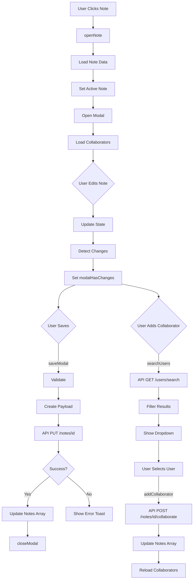

# ModalContext
**Last Updated:** January 21, 2026  
**Version:** 1.0  
**Status:** ✅ Production Ready

---

## Overview

`ModalContext` is a React Context API implementation that manages state and operations for the note editor modal in GlassKeep. Provides comprehensive note editing capabilities with support for text, checklist, and drawing notes, along with collaboration features, image viewing, and change detection.

---

## Purpose

Provide modal functionality with:
- Note editing for all note types (text, checklist, draw)
- Edit/preview mode switching
- Tag management with autocomplete
- Image attachment and viewing
- Collaboration management (add/remove collaborators)
- Change detection for unsaved changes
- Note download functionality
- Checklist drag-and-drop reordering
- User search for collaboration
- Confirmation dialogs for destructive actions

---

## Context Structure

```
ModalContext
├── Core State
│   ├── open
│   ├── activeId
│   ├── activeNoteObj
│   ├── mType
│   ├── mTitle
│   ├── mBody
│   ├── mTagList
│   ├── mColor
│   ├── mTransparency
│   ├── mImages
│   ├── mItems
│   ├── mInput
│   └── mDrawingData
├── UI State
│   ├── viewMode
│   ├── showModalFmt
│   ├── modalMenuOpen
│   ├── showModalColorPop
│   ├── showModalTransPop
│   ├── imgViewOpen
│   ├── mImagesViewIndex
│   ├── tagInput
│   ├── confirmDeleteOpen
│   ├── isSaving
│   ├── checklistDragId
│   └── modalHasChanges
├── Collaboration State
│   ├── collaborationModalOpen
│   ├── collaboratorUsername
│   ├── showUserDropdown
│   ├── filteredUsers
│   ├── addModalCollaborators
│   ├── loadingUsers
│   └── dropdownPosition
├── Refs
│   ├── modalScrollRef
│   ├── modalFmtBtnRef
│   ├── modalMenuBtnRef
│   ├── modalColorBtnRef
│   ├── modalTransBtnRef
│   ├── modalFileRef
│   ├── mBodyRef
│   ├── noteViewRef
│   ├── collaboratorInputRef
│   └── scrimClickStartRef
└── Actions
    ├── openNote()
    ├── closeModal()
    ├── saveModal()
    ├── deleteModal()
    ├── formatModal()
    ├── handleDownloadNote()
    ├── addTags()
    ├── handleTagKeyDown()
    ├── handleTagBlur()
    ├── handleTagPaste()
    ├── onModalBodyClick()
    ├── openImageViewer()
    ├── closeImageViewer()
    ├── nextImage()
    ├── prevImage()
    ├── addImagesToModal()
    ├── loadCollaboratorsForAddModal()
    ├── searchUsers()
    ├── addCollaborator()
    ├── removeCollaborator()
    ├── onMChecklistDragStart()
    ├── onMChecklistDragOver()
    ├── onMChecklistDrop()
    ├── resizeModalTextarea()
    └── handleSmartEnter()
```

---

## Provider Value

```javascript
{
  // Core State
  open: boolean,                      // Modal open state
  setOpen: (open) => void,           // Set modal open
  activeId: string,                   // Active note ID
  setActiveId: (id) => void,         // Set active ID
  activeNoteObj: object,               // Active note object
  setActiveNoteObj: (obj) => void,    // Set active note
  mType: string,                      // Note type
  setMType: (type) => void,          // Set note type
  mTitle: string,                     // Note title
  setMTitle: (title) => void,        // Set title
  mBody: string,                      // Note content
  setMBody: (body) => void,          // Set content
  mTagList: array,                   // Tags array
  setMTagList: (tags) => void,       // Set tags
  mColor: string,                     // Note color
  setMColor: (color) => void,        // Set color
  mTransparency: number,              // Note transparency
  setMTransparency: (t) => void,    // Set transparency
  mImages: array,                     // Images array
  setMImages: (images) => void,      // Set images
  mItems: array,                      // Checklist items
  setMItems: (items) => void,        // Set checklist items
  mInput: string,                      // Current input
  setMInput: (input) => void,        // Set input
  drawingData: object,                 // Drawing data
  setDrawingData: (data) => void,      // Set drawing data
  
  // UI State
  viewMode: string,                    // 'edit' | 'preview'
  setViewMode: (mode) => void,        // Set view mode
  showModalFmt: boolean,               // Show formatting toolbar
  setShowModalFmt: (show) => void,    // Set formatting visibility
  modalMenuOpen: boolean,             // Modal menu open
  setModalMenuOpen: (open) => void,   // Set menu open
  showModalColorPop: boolean,         // Show color picker
  setShowModalColorPop: (show) => void,  // Set color picker visibility
  showModalTransPop: boolean,         // Show transparency picker
  setShowModalTransPop: (show) => void,  // Set transparency picker visibility
  imgViewOpen: boolean,              // Image viewer open
  setImgViewOpen: (open) => void,    // Set image viewer open
  mImagesViewIndex: number,           // Current image index
  setMImagesViewIndex: (idx) => void,  // Set image index
  tagInput: string,                   // Tag input value
  setTagInput: (input) => void,      // Set tag input
  confirmDeleteOpen: boolean,         // Delete confirmation open
  setConfirmDeleteOpen: (open) => void,  // Set delete confirmation
  isSaving: boolean,                 // Saving state
  setIsSaving: (saving) => void,     // Set saving state
  modalHasChanges: boolean,           // Unsaved changes flag
  setModalHasChanges: (has) => void,  // Set changes flag
  checklistDragId: string,           // Dragged checklist item ID
  setChecklistDragId: (id) => void,  // Set drag ID
  
  // Collaboration State
  collaborationModalOpen: boolean,    // Collaboration modal open
  setCollaborationModalOpen: (open) => void,  // Set collaboration modal
  collaboratorUsername: string,        // Collaborator username input
  setCollaboratorUsername: (name) => void,  // Set collaborator username
  showUserDropdown: boolean,         // User dropdown visibility
  setShowUserDropdown: (show) => void,  // Set dropdown visibility
  filteredUsers: array,              // Filtered users for search
  setFilteredUsers: (users) => void,  // Set filtered users
  addModalCollaborators: array,       // Current note collaborators
  setAddModalCollaborators: (users) => void,  // Set collaborators
  loadingUsers: boolean,             // Loading users state
  setLoadingUsers: (loading) => void,  // Set loading state
  dropdownPosition: object,          // Dropdown position
  setDropdownPosition: (pos) => void,  // Set dropdown position
  
  // Refs
  onMChecklistDragStart: (e, id) => void,  // Drag start handler
  onMChecklistDragOver: (e) => void,       // Drag over handler
  onMChecklistDrop: (e, id) => void,       // Drop handler
  modalScrollRef: ReactRef,                    // Modal scroll ref
  modalFmtBtnRef: ReactRef,                   // Format button ref
  modalMenuBtnRef: ReactRef,                  // Menu button ref
  modalColorBtnRef: ReactRef,                 // Color button ref
  modalTransBtnRef: ReactRef,                 // Transparency button ref
  modalFileRef: ReactRef,                     // File input ref
  mBodyRef: ReactRef,                        // Body textarea ref
  noteViewRef: ReactRef,                      // Note view ref
  collaboratorInputRef: ReactRef,              // Collaborator input ref
  scrimClickStartRef: ReactRef,               // Scrim click ref
  
  // Actions
  openNote: (noteData) => Promise,            // Open note in modal
  closeModal: () => void,                      // Close modal
  saveModal: () => Promise,                   // Save note
  deleteModal: () => Promise,                 // Delete note
  formatModal: (type) => void,                // Apply formatting
  handleDownloadNote: () => void,             // Download note as MD
  addCollaborator: (username) => Promise,    // Add collaborator
  removeCollaborator: (username) => Promise, // Remove collaborator
  searchUsers: (query) => Promise,            // Search users
  loadCollaboratorsForAddModal: (id) => Promise,  // Load collaborators
  addTags: (raw) => void,                    // Add tags
  handleTagKeyDown: (e) => void,              // Handle tag input key events
  handleTagBlur: () => void,                   // Handle tag input blur
  handleTagPaste: (e) => void,                // Handle tag input paste
  onModalBodyClick: (e) => void,             // Handle body clicks
  openImageViewer: (index) => void,           // Open image viewer
  closeImageViewer: () => void,                // Close image viewer
  nextImage: () => void,                       // Next image
  prevImage: () => void,                       // Previous image
  addImagesToModal: (files) => Promise,        // Add images
  resizeModalTextarea: () => void,              // Auto-resize textarea
  handleSmartEnter: () => void                  // Smart Enter handler
}
```

---

## State Properties

### Core State

#### open
- **Type:** `boolean`
- **Default:** `false`
- **Purpose:** Modal visibility state

#### activeId
- **Type:** `string | null`
- **Default:** `null`
- **Purpose:** Currently editing note ID

#### activeNoteObj
- **Type:** `object | null`
- **Default:** `null`
- **Purpose:** Complete note object
- **Usage:** Reference for original values

#### mType
- **Type:** `string`
- **Default:** `'text'`
- **Values:** `'text' | 'checklist' | 'draw'`
- **Purpose:** Note type

#### mTitle
- **Type:** `string`
- **Default:** `''`
- **Purpose:** Note title

#### mBody
- **Type:** `string`
- **Default:** `''`
- **Purpose:** Note content (text notes)

#### mTagList
- **Type:** `array`
- **Default:** `[]`
- **Purpose:** Tags array
- **Format:** `['tag1', 'tag2', 'tag3']`

#### mColor
- **Type:** `string`
- **Default:** `'default'`
- **Purpose:** Note color

#### mTransparency
- **Type:** `number | null`
- **Default:** `null`
- **Purpose:** Note transparency level
- **Range:** 0-100

#### mImages
- **Type:** `array`
- **Default:** `[]`
- **Purpose:** Attached images
- **Structure:**
```javascript
[
  {
    id: string,    // Unique ID
    src: string,   // Base64 data URL
    name: string   // Original filename
  }
]
```

#### mItems
- **Type:** `array`
- **Default:** `[]`
- **Purpose:** Checklist items
- **Structure:**
```javascript
[
  {
    id: string,    // Unique ID
    text: string,  // Item text
    done: boolean  // Completed flag
  }
]
```

#### mInput
- **Type:** `string`
- **Default:** `''`
- **Purpose:** Current checklist input

#### mDrawingData
- **Type:** `object`
- **Default:** `{ paths: [], dimensions: null }`
- **Purpose:** Drawing paths and dimensions

---

### UI State

#### viewMode
- **Type:** `string`
- **Default:** `'edit'`
- **Values:** `'edit' | 'preview'`
- **Purpose:** Modal view mode

#### showModalFmt
- **Type:** `boolean`
- **Default:** `false`
- **Purpose:** Formatting toolbar visibility

#### modalMenuOpen
- **Type:** `boolean`
- **Default:** `false`
- **Purpose:** Modal menu open state

#### showModalColorPop
- **Type:** `boolean`
- **Default:** `false`
- **Purpose:** Color picker visibility

#### showModalTransPop
- **Type:** `boolean`
- **Default:** `false`
- **Purpose:** Transparency picker visibility

#### imgViewOpen
- **Type:** `boolean`
- **Default:** `false`
- **Purpose:** Image viewer open state

#### mImagesViewIndex
- **Type:** `number`
- **Default:** `0`
- **Purpose:** Current image index in viewer

#### tagInput
- **Type:** `string`
- **Default:** `''`
- **Purpose:** Tag input value

#### confirmDeleteOpen
- **Type:** `boolean`
- **Default:** `false`
- **Purpose:** Delete confirmation dialog state

#### isSaving
- **Type:** `boolean`
- **Default:** `false`
- **Purpose:** Saving in progress flag

#### modalHasChanges
- **Type:** `boolean`
- **Default:** `false`
- **Purpose:** Unsaved changes flag
- **Calculated:** Compared against originalValues

#### checklistDragId
- **Type:** `string | null`
- **Default:** `null`
- **Purpose:** Currently dragged checklist item ID

---

### Collaboration State

#### collaborationModalOpen
- **Type:** `boolean`
- **Default:** `false`
- **Purpose:** Collaboration modal open state

#### collaboratorUsername
- **Type:** `string`
- **Default:** `''`
- **Purpose:** Username input for adding collaborator

#### showUserDropdown
- **Type:** `boolean`
- **Default:** `false`
- **Purpose:** User search dropdown visibility

#### filteredUsers
- **Type:** `array`
- **Default:** `[]`
- **Purpose:** Search results for users
- **Filtered:** Excludes current user and existing collaborators

#### addModalCollaborators
- **Type:** `array`
- **Default:** `[]`
- **Purpose:** Current note collaborators
- **Structure:**
```javascript
[
  {
    id: number,
    username: string,
    email: string,
    // ... other user fields
  }
]
```

#### loadingUsers
- **Type:** `boolean`
- **Default:** `false`
- **Purpose:** User search loading state

#### dropdownPosition
- **Type:** `object`
- **Default:** `{ top: 0, left: 0, width: 0 }`
- **Purpose:** User dropdown position
- **Usage:** Position dropdown near input

---

## Refs

### modalScrollRef
- **Type:** `ReactRef`
- **Purpose:** Reference to modal scroll container
- **Usage:** Scroll management

### modalFmtBtnRef
- **Type:** `ReactRef`
- **Purpose:** Reference to format button
- **Usage:** Position formatting toolbar

### modalMenuBtnRef
- **Type:** `ReactRef`
- **Purpose:** Reference to menu button
- **Usage:** Position modal menu

### modalColorBtnRef
- **Type:** `ReactRef`
- **Purpose:** Reference to color button
- **Usage:** Position color picker

### modalTransBtnRef
- **Type:** `ReactRef`
- **Purpose:** Reference to transparency button
- **Usage:** Position transparency picker

### modalFileRef
- **Type:** `ReactRef`
- **Purpose:** Reference to file input
- **Usage:** Trigger file upload dialog

### mBodyRef
- **Type:** `ReactRef`
- **Purpose:** Reference to body textarea
- **Usage:** Cursor positioning, auto-resize

### noteViewRef
- **Type:** `ReactRef`
- **Purpose:** Reference to note view area
- **Usage:** Preview mode scrolling

### collaboratorInputRef
- **Type:** `ReactRef`
- **Purpose:** Reference to collaborator input
- **Usage:** Focus management

### scrimClickStartRef
- **Type:** `ReactRef`
- **Purpose:** Reference for scrim click tracking
- **Usage:** Distinguish clicks from drags

---

## Actions

### openNote()
- **Type:** `(noteData: object) => Promise<void>`
- **Purpose:** Open note in modal
- **Parameters:**
  - `noteData`: Note object from notes list
- **Actions:**
  1. Set active note ID and object
  2. Parse note data (type, title, content, tags, etc.)
  3. Store original values for change detection
  4. Parse drawing data if applicable
  5. Set view mode to 'edit'
  6. Open modal
  7. Load collaborators

**Usage:**
```javascript
const { openNote } = useModal()

function handleNoteClick(note) {
  openNote(note)
}
```

---

### closeModal()
- **Type:** `() => void`
- **Purpose:** Close modal
- **Actions:**
  1. Close modal
  2. Clear active note
  3. Reset UI states
  4. Clear collaborators
  5. Close all sub-modals

**Usage:**
```javascript
const { closeModal } = useModal()

function handleClose() {
  closeModal()
}
```

---

### saveModal()
- **Type:** `() => Promise<void>`
- **Purpose:** Save current note changes
- **Validation:**
  - Active ID must exist
  - Prevent concurrent saves
- **Actions:**
  1. Create payload based on note type
  2. Send PUT request to API
  3. Invalidate notes cache
  4. Update local notes array
  5. Close modal
  6. Show toast on error

**Payload Structure:**
```javascript
// Text note
{
  id: string,
  type: "text",
  title: string,
  content: string,
  items: [],
  tags: array,
  images: array,
  color: string,
  transparency: number,
  pinned: boolean
}

// Checklist note
{
  id: string,
  type: "checklist",
  title: string,
  content: "",
  items: array,
  tags: array,
  images: array,
  color: string,
  transparency: number,
  pinned: boolean
}

// Drawing note
{
  id: string,
  type: "draw",
  title: string,
  content: string,  // JSON stringified drawing data
  items: [],
  tags: array,
  images: array,
  color: string,
  transparency: number,
  pinned: boolean
}
```

**Usage:**
```javascript
const { saveModal } = useModal()

async function handleSave() {
  await saveModal()
}
```

---

### deleteModal()
- **Type:** `() => Promise<void>`
- **Purpose:** Delete current note
- **Validation:**
  - Active ID must exist
  - User must own note
- **Actions:**
  1. Verify user ownership
  2. Send DELETE request to API
  3. Invalidate notes cache
  4. Remove from local notes array
  5. Close modal
  6. Show toast

**Usage:**
```javascript
const { deleteModal } = useModal()

async function handleDelete() {
  await deleteModal()
}
```

---

### formatModal()
- **Type:** `(type: string) => void`
- **Purpose:** Apply text formatting to body
- **Parameters:**
  - `type`: Format type (bold, italic, etc.)
- **Actions:**
  1. Get selected text
  2. Apply formatting
  3. Update body
  4. Restore cursor position

**Usage:**
```javascript
const { formatModal } = useModal()

function handleBold() {
  formatModal('bold')
}
```

---

### handleDownloadNote()
- **Type:** `() => void`
- **Purpose:** Download note as Markdown
- **Actions:**
  1. Generate Markdown content
  2. Sanitize filename
  3. Trigger download

**Usage:**
```javascript
const { handleDownloadNote } = useModal()

<button onClick={handleDownloadNote}>
  Download Note
</button>
```

---

### addTags()
- **Type:** `(raw: string) => void`
- **Purpose:** Add tags from comma-separated string
- **Parameters:**
  - `raw`: Comma-separated tags
- **Actions:**
  1. Split by commas
  2. Trim and filter empty
  3. Deduplicate (case-insensitive)
  4. Add to tag list

**Usage:**
```javascript
const { addTags } = useModal()

function handleTagSubmit() {
  addTags('work, urgent, important')
}
```

---

### handleTagKeyDown()
- **Type:** `(e: KeyboardEvent) => void`
- **Purpose:** Handle keyboard events in tag input
- **Key Actions:**
  - **Enter/Comma/Tab:** Add tag and clear input
  - **Backspace (empty):** Remove last tag

**Usage:**
```javascript
const { handleTagKeyDown } = useModal()

<input
  type="text"
  value={tagInput}
  onChange={(e) => setTagInput(e.target.value)}
  onKeyDown={handleTagKeyDown}
/>
```

---

### handleTagBlur()
- **Type:** `() => void`
- **Purpose:** Handle tag input blur
- **Actions:**
  1. If input has value, add tag
  2. Clear input

**Usage:**
```javascript
const { handleTagBlur } = useModal()

<input
  type="text"
  value={tagInput}
  onChange={(e) => setTagInput(e.target.value)}
  onBlur={handleTagBlur}
/>
```

---

### handleTagPaste()
- **Type:** `(e: ClipboardEvent) => void`
- **Purpose:** Handle paste in tag input
- **Actions:**
  1. Get pasted text
  2. If contains commas, add tags
  3. Prevent default

**Usage:**
```javascript
const { handleTagPaste } = useModal()

<input
  type="text"
  value={tagInput}
  onChange={(e) => setTagInput(e.target.value)}
  onPaste={handleTagPaste}
/>
```

---

### onModalBodyClick()
- **Type:** `(e: MouseEvent) => void`
- **Purpose:** Handle clicks in modal body (preview mode)
- **Actions:**
  1. Check if clicking link
  2. If external link, open in new tab
  3. Prevent default navigation

**Usage:**
```javascript
const { onModalBodyClick } = useModal()

<div
  className="modal-body"
  onClick={onModalBodyClick}
>
  {/* Preview content */}
</div>
```

---

### openImageViewer()
- **Type:** `(index: number) => void`
- **Purpose:** Open image viewer at specific index
- **Parameters:**
  - `index`: Image index to display

**Usage:**
```javascript
const { openImageViewer } = useModal()

{images.map((img, idx) => (
   openImageViewer(idx)}
  />
))}
```

---

### closeImageViewer()
- **Type:** `() => void`
- **Purpose:** Close image viewer

**Usage:**
```javascript
const { closeImageViewer } = useModal()

<button onClick={closeImageViewer}>
  Close
</button>
```

---

### nextImage()
- **Type:** `() => void`
- **Purpose:** Navigate to next image
- **Behavior:** Cycles back to first after last

**Usage:**
```javascript
const { nextImage } = useModal()

<button onClick={nextImage}>
  Next
</button>
```

---

### prevImage()
- **Type:** `() => void`
- **Purpose:** Navigate to previous image
- **Behavior:** Cycles to last after first

**Usage:**
```javascript
const { prevImage } = useModal()

<button onClick={prevImage}>
  Previous
</button>
```

---

### addImagesToModal()
- **Type:** `(fileList: FileList) => Promise<void>`
- **Purpose:** Upload and compress images
- **Parameters:**
  - `fileList`: FileList from input
- **Actions:**
  1. Iterate through files
  2. Compress each image
  3. Convert to base64
  4. Add to images array

**Usage:**
```javascript
const { addImagesToModal, modalFileRef } = useModal()

function triggerUpload() {
  modalFileRef.current.click()
}

function handleFileChange(e) {
  addImagesToModal(e.target.files)
}
```

---

### loadCollaboratorsForAddModal()
- **Type:** `(noteId: string) => Promise<void>`
- **Purpose:** Load collaborators for note
- **Parameters:**
  - `noteId`: Note ID
- **Actions:**
  1. Fetch from API
  2. Set collaborators array

**Usage:**
```javascript
const { loadCollaboratorsForAddModal } = useModal()

useEffect(() => {
  if (activeId) {
    loadCollaboratorsForAddModal(activeId)
  }
}, [activeId])
```

---

### searchUsers()
- **Type:** `(query: string) => Promise<void>`
- **Purpose:** Search users for collaboration
- **Parameters:**
  - `query`: Search query
- **Actions:**
  1. Fetch from API
  2. Filter out current user
  3. Filter out existing collaborators
  4. Set filtered users

**Usage:**
```javascript
const { searchUsers } = useModal()

<input
  type="text"
  value={collaboratorUsername}
  onChange={(e) => searchUsers(e.target.value)}
  placeholder="Search users..."
/>
```

---

### addCollaborator()
- **Type:** `(username: string) => Promise<void>`
- **Purpose:** Add collaborator to note
- **Parameters:**
  - `username`: Username to add
- **Actions:**
  1. Send POST request to API
  2. Update local notes array
  3. Show toast
  4. Reload collaborators list

**Usage:**
```javascript
const { addCollaborator } = useModal()

<button onClick={() => addCollaborator('john_doe')}>
  Add Collaborator
</button>
```

---

### removeCollaborator()
- **Type:** `(username: string) => Promise<void>`
- **Purpose:** Remove collaborator from note
- **Parameters:**
  - `username`: Username to remove
- **Actions:**
  1. Send DELETE request to API
  2. Update local notes array
  3. Show toast
  4. Reload collaborators list

**Usage:**
```javascript
const { removeCollaborator } = useModal()

<button onClick={() => removeCollaborator('john_doe')}>
  Remove
</button>
```

---

### onMChecklistDragStart()
- **Type:** `(e: DragEvent, itemId: string) => void`
- **Purpose:** Handle checklist item drag start
- **Parameters:**
  - `e`: Drag event
  - `itemId`: Item ID being dragged
- **Actions:**
  1. Set drag ID
  2. Set drag data

**Usage:**
```javascript
const { onMChecklistDragStart } = useModal()

<div
  draggable
  onDragStart={(e) => onMChecklistDragStart(e, item.id)}
>
  {/* Checklist item */}
</div>
```

---

### onMChecklistDragOver()
- **Type:** `(e: DragEvent) => void`
- **Purpose:** Handle checklist item drag over
- **Parameters:**
  - `e`: Drag event
- **Actions:**
  1. Prevent default (allow drop)

**Usage:**
```javascript
const { onMChecklistDragOver } = useModal()

<div onDragOver={onMChecklistDragOver}>
  {/* Checklist items */}
</div>
```

---

### onMChecklistDrop()
- **Type:** `(e: DragEvent, targetId: string) => void`
- **Purpose:** Handle checklist item drop
- **Parameters:**
  - `e`: Drag event
  - `targetId`: Target item ID
- **Actions:**
  1. Parse drag data
  2. Validate source and target
  3. Reorder items array
  4. Update state

**Usage:**
```javascript
const { onMChecklistDrop } = useModal()

<div
  onDrop={(e) => onMChecklistDrop(e, item.id)}
>
  {/* Checklist item */}
</div>
```

---

### resizeModalTextarea()
- **Type:** `() => void`
- **Purpose:** Auto-resize body textarea
- **Actions:**
  1. Reset height to auto
  2. Set height to scrollHeight

**Usage:**
```javascript
const { resizeModalTextarea } = useModal()

useEffect(() => {
  resizeModalTextarea()
}, [mBody])
```

---

### handleSmartEnter()
- **Type:** `() => void`
- **Purpose:** Handle smart Enter keypress
- **Actions:**
  1. Detect list syntax
  2. Auto-indent next line
  3. Maintain cursor position

**Usage:**
```javascript
const { handleSmartEnter } = useModal()

<textarea
  ref={mBodyRef}
  value={mBody}
  onChange={(e) => setMBody(e.target.value)}
  onKeyDown={handleSmartEnter}
/>
```

---

## useModal Hook

### Purpose
Convenience hook to access modal context from any component.

### Usage

```javascript
import { useModal } from '../contexts/ModalContext'

function MyComponent() {
  const {
    open,
    activeId,
    activeNoteObj,
    mType,
    mTitle,
    mBody,
    mTagList,
    mColor,
    mTransparency,
    mImages,
    mItems,
    mDrawingData,
    viewMode,
    isSaving,
    modalHasChanges,
    openNote,
    closeModal,
    saveModal,
    deleteModal,
    // ... other properties
  } = useModal()
  
  // Use modal state and functions
  return <div>...</div>
}
```

### Error Handling
Throws error if used outside `ModalProvider`:
```javascript
if (!context) {
  throw new Error('useModal must be used within ModalProvider');
}
```

---

## Provider Setup

### App Component

```javascript
import { ModalProvider } from './contexts/ModalContext'

function App() {
  return (
    <ModalProvider>
      {/* App content */}
      <Routes />
    </ModalProvider>
  )
}
```

---

## Usage Examples

### Open Note Modal

```javascript
import { useModal } from '../contexts/ModalContext'

function NoteCard({ note }) {
  const { openNote } = useModal()
  
  return (
    <div className="note-card" onClick={() => openNote(note)}>
      <h3>{note.title}</h3>
      <p>{note.content}</p>
    </div>
  )
}
```

### Note Editor Modal

```javascript
import { useModal } from '../contexts/ModalContext'

function NoteEditorModal() {
  const {
    open,
    mType,
    mTitle,
    mBody,
    viewMode,
    closeModal,
    saveModal,
    deleteModal,
  } = useModal()
  
  if (!open) return null
  
  return (
    <div className="modal-overlay">
      <div className="modal">
        <div className="modal-header">
          <input
            type="text"
            value={mTitle}
            onChange={(e) => setMTitle(e.target.value)}
            placeholder="Title"
          />
          <button onClick={closeModal}>✕</button>
        </div>
        
        <div className="modal-body">
          {mType === 'text' && viewMode === 'edit' && (
            <textarea
              value={mBody}
              onChange={(e) => setMBody(e.target.value)}
              placeholder="Write your note..."
            />
          )}
          
          {mType === 'text' && viewMode === 'preview' && (
            <div className="markdown-preview">
              {/* Rendered markdown */}
            </div>
          )}
        </div>
        
        <div className="modal-footer">
          <button onClick={closeModal}>Cancel</button>
          <button onClick={deleteModal}>Delete</button>
          <button onClick={saveModal}>Save</button>
        </div>
      </div>
    </div>
  )
}
```

### Tag Input with Autocomplete

```javascript
import { useModal } from '../contexts/ModalContext'

function TagInput() {
  const {
    mTagList,
    tagInput,
    setTagInput,
    addTags,
    handleTagKeyDown,
    handleTagBlur,
    handleTagPaste,
  } = useModal()
  
  return (
    <div className="tag-input">
      <div className="tags">
        {mTagList.map(tag => (
          <span key={tag} className="tag">
            {tag}
            <button onClick={() => removeTag(tag)}>✕</button>
          </span>
        ))}
      </div>
      
      <input
        type="text"
        value={tagInput}
        onChange={(e) => setTagInput(e.target.value)}
        onKeyDown={handleTagKeyDown}
        onBlur={handleTagBlur}
        onPaste={handleTagPaste}
        placeholder="Add tags..."
      />
    </div>
  )
}
```

### Image Viewer

```javascript
import { useModal } from '../contexts/ModalContext'

function ImageViewer() {
  const {
    imgViewOpen,
    mImages,
    mImagesViewIndex,
    closeImageViewer,
    nextImage,
    prevImage,
  } = useModal()
  
  if (!imgViewOpen || mImages.length === 0) return null
  
  const currentImage = mImages[mImagesViewIndex]
  
  return (
    <div className="image-viewer-overlay" onClick={closeImageViewer}>
      <div className="image-viewer">
        <button onClick={prevImage} className="nav-btn prev">
          ◀
        </button>
        
        
        
        <button onClick={nextImage} className="nav-btn next">
          ▶
        </button>
        
        <div className="image-info">
          {mImagesViewIndex + 1} / {mImages.length}
        </div>
      </div>
    </div>
  )
}
```

### Collaboration Management

```javascript
import { useModal } from '../contexts/ModalContext'

function CollaborationPanel() {
  const {
    collaborationModalOpen,
    collaboratorUsername,
    showUserDropdown,
    filteredUsers,
    addModalCollaborators,
    addCollaborator,
    removeCollaborator,
  } = useModal()
  
  return (
    <div className="collaboration-panel">
      <h3>Collaborators</h3>
      
      <div className="collaborators-list">
        {addModalCollaborators.map(user => (
          <div key={user.id} className="collaborator">
            <span>{user.username}</span>
            <button onClick={() => removeCollaborator(user.username)}>
              Remove
            </button>
          </div>
        ))}
      </div>
      
      <div className="add-collaborator">
        <input
          type="text"
          value={collaboratorUsername}
          onChange={(e) => setCollaboratorUsername(e.target.value)}
          placeholder="Search users..."
        />
        
        {showUserDropdown && (
          <div className="user-dropdown">
            {filteredUsers.map(user => (
              <div
                key={user.id}
                onClick={() => addCollaborator(user.username)}
              >
                {user.username}
              </div>
            ))}
          </div>
        )}
      </div>
    </div>
  )
}
```

### Unsaved Changes Warning

```javascript
import { useModal } from '../contexts/ModalContext'

function Modal() {
  const {
    open,
    modalHasChanges,
    closeModal,
  } = useModal()
  
  const handleClose = () => {
    if (modalHasChanges) {
      if (confirm('You have unsaved changes. Close anyway?')) {
        closeModal()
      }
    } else {
      closeModal()
    }
  }
  
  return (
    open && (
      <div className="modal-overlay">
        <div className="modal">
          {/* Modal content */}
          <button onClick={handleClose}>Close</button>
        </div>
      </div>
    )
  )
}
```

---

## Data Flow



---

## Testing

### Unit Tests

```javascript
describe('ModalContext', () => {
  describe('ModalProvider', () => {
    it('should initialize with default state', () => {
      // Test: default values set correctly
    });
    
    it('should open note in modal', async () => {
      // Test: openNote → modal opens, data loaded
    });
    
    it('should close modal', () => {
      // Test: closeModal → all state cleared
    });
    
    it('should save note', async () => {
      // Test: saveModal → API call, notes updated
    });
    
    it('should delete note', async () => {
      // Test: deleteModal → API call, note removed
    });
    
    it('should detect unsaved changes', () => {
      // Test: state changes → modalHasChanges true
    });
    
    it('should apply formatting', () => {
      // Test: formatModal → content formatted
    });
    
    it('should add tags', () => {
      // Test: addTags → tags added, deduplicated
    });
    
    it('should handle tag keyboard events', () => {
      // Test: handleTagKeyDown → Enter/Backspace handled
    });
    
    it('should handle tag paste', () => {
      // Test: handleTagPaste → comma-separated tags added
    });
    
    it('should add images', async () => {
      // Test: addImagesToModal → images compressed and added
    });
    
    it('should navigate images', () => {
      // Test: nextImage/prevImage → index updated
    });
    
    it('should search users', async () => {
      // Test: searchUsers → filtered users loaded
    });
    
    it('should add collaborator', async () => {
      // Test: addCollaborator → API call, collaborator added
    });
    
    it('should remove collaborator', async () => {
      // Test: removeCollaborator → API call, collaborator removed
    });
    
    it('should handle checklist drag and drop', () => {
      // Test: drag/drop → items reordered
    });
  });
  
  describe('useModal', () => {
    it('should return modal context', () => {
      // Test: useModal → context values
    });
    
    it('should throw error outside provider', () => {
      // Test: useModal outside ModalProvider → error
    });
  });
});
```

### Integration Tests

```javascript
describe('ModalContext Integration', () => {
  it('should save and display changes', async () => {
    // Test: edit note → save → changes reflected in list
  });
  
  it('should handle collaboration', async () => {
    // Test: add collaborator → save → collaborator persists
  });
  
  it('should maintain changes across edit/preview', () => {
    // Test: edit → preview → edit → changes preserved
  });
});
```

### E2E Tests (Playwright)

```javascript
test('User edits note', async ({ page }) => {
  await page.goto('/#/notes');
  
  // Open note in modal
  await page.click('.note-card:first-child');
  
  // Edit title
  await page.fill('.modal input[type="text"]', 'Updated Title');
  
  // Save changes
  await page.click('.modal button:has-text("Save")');
  
  // Verify changes reflected
  await expect(page.locator('text=Updated Title')).toBeVisible();
});

test('User adds tags to note', async ({ page }) => {
  await page.goto('/#/notes');
  await page.click('.note-card:first-child');
  
  // Add tags
  await page.fill('.tag-input', 'work, urgent');
  await page.keyboard.press('Enter');
  
  // Save note
  await page.click('.modal button:has-text("Save")');
  
  // Verify tags added
  await expect(page.locator('.tag')).toHaveCount(2);
});

test('User adds collaborator', async ({ page }) => {
  await page.goto('/#/notes');
  await page.click('.note-card:first-child');
  
  // Open collaboration panel
  await page.click('text=Collaborators');
  
  // Search user
  await page.fill('.collaborator-input', 'john_doe');
  
  // Add collaborator
  await page.click('.user-dropdown-item:first-child');
  
  // Verify collaborator added
  await expect(page.locator('text=john_doe')).toBeVisible();
});

test('User navigates images', async ({ page }) => {
  await page.goto('/#/notes');
  await page.click('.note-card:first-child');
  
  // Open image viewer
  await page.click('.note-image:first-child');
  
  // Navigate to next image
  await page.click('.nav-btn.next');
  
  // Verify next image displayed
  await expect(page.locator('.image-viewer img')).toBeVisible();
});
```

---

## Troubleshooting

### Issue: Modal not opening

**Possible Causes:**
- openNote not called
- Note data invalid
- State update not triggering

**Solutions:**
1. Verify openNote called with valid data
2. Check note object structure
3. Verify state updates
4. Check browser console for errors

---

### Issue: Changes not saving

**Possible Causes:**
- Validation failing
- API error
- isSaving blocking
- Token expired

**Solutions:**
1. Check browser console for errors
2. Verify API endpoint
3. Check token validity
4. Verify payload structure

---

### Issue: Tags not adding

**Possible Causes:**
- addTags not called
- Input value empty
- Event handler not attached

**Solutions:**
1. Verify addTags called
2. Check input value
3. Test event handlers
4. Check for errors

---

### Issue: Collaboration not working

**Possible Causes:**
- User not found
- Already collaborator
- API error
- Permissions issue

**Solutions:**
1. Verify user exists
2. Check current collaborators
3. Check API response
4. Verify permissions

---

### Issue: useModal throwing error

**Possible Causes:**
- Component outside ModalProvider
- Provider not wrapping component

**Solutions:**
1. Ensure component is wrapped in ModalProvider
2. Check provider placement
3. Verify no duplicate providers

---

## Best Practices

1. **Always use useModal hook** instead of direct context access
2. **Show unsaved changes warning** before closing
3. **Validate inputs** before saving
4. **Handle errors gracefully** with toast notifications
5. **Provide clear feedback** for all operations
6. **Use confirmation dialogs** for destructive actions
7. **Implement keyboard shortcuts** for common actions
8. **Debounce user search** for better performance
9. **Filter search results** appropriately
10. **Test all note types** thoroughly

---

## Performance Considerations

### Optimizations

1. **useCallback for Actions**
   - Prevents unnecessary re-renders
   - Stable function references
   - Better performance

2. **Image Compression**
   - Reduces payload size
   - Faster uploads
   - Better storage efficiency

3. **User Search Debouncing**
   - Reduces API calls
   - Faster search experience
   - Better performance

4. **Change Detection**
   - Efficient comparison
   - Minimal re-renders
   - Better UX

---

## Related Contexts

- [AuthContext](./AuthContext.md) - Authentication for user info
- [NotesContext](./NotesContext.md) - Notes data management
- [UIContext](./UIContext.md) - Toast notifications

---

## Dependencies

- `react` - React (createContext, useState, useCallback, useContext, useRef)
- `./AuthContext` - Authentication (token, currentUser)
- `./NotesContext` - Notes management (notes, setNotes, invalidateNotesCache)
- `./UIContext` - UI state (showToast)
- `../utils/helpers` - Helper functions (api, uid, runFormat, handleSmartEnter, downloadText, mdForDownload, sanitizeFilename, solid, bgFor, fileToCompressedDataURL)

---

## API Endpoints Used

### GET /notes/{id}/collaborators
- **Purpose:** Get note collaborators
- **Response:** Array of user objects

### PUT /notes/{id}
- **Purpose:** Update note
- **Body:** Note payload (type-specific)
- **Response:** Updated note object

### DELETE /notes/{id}
- **Purpose:** Delete note
- **Response:** Success message

### GET /users/search
- **Purpose:** Search users
- **Query:** `q={search query}`
- **Response:** Array of user objects

### POST /notes/{id}/collaborate
- **Purpose:** Add collaborator
- **Body:** `{ username }`
- **Response:** Success message

### DELETE /notes/{id}/collaborate
- **Purpose:** Remove collaborator
- **Body:** `{ username }`
- **Response:** Success message

---

**Context Version:** 1.0  
**Last Updated:** January 21, 2026  
**Status:** ✅ Production Ready