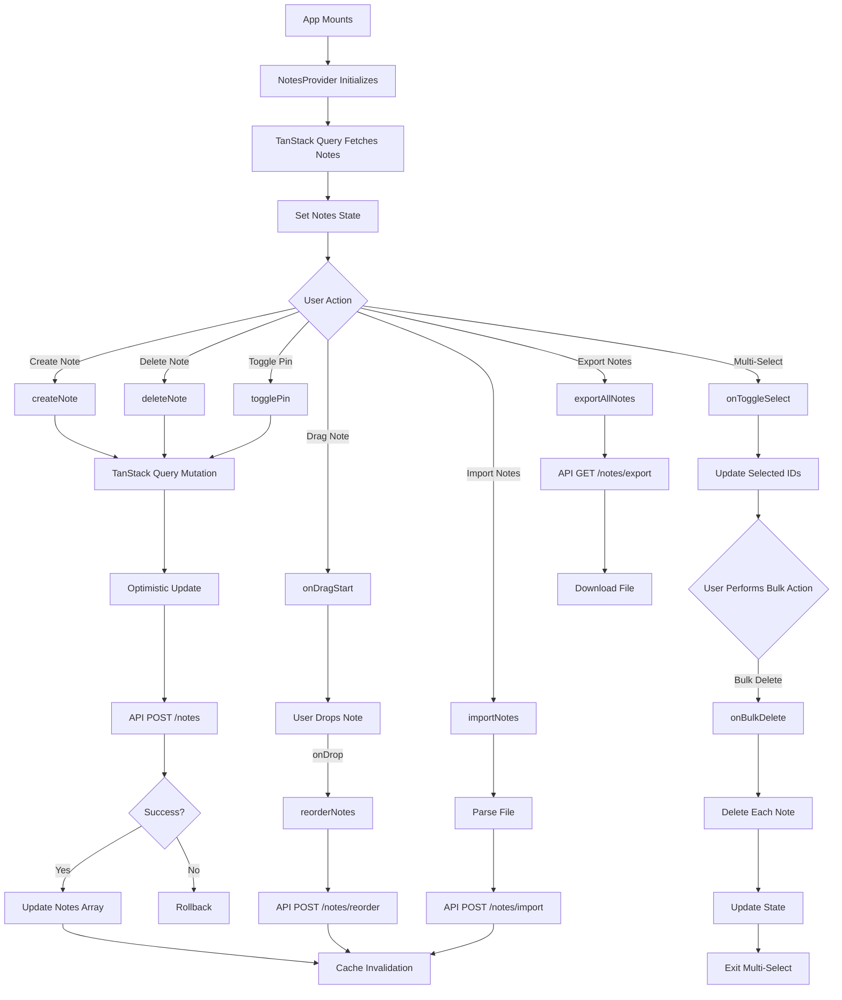

# NotesContext
**Last Updated:** January 21, 2026  
**Version:** 2.0  
**Status:** ✅ Production Ready

---

## Overview

`NotesContext` is a React Context API implementation that manages all notes data and operations throughout GlassKeep. Provides centralized state management for notes, trash, archived notes, multi-select operations, bulk actions, import/export, and real-time collaboration via Server-Sent Events (SSE).

---

## Purpose

Provide comprehensive notes functionality with:
- Notes, trash, and archived notes management
- Real-time collaboration via SSE
- Multi-select operations
- Bulk actions (delete, pin, archive, color)
- Drag-and-drop reordering
- Import/export functionality (JSON, Google Keep, Markdown)
- Search and filtering by tags
- Cache management with localStorage
- Integration with TanStack Query for data fetching
- Optimistic updates for better UX

---

## Context Structure

```
NotesContext
├── Data State
│   ├── notes
│   ├── trashNotes
│   ├── notesLoading
│   └── viewTrash
├── Filter State
│   ├── search
│   └── tagFilter
├── Multi-Select State
│   ├── multiMode
│   └── selectedIds
├── Collaboration State
│   ├── sseConnected
│   └── isOnline
├── CRUD Operations
│   ├── createNote()
│   ├── toggleArchiveNote()
│   ├── deleteNote()
│   ├── restoreNote()
│   ├── emptyTrash()
│   ├── permanentDeleteNote()
│   ├── togglePin()
│   └── updateChecklistItem()
├── Bulk Operations
│   ├── onBulkDelete()
│   ├── onBulkPin()
│   ├── onBulkArchive()
│   ├── onBulkColor()
│   └── onBulkDownloadZip()
├── Import/Export
│   ├── exportAllNotes()
│   ├── importNotes()
│   ├── importGoogleKeep()
│   ├── importMarkdown()
│   ├── downloadSecretKey()
│   └── downloadNoteAsMarkdown()
├── Drag and Drop
│   ├── onDragStart()
│   ├── onDragOver()
│   ├── onDragLeave()
│   ├── onDrop()
│   └── onDragEnd()
├── Multi-Select Actions
│   ├── onStartMulti()
│   ├── onExitMulti()
│   ├── onToggleSelect()
│   ├── onSelectAllPinned()
│   └── onSelectAllOthers()
└── Computed Values
    ├── tagsWithCounts
    ├── filteredEmptyWithSearch
    ├── allEmpty
    ├── pinned
    └── others
```

---

## Provider Value

```javascript
{
  // Data State
  notes: array,                       // All active notes
  setNotes: (notes) => void,         // Set notes state
  notesLoading: boolean,               // Loading state
  trashNotes: array,                  // Trash notes
  trashLoading: boolean,              // Trash loading
  viewTrash: boolean,                 // View trash mode
  setViewTrash: (view) => void,     // Set trash view
  
  // Filter State
  search: string,                     // Search query
  setSearch: (query) => void,       // Set search query
  tagFilter: string | null,           // Tag filter
  setTagFilter: (tag) => void,      // Set tag filter
  
  // Multi-Select State
  multiMode: boolean,                 // Multi-select mode
  selectedIds: array,                // Selected note IDs
  onStartMulti: () => void,          // Start multi-select
  onExitMulti: () => void,           // Exit multi-select
  onToggleSelect: (id, checked) => void,  // Toggle selection
  onSelectAllPinned: () => void,     // Select all pinned
  onSelectAllOthers: () => void,     // Select all others
  
  // CRUD Operations
  createNote: (data) => Promise,      // Create new note
  toggleArchiveNote: (id, archived) => Promise,  // Archive note
  deleteNote: (id) => Promise,       // Delete note
  restoreNote: (id) => Promise,      // Restore from trash
  emptyTrash: () => Promise,          // Empty trash
  permanentDeleteNote: (id) => Promise,  // Permanent delete
  togglePin: (id, pinned) => Promise,  // Toggle pin
  updateChecklistItem: (noteId, itemId, checked) => Promise,  // Update item
  
  // Import/Export
  exportAllNotes: () => Promise,      // Export all notes as JSON
  importNotes: (files) => Promise,    // Import JSON notes
  importGoogleKeep: (files) => Promise,  // Import Google Keep notes
  importMarkdown: (files) => Promise,  // Import Markdown files
  downloadSecretKey: () => Promise,   // Download secret key
  downloadNoteAsMarkdown: (note) => void,  // Download note as MD
  
  // Bulk Operations
  onBulkDelete: () => Promise,        // Bulk delete
  onBulkPin: (pinned) => Promise,    // Bulk pin/unpin
  onBulkArchive: () => Promise,        // Bulk archive
  onBulkColor: (color) => Promise,    // Bulk color change
  onBulkDownloadZip: () => void,      // Bulk download
  
  // Drag and Drop
  onDragStart: (e, id) => void,      // Drag start
  onDragOver: (e) => void,           // Drag over
  onDragLeave: (e) => void,          // Drag leave
  onDrop: (e, targetId) => Promise,  // Drop
  onDragEnd: (e) => void,            // Drag end
  
  // Collaboration
  sseConnected: boolean,              // SSE connection state
  isOnline: boolean,                  // Online status
  
  // Computed Values
  tagsWithCounts: array,              // Tags with counts
  filteredEmptyWithSearch: boolean,   // Empty with search
  allEmpty: boolean,                 // All notes empty
  pinned: array,                     // Pinned notes
  others: array,                     // Other notes
  
  // Cache
  invalidateNotesCache: () => void,   // Clear cache
}
```

---

## State Properties

### Data State

#### notes
- **Type:** `array`
- **Default:** `[]`
- **Purpose:** All active notes
- **Source:** TanStack Query (useNotesQuery)

#### trashNotes
- **Type:** `array`
- **Default:** `[]`
- **Purpose:** Notes in trash
- **Source:** TanStack Query (useTrash)

#### notesLoading
- **Type:** `boolean`
- **Purpose:** Loading state for any notes query
- **Computed:** From query loading states

#### viewTrash
- **Type:** `boolean`
- **Default:** `false`
- **Purpose:** View trash mode
- **Usage:** Toggle between notes and trash view

---

### Filter State

#### search
- **Type:** `string`
- **Default:** `''`
- **Purpose:** Search query
- **Usage:** Filter notes by text search

#### tagFilter
- **Type:** `string | null`
- **Default:** `null`
- **Purpose:** Tag filter
- **Values:** Tag name or 'ARCHIVED'
- **Usage:** Filter notes by tag

---

### Multi-Select State

#### multiMode
- **Type:** `boolean`
- **Default:** `false`
- **Purpose:** Multi-select mode active

#### selectedIds
- **Type:** `array`
- **Default:** `[]`
- **Purpose:** Selected note IDs
- **Format:** Array of string IDs

---

### Collaboration State

#### sseConnected
- **Type:** `boolean`
- **Purpose:** SSE connection state
- **Source:** useCollaboration hook

#### isOnline
- **Type:** `boolean`
- **Purpose:** Online status
- **Source:** useCollaboration hook

---

## Actions

### createNote()
- **Type:** `(noteData: object) => Promise<object>`
- **Purpose:** Create new note
- **Parameters:**
  - `noteData`: Note data object
- **Actions:**
  1. Use TanStack Query mutation
  2. Optimistic update handled by mutation
  3. Cache invalidation handled by mutation
  4. Log error on failure

**Note Data Structure:**
```javascript
{
  id: string,              // Unique ID (optional, generated if not provided)
  type: string,            // 'text' | 'checklist' | 'draw'
  title: string,           // Note title
  content: string,         // Note content (text/draw)
  items: array,            // Checklist items (checklist only)
  tags: array,             // Tags array
  images: array,           // Images array
  color: string,           // Note color
  pinned: boolean,         // Pinned status
  position: number,        // Sort position
  timestamp: string,        // ISO timestamp
  updated_at: string       // ISO timestamp
}
```

**Usage:**
```javascript
const { createNote } = useNotes()

async function handleCreate() {
  try {
    const note = await createNote({
      type: 'text',
      title: 'My Note',
      content: 'Note content',
      tags: ['work'],
      color: 'default',
      pinned: false,
    })
    console.log('Note created:', note)
  } catch (error) {
    console.error('Failed to create note:', error)
  }
}
```

---

### toggleArchiveNote()
- **Type:** `(noteId: string, archived: boolean) => Promise<void>`
- **Purpose:** Archive or unarchive note
- **Parameters:**
  - `noteId`: Note ID
  - `archived`: Archive status
- **Actions:**
  1. Optimistically update local state
  2. Call update mutation
  3. Invalidate cache

**Usage:**
```javascript
const { toggleArchiveNote } = useNotes()

async function handleArchive(noteId) {
  await toggleArchiveNote(noteId, true)
}

async function handleUnarchive(noteId) {
  await toggleArchiveNote(noteId, false)
}
```

---

### deleteNote()
- **Type:** `(noteId: string) => Promise<void>`
- **Purpose:** Delete note (move to trash)
- **Parameters:**
  - `noteId`: Note ID
- **Actions:**
  1. Use delete mutation
  2. Optimistic update handled by mutation
  3. Cache invalidation handled by mutation

**Usage:**
```javascript
const { deleteNote } = useNotes()

async function handleDelete(noteId) {
  await deleteNote(noteId)
}
```

---

### restoreNote()
- **Type:** `(noteId: string) => Promise<void>`
- **Purpose:** Restore note from trash
- **Parameters:**
  - `noteId`: Note ID
- **Actions:**
  1. Use restore mutation
  2. Cache invalidation handled by mutation

**Usage:**
```javascript
const { restoreNote } = useNotes()

async function handleRestore(noteId) {
  await restoreNote(noteId)
}
```

---

### emptyTrash()
- **Type:** `() => Promise<void>`
- **Purpose:** Empty trash (permanent delete all)
- **Actions:**
  1. Use empty trash mutation
  2. Cache invalidation handled by mutation

**Usage:**
```javascript
const { emptyTrash } = useNotes()

async function handleEmptyTrash() {
  if (confirm('Are you sure you want to empty the trash?')) {
    await emptyTrash()
  }
}
```

---

### permanentDeleteNote()
- **Type:** `(noteId: string) => Promise<void>`
- **Purpose:** Permanently delete note from trash
- **Parameters:**
  - `noteId`: Note ID
- **Actions:**
  1. Use permanent delete mutation
  2. Cache invalidation handled by mutation

**Usage:**
```javascript
const { permanentDeleteNote } = useNotes()

async function handlePermanentDelete(noteId) {
  if (confirm('Are you sure you want to permanently delete this note?')) {
    await permanentDeleteNote(noteId)
  }
}
```

---

### togglePin()
- **Type:** `(id: string, toPinned: boolean) => Promise<void>`
- **Purpose:** Toggle note pin status
- **Parameters:**
  - `id`: Note ID
  - `toPinned`: Pin status
- **Actions:**
  1. Use toggle pin mutation
  2. Cache invalidation handled by mutation

**Usage:**
```javascript
const { togglePin } = useNotes()

async function handleTogglePin(noteId, isPinned) {
  await togglePin(noteId, !isPinned)
}
```

---

### updateChecklistItem()
- **Type:** `(noteId: string, itemId: string, checked: boolean) => Promise<void>`
- **Purpose:** Update checklist item completion
- **Parameters:**
  - `noteId`: Note ID
  - `itemId`: Item ID
  - `checked`: Completion status
- **Actions:**
  1. Find note
  2. Store original items for rollback
  3. Optimistically update local state
  4. Call API to update
  5. Invalidate cache
  6. Rollback on error

**Usage:**
```javascript
const { updateChecklistItem } = useNotes()

async function handleToggleItem(noteId, itemId, isChecked) {
  await updateChecklistItem(noteId, itemId, isChecked)
}
```

---

### exportAllNotes()
- **Type:** `() => Promise<void>`
- **Purpose:** Export all notes as JSON
- **Actions:**
  1. Fetch from API
  2. Format as JSON
  3. Download file
  4. Log export event

**Usage:**
```javascript
const { exportAllNotes } = useNotes()

async function handleExport() {
  try {
    await exportAllNotes()
    console.log('Notes exported successfully')
  } catch (error) {
    console.error('Export failed:', error)
  }
}
```

---

### importNotes()
- **Type:** `(fileList: FileList) => Promise<number>`
- **Purpose:** Import notes from JSON
- **Parameters:**
  - `fileList`: FileList from input
- **Returns:** Number of notes imported
- **Actions:**
  1. Read file
  2. Parse JSON
  3. Validate format
  4. Send to API
  5. Log import event

**Usage:**
```javascript
const { importNotes } = useNotes()

async function handleImport(e) {
  try {
    const count = await importNotes(e.target.files)
    console.log(`Imported ${count} notes`)
  } catch (error) {
    console.error('Import failed:', error)
  }
}
```

---

### importGoogleKeep()
- **Type:** `(fileList: FileList) => Promise<number>`
- **Purpose:** Import Google Keep notes
- **Parameters:**
  - `fileList`: FileList from input
- **Returns:** Number of notes imported
- **Actions:**
  1. Read all files
  2. Parse each file
  3. Extract note data
  4. Convert to GlassKeep format
  5. Send to API
  6. Log import event

**Google Keep Format:**
```javascript
{
  title: string,
  textContent: string,
  listContent: [{ text: string, isChecked: boolean }],
  labels: [{ name: string }],
  isPinned: boolean,
  userEditedTimestampUsec: number,
  createdTimestampUsec: number
}
```

**Usage:**
```javascript
const { importGoogleKeep } = useNotes()

async function handleGoogleKeepImport(e) {
  try {
    const count = await importGoogleKeep(e.target.files)
    console.log(`Imported ${count} Google Keep notes`)
  } catch (error) {
    console.error('Import failed:', error)
  }
}
```

---

### importMarkdown()
- **Type:** `(fileList: FileList) => Promise<number>`
- **Purpose:** Import Markdown files
- **Parameters:**
  - `fileList`: FileList from input
- **Returns:** Number of notes imported
- **Actions:**
  1. Read each file
  2. Extract title from first line (if heading)
  3. Extract content from rest
  4. Create note objects
  5. Send to API
  6. Log import event

**Usage:**
```javascript
const { importMarkdown } = useNotes()

async function handleMarkdownImport(e) {
  try {
    const count = await importMarkdown(e.target.files)
    console.log(`Imported ${count} Markdown files`)
  } catch (error) {
    console.error('Import failed:', error)
  }
}
```

---

### downloadSecretKey()
- **Type:** `() => Promise<void>`
- **Purpose:** Download user's secret key
- **Actions:**
  1. Fetch from API
  2. Format with instructions
  3. Download as text file

**Usage:**
```javascript
const { downloadSecretKey } = useNotes()

async function handleDownloadSecretKey() {
  try {
    await downloadSecretKey()
    console.log('Secret key downloaded')
  } catch (error) {
    console.error('Failed to download secret key:', error)
  }
}
```

---

### downloadNoteAsMarkdown()
- **Type:** `(note: object) => void`
- **Purpose:** Download single note as Markdown
- **Parameters:**
  - `note`: Note object

**Usage:**
```javascript
const { downloadNoteAsMarkdown } = useNotes()

function handleDownload(note) {
  downloadNoteAsMarkdown(note)
}
```

---

## Multi-Select Actions

### onStartMulti()
- **Type:** `() => void`
- **Purpose:** Start multi-select mode
- **Actions:**
  1. Enable multi-select mode
  2. Clear selected IDs

**Usage:**
```javascript
const { onStartMulti } = useNotes()

<button onClick={onStartMulti}>
  Select Multiple
</button>
```

---

### onExitMulti()
- **Type:** `() => void`
- **Purpose:** Exit multi-select mode
- **Actions:**
  1. Disable multi-select mode
  2. Clear selected IDs

**Usage:**
```javascript
const { onExitMulti } = useNotes()

<button onClick={onExitMulti}>
  Cancel Selection
</button>
```

---

### onToggleSelect()
- **Type:** `(id: string, checked: boolean) => void`
- **Purpose:** Toggle note selection
- **Parameters:**
  - `id`: Note ID
  - `checked`: Selection state

**Usage:**
```javascript
const { onToggleSelect } = useNotes()

<input
  type="checkbox"
  checked={selected}
  onChange={(e) => onToggleSelect(noteId, e.target.checked)}
/>
```

---

### onSelectAllPinned()
- **Type:** `() => void`
- **Purpose:** Select all pinned notes

**Usage:**
```javascript
const { onSelectAllPinned } = useNotes()

<button onClick={onSelectAllPinned}>
  Select All Pinned
</button>
```

---

### onSelectAllOthers()
- **Type:** `() => void`
- **Purpose:** Select all non-pinned notes

**Usage:**
```javascript
const { onSelectAllOthers } = useNotes()

<button onClick={onSelectAllOthers}>
  Select All Others
</button>
```

---

## Bulk Operations

### onBulkDelete()
- **Type:** `() => Promise<void>`
- **Purpose:** Delete all selected notes
- **Actions:**
  1. Delete each note individually
  2. Collect failed IDs
  3. Update state for successful deletions
  4. Show error if any failed
  5. Exit multi-select mode

**Usage:**
```javascript
const { onBulkDelete } = useNotes()

async function handleBulkDelete() {
  if (confirm(`Delete ${selectedIds.length} notes?`)) {
    await onBulkDelete()
  }
}
```

---

### onBulkPin()
- **Type:** `(pinned: boolean) => Promise<void>`
- **Purpose:** Pin/unpin all selected notes
- **Parameters:**
  - `pinned`: Pin status to apply
- **Actions:**
  1. Update each note individually
  2. Collect failed IDs
  3. Update state for successful updates
  4. Show error if any failed
  5. Exit multi-select mode

**Usage:**
```javascript
const { onBulkPin } = useNotes()

async function handleBulkPin() {
  await onBulkPin(true)
}

async function handleBulkUnpin() {
  await onBulkPin(false)
}
```

---

### onBulkArchive()
- **Type:** `() => Promise<void>`
- **Purpose:** Archive/unarchive all selected notes
- **Actions:**
  1. Archive each note individually
  2. Collect failed IDs
  3. Update state for successful archives
  4. Show error if any failed
  5. Exit multi-select mode

**Usage:**
```javascript
const { onBulkArchive } = useNotes()

async function handleBulkArchive() {
  await onBulkArchive()
}
```

---

### onBulkColor()
- **Type:** `(color: string) => Promise<void>`
- **Purpose:** Change color of all selected notes
- **Parameters:**
  - `color`: Color to apply
- **Actions:**
  1. Update each note individually
  2. Collect failed IDs
  3. Update state for successful updates
  4. Show error if any failed
  5. Exit multi-select mode

**Usage:**
```javascript
const { onBulkColor } = useNotes()

async function handleBulkColor(color) {
  await onBulkColor(color)
}
```

---

### onBulkDownloadZip()
- **Type:** `() => void`
- **Purpose:** Download all selected notes
- **Actions:**
  1. Get selected notes
  2. Format as JSON
  3. Download file

**Usage:**
```javascript
const { onBulkDownloadZip } = useNotes()

<button onClick={onBulkDownloadZip}>
  Download Selected
</button>
```

---

## Drag and Drop

### onDragStart()
- **Type:** `(e: DragEvent, noteId: string) => void`
- **Purpose:** Handle drag start
- **Parameters:**
  - `e`: Drag event
  - `noteId`: Note ID being dragged

**Usage:**
```javascript
const { onDragStart } = useNotes()

<div
  draggable
  onDragStart={(e) => onDragStart(e, note.id)}
>
  {/* Note content */}
</div>
```

---

### onDragOver()
- **Type:** `(e: DragEvent) => void`
- **Purpose:** Handle drag over
- **Parameters:**
  - `e`: Drag event

**Usage:**
```javascript
const { onDragOver } = useNotes()

<div onDragOver={onDragOver}>
  {/* Drop target */}
</div>
```

---

### onDragLeave()
- **Type:** `(e: DragEvent) => void`
- **Purpose:** Handle drag leave

**Usage:**
```javascript
const { onDragLeave } = useNotes()

<div onDragLeave={onDragLeave}>
  {/* Drop target */}
</div>
```

---

### onDrop()
- **Type:** `(e: DragEvent, targetNoteId: string) => Promise<void>`
- **Purpose:** Handle drop
- **Parameters:**
  - `e`: Drag event
  - `targetNoteId`: Target note ID
- **Actions:**
  1. Get dragged ID from data
  2. Find positions in combined list
  3. Create new order
  4. Call reorder API
  5. Invalidate cache

**Usage:**
```javascript
const { onDrop } = useNotes()

<div
  onDragOver={onDragOver}
  onDrop={(e) => onDrop(e, note.id)}
>
  {/* Drop target */}
</div>
```

---

### onDragEnd()
- **Type:** `(e: DragEvent) => void`
- **Purpose:** Handle drag end

**Usage:**
```javascript
const { onDragEnd } = useNotes()

<div
  draggable
  onDragEnd={onDragEnd}
>
  {/* Draggable element */}
</div>
```

---

## Computed Values

### tagsWithCounts
- **Type:** `array`
- **Purpose:** All tags with note counts
- **Format:** `[{ name: string, count: number }]`

**Usage:**
```javascript
const { tagsWithCounts } = useNotes()

tagsWithCounts.map(tag => (
  <div key={tag.name}>
    {tag.name} ({tag.count})
  </div>
))
```

---

### filteredEmptyWithSearch
- **Type:** `boolean`
- **Purpose:** Empty state when search active

---

### allEmpty
- **Type:** `boolean`
- **Purpose:** Empty state when no notes

---

### pinned
- **Type:** `array`
- **Purpose:** Filtered pinned notes

---

### others
- **Type:** `array`
- **Purpose:** Filtered non-pinned notes

---

## Cache Management

### invalidateNotesCache()
- **Type:** `() => void`
- **Purpose:** Clear all notes cache
- **Actions:**
  1. Remove notes cache
  2. Remove archived notes cache
  3. Remove trash notes cache
  4. Remove cache timestamp

**Usage:**
```javascript
const { invalidateNotesCache } = useNotes()

function handleLogout() {
  invalidateNotesCache()
}
```

---

## useNotes Hook

### Purpose
Convenience hook to access notes context from any component.

### Usage

```javascript
import { useNotes } from '../contexts/NotesContext'

function MyComponent() {
  const {
    notes,
    search,
    setSearch,
    tagFilter,
    setTagFilter,
    createNote,
    deleteNote,
    // ... other properties
  } = useNotes()
  
  // Use notes state and functions
  return <div>...</div>
}
```

### Error Handling
Throws error if used outside `NotesProvider`:
```javascript
if (!context) {
  throw new Error('useNotes must be used within NotesProvider');
}
```

---

## Provider Setup

### App Component

```javascript
import { NotesProvider } from './contexts/NotesContext'

function App() {
  return (
    <NotesProvider>
      {/* App content */}
      <Routes />
    </NotesProvider>
  )
}
```

---

## Usage Examples

### Notes List with Search and Filter

```javascript
import { useNotes } from '../contexts/NotesContext'

function NotesList() {
  const {
    notes,
    search,
    setSearch,
    tagFilter,
    setTagFilter,
    tagsWithCounts,
  } = useNotes()
  
  return (
    <div>
      <input
        type="text"
        value={search}
        onChange={(e) => setSearch(e.target.value)}
        placeholder="Search notes..."
      />
      
      <select
        value={tagFilter || ''}
        onChange={(e) => setTagFilter(e.target.value || null)}
      >
        <option value="">All Tags</option>
        {tagsWithCounts.map(tag => (
          <option key={tag.name} value={tag.name}>
            {tag.name} ({tag.count})
          </option>
        ))}
      </select>
      
      <div className="notes">
        {notes.map(note => (
          <NoteCard key={note.id} note={note} />
        ))}
      </div>
    </div>
  )
}
```

### Note with Pin Toggle

```javascript
import { useNotes } from '../contexts/NotesContext'

function NoteCard({ note }) {
  const { togglePin } = useNotes()
  
  return (
    <div className="note-card">
      <h3>{note.title}</h3>
      <button
        onClick={() => togglePin(note.id, !note.pinned)}
      >
        {note.pinned ? '📌 Unpin' : '📍 Pin'}
      </button>
    </div>
  )
}
```

### Multi-Select Interface

```javascript
import { useNotes } from '../contexts/NotesContext'

function MultiSelectBar() {
  const {
    multiMode,
    selectedIds,
    onStartMulti,
    onExitMulti,
    onBulkDelete,
    onBulkPin,
    onBulkArchive,
  } = useNotes()
  
  if (!multiMode) {
    return (
      <button onClick={onStartMulti}>
        Select Multiple
      </button>
    )
  }
  
  return (
    <div className="multi-select-bar">
      <span>{selectedIds.length} selected</span>
      
      <button onClick={onBulkDelete}>
        Delete
      </button>
      
      <button onClick={() => onBulkPin(true)}>
        Pin
      </button>
      
      <button onClick={onBulkArchive}>
        Archive
      </button>
      
      <button onClick={onExitMulti}>
        Cancel
      </button>
    </div>
  )
}
```

### Drag and Drop Notes

```javascript
import { useNotes } from '../contexts/NotesContext'

function DraggableNote({ note }) {
  const {
    onDragStart,
    onDragOver,
    onDrop,
  } = useNotes()
  
  return (
    <div
      className="note-card"
      draggable
      onDragStart={(e) => onDragStart(e, note.id)}
      onDragOver={onDragOver}
      onDrop={(e) => onDrop(e, note.id)}
    >
      <h3>{note.title}</h3>
      <p>{note.content}</p>
    </div>
  )
}
```

### Import/Export Panel

```javascript
import { useNotes } from '../contexts/NotesContext'

function ImportExportPanel() {
  const {
    exportAllNotes,
    importNotes,
    importGoogleKeep,
    importMarkdown,
  } = useNotes()
  
  return (
    <div className="import-export-panel">
      <h3>Export</h3>
      <button onClick={exportAllNotes}>
        Export All Notes (JSON)
      </button>
      
      <h3>Import</h3>
      <input
        type="file"
        accept=".json"
        onChange={(e) => importNotes(e.target.files)}
      />
      
      <input
        type="file"
        accept=".json"
        multiple
        onChange={(e) => importGoogleKeep(e.target.files)}
      />
      
      <input
        type="file"
        accept=".md"
        multiple
        onChange={(e) => importMarkdown(e.target.files)}
      />
    </div>
  )
}
```

### Trash View

```javascript
import { useNotes } from '../contexts/NotesContext'

function TrashView() {
  const {
    viewTrash,
    setViewTrash,
    trashNotes,
    trashLoading,
    restoreNote,
    permanentDeleteNote,
    emptyTrash,
  } = useNotes()
  
  return (
    <div>
      <button onClick={() => setViewTrash(!viewTrash)}>
        {viewTrash ? 'View Notes' : 'View Trash'}
      </button>
      
      {viewTrash && (
        <>
          <div className="trash-notes">
            {trashNotes.map(note => (
              <TrashNote
                key={note.id}
                note={note}
                onRestore={restoreNote}
                onDelete={permanentDeleteNote}
              />
            ))}
          </div>
          
          <button onClick={emptyTrash}>
            Empty Trash
          </button>
        </>
      )}
    </div>
  )
}
```

---

## Data Flow



---

## Testing

### Unit Tests

```javascript
describe('NotesContext', () => {
  describe('NotesProvider', () => {
    it('should initialize with default state', () => {
      // Test: default values set correctly
    });
    
    it('should create note', async () => {
      // Test: createNote → note added to array
    });
    
    it('should delete note', async () => {
      // Test: deleteNote → note removed from array
    });
    
    it('should toggle pin', async () => {
      // Test: togglePin → pin status updated
    });
    
    it('should archive note', async () => {
      // Test: toggleArchiveNote → note archived
    });
    
    it('should restore note', async () => {
      // Test: restoreNote → note restored
    });
    
    it('should empty trash', async () => {
      // Test: emptyTrash → trash cleared
    });
    
    it('should update checklist item', async () => {
      // Test: updateChecklistItem → item updated
    });
    
    it('should export notes', async () => {
      // Test: exportAllNotes → file downloaded
    });
    
    it('should import notes', async () => {
      // Test: importNotes → notes added
    });
    
    it('should import Google Keep notes', async () => {
      // Test: importGoogleKeep → notes imported
    });
    
    it('should import Markdown files', async () => {
      // Test: importMarkdown → notes created
    });
    
    it('should handle multi-select', () => {
      // Test: onToggleSelect → selected IDs updated
    });
    
    it('should bulk delete notes', async () => {
      // Test: onBulkDelete → notes deleted
    });
    
    it('should bulk pin notes', async () => {
      // Test: onBulkPin → notes pinned
    });
    
    it('should reorder notes via drag and drop', async () => {
      // Test: onDrop → notes reordered
    });
  });
  
  describe('useNotes', () => {
    it('should return notes context', () => {
      // Test: useNotes → context values
    });
    
    it('should throw error outside provider', () => {
      // Test: useNotes outside NotesProvider → error
    });
  });
});
```

### Integration Tests

```javascript
describe('NotesContext Integration', () => {
  it('should persist notes across page reload', () => {
    // Test: create note → reload → note still exists
  });
  
  it('should sync with server via SSE', () => {
    // Test: server update → local notes updated
  });
  
  it('should handle offline state', () => {
    // Test: offline → operations queued
  });
});
```

### E2E Tests (Playwright)

```javascript
test('User creates note', async ({ page }) => {
  await page.goto('/#/notes');
  
  // Click new note button
  await page.click('text=New Note');
  
  // Fill note
  await page.fill('input[placeholder="Title"]', 'Test Note');
  await page.fill('textarea[placeholder="Write your note..."]', 'Test content');
  
  // Save note
  await page.click('text=Save');
  
  // Verify note appears in list
  await expect(page.locator('text=Test Note')).toBeVisible();
});

test('User searches notes', async ({ page }) => {
  await page.goto('/#/notes');
  
  // Enter search query
  await page.fill('input[placeholder="Search notes..."]', 'test');
  
  // Verify filtered results
  const notes = await page.locator('.note-card').count();
  expect(notes).toBeGreaterThan(0);
});

test('User pins note', async ({ page }) => {
  await page.goto('/#/notes');
  
  // Find a note
  const note = page.locator('.note-card').first();
  
  // Pin note
  await note.click('button:has-text("Pin")');
  
  // Verify note is pinned
  await expect(note.locator('text=📌')).toBeVisible();
});

test('User uses multi-select', async ({ page }) => {
  await page.goto('/#/notes');
  
  // Start multi-select
  await page.click('text=Select Multiple');
  
  // Select notes
  await page.locator('.note-card input[type="checkbox"]').nth(0).check();
  await page.locator('.note-card input[type="checkbox"]').nth(1).check();
  
  // Bulk delete
  await page.click('text=Delete');
  
  // Confirm deletion
  await page.click('text=Confirm');
  
  // Verify notes deleted
  const notes = await page.locator('.note-card').count();
  expect(notes).toBeLessThan(2);
});
```

---

## Troubleshooting

### Issue: Notes not loading

**Possible Causes:**
- API endpoint down
- Network error
- Token expired
- TanStack Query error

**Solutions:**
1. Check browser console for errors
2. Verify API endpoint status
3. Check token validity
4. Verify online status

---

### Issue: Changes not syncing

**Possible Causes:**
- SSE not connected
- WebSocket error
- Server not broadcasting

**Solutions:**
1. Check sseConnected state
2. Verify isOnline state
3. Check server logs
4. Test SSE connection manually

---

### Issue: Bulk operation failing

**Possible Causes:**
- Some notes already deleted
- Permission errors
- Network issues

**Solutions:**
1. Check failed IDs in error
2. Verify user permissions
3. Check network connection
4. Retry operation

---

### Issue: Import failing

**Possible Causes:**
- Invalid file format
- Corrupted JSON
- Missing required fields

**Solutions:**
1. Validate file format
2. Check JSON structure
3. Verify required fields present
4. Test with smaller file

---

### Issue: Drag and drop not working

**Possible Causes:**
- Event handlers not attached
- preventDefault not called
- Data not set correctly

**Solutions:**
1. Verify event handlers attached
2. Check preventDefault in onDragOver
3. Verify dataTransfer.setData in onDragStart
4. Test drag and drop manually

---

## Best Practices

1. **Always use useNotes hook** instead of direct context access
2. **Handle errors gracefully** with try-catch
3. **Show loading states** during operations
4. **Provide user feedback** for all actions
5. **Use optimistic updates** for better UX
6. **Implement proper error handling** for bulk operations
7. **Cache data appropriately** for offline support
8. **Validate imports** before processing
9. **Test drag and drop** thoroughly
10. **Monitor SSE connection** for collaboration

---

## Performance Considerations

### Optimizations

1. **TanStack Query Caching**
   - Automatic data caching
   - Intelligent refetching
   - Request deduplication
   - Reduced API calls

2. **Optimistic Updates**
   - Immediate UI feedback
   - Rollback on error
   - Better perceived performance

3. **Bulk Operations**
   - Efficient API calls
   - Batched updates
   - Faster processing

4. **SSE Collaboration**
   - Real-time updates
   - Reduced polling
   - Better sync

---

## Related Contexts

- [AuthContext](./AuthContext.md) - Authentication for token and user info
- [UIContext](./UIContext.md) - UI state for toast notifications
- [ModalContext](./ModalContext.md) - Modal context for note editing

---

## Dependencies

- `react` - React (createContext, useState, useCallback, useContext, useEffect)
- `./AuthContext` - Authentication (token, currentUser)
- `../hooks/useCollaboration` - SSE collaboration hook
- `../hooks/queries/useNotes` - TanStack Query hooks
- `../hooks/mutations/useNoteMutations` - TanStack Query mutations
- `../utils/helpers` - Helper functions (api, uid, mdForDownload, sanitizeFilename, downloadText)
- `../utils/logger` - Logging utility

---

## API Endpoints Used

### GET /notes
- **Purpose:** Get user notes
- **Query:** `?tag={tag}&search={query}`
- **Response:** Array of notes

### POST /notes
- **Purpose:** Create new note
- **Body:** Note object
- **Response:** Created note

### PUT /notes/{id}
- **Purpose:** Update note
- **Body:** Note updates
- **Response:** Updated note

### PATCH /notes/{id}
- **Purpose:** Partially update note
- **Body:** Partial note updates
- **Response:** Updated note

### DELETE /notes/{id}
- **Purpose:** Delete note (move to trash)
- **Response:** Success message

### POST /notes/{id}/archive
- **Purpose:** Archive note
- **Body:** `{ archived: boolean }`
- **Response:** Success message

### POST /notes/reorder
- **Purpose:** Reorder notes
- **Body:** `{ positions: [{ id, position }] }`
- **Response:** Success message

### GET /notes/export
- **Purpose:** Export all notes
- **Response:** Exported notes object

### POST /notes/import
- **Purpose:** Import notes
- **Body:** `{ notes: array }`
- **Response:** Import result

### GET /secret-key
- **Purpose:** Get user secret key
- **Response:** `{ key: string }`

### SSE /notes/stream
- **Purpose:** Real-time note updates
- **Query:** `?token={token}`
- **Events:** notes_updated

---

## TanStack Query Integration

### Query Hooks

- `useNotesQuery()` - Fetch active notes
- `useTrash()` - Fetch trash notes
- `useArchived()` - Fetch archived notes

### Mutation Hooks

- `useCreateNote()` - Create note
- `useUpdateNote()` - Update note
- `useDeleteNote()` - Delete note
- `useRestoreNote()` - Restore note
- `useEmptyTrash()` - Empty trash
- `usePermanentDeleteNote()` - Permanent delete
- `useTogglePin()` - Toggle pin

### Benefits

- Automatic caching
- Optimistic updates
- Background refetching
- Error handling
- Loading states
- Request deduplication

---

**Context Version:** 2.0  
**Last Updated:** January 21, 2026  
**Status:** ✅ Production Ready