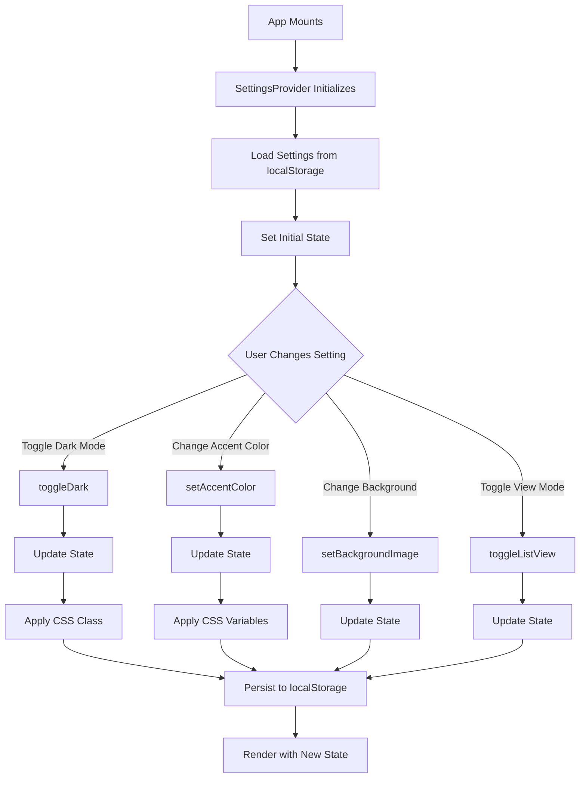

# SettingsContext
**Last Updated:** January 21, 2026  
**Version:** 1.0  
**Status:** ✅ Production Ready

---

## Overview

`SettingsContext` is a React Context API implementation that manages user preferences and application settings throughout GlassKeep. Provides centralized state management for appearance, layout, and feature preferences with automatic localStorage persistence.

---

## Purpose

Provide comprehensive settings functionality with:
- Dark/light mode toggling
- Background image management
- Accent color customization
- Card transparency control
- Sidebar visibility and width
- Grid/list view toggle
- Local AI feature toggle
- Automatic localStorage persistence
- Theme-aware accent color application
- Background overlay management

---

## Context Structure

```
SettingsContext
├── Dark Mode
│   ├── dark
│   ├── setDark
│   └── toggleDark
├── Background
│   ├── backgroundImage
│   ├── setBackgroundImage
│   ├── backgroundOverlay
│   ├── setBackgroundOverlay
│   ├── overlayOpacity
│   └── setOverlayOpacity
├── Accent Color
│   ├── accentColor
│   └── setAccentColor
├── Transparency
│   ├── cardTransparency
│   └── setCardTransparency
├── Sidebar
│   ├── alwaysShowSidebarOnWide
│   ├── setAlwaysShowSidebarOnWide
│   ├── sidebarWidth
│   └── setSidebarWidth
├── View Mode
│   ├── listView
│   ├── setListView
│   └── toggleListView
└── Local AI
    ├── localAiEnabled
    └── setLocalAiEnabled
```

---

## Provider Value

```javascript
{
  // Dark Mode
  dark: boolean,                          // Dark mode active
  setDark: (dark) => void,               // Set dark mode
  toggleDark: () => void,                 // Toggle dark mode
  
  // Background
  backgroundImage: string,                 // Background image ID
  setBackgroundImage: (id) => void,       // Set background image
  backgroundOverlay: boolean,              // Background overlay enabled
  setBackgroundOverlay: (show) => void,   // Set overlay visibility
  overlayOpacity: number,                 // Overlay opacity (0-1)
  setOverlayOpacity: (opacity) => void,    // Set overlay opacity
  
  // Accent Color
  accentColor: string,                    // Accent color ID
  setAccentColor: (color) => void,       // Set accent color
  
  // Transparency
  cardTransparency: string,               // Card transparency level
  setCardTransparency: (level) => void,   // Set card transparency
  
  // Sidebar
  alwaysShowSidebarOnWide: boolean,        // Always show sidebar on wide screens
  setAlwaysShowSidebarOnWide: (show) => void,  // Set sidebar visibility
  sidebarWidth: number,                   // Sidebar width in pixels
  setSidebarWidth: (width) => void,       // Set sidebar width
  
  // View Mode
  listView: boolean,                      // List view active
  setListView: (list) => void,           // Set list view
  toggleListView: () => void,             // Toggle list/grid view
  
  // Local AI
  localAiEnabled: boolean,                // Local AI enabled
  setLocalAiEnabled: (enabled) => void,   // Set local AI
}
```

---

## State Properties

### Dark Mode

#### dark
- **Type:** `boolean`
- **Default:** `false` (or system preference)
- **Purpose:** Dark mode state
- **Persistence:** `glass-keep-dark-mode`
- **System Preference:** Checks `prefers-color-scheme: dark` if not set
- **CSS Class:** Applied to `document.documentElement` as `dark`

**Usage:**
```javascript
const { dark } = useSettings()

if (dark) {
  console.log('Dark mode is active')
}
```

---

### Background

#### backgroundImage
- **Type:** `string | null`
- **Default:** `null`
- **Purpose:** Current background image ID
- **Persistence:** `glass_keep_bg`
- **Validation:** Validates against `BACKGROUNDS` array on load
- **Fallback:** Returns null if saved background doesn't exist

**Background IDs:** Defined in `src/backgrounds.js`

**Usage:**
```javascript
const { backgroundImage, setBackgroundImage } = useSettings()

function setBackground() {
  setBackgroundImage('mountains')
}
```

---

#### backgroundOverlay
- **Type:** `boolean`
- **Default:** `false`
- **Purpose:** Enable/disable background overlay
- **Persistence:** `glass_keep_bg_overlay`
- **Purpose:** Improves text readability on busy backgrounds

**Usage:**
```javascript
const { backgroundOverlay, setBackgroundOverlay } = useSettings()

function toggleOverlay() {
  setBackgroundOverlay(!backgroundOverlay)
}
```

---

#### overlayOpacity
- **Type:** `number`
- **Default:** `0.85`
- **Range:** `0-1`
- **Persistence:** `glass_keep_overlay_opacity`
- **Purpose:** Adjust background overlay darkness

**Usage:**
```javascript
const { overlayOpacity, setOverlayOpacity } = useSettings()

function adjustOpacity(value) {
  setOverlayOpacity(Math.max(0, Math.min(1, value)))
}
```

---

### Accent Color

#### accentColor
- **Type:** `string`
- **Default:** `'indigo'`
- **Purpose:** Current accent color ID
- **Persistence:** `glass_keep_accent`
- **CSS Variables:**
  - `--color-accent`: Primary color (hex)
  - `--color-accent-hover`: Hover color (hex)
  - `--color-accent-glow`: Glow effect (rgba)

**Accent Color IDs:** Defined in `src/themes.js` - `ACCENT_COLORS` array

**Usage:**
```javascript
const { accentColor, setAccentColor } = useSettings()

function changeColor() {
  setAccentColor('rose')
}
```

---

### Transparency

#### cardTransparency
- **Type:** `string`
- **Default:** `'medium'`
- **Values:** `'low' | 'medium' | 'high'`
- **Persistence:** `glass_keep_transparency`
- **Purpose:** Card transparency level

**Transparency Levels:**
- `low`: Low transparency (more opaque)
- `medium`: Medium transparency (default)
- `high`: High transparency (more transparent)

**Usage:**
```javascript
const { cardTransparency, setCardTransparency } = useSettings()

function setTransparency(level) {
  setCardTransparency(level)
}
```

---

### Sidebar

#### alwaysShowSidebarOnWide
- **Type:** `boolean`
- **Default:** `false`
- **Persistence:** `sidebarAlwaysVisible`
- **Purpose:** Always show sidebar on wide screens (≥ 1024px)

**Usage:**
```javascript
const { alwaysShowSidebarOnWide, setAlwaysShowSidebarOnWide } = useSettings()

function toggleSidebarVisibility() {
  setAlwaysShowSidebarOnWide(!alwaysShowSidebarOnWide)
}
```

---

#### sidebarWidth
- **Type:** `number`
- **Default:** `288` (pixels)
- **Persistence:** `sidebarWidth`
- **Purpose:** Sidebar width in pixels
- **Range:** Typically 200-400px

**Usage:**
```javascript
const { sidebarWidth, setSidebarWidth } = useSettings()

function resizeSidebar(width) {
  setSidebarWidth(Math.max(200, Math.min(400, width)))
}
```

---

### View Mode

#### listView
- **Type:** `boolean`
- **Default:** `false` (grid view)
- **Persistence:** `glass_keep_list_view`
- **Purpose:** Toggle between grid and list view for notes

**View Modes:**
- `false`: Grid view (default)
- `true`: List view

**Usage:**
```javascript
const { listView, toggleListView } = useSettings()

<button onClick={toggleListView}>
  {listView ? 'Grid View' : 'List View'}
</button>
```

---

### Local AI

#### localAiEnabled
- **Type:** `boolean`
- **Default:** `false`
- **Persistence:** `localAiEnabled`
- **Purpose:** Enable/disable local AI features
- **Note:** Requires local AI server to be running

**Usage:**
```javascript
const { localAiEnabled, setLocalAiEnabled } = useSettings()

function toggleLocalAI() {
  setLocalAiEnabled(!localAiEnabled)
}
```

---

## Actions

### toggleDark()
- **Type:** `() => void`
- **Purpose:** Toggle dark/light mode
- **Actions:**
  1. Toggle dark state
  2. Apply CSS class to `document.documentElement`
  3. Persist to localStorage

**Usage:**
```javascript
const { toggleDark } = useSettings()

<button onClick={toggleDark}>
  Toggle Dark Mode
</button>
```

---

### toggleListView()
- **Type:** `() => void`
- **Purpose:** Toggle between grid and list view
- **Actions:**
  1. Toggle list view state
  2. Persist to localStorage

**Usage:**
```javascript
const { toggleListView } = useSettings()

<button onClick={toggleListView}>
  {listView ? 'Grid View' : 'List View'}
</button>
```

---

## localStorage Keys

| Key | Type | Description |
|-----|------|-------------|
| `glass-keep-dark-mode` | boolean | Dark mode enabled |
| `glass_keep_bg` | string | Background image ID |
| `glass_keep_bg_overlay` | boolean | Background overlay enabled |
| `glass_keep_overlay_opacity` | number | Overlay opacity (0-1) |
| `glass_keep_accent` | string | Accent color ID |
| `glass_keep_transparency` | string | Card transparency level |
| `sidebarAlwaysVisible` | boolean | Always show sidebar |
| `sidebarWidth` | number | Sidebar width in pixels |
| `glass_keep_list_view` | boolean | List view enabled |
| `localAiEnabled` | boolean | Local AI enabled |

---

## CSS Variables

### Accent Color

Applied to `:root` / `html` element:

```css
--color-accent: #6366f1;                    /* Primary color */
--color-accent-hover: #4f46e5;              /* Hover color */
--color-accent-glow: rgba(99, 102, 241, 0.15); /* Glow effect */
```

**Usage in CSS:**
```css
.button {
  background-color: var(--color-accent);
  transition: background-color 0.2s;
}

.button:hover {
  background-color: var(--color-accent-hover);
  box-shadow: 0 0 20px var(--color-accent-glow);
}
```

### Dark Mode

Applied via CSS class:

```css
html.dark {
  /* Dark mode styles */
}
```

---

## useSettings Hook

### Purpose
Convenience hook to access settings context from any component.

### Usage

```javascript
import { useSettings } from '../contexts/SettingsContext'

function MyComponent() {
  const {
    dark,
    toggleDark,
    accentColor,
    setAccentColor,
    listView,
    toggleListView,
    // ... other properties
  } = useSettings()
  
  // Use settings state and functions
  return <div>...</div>
}
```

### Error Handling
Throws error if used outside `SettingsProvider`:
```javascript
if (!context) {
  throw new Error('useSettings must be used within SettingsProvider');
}
```

---

## Provider Setup

### App Component

```javascript
import { SettingsProvider } from './contexts/SettingsContext'

function App() {
  return (
    <SettingsProvider>
      {/* App content */}
      <Routes />
    </SettingsProvider>
  )
}
```

---

## Usage Examples

### Dark Mode Toggle

```javascript
import { useSettings } from '../contexts/SettingsContext'

function ThemeToggle() {
  const { dark, toggleDark } = useSettings()
  
  return (
    <button onClick={toggleDark}>
      {dark ? '☀️ Light' : '🌙 Dark'}
    </button>
  )
}
```

### Background Selector

```javascript
import { useSettings } from '../contexts/SettingsContext'
import { BACKGROUNDS } from '../backgrounds'

function BackgroundSelector() {
  const { backgroundImage, setBackgroundImage } = useSettings()
  
  return (
    <div className="background-selector">
      <label>Select Background:</label>
      <select
        value={backgroundImage || ''}
        onChange={(e) => setBackgroundImage(e.target.value || null)}
      >
        <option value="">None</option>
        {BACKGROUNDS.map(bg => (
          <option key={bg.id} value={bg.id}>
            {bg.name}
          </option>
        ))}
      </select>
    </div>
  )
}
```

### Accent Color Picker

```javascript
import { useSettings } from '../contexts/SettingsContext'
import { ACCENT_COLORS } from '../themes'

function AccentColorPicker() {
  const { accentColor, setAccentColor } = useSettings()
  
  return (
    <div className="color-picker">
      <label>Accent Color:</label>
      <div className="color-options">
        {ACCENT_COLORS.map(color => (
          <button
            key={color.id}
            className={`color-option ${accentColor === color.id ? 'active' : ''}`}
            style={{ backgroundColor: color.hex }}
            onClick={() => setAccentColor(color.id)}
            aria-label={color.name}
          >
            {accentColor === color.id && '✓'}
          </button>
        ))}
      </div>
    </div>
  )
}
```

### Card Transparency Control

```javascript
import { useSettings } from '../contexts/SettingsContext'

function TransparencyControl() {
  const { cardTransparency, setCardTransparency } = useSettings()
  
  const levels = [
    { id: 'low', label: 'Low', value: 0.95 },
    { id: 'medium', label: 'Medium', value: 0.85 },
    { id: 'high', label: 'High', value: 0.75 },
  ]
  
  return (
    <div className="transparency-control">
      <label>Card Transparency:</label>
      <div className="transparency-options">
        {levels.map(level => (
          <button
            key={level.id}
            className={`transparency-option ${cardTransparency === level.id ? 'active' : ''}`}
            onClick={() => setCardTransparency(level.id)}
          >
            {level.label}
          </button>
        ))}
      </div>
    </div>
  )
}
```

### Sidebar Settings

```javascript
import { useSettings } from '../contexts/SettingsContext'

function SidebarSettings() {
  const {
    alwaysShowSidebarOnWide,
    setAlwaysShowSidebarOnWide,
    sidebarWidth,
    setSidebarWidth,
  } = useSettings()
  
  return (
    <div className="sidebar-settings">
      <label>
        <input
          type="checkbox"
          checked={alwaysShowSidebarOnWide}
          onChange={(e) => setAlwaysShowSidebarOnWide(e.target.checked)}
        />
        Always show sidebar on wide screens
      </label>
      
      <label>
        Sidebar Width:
        <input
          type="range"
          min="200"
          max="400"
          step="8"
          value={sidebarWidth}
          onChange={(e) => setSidebarWidth(parseInt(e.target.value))}
        />
        {sidebarWidth}px
      </label>
    </div>
  )
}
```

### View Mode Toggle

```javascript
import { useSettings } from '../contexts/SettingsContext'

function ViewModeToggle() {
  const { listView, toggleListView } = useSettings()
  
  return (
    <div className="view-mode-toggle">
      <button
        className={!listView ? 'active' : ''}
        onClick={() => !listView && toggleListView()}
      >
        <span>Grid</span>
      </button>
      
      <button
        className={listView ? 'active' : ''}
        onClick={() => listView && toggleListView()}
      >
        <span>List</span>
      </button>
    </div>
  )
}
```

### Local AI Toggle

```javascript
import { useSettings } from '../contexts/SettingsContext'

function LocalAIToggle() {
  const { localAiEnabled, setLocalAiEnabled } = useSettings()
  
  return (
    <label className="toggle-switch">
      <input
        type="checkbox"
        checked={localAiEnabled}
        onChange={(e) => setLocalAiEnabled(e.target.checked)}
      />
      <span className="slider"></span>
      <span>Enable Local AI</span>
    </label>
  )
}
```

### Background Overlay Controls

```javascript
import { useSettings } from '../contexts/SettingsContext'

function BackgroundOverlayControls() {
  const {
    backgroundOverlay,
    setBackgroundOverlay,
    overlayOpacity,
    setOverlayOpacity,
  } = useSettings()
  
  return (
    <div className="overlay-controls">
      <label>
        <input
          type="checkbox"
          checked={backgroundOverlay}
          onChange={(e) => setBackgroundOverlay(e.target.checked)}
        />
        Enable Background Overlay
      </label>
      
      {backgroundOverlay && (
        <label>
          Overlay Opacity:
          <input
            type="range"
            min="0"
            max="1"
            step="0.05"
            value={overlayOpacity}
            onChange={(e) => setOverlayOpacity(parseFloat(e.target.value))}
          />
          {Math.round(overlayOpacity * 100)}%
        </label>
      )}
    </div>
  )
}
```

### Settings Panel

```javascript
import { useSettings } from '../contexts/SettingsContext'

function SettingsPanel() {
  const {
    dark,
    toggleDark,
    accentColor,
    setAccentColor,
    cardTransparency,
    setCardTransparency,
    listView,
    toggleListView,
  } = useSettings()
  
  return (
    <div className="settings-panel">
      <h2>Settings</h2>
      
      <section>
        <h3>Appearance</h3>
        <button onClick={toggleDark}>
          {dark ? 'Switch to Light Mode' : 'Switch to Dark Mode'}
        </button>
      </section>
      
      <section>
        <h3>Accent Color</h3>
        <AccentColorPicker />
      </section>
      
      <section>
        <h3>Card Transparency</h3>
        <TransparencyControl />
      </section>
      
      <section>
        <h3>View Mode</h3>
        <button onClick={toggleListView}>
          {listView ? 'Switch to Grid View' : 'Switch to List View'}
        </button>
      </section>
    </div>
  )
}
```

---

## Data Flow



---

## Testing

### Unit Tests

```javascript
describe('SettingsContext', () => {
  describe('SettingsProvider', () => {
    it('should initialize with default values', () => {
      // Test: default values set correctly
    });
    
    it('should load settings from localStorage', () => {
      // Test: settings loaded from storage
    });
    
    it('should toggle dark mode', () => {
      // Test: toggleDark → dark state toggled
    });
    
    it('should toggle list view', () => {
      // Test: toggleListView → view mode toggled
    });
    
    it('should set accent color', () => {
      // Test: setAccentColor → color updated
    });
    
    it('should set background image', () => {
      // Test: setBackgroundImage → background updated
    });
    
    it('should set card transparency', () => {
      // Test: setCardTransparency → transparency updated
    });
    
    it('should toggle background overlay', () => {
      // Test: setBackgroundOverlay → overlay toggled
    });
    
    it('should set overlay opacity', () => {
      // Test: setOverlayOpacity → opacity updated
    });
    
    it('should set sidebar visibility', () => {
      // Test: setAlwaysShowSidebarOnWide → visibility updated
    });
    
    it('should set sidebar width', () => {
      // Test: setSidebarWidth → width updated
    });
    
    it('should toggle local AI', () => {
      // Test: setLocalAiEnabled → AI toggled
    });
    
    it('should apply CSS variables for accent color', () => {
      // Test: accentColor → CSS variables set
    });
    
    it('should apply CSS class for dark mode', () => {
      // Test: dark → dark class applied
    });
    
    it('should persist settings to localStorage', () => {
      // Test: settings saved to storage
    });
  });
  
  describe('useSettings', () => {
    it('should return settings context', () => {
      // Test: useSettings → context values
    });
    
    it('should throw error outside provider', () => {
      // Test: useSettings outside SettingsProvider → error
    });
  });
});
```

### Integration Tests

```javascript
describe('SettingsContext Integration', () => {
  it('should persist settings across page reload', () => {
    // Test: change setting → reload → setting persisted
  });
  
  it('should apply dark mode correctly', () => {
    // Test: toggle dark → CSS class applied → styles change
  });
  
  it('should apply accent color correctly', () => {
    // Test: change color → CSS variables set → styles change
  });
});
```

### E2E Tests (Playwright)

```javascript
test('User toggles dark mode', async ({ page }) => {
  await page.goto('/#/settings');
  
  // Click dark mode toggle
  await page.click('text=Switch to Dark Mode');
  
  // Verify dark class applied
  const html = await page.locator('html');
  await expect(html).toHaveClass(/dark/);
  
  // Verify UI changed
  const button = page.locator('button:has-text("Switch to Light Mode")');
  await expect(button).toBeVisible();
});

test('User changes accent color', async ({ page }) => {
  await page.goto('/#/settings');
  
  // Select accent color
  await page.click('[data-testid="accent-rose"]');
  
  // Verify CSS variable updated
  const accentColor = await page.locator('html').evaluate(el => {
    return getComputedStyle(el).getPropertyValue('--color-accent');
  });
  
  expect(accentColor).toBe('#f43f5e');
});

test('User changes background', async ({ page }) => {
  await page.goto('/#/settings');
  
  // Select background
  await page.selectOption('select[name="background"]', 'mountains');
  
  // Verify setting saved
  const savedBg = await page.evaluate(() => {
    return localStorage.getItem('glass_keep_bg');
  });
  
  expect(savedBg).toBe('mountains');
});

test('User toggles view mode', async ({ page }) => {
  await page.goto('/#/notes');
  
  // Toggle to list view
  await page.click('text=List View');
  
  // Verify list view active
  const notes = page.locator('.notes-list');
  await expect(notes).toBeVisible();
  
  // Toggle back to grid view
  await page.click('text=Grid View');
  
  // Verify grid view active
  const grid = page.locator('.notes-grid');
  await expect(grid).toBeVisible();
});
```

---

## Troubleshooting

### Issue: Dark mode not working

**Possible Causes:**
- CSS class not applied
- localStorage not persisting
- System preference conflict

**Solutions:**
1. Check if `dark` class is on `html` element
2. Verify localStorage value
3. Check CSS variables
4. Clear localStorage and try again

---

### Issue: Accent color not applying

**Possible Causes:**
- CSS variables not set
- Invalid color ID
- Browser compatibility

**Solutions:**
1. Check CSS variables in dev tools
2. Verify color ID exists in ACCENT_COLORS
3. Check browser console for errors
4. Try different color

---

### Issue: Background not showing

**Possible Causes:**
- Invalid background ID
- Background image not loading
- CSS issues

**Solutions:**
1. Verify background ID exists in BACKGROUNDS
2. Check network tab for image loading
3. Check CSS background-image property
4. Try different background

---

### Issue: Settings not persisting

**Possible Causes:**
- localStorage disabled
- Quota exceeded
- Privacy settings blocking

**Solutions:**
1. Check if localStorage is accessible
2. Check browser console for quota errors
3. Verify browser privacy settings
4. Clear localStorage and try again

---

### Issue: Sidebar width not changing

**Possible Causes:**
- Width not applied to CSS
- Invalid width value
- CSS specificity issues

**Solutions:**
1. Check CSS width property
2. Verify width is within valid range
3. Check for overriding styles
4. Try different width

---

## Best Practices

1. **Always use useSettings hook** instead of direct context access
2. **Provide visual feedback** for all setting changes
3. **Validate input values** before setting
4. **Provide preview** for visual settings
5. **Reset to defaults** option for users
6. **Explain settings** with clear labels
7. **Use semantic colors** for better accessibility
8. **Test all settings** across different browsers
9. **Provide keyboard shortcuts** for common settings
10. **Consider user preferences** for defaults

---

## Performance Considerations

### Optimizations

1. **useCallback for Actions**
   - Prevents unnecessary re-renders
   - Stable function references
   - Better performance

2. **localStorage Persistence**
   - Debounced saves could reduce writes
   - Current implementation saves on every change
   - Consider batching for rapid changes

3. **CSS Variable Updates**
   - Efficient theme application
   - Browser-optimized
   - Minimal reflows

4. **Initialization from localStorage**
   - Single read on mount
   - Validates values
   - Fallbacks for invalid data

---

## Related Contexts

None currently - SettingsContext is standalone

---

## Dependencies

- `react` - React (createContext, useState, useEffect, useCallback)
- `../themes` - ACCENT_COLORS array
- `../backgrounds` - BACKGROUNDS array

---

## Constants

### ACCENT_COLORS
Defined in `src/themes.js`

```javascript
[
  { id: 'indigo', name: 'Indigo', hex: '#6366f1', hover: '#4f46e5' },
  { id: 'rose', name: 'Rose', hex: '#f43f5e', hover: '#e11d48' },
  { id: 'amber', name: 'Amber', hex: '#f59e0b', hover: '#d97706' },
  { id: 'emerald', name: 'Emerald', hex: '#10b981', hover: '#059669' },
  { id: 'cyan', name: 'Cyan', hex: '#06b6d4', hover: '#0891b2' },
  { id: 'violet', name: 'Violet', hex: '#8b5cf6', hover: '#7c3aed' },
  // ... more colors
]
```

### BACKGROUNDS
Defined in `src/backgrounds.js`

```javascript
[
  { id: 'mountains', name: 'Mountains', src: '/bg/mountains.jpg' },
  { id: 'ocean', name: 'Ocean', src: '/bg/ocean.jpg' },
  { id: 'forest', name: 'Forest', src: '/bg/forest.jpg' },
  // ... more backgrounds
]
```

---

## Migration Guide

### From useSettings Hook to SettingsContext

If you were previously using a `useSettings` hook directly:

**Before:**
```javascript
import { useSettings } from '../hooks/useSettings'

function MyComponent() {
  const { dark, toggleDark } = useSettings()
  // ...
}
```

**After:**
```javascript
import { useSettings } from '../contexts/SettingsContext'

function MyComponent() {
  const { dark, toggleDark } = useSettings()
  // ...
}
```

**No changes needed!** The API is identical.

---

**Context Version:** 1.0  
**Last Updated:** January 21, 2026  
**Status:** ✅ Production Ready